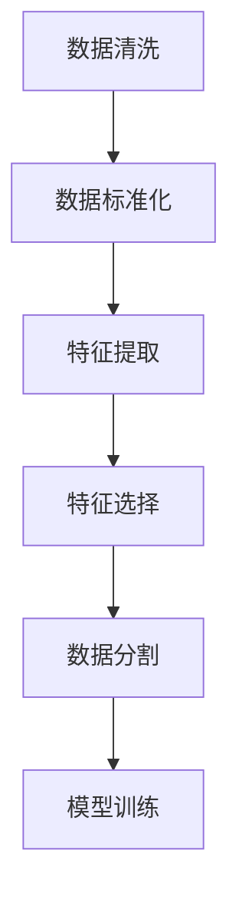
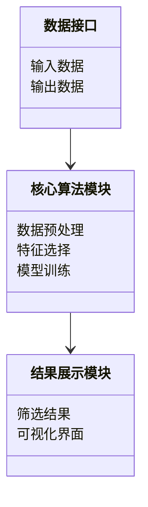

                 


# 智能算法构建自适应格雷厄姆筛选器

## 关键词：智能算法，格雷厄姆筛选器，自适应，机器学习，投资筛选

## 摘要：本文详细探讨了如何利用智能算法构建自适应格雷厄姆筛选器。通过机器学习和数据挖掘技术，我们能够动态调整筛选标准，提升投资决策的准确性和效率。文章涵盖了从理论基础到实际实现的全过程，包括数据预处理、特征选择、模型训练及系统架构设计等，为读者提供全面的技术指导。

---

## 第一部分：引言与背景

### 第1章：智能算法与自适应格雷厄姆筛选器概述

#### 1.1 问题背景与必要性

传统的格雷厄姆筛选器依赖于固定的财务指标来筛选投资标的，但在市场环境复杂多变的情况下，这种方法往往显得僵化且不够灵活。随着大数据和人工智能技术的发展，投资者迫切需要一种能够动态调整筛选标准的工具，以适应市场变化，捕捉潜在投资机会。

#### 1.2 问题描述

格雷厄姆筛选器的传统实现存在以下问题：
- 固定的筛选标准难以应对市场波动。
- 数据维度高，传统方法难以高效处理。
- 缺乏对市场趋势的动态适应能力。

通过引入智能算法，我们可以构建一个能够自适应调整筛选标准的系统，从而提高投资决策的准确性和效率。

---

## 第二部分：智能算法基础

### 第2章：机器学习与数据挖掘基础

#### 2.1 机器学习基础

机器学习是一种通过数据训练模型，使其能够从数据中学习并做出预测或决策的技术。常见的机器学习算法包括线性回归、支持向量机（SVM）、随机森林等。

- **监督学习**：通过标记数据训练模型，使其能够预测新数据的标签。
- **无监督学习**：通过数据的内在结构发现隐藏模式或群组。
- **在线学习**：模型能够实时更新，适应新数据的变化。

#### 2.2 数据挖掘与特征工程

数据预处理是构建高效筛选器的关键步骤，包括：
- **数据清洗**：处理缺失值、异常值和重复数据。
- **特征选择**：识别对目标变量影响较大的特征，常用的方法有逐步回归、LASSO回归等。
- **特征提取**：通过主成分分析（PCA）等方法降维，减少特征数量。

---

## 第三部分：自适应格雷厄姆筛选器的核心算法

### 第3章：数据预处理与特征选择

#### 3.1 数据预处理流程



数据预处理是构建自适应筛选器的第一步，通过清洗和标准化处理，确保数据的质量和一致性。

#### 3.2 特征选择与提取

使用主成分分析（PCA）进行特征降维：

$$
\text{PCA} = \text{argmin} \sum_{i=1}^{n} (x_i - \mu)^2
$$

其中，$\mu$ 是样本均值，$x_i$ 是输入数据。

---

### 第4章：自适应筛选器的实现

#### 4.1 算法原理

自适应筛选器基于机器学习模型动态调整筛选标准，核心步骤如下：

1. **数据采集**：收集相关财务数据和市场信息。
2. **特征工程**：对数据进行预处理和特征选择。
3. **模型训练**：训练机器学习模型，学习筛选标准。
4. **动态调整**：根据市场变化更新模型参数。

---

## 第四部分：系统架构与实现

### 第5章：系统架构设计



系统架构设计包括数据接口、核心算法模块和结果展示模块，各模块协同工作，实现自适应筛选。

---

## 第五部分：项目实战

### 第6章：项目实战与优化

#### 6.1 环境安装

安装必要的库：

```bash
pip install numpy pandas scikit-learn matplotlib
```

#### 6.2 核心代码实现

```python
import pandas as pd
from sklearn.preprocessing import StandardScaler
from sklearn.decomposition import PCA
from sklearn.feature_selection import SelectKBest

# 数据预处理
def preprocess_data(data):
    # 删除缺失值
    data = data.dropna()
    # 标准化处理
    scaler = StandardScaler()
    data_scaled = scaler.fit_transform(data)
    return data_scaled

# 特征选择
def select_features(data, labels):
    selector = SelectKBest(k=10)
    selector.fit(data, labels)
    selected_features = selector.transform(data)
    return selected_features

# PCA降维
def perform_pca(data, n_components=5):
    pca = PCA(n_components=n_components)
    pca_features = pca.fit_transform(data)
    return pca_features

# 简单的机器学习模型训练
from sklearn.svm import SVC
from sklearn.model_selection import train_test_split

data = pd.read_csv('investment_data.csv')
labels = data['target'].values
data = data.drop('target', axis=1)

data_processed = preprocess_data(data)
data_features = select_features(data_processed, labels)
data_pca = perform_pca(data_features, n_components=5)

X_train, X_test, y_train, y_test = train_test_split(data_pca, labels, test_size=0.2)
model = SVC()
model.fit(X_train, y_train)
score = model.score(X_test, y_test)
print(f'模型准确率：{score}')
```

#### 6.3 案例分析

通过实际数据训练模型，展示如何动态调整筛选标准，并分析模型的性能和效果。

---

## 第六部分：优化与扩展

### 第7章：优化与未来展望

#### 7.1 模型优化

- 调整模型参数，如支持向量机的核函数和惩罚系数。
- 引入时间序列分析，考虑市场趋势的影响。

#### 7.2 技术扩展

- 使用强化学习进一步优化筛选策略。
- 结合自然语言处理技术，分析财务报告中的文本信息。

---

## 结论

通过智能算法构建的自适应格雷厄姆筛选器，能够有效提升投资决策的效率和准确性。未来，随着技术的不断进步，这类系统将变得更加智能化和高效。

---

## 作者

作者：AI天才研究院（AI Genius Institute） & 禅与计算机程序设计艺术（Zen And The Art of Computer Programming）

---

以上就是《智能算法构建自适应格雷厄姆筛选器》的完整内容，涵盖了从理论到实践的各个方面，希望对读者有所帮助。

