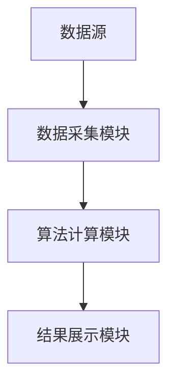

                 


# 智能算法识别市场异常与套利机会

> **关键词**：智能算法、市场异常、套利机会、时间序列分析、机器学习、统计套利、算法交易

> **摘要**：本文深入探讨了智能算法在识别市场异常和套利机会中的应用。通过分析时间序列分析、机器学习算法和统计套利算法，本文详细阐述了这些算法在金融市场的实际应用。结合数学模型和系统架构设计，本文为读者提供了一套完整的解决方案，并通过实际案例展示了如何利用智能算法捕捉市场异常和套利机会。本文还总结了最佳实践、注意事项和未来研究方向。

---

## 第一部分: 智能算法识别市场异常与套利机会概述

### 第1章: 智能算法与市场异常识别

#### 1.1 智能算法的定义与特点
智能算法是一种基于人工智能技术的算法，能够在复杂、动态的环境中自动学习和优化，以识别模式、预测趋势并做出决策。其核心特点包括：
- **自适应性**：能够根据数据反馈不断优化自身。
- **数据驱动**：依赖大量数据进行训练和推理。
- **非线性关系**：能够捕捉复杂的数据关系。

#### 1.2 市场异常的定义与分类
市场异常是指市场价格、成交量等指标在短时间内出现异常波动，可能是由于突发事件、市场操纵或其他不可预测的因素引起。常见的市场异常包括：
- **短期波动**：如股价突然暴跌或暴涨。
- **价格偏离**：如股价与基本面严重不符。

#### 1.3 套利机会的定义与特点
套利机会是指在不同市场或资产之间利用价格差异进行无风险或低风险套利的行为。其特点包括：
- **低风险**：套利机会通常具有较低的风险。
- **短期性**：套利机会往往短暂，需要快速识别和执行。

---

### 第2章: 智能算法在市场异常识别中的应用

#### 2.1 时间序列分析
时间序列分析是一种通过分析历史数据来预测未来趋势的方法。常用的时间序列分析方法包括：
- **ARIMA模型**：用于捕捉数据的自相关性。
- **LSTM网络**：能够捕捉长期依赖关系。

#### 2.2 机器学习算法
机器学习算法在市场异常识别中的应用非常广泛，包括：
- **监督学习**：如随机森林和SVM，用于分类市场状态。
- **无监督学习**：如聚类分析，用于识别异常模式。

#### 2.3 统计套利算法
统计套利算法通过分析资产之间的价格差异来寻找套利机会。常见的统计套利算法包括：
- **配对交易**：通过对比两只股票的相对表现寻找套利机会。
- **动量策略**：利用资产价格的动量效应进行套利。

---

### 第3章: 市场异常与套利机会的关联性分析

#### 3.1 市场异常与套利机会的定义对比
市场异常和套利机会在定义上有相似之处，但也存在差异。市场异常强调价格的异常波动，而套利机会则强调价格差异带来的获利机会。

#### 3.2 市场异常与套利机会的ER实体关系图


#### 3.3 市场异常与套利机会的关联性分析
市场异常往往伴随着套利机会。例如，突发事件导致市场异常波动，套利者可以通过对冲交易利用价格差异获利。然而，市场异常也可能破坏套利机会，例如市场操纵行为导致价格失真。

---

## 第二部分: 智能算法识别市场异常与套利机会的核心算法

### 第4章: 时间序列分析算法

#### 4.1 ARIMA模型
ARIMA（自回归积分滑动平均）模型是一种常用的时间序列分析方法。其数学公式为：
$$ ARIMA(p, d, q) $$
其中，$p$ 是自回归阶数，$d$ 是差分阶数，$q$ 是滑动平均阶数。

#### 4.2 LSTM网络
LSTM（长短期记忆网络）是一种特殊的RNN，能够捕捉时间序列的长期依赖关系。其核心结构包括：
- **遗忘门**：决定哪些信息需要遗忘。
- **输入门**：决定哪些新信息需要存储。
- **输出门**：决定输出哪些信息。

---

### 第5章: 机器学习算法

#### 5.1 随机森林
随机森林是一种基于树的集成算法，通过构建多棵决策树并取其平均值来提高预测准确率。其数学模型如下：
$$ y = \sum_{i=1}^{n} w_i \cdot t_i(x) $$
其中，$w_i$ 是决策树的权重，$t_i(x)$ 是第 $i$ 棵决策树的预测值。

#### 5.2 支持向量机（SVM）
SVM是一种监督学习算法，通过构建超平面将数据分为不同类别。其数学模型为：
$$ y = \text{sign}(w \cdot x + b) $$
其中，$w$ 是权重向量，$b$ 是偏置项。

---

### 第6章: 统计套利算法

#### 6.1 配对交易
配对交易通过对比两只股票的相对表现来寻找套利机会。其数学模型为：
$$ \text{价差} = \frac{A}{B} $$
其中，$A$ 和 $B$ 分别是两只股票的价格。

#### 6.2 动量策略
动量策略通过利用资产价格的动量效应进行套利。其数学模型为：
$$ \text{动量} = \frac{p_t - p_{t-n}}{n} $$
其中，$p_t$ 是当前价格，$p_{t-n}$ 是 $n$ 天前的价格。

---

## 第三部分: 智能算法识别市场异常与套利机会的系统架构设计

### 第7章: 系统分析与架构设计

#### 7.1 项目背景
本文提出了一种基于智能算法的市场异常与套利机会识别系统，旨在通过实时数据分析和智能算法计算，帮助投资者快速识别市场异常和套利机会。

#### 7.2 系统功能设计
- **数据采集模块**：实时采集市场数据。
- **算法计算模块**：运行智能算法进行分析。
- **结果展示模块**：将分析结果以可视化形式呈现。

#### 7.3 系统架构设计


---

## 第四部分: 项目实战与总结

### 第8章: 项目实战

#### 8.1 环境安装
需要安装以下工具和库：
- **Python**：用于编程。
- **NumPy** 和 **Pandas**：用于数据处理。
- **TensorFlow** 或 **Keras**：用于深度学习。

#### 8.2 代码实现
以下是基于LSTM的时间序列分析代码示例：
```python
import numpy as np
import pandas as pd
from tensorflow.keras.models import Sequential
from tensorflow.keras.layers import LSTM, Dense

# 数据预处理
data = pd.read_csv('market_data.csv')
train_data = data[:700]
test_data = data[700:]

# 模型训练
model = Sequential()
model.add(LSTM(128, input_shape=(None, 1)))
model.add(Dense(1))
model.compile(loss='mean_squared_error', optimizer='adam')
model.fit(train_data.values, epochs=100, batch_size=32)

# 模型预测
predictions = model.predict(test_data.values)
```

#### 8.3 案例分析
通过实际案例分析，验证智能算法在市场异常识别和套利机会捕捉中的有效性。例如，利用LSTM模型预测股票价格波动，捕捉短期套利机会。

---

### 第9章: 总结与展望

#### 9.1 最佳实践
- **数据质量**：确保数据的完整性和准确性。
- **算法选择**：根据具体场景选择合适的算法。
- **风险管理**：合理控制风险，避免过度交易。

#### 9.2 小结
智能算法在识别市场异常和套利机会中具有重要作用。通过合理选择和优化算法，可以显著提高识别准确率和交易效率。

#### 9.3 注意事项
- 市场异常识别具有不确定性，需谨慎对待。
- 套利机会往往短暂，需快速决策。

#### 9.4 拓展阅读
推荐阅读《算法交易：善用数学与计算机的科学》和《机器学习实战》。

---

**作者：AI天才研究院/AI Genius Institute & 禅与计算机程序设计艺术 /Zen And The Art of Computer Programming**

