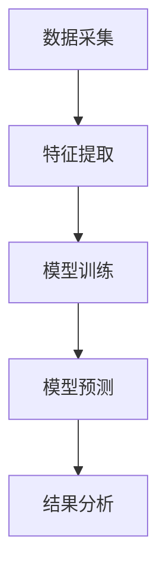
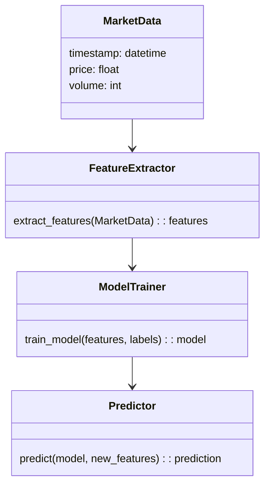
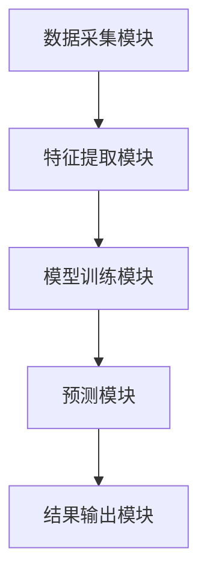
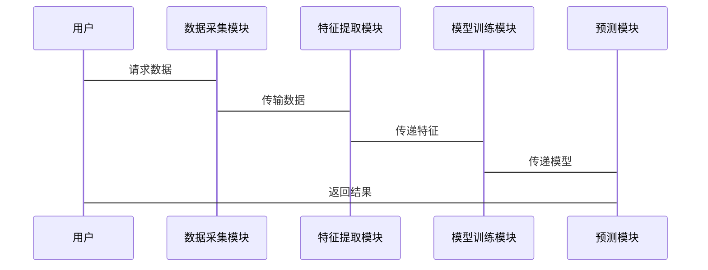

                 


# 智能算法识别市场微观结构变化

> 关键词：智能算法，市场微观结构，时间序列分析，机器学习，深度学习，金融数据分析

> 摘要：本文探讨了如何利用智能算法识别和分析市场微观结构的变化。通过结合机器学习和深度学习技术，本文详细介绍了算法原理、数学模型、系统架构，并通过实际案例展示了如何在金融市场中应用这些算法。文章最后总结了最佳实践和未来研究方向。

---

# 第1章 智能算法与市场微观结构变化的背景介绍

## 1.1 问题背景与定义

### 1.1.1 市场微观结构变化的定义
市场微观结构变化是指在金融市场中，由于交易行为、参与者策略调整或外部因素影响，导致市场局部价格波动、交易量变化或市场参与者行为模式的改变。这些变化通常难以通过传统统计方法捕捉，但可以通过智能算法进行识别和分析。

### 1.1.2 智能算法的定义与特点
智能算法是指基于人工智能技术（如机器学习、深度学习）开发的算法，能够从数据中学习特征，并自动调整模型参数以适应数据的变化。其特点包括自适应性、非线性建模能力和对复杂数据的处理能力。

### 1.1.3 问题的解决思路与目标
通过智能算法分析市场微观结构变化，目标是识别市场中的异常行为、预测价格波动，并为交易策略提供支持。解决思路包括数据采集、特征提取、模型训练和结果验证。

---

## 1.2 当前研究现状

### 1.2.1 市场微观结构变化研究的现状
目前，市场微观结构变化的研究主要集中在高频交易数据和订单簿分析上。然而，由于数据的复杂性和动态性，传统方法在捕捉细微变化方面存在局限性。

### 1.2.2 智能算法在金融领域的应用现状
智能算法在金融领域的应用已取得显著成果，特别是在股票价格预测、风险评估和交易信号生成方面。然而，如何高效地识别市场微观结构变化仍是一个挑战。

### 1.2.3 当前研究中的主要挑战与不足
主要挑战包括数据噪声干扰、模型过拟合以及计算效率问题。不足之处在于现有算法在处理多时间尺度数据和复杂市场行为方面的能力有限。

---

## 1.3 研究意义与价值

### 1.3.1 理论意义
智能算法的研究为金融市场分析提供了新的理论工具，扩展了传统统计方法的应用边界。

### 1.3.2 实际应用价值
通过识别市场微观结构变化，投资者可以更及时地做出决策，优化交易策略，并降低市场风险。

### 1.3.3 对金融市场的潜在影响
智能算法的应用可能改变传统的市场分析方式，推动金融技术的进步，并提高市场的流动性。

---

## 1.4 本章小结
本章通过定义市场微观结构变化和智能算法，分析了当前研究的现状、挑战与意义。下一章将深入探讨智能算法与市场微观结构变化的核心概念及其关联性。

---

# 第2章 智能算法与市场微观结构变化的核心概念

## 2.1 智能算法的核心概念

### 2.1.1 机器学习算法的定义与分类
机器学习算法分为监督学习、无监督学习和强化学习。监督学习用于分类和回归问题，无监督学习用于聚类和降维，强化学习用于策略优化。

### 2.1.2 深度学习算法的定义与特点
深度学习算法通过多层神经网络提取数据的高层次特征，具有强大的非线性建模能力。

### 2.1.3 时间序列分析的基本概念
时间序列分析是研究数据随时间变化的模式和趋势，常用的方法包括ARIMA和LSTM。

---

## 2.2 市场微观结构变化的核心要素

### 2.2.1 市场微观结构的定义
市场微观结构是指市场中的交易行为、价格形成机制和参与者互动方式的总和。

### 2.2.2 市场微观结构变化的主要指标
包括订单簿深度变化、买卖价差波动、交易量突变等。

### 2.2.3 市场微观结构变化的驱动因素
市场参与者的行为、新闻事件、技术故障和宏观经济因素都可能影响市场微观结构。

---

## 2.3 智能算法与市场微观结构变化的关联性分析

### 2.3.1 数据特征分析
市场微观结构变化通常表现为非线性、短期性和突发性，智能算法能够捕捉这些特征。

### 2.3.2 算法选择与优化
根据数据特点选择合适的算法，并通过超参数优化提升模型性能。

### 2.3.3 模型评估与验证
使用回测和交叉验证方法评估模型的准确性和稳定性。

---

## 2.4 核心概念对比分析

### 2.4.1 不同算法的性能对比
通过对比实验分析机器学习和深度学习算法在识别市场微观结构变化中的表现。

### 2.4.2 市场微观结构变化的多维度分析
从时间、空间和参与者行为等多个维度分析市场变化。

### 2.4.3 智能算法与传统统计方法的对比
智能算法在非线性建模和复杂数据处理方面具有优势，但计算成本较高。

---

## 2.5 ER实体关系图架构

```mermaid
er
  actor: 智能算法
  actor --> MarketData: 采集市场数据
  MarketData --> FeatureExtraction: 特征提取
  FeatureExtraction --> ModelTraining: 模型训练
  ModelTraining --> ModelPrediction: 模型预测
  ModelPredict
```

---

# 第3章 智能算法识别市场微观结构变化的算法原理

## 3.1 算法选择与流程

### 3.1.1 算法流程图


### 3.1.2 算法实现代码
```python
import numpy as np
import pandas as pd
from sklearn.model_selection import train_test_split
from sklearn.ensemble import RandomForestClassifier

# 示例数据加载
data = pd.read_csv('market_data.csv')
X = data.drop('label', axis=1)
y = data['label']

# 数据分割
X_train, X_test, y_train, y_test = train_test_split(X, y, test_size=0.2)

# 模型训练
model = RandomForestClassifier()
model.fit(X_train, y_train)

# 模型预测
y_pred = model.predict(X_test)

# 模型评估
print('准确率:', model.score(X_test, y_test))
```

---

## 3.2 算法数学模型

### 3.2.1 随机森林模型
随机森林是一种基于决策树的集成算法，其数学模型如下：
$$
y = \sum_{i=1}^{n} \text{Tree}(x_i)
$$

### 3.2.2 LSTM网络
LSTM（长短期记忆网络）用于时间序列分析，其核心公式为：
$$
f_t = \sigma(W_f \cdot [h_{t-1}, x_t] + b_f)
$$

---

## 3.3 算法优化与调优

### 3.3.1 超参数优化
使用网格搜索或随机搜索方法优化模型参数。

### 3.3.2 正则化方法
通过L1/L2正则化防止过拟合。

### 3.3.3 模型集成
结合多种算法的结果，提升整体性能。

---

## 3.4 本章小结
本章详细介绍了智能算法的原理和实现方法，并通过代码示例展示了算法的具体应用。下一章将讨论系统架构设计。

---

# 第4章 智能算法识别市场微观结构变化的系统架构设计

## 4.1 系统功能设计

### 4.1.1 领域模型类图


### 4.1.2 系统架构图


---

## 4.2 系统接口设计

### 4.2.1 API接口
提供RESTful API接口，供其他系统调用模型预测结果。

### 4.2.2 数据接口
支持多种数据格式的输入，如CSV和JSON。

---

## 4.3 系统交互流程图



---

## 4.4 本章小结
本章详细设计了系统的架构，并展示了模块之间的交互关系。下一章将通过实际案例展示系统的具体实现。

---

# 第5章 智能算法识别市场微观结构变化的项目实战

## 5.1 环境安装与配置

### 5.1.1 环境要求
Python 3.8以上版本，安装必要的库如pandas、numpy、scikit-learn和keras。

### 5.1.2 数据准备
加载市场数据并进行预处理，确保数据的完整性和准确性。

---

## 5.2 核心代码实现

### 5.2.1 数据特征提取
```python
def extract_features(data):
    features = data[['open', 'high', 'low', 'close', 'volume']]
    return features
```

### 5.2.2 模型训练
```python
from sklearn.ensemble import RandomForestClassifier

def train_model(features, labels):
    model = RandomForestClassifier()
    model.fit(features, labels)
    return model
```

### 5.2.3 模型预测
```python
def predict(model, new_features):
    return model.predict(new_features)
```

---

## 5.3 实际案例分析

### 5.3.1 数据加载与分析
加载某段时间内的股票数据，分析其价格波动和交易量变化。

### 5.3.2 模型训练与验证
通过回测验证模型的准确性和稳定性，调整参数以优化性能。

### 5.3.3 结果分析与解读
解读模型预测结果，分析其对交易策略的指导意义。

---

## 5.4 项目总结与优化

### 5.4.1 项目小结
总结项目的实现过程和主要成果，分析存在的问题。

### 5.4.2 优化方向
优化算法性能、提高模型泛化能力以及改进数据处理流程。

---

## 5.5 本章小结
本章通过实际案例展示了智能算法在识别市场微观结构变化中的应用，并总结了项目的实现经验和优化方向。

---

# 第6章 智能算法识别市场微观结构变化的最佳实践

## 6.1 最佳实践 tips

### 6.1.1 数据处理
确保数据的高质量和完整性，避免噪声干扰。

### 6.1.2 算法选择
根据数据特点选择合适的算法，并进行充分的实验验证。

### 6.1.3 模型优化
通过超参数调优和模型集成提高算法性能。

---

## 6.2 小结

### 6.2.1 核心要点总结
总结智能算法在识别市场微观结构变化中的关键步骤和注意事项。

### 6.2.2 研究总结
回顾整个研究过程，总结取得的成果和经验教训。

---

## 6.3 注意事项

### 6.3.1 数据隐私与安全
注意保护数据隐私，遵守相关法律法规。

### 6.3.2 模型解释性
确保模型的可解释性，便于分析和优化。

### 6.3.3 系统稳定性
保证系统的稳定运行，避免因技术故障导致损失。

---

## 6.4 拓展阅读

### 6.4.1 推荐书籍
《机器学习实战》、《深度学习》等。

### 6.4.2 推荐博客与资源
推荐相关技术博客和开源项目，供读者进一步学习。

---

# 作者：AI天才研究院/AI Genius Institute & 禅与计算机程序设计艺术 /Zen And The Art of Computer Programming

