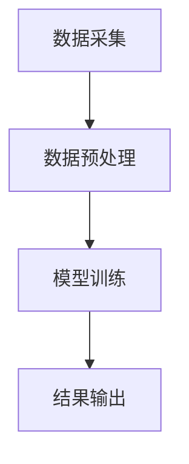

                 


# 智能算法识别市场情绪拐点

> 关键词：智能算法、市场情绪、拐点识别、时间序列分析、机器学习、自然语言处理

> 摘要：本文深入探讨了如何利用智能算法识别市场情绪拐点，通过分析市场情绪的定义、重要性及其在不同场景中的表现，结合时间序列分析、机器学习和自然语言处理等技术，详细讲解了基于智能算法的市场情绪拐点识别方法。文章从理论到实践，系统性地分析了如何构建一个完整的市场情绪拐点识别系统，并通过具体案例展示了算法的实现与应用。

---

## 第一部分：市场情绪拐点概述

### 1.1 市场情绪的定义与重要性

市场情绪是投资者在市场中的心理状态的总和，反映了市场参与者对市场的看法和预期。市场情绪拐点是指市场情绪从一个阶段向另一个阶段转变的关键点，通常对应市场的顶点或底部。

市场情绪拐点的识别对投资者和交易者具有重要意义，它可以帮助他们提前预测市场趋势，做出更明智的投资决策。

### 1.2 市场情绪的表现形式

市场情绪可以通过多种方式表现，包括技术指标（如RSI、MACD）和市场参与者的心理特征。时间序列分析是研究市场情绪表现的重要方法。

---

## 第二部分：智能算法的核心概念

### 2.1 智能算法的基本原理

智能算法通过数据驱动的方式，利用数学模型和机器学习技术，从历史数据中学习市场情绪的变化规律，从而预测未来的市场情绪拐点。

### 2.2 市场情绪分析的关键技术

- **时间序列分析**：用于研究市场情绪的时间变化规律。
- **机器学习**：用于分类和回归任务，识别市场情绪的转折点。
- **自然语言处理**：用于分析新闻、评论等文本数据，提取市场情绪。

---

## 第三部分：基于时间序列分析的市场情绪预测

### 3.1 时间序列分析基础

时间序列分析是一种通过分析数据随时间的变化规律，预测未来趋势的方法。常见的模型包括ARIMA和LSTM。

### 3.2 基于ARIMA模型的市场情绪预测

#### ARIMA模型原理

ARIMA（自回归积分滑动平均模型）通过自回归和滑动平均部分来建模时间序列数据。其数学公式为：

$$ ARIMA(p, d, q) $$

其中：
- $p$ 是自回归阶数
- $d$ 是差分阶数
- $q$ 是滑动平均阶数

#### ARIMA模型的实现代码

```python
from statsmodels.tsa.arima.model import ARIMA

# 假设我们有训练数据 train_data 和测试数据 test_data
model = ARIMA(train_data, order=(5, 1, 0))
model_fit = model.fit()

# 预测未来值
forecast, stderr, conf_int = model_fit.forecast(steps=len(test_data))
```

---

## 第四部分：基于机器学习的市场情绪分类

### 4.1 机器学习基础

机器学习通过训练模型从数据中学习特征，用于分类和回归任务。常用的算法包括支持向量机（SVM）和随机森林。

### 4.2 基于SVM的市场情绪分类

#### SVM算法原理

支持向量机通过构建超平面，将数据分成两类。其数学公式为：

$$ y = \text{sign}(w \cdot x + b) $$

其中：
- $w$ 是权重向量
- $x$ 是输入数据
- $b$ 是偏置项

#### SVM算法的实现代码

```python
from sklearn.svm import SVC

# 训练SVM模型
model = SVC(kernel='rbf', gamma='auto')
model.fit(train_X, train_y)

# 预测测试数据
predict_y = model.predict(test_X)
```

---

## 第五部分：基于自然语言处理的市场情绪分析

### 5.1 自然语言处理基础

自然语言处理（NLP）用于分析文本数据，提取情感倾向。常用的模型包括词袋模型和词嵌入模型。

### 5.2 基于BERT模型的市场情绪分析

#### BERT模型原理

BERT是一种基于Transformer的预训练语言模型，通过上下文理解文本情感。其数学公式为：

$$ \text{BERT}(x) = \text{Transformer}(x) $$

#### BERT模型的实现代码

```python
from transformers import BertTokenizer, BertModel

# 加载预训练BERT模型
tokenizer = BertTokenizer.from_pretrained('bert-base-uncased')
model = BertModel.from_pretrained('bert-base-uncased')

# 分词
inputs = tokenizer("市场情绪分析", return_tensors="pt")
outputs = model(**inputs)
```

---

## 第六部分：系统架构与项目实战

### 6.1 系统架构设计

市场情绪拐点识别系统的架构包括数据采集模块、数据预处理模块和模型训练模块。

#### 系统架构图



### 6.2 项目实战与代码实现

#### 环境搭建与数据准备

安装必要的库：

```bash
pip install numpy pandas scikit-learn transformers
```

数据准备：

```python
import pandas as pd

data = pd.read_csv('market_emotion.csv')
```

#### 系统核心代码实现

模型训练：

```python
from sklearn.model_selection import train_test_split
from sklearn.metrics import accuracy_score

X_train, X_test, y_train, y_test = train_test_split(data.drop('emotion', axis=1), data['emotion'])

model = SVC(kernel='rbf', gamma='auto')
model.fit(X_train, y_train)

accuracy = accuracy_score(y_test, model.predict(X_test))
print(f'准确率: {accuracy}')
```

---

## 第七部分：总结与展望

### 总结

本文系统性地介绍了智能算法在识别市场情绪拐点中的应用，涵盖了时间序列分析、机器学习和自然语言处理等多种技术。通过具体案例展示了如何构建一个完整的识别系统，并提供了实现代码和结果分析。

### 展望

未来的研究可以结合多模态数据（如文本、图像）进一步提升市场情绪分析的准确性。同时，随着深度学习技术的发展，更复杂的模型（如GPT-3）也将被应用于市场情绪分析。

---

作者：AI天才研究院/AI Genius Institute & 禅与计算机程序设计艺术 /Zen And The Art of Computer Programming

