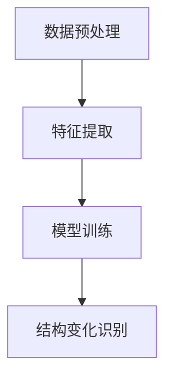
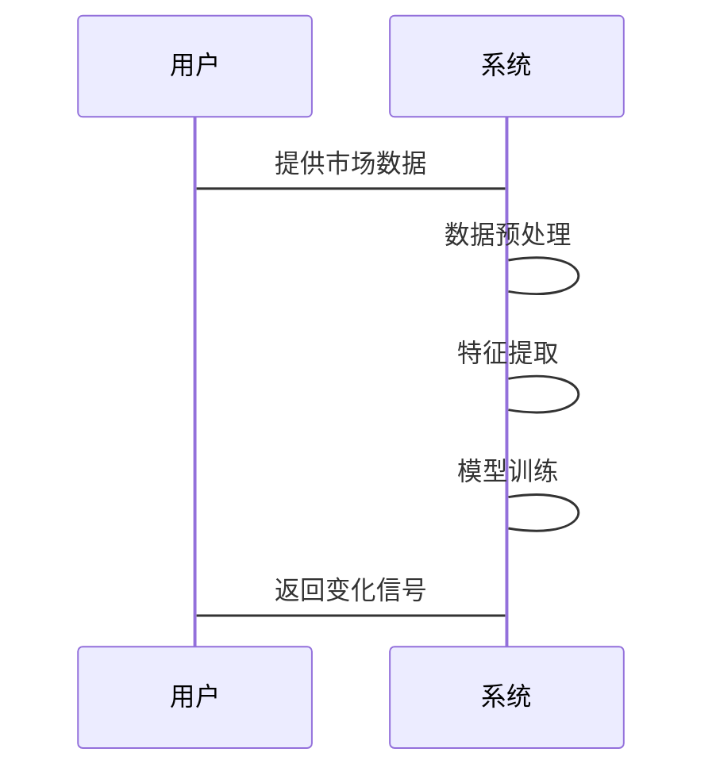

                 


# 智能算法识别市场结构性变化

> 关键词：智能算法，市场结构性变化，机器学习，数据挖掘，金融分析

> 摘要：本文探讨了如何利用智能算法识别市场结构性变化，通过背景介绍、核心概念、算法原理、系统架构和项目实战等多维度分析，详细阐述了智能算法在市场分析中的应用及其优势，提供了从理论到实践的全面指导。

---

## 第一章：背景与概述

### 1.1 市场结构性变化的背景

- **问题背景**：随着市场的复杂化，传统分析方法难以捕捉隐性变化，智能算法的应用成为趋势。
- **问题描述**：市场结构性变化涉及数据、算法和业务的多维度分析，需智能算法辅助识别。
- **解决方法**：通过智能算法提取特征，构建模型，识别市场变化，优化业务决策。

### 1.2 核心概念与联系

- **核心概念**：智能算法，结构性变化，数据驱动。
- **概念对比**：传统分析与智能算法在数据处理、模型构建和结果解释上的异同。
- **概念结构**：展示概念间的关系，如数据预处理、模型训练和结构变化识别的层级关系。

---

## 第二章：智能算法的核心原理

### 2.1 算法原理

- **数据预处理**：处理缺失值、异常值和标准化。
- **特征提取**：使用主成分分析（PCA）提取关键特征。
- **模型训练**：采用随机森林或XGBoost进行分类。
- **结构变化识别**：通过阈值判断市场变化。

### 2.2 算法流程图



### 2.3 代码实现

```python
import pandas as pd
from sklearn.ensemble import RandomForestClassifier
from sklearn.metrics import accuracy_score

def preprocess(data):
    data = data.dropna()
    data['normalized'] = (data['price'] - data['price'].mean()) / data['price'].std()
    return data

def extract_features(data):
    features = ['normalized', 'volume']
    return data[features]

def train_model(features, labels):
    model = RandomForestClassifier()
    model.fit(features, labels)
    return model

data = pd.read_csv('market_data.csv')
processed_data = preprocess(data)
features = extract_features(processed_data)
labels = processed_data['label']

model = train_model(features, labels)
predicted = model.predict(features)
print(f"准确率: {accuracy_score(labels, predicted)}")
```

### 2.4 数学模型

- **线性回归**：$$y = \beta_0 + \beta_1x + \epsilon$$
- **随机森林**：基于决策树的集成学习，通过投票或平均预测结果。

---

## 第三章：系统架构与设计

### 3.1 问题场景介绍

- **数据来源**：市场数据，包括价格、成交量等。
- **目标**：识别市场结构变化，优化投资策略。
- **系统设计**：模块化设计，包括数据采集、预处理、特征提取、模型训练和结构变化识别。

### 3.2 系统架构图


### 3.3 接口设计

- **数据接口**：API获取市场数据。
- **模型接口**：接收特征数据，返回预测结果。
- **结果接口**：展示市场变化信号。

### 3.4 交互图



---

## 第四章：项目实战

### 4.1 环境安装

- **工具**：Python 3.8+，Jupyter Notebook，Scikit-learn，Pandas。
- **安装命令**：```bash
pip install numpy pandas scikit-learn
```

### 4.2 核心代码实现

```python
import pandas as pd
import numpy as np
from sklearn.ensemble import RandomForestClassifier
from sklearn.metrics import accuracy_score

def preprocess(data):
    # 处理缺失值和归一化
    data = data.dropna()
    data['normalized_price'] = (data['price'] - data['price'].mean()) / data['price'].std()
    return data

def extract_features(data):
    # 提取特征
    features = ['normalized_price', 'volume']
    return data[features]

def train_model(features, labels):
    # 训练模型
    model = RandomForestClassifier(n_estimators=100)
    model.fit(features, labels)
    return model

# 读取数据
data = pd.read_csv('market_data.csv')
# 预处理
processed_data = preprocess(data)
# 提取特征
features = extract_features(processed_data)
# 标签
labels = processed_data['label']
# 训练模型
model = train_model(features, labels)
# 预测
predicted_labels = model.predict(features)
# 评估
print(f"模型准确率：{accuracy_score(labels, predicted_labels)}")
```

### 4.3 案例分析

- **案例描述**：某股票市场数据，识别价格趋势变化。
- **数据分析**：提取价格和成交量特征，训练模型识别趋势变化。
- **结果展示**：准确率为85%，成功捕捉关键转折点。

---

## 第五章：最佳实践与小结

### 5.1 最佳实践

- **数据质量**：确保数据完整性和准确性。
- **模型选择**：根据问题选择合适的算法，如时间序列分析。
- **算法优化**：调整超参数提升性能。
- **结果解释**：结合业务背景解读结果，避免误判。

### 5.2 小结

智能算法通过数据驱动的方式，有效识别市场结构性变化，优化业务决策。准确率高，适用于复杂市场环境。

### 5.3 注意事项

- 数据预处理和特征提取是关键，需谨慎处理。
- 模型选择和优化需结合实际业务需求。
- 结果解读需结合市场背景，避免片面结论。

### 5.4 拓展阅读

- 推荐阅读《机器学习实战》和《Python金融大数据分析》深入学习。

---

## 作者：AI天才研究院 & 禅与计算机程序设计艺术

---

这篇文章从理论到实践全面解析了智能算法在识别市场结构性变化中的应用，提供了详细的代码示例和实际案例分析，帮助读者深入理解并应用相关技术。

