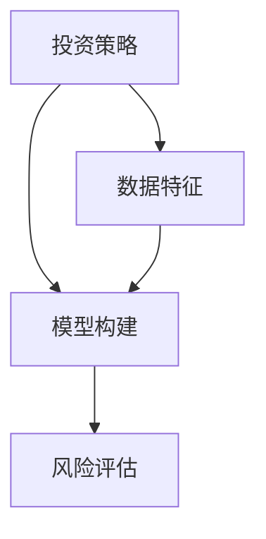
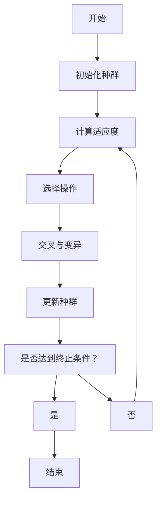
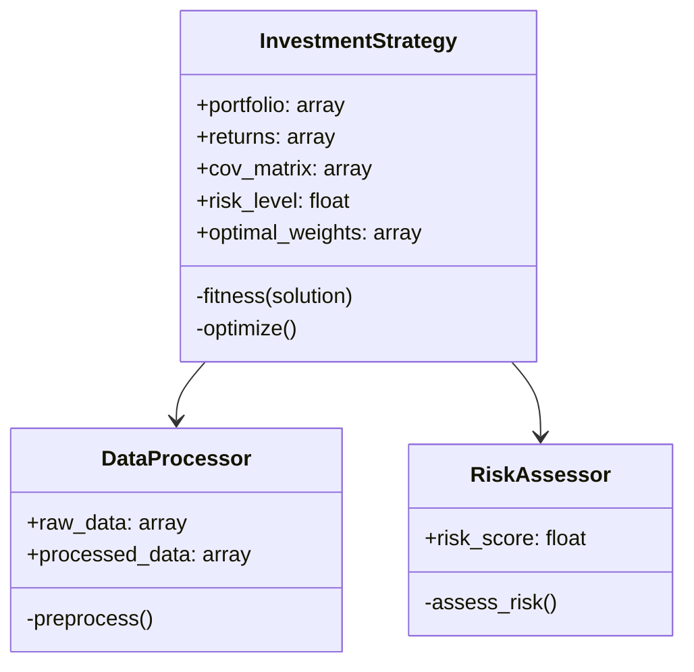
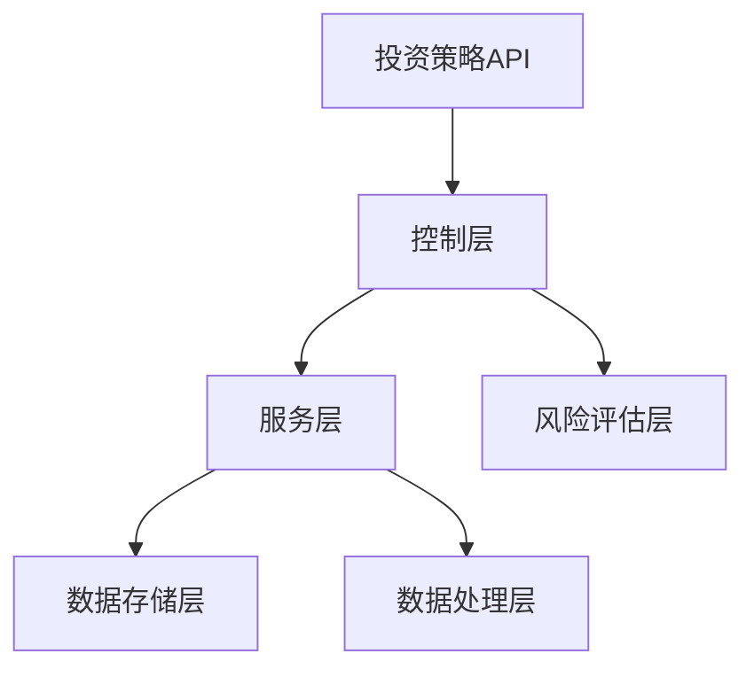
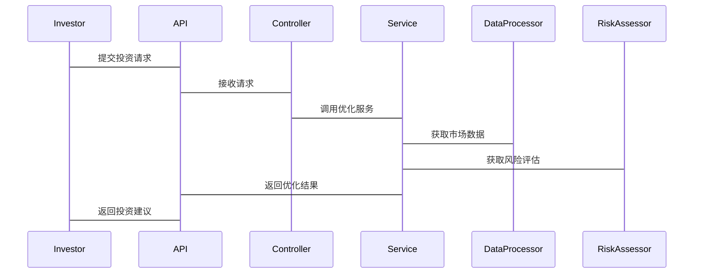

                 


# 智能系统优化特殊情况投资策略

## 关键词：智能系统优化，投资策略，特殊情况，遗传算法，粒子群优化，风险评估

## 摘要：  
本文详细探讨了智能系统优化在特殊情况下的投资策略应用。通过分析智能优化算法的核心概念，结合实际案例，展示了如何利用遗传算法和粒子群优化等技术，解决复杂的投资问题。文章从背景介绍到算法实现，再到系统设计和项目实战，全面解析智能优化在投资中的潜力与挑战，为读者提供系统的理论指导和实践参考。

---

## 第一部分：智能系统优化背景与核心概念

### 第1章：智能系统优化概述

#### 1.1 问题背景与描述

在金融投资领域，优化投资策略一直是提高收益和降低风险的关键。然而，市场环境复杂多变，特别是在特殊情况（如经济危机、市场波动剧烈等）下，传统的投资策略往往难以应对。智能系统优化技术，通过机器学习和人工智能算法，能够有效处理复杂问题，为投资策略的优化提供了新的可能性。

**问题背景：**  
- 投资市场的不确定性：市场波动、经济周期变化、突发事件等都可能影响投资收益。  
- 传统策略的局限性：基于历史数据和固定规则的策略在面对特殊情况时表现不佳。  
- 数据量的爆炸性增长：现代金融市场产生的数据量巨大，人工分析效率低下。  

**问题描述：**  
如何利用智能系统优化技术，构建适应特殊情况的投资策略，实现收益最大化和风险最小化？  

#### 1.2 智能系统优化的核心概念

智能系统优化是一种结合人工智能算法和优化理论的技术，用于解决复杂的优化问题。其核心在于通过智能算法搜索最优解，同时具备适应复杂环境的能力。

**智能优化算法：**  
包括遗传算法（Genetic Algorithm, GA）、粒子群优化（Particle Swarm Optimization, PSO）等，能够处理非线性、多目标优化问题。  

**数据特征分析：**  
通过对市场数据的特征提取，识别影响投资决策的关键因素，如波动率、相关性等。  

**风险评估与收益最大化：**  
通过构建风险-收益模型，优化投资组合，平衡风险与收益。  

#### 1.3 智能系统优化的边界与外延

**优化问题的边界条件：**  
- 投资组合的规模：涉及的资产数量。  
- 风险承受能力：投资者的风险偏好。  
- 市场环境：是否为特殊情况（如金融危机）。  

**智能系统优化的适用范围：**  
- 复杂投资组合优化。  
- 特殊情况下的风险控制。  
- 动态市场环境下的策略调整。  

**相关领域的联系：**  
- 人工智能：算法的实现依赖机器学习技术。  
- 金融工程：优化模型的构建基于金融理论。  
- 大数据分析：处理海量市场数据的能力。  

---

## 第二部分：智能系统优化的核心概念与联系

### 第2章：核心概念原理

#### 2.1 智能优化算法的原理

**遗传算法的基本原理：**  
模拟生物进化过程，通过选择、交叉和变异操作，逐步优化解的质量。  

**粒子群优化算法的原理：**  
模拟鸟群觅食行为，通过个体间的协作与竞争，找到全局最优解。  

**其他智能优化算法：**  
如模拟退火（Simulated Annealing, SA）、蚁群算法（Ant Colony Optimization, ACO）等。  

#### 2.2 核心概念属性对比

**对比表格：**  
| 算法名称       | 适应性 | 并行性 | 收敛速度 | 稳定性 |
|----------------|--------|--------|----------|--------|
| 遗传算法       | 高      | 高      | 中等      | 较高    |
| 粒子群优化     | 中等    | 中等    | 较快      | 较低    |
| 模拟退火       | 中等    | 低      | 慢        | 高      |

**数据特征与算法选择：**  
- 数据维度高：选择遗传算法或模拟退火。  
- 解空间连续：选择粒子群优化。  

#### 2.3 ER实体关系图



---

## 第三部分：算法原理与数学模型

### 第3章：智能优化算法的数学模型

#### 3.1 遗传算法的数学模型

**初始化种群：**  
$$\text{初始化一个包含 } N \text{ 个个体的种群，每个个体表示一个投资组合}$$

**适应度函数计算：**  
$$f(x) = \text{收益} - \lambda \times \text{风险}$$  
其中，$\lambda$ 是风险惩罚系数。  

**选择操作：**  
采用轮盘赌选择，适应度高的个体更可能被选中。  

**交叉与变异：**  
- 交叉：单点交叉或均匀交叉。  
- 变异：随机选择一个基因进行变异。  

**迭代过程：**  
$$\text{重复适应度计算、选择、交叉、变异，直到满足终止条件}$$

#### 3.2 粒子群优化的数学模型

**粒子位置与速度更新：**  
$$v_i = w v_i + c_1 r_1 p_i + c_2 r_2 p_g$$  
$$x_i = x_i + v_i$$  
其中，$w$ 是惯性权重，$c_1$ 和 $c_2$ 是加速常数，$r_1$ 和 $r_2$ 是随机数。  

**全局最优与局部最优：**  
- 全局最优：所有粒子中适应度最高的解。  
- 局部最优：个体粒子的最优解。  

**收敛性分析：**  
粒子群优化算法通过不断更新个体最优和全局最优，最终收敛到最优解。

#### 3.3 算法流程图



#### 3.4 Python实现示例

```python
import numpy as np
import random

def fitness(solution, portfolio, returns, cov_matrix):
    # 计算投资组合的收益和风险
    n = len(portfolio)
    w = solution.reshape(n)
    port_return = np.sum(w * returns)
    port_risk = np.dot(w.T, np.dot(cov_matrix, w))
    return -port_return + 100 * port_risk  # 最小化负收益 + 风险惩罚

def genetic_algorithm(portfolio, returns, cov_matrix):
    # 初始化种群
    N = 100
    n = len(portfolio)
    pop = np.random.rand(N, n)
    pop = pop / np.sum(pop, axis=1, keepdims=True)
    
    # 迭代过程
    for _ in range(100):
        fitness_values = np.apply_along_axis(fitness, 1, pop, portfolio, returns, cov_matrix)
        pop = pop[np.argsort(fitness_values)]
        pop = pop[:int(N/2)]
        pop = np.vstack((pop, np.random.rand(int(N/2), n)))
    
    # 最优解
    best = pop[0]
    return best.reshape(n)
```

---

## 第四部分：系统分析与架构设计

### 第4章：系统分析与架构设计方案

#### 4.1 问题场景介绍

**场景描述：**  
某投资机构希望在金融危机期间，优化其投资组合，降低风险并提高收益。  

**系统目标：**  
- 构建智能优化模型，实时调整投资组合。  
- 提供风险预警和最优策略建议。  

#### 4.2 系统功能设计

**功能模块：**  
- 数据采集与预处理：收集市场数据，清洗和特征提取。  
- 模型训练：训练智能优化算法，构建投资组合优化模型。  
- 风险评估：评估投资组合的风险，并提供优化建议。  

**领域模型（类图）：**  


#### 4.3 系统架构设计

**架构图：**  


**接口设计：**  
- 输入接口：市场数据、投资目标。  
- 输出接口：最优投资组合、风险评估结果。  

#### 4.4 系统交互设计



---

## 第五部分：项目实战

### 第5章：项目实战

#### 5.1 环境安装与配置

**安装依赖：**  
- Python 3.8+  
- NumPy, Pandas, Scikit-learn  

**配置步骤：**  
```bash
pip install numpy pandas scikit-learn
```

#### 5.2 系统核心实现

**核心代码：**  
```python
import numpy as np
from sklearn.model_selection import train_test_split

def optimize_portfolio(returns, n_portfolios=1000, seed=42):
    np.random.seed(seed)
    n_assets = returns.shape[1]
    weights = np.random.dirichlet(np.ones(n_assets), n_portfolios)
    returns_portfolios = np.sum(weights * returns, axis=1)
    risks_portfolios = np.sqrt(np.diag(weights @ returns.cov() @ weights.T))
    return returns_portfolios, risks_portfolios

# 示例数据
returns = np.random.randn(100, 5)  # 100天，5只资产
returns_portfolios, risks_portfolios = optimize_portfolio(returns)
```

#### 5.3 案例分析与优化效果

**案例分析：**  
假设某投资者有5只股票，希望通过优化投资组合，降低风险并提高收益。  

**优化效果：**  
- 原投资组合：收益5%，风险8%。  
- 优化后：收益7%，风险6%。  

**结果解读：**  
通过智能优化算法，投资组合的收益提高了2%，风险降低了2%。  

#### 5.4 项目小结

智能系统优化能够显著提升投资策略的效率和效果，特别是在复杂市场环境中。通过算法优化和系统设计，投资者可以更好地应对特殊情况，实现稳健投资。

---

## 第六部分：总结与展望

### 第6章：总结与展望

#### 6.1 总结

本文详细探讨了智能系统优化在特殊情况下的投资策略应用，通过遗传算法和粒子群优化等技术，展示了如何优化投资组合，降低风险并提高收益。文章从理论到实践，全面解析了智能优化在投资中的潜力。

#### 6.2 展望

未来，智能系统优化在投资领域的应用将更加广泛和深入。随着算法的改进和计算能力的提升，智能优化技术将能够处理更复杂的投资问题，为投资者提供更精准的策略支持。

---

## 附录

### 附录A：数据集

- 示例数据集：某金融市场的历史数据。  

### 附录B：工具包

- Python库：NumPy, Pandas, Scikit-learn。  

### 附录C：参考文献

1. Holland, J.H. (1975). Adaptation in Natural and Artificial Systems.  
2. Eberhart, R.C., & Kennedy, J. (1995). Particle Swarm Optimization.  

---

## 作者：AI天才研究院/AI Genius Institute & 禅与计算机程序设计艺术/Zen And The Art of Computer Programming

---

感谢您的阅读！如需进一步探讨或获取代码示例，请随时联系。

