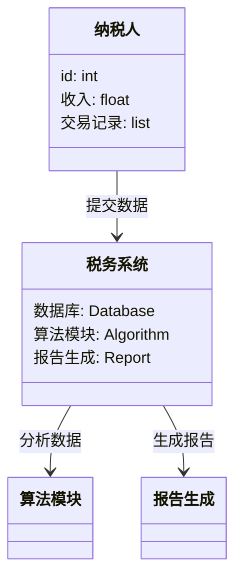
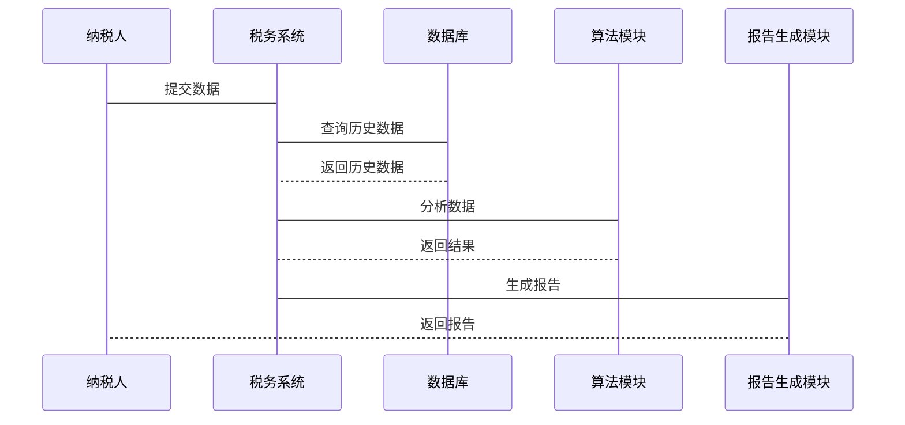

                 


# 智能系统优化税收效率投资策略

---

## 关键词：智能系统, 税收效率, 优化投资, 机器学习, 数据驱动

---

## 摘要：本文探讨如何利用智能系统优化税收效率投资策略。通过分析背景、核心概念、算法原理、系统架构和项目实战，详细阐述如何应用机器学习和大数据技术来提高税务管理的效率和准确性。

---

## 第一部分: 智能系统优化税收效率的背景与概念

### 第1章: 税收效率优化的背景与问题

#### 1.1 税收效率优化的重要性

##### 1.1.1 税收效率的基本概念
税收效率是指税务部门在征税过程中，以最小的成本和资源，最大化税款的征收和合规性。优化税收效率能够提高政府财政收入，降低纳税人的负担，同时减少税务纠纷。

##### 1.1.2 税收效率优化的必要性
随着经济全球化和数字化的发展，税收体系面临新的挑战，如避税、逃税、偷税等行为的增加，传统的人工审核方式效率低下，难以应对复杂的情况。

##### 1.1.3 智能系统在税收效率优化中的作用
智能系统通过大数据分析、机器学习等技术，能够快速识别异常交易，预测税收风险，优化资源配置，从而提高税收效率。

#### 1.2 智能系统优化的背景

##### 1.2.1 大数据与人工智能的发展
大数据和人工智能技术的进步为税收效率优化提供了新的工具和方法，能够处理海量数据，发现隐藏的模式和趋势。

##### 1.2.2 税务管理的智能化趋势
税务管理正在从传统的人工审核向智能化、自动化方向转变，智能系统能够实时监控交易，动态调整税收策略。

##### 1.2.3 智能系统优化的现状与挑战
尽管智能系统在税收领域应用广泛，但仍然面临数据隐私、模型准确性和计算资源等挑战。

#### 1.3 问题描述与目标

##### 1.3.1 税收效率优化的核心问题
如何通过智能系统识别高风险纳税人，预测税收流失，优化税收征管流程。

##### 1.3.2 智能系统优化的目标
提高税收征管效率，降低税收流失，实现税收政策的精准实施。

##### 1.3.3 边界与外延
智能系统优化的边界包括数据收集、处理、分析和决策，外延则涉及政策制定、执法和纳税人服务。

#### 1.4 核心概念与联系

##### 1.4.1 核心概念原理
税收效率优化依赖于数据的收集、处理和分析，利用机器学习算法识别异常交易，优化资源配置。

##### 1.4.2 概念属性特征对比表格

| 概念       | 特性         | 描述                           |
|------------|--------------|--------------------------------|
| 数据驱动   | 数据来源     | 结构化和非结构化数据           |
|            | 数据处理     | 清洗、转换、分析               |
| 机器学习   | 算法类型     | 监督学习、无监督学习           |
|            | 模型训练     | 数据训练，参数优化             |
| 智能系统   | 系统架构     | 数据采集、处理、分析、决策     |
|            | 系统功能     | 实时监控、预测、优化           |

##### 1.4.3 ER实体关系图架构
```mermaid
er
actor: 税务部门
actor: 纳税人
actor: 税务系统
entity: 纳税记录
entity: 税收政策
entity: 税务风险
relationship: 税务部门 -[管理]-> 税收政策
relationship: 纳税人 -[提交]-> 纳税记录
relationship: 税务系统 -[分析]-> 税务风险
```

---

### 第2章: 智能系统优化的核心概念

#### 2.1 数据驱动的税收效率优化

##### 2.1.1 数据驱动的定义与特点
数据驱动是指通过分析大量数据来发现规律和趋势，支持决策。其特点是实时性、精准性和数据驱动的洞察。

##### 2.1.2 数据驱动在税收效率优化中的应用
数据驱动技术可以用于识别高风险纳税人、预测税收流失、优化税收政策。

##### 2.1.3 数据驱动与传统优化方法的对比
数据驱动方法依赖于数据质量和算法，而传统方法依赖于经验判断和规则。

#### 2.2 机器学习与智能优化

##### 2.2.1 机器学习的基本原理
机器学习是通过算法学习数据中的模式，用于预测和分类。其核心是模型的训练和优化。

##### 2.2.2 机器学习在税收效率优化中的应用
机器学习可以用于识别异常交易、预测纳税人行为、优化税收征管流程。

##### 2.2.3 机器学习与传统优化方法的对比
机器学习能够处理复杂非线性关系，而传统方法通常处理线性关系。

#### 2.3 智能系统优化的数学模型

##### 2.3.1 数学模型的基本结构
数学模型通常包括输入、输出、目标函数和约束条件。例如，线性回归模型的输入是纳税人特征，输出是税收风险评分。

##### 2.3.2 数学模型的优化目标
优化目标通常是最大化收益、最小化成本或提高准确性。

##### 2.3.3 数学模型的变量与约束条件
变量包括纳税人收入、交易频率等，约束条件包括数据范围、模型复杂度等。

---

## 第二部分: 算法原理与实现

### 第3章: 算法原理与实现

#### 3.1 算法原理

##### 3.1.1 线性回归算法
线性回归是一种回归分析方法，用于预测连续变量。其核心是找到最佳拟合直线。

##### 3.1.2 随机森林算法
随机森林是一种基于决策树的集成算法，具有高准确性和鲁棒性。

##### 3.1.3 遗传算法
遗传算法是一种模拟自然选择的优化算法，用于解决组合优化问题。

#### 3.2 算法实现

##### 3.2.1 线性回归算法的实现
使用Python和Scikit-learn库，通过数据预处理、模型训练和评估步骤实现线性回归。

##### 3.2.2 随机森林算法的实现
通过数据分割、特征选择和投票机制实现随机森林模型。

##### 3.2.3 遗传算法的实现
通过编码、选择、交叉和变异操作实现遗传算法优化。

#### 3.3 数学模型与公式

##### 3.3.1 线性回归模型
$$ y = \beta_0 + \beta_1x + \epsilon $$

##### 3.3.2 随机森林模型
随机森林通过集成多个决策树的预测结果，提高模型的准确性和鲁棒性。

##### 3.3.3 遗传算法优化
$$ f(x) = \sum_{i=1}^n (x_i - \text{目标})^2 $$

---

## 第三部分: 系统分析与架构设计方案

### 第4章: 系统分析与架构设计方案

#### 4.1 问题场景介绍

##### 4.1.1 税务部门的需求
税务部门需要实时监控纳税人行为，识别异常交易，优化税收政策。

##### 4.1.2 纳税人的需求
纳税人需要快速、准确地完成税务申报，避免税务纠纷。

#### 4.2 系统功能设计

##### 4.2.1 领域模型


##### 4.2.2 系统架构设计


##### 4.2.3 接口设计与交互


---

## 第四部分: 项目实战

### 第5章: 项目实战

#### 5.1 环境安装与数据准备

##### 5.1.1 环境安装
安装Python、Scikit-learn、XGBoost等库。

##### 5.1.2 数据准备
收集纳税人的交易记录、收入数据等，进行数据清洗和预处理。

#### 5.2 核心实现

##### 5.2.1 线性回归实现
```python
from sklearn.linear_model import LinearRegression
model = LinearRegression()
model.fit(X_train, y_train)
y_pred = model.predict(X_test)
```

##### 5.2.2 随机森林实现
```python
from sklearn.ensemble import RandomForestRegressor
model = RandomForestRegressor(n_estimators=100)
model.fit(X_train, y_train)
y_pred = model.predict(X_test)
```

##### 5.2.3 遗传算法实现
```python
import numpy as np
from deap import algorithms, base, tools

toolbox = base.Toolbox()
toolbox.register("attr_int", np.random.randint, 0, 100)
toolbox.register("individual", tools.initRepeat, base.Fitness, toolbox.attr_int)
```

#### 5.3 案例分析与解读

##### 5.3.1 案例分析
分析某公司的交易数据，识别异常交易行为，预测税收风险。

##### 5.3.2 案例解读
通过机器学习模型识别高风险纳税人，优化税收征管策略。

#### 5.4 项目小结
总结项目实现的步骤、遇到的问题及解决方案，强调智能系统优化税收效率的实际应用价值。

---

## 第五部分: 结论与展望

### 第6章: 最佳实践 tips、小结、注意事项、拓展阅读

#### 6.1 最佳实践 tips
- 数据质量是关键，确保数据的准确性和完整性。
- 结合业务知识，选择合适的算法和模型。
- 定期更新模型，适应数据变化。

#### 6.2 小结
智能系统优化税收效率投资策略是一种高效、精准的解决方案，能够显著提高税收征管效率和准确性。

#### 6.3 注意事项
- 注意数据隐私和安全。
- 确保模型的解释性和可维护性。
- 定期监控和优化模型性能。

#### 6.4 拓展阅读
- 《大数据与人工智能在税务中的应用》
- 《机器学习算法与税收优化》
- 《智能系统设计与实现》

---

## 作者：AI天才研究院 & 禅与计算机程序设计艺术

---

**结语：** 智能系统优化税收效率投资策略是大数据和人工智能技术在税务管理中的重要应用，通过本文的分析和实践，读者可以深入理解其原理和实现方法，为实际应用提供参考和指导。

