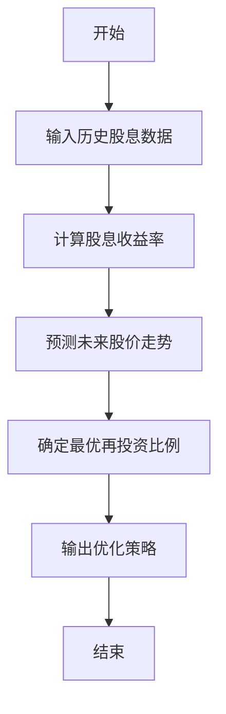
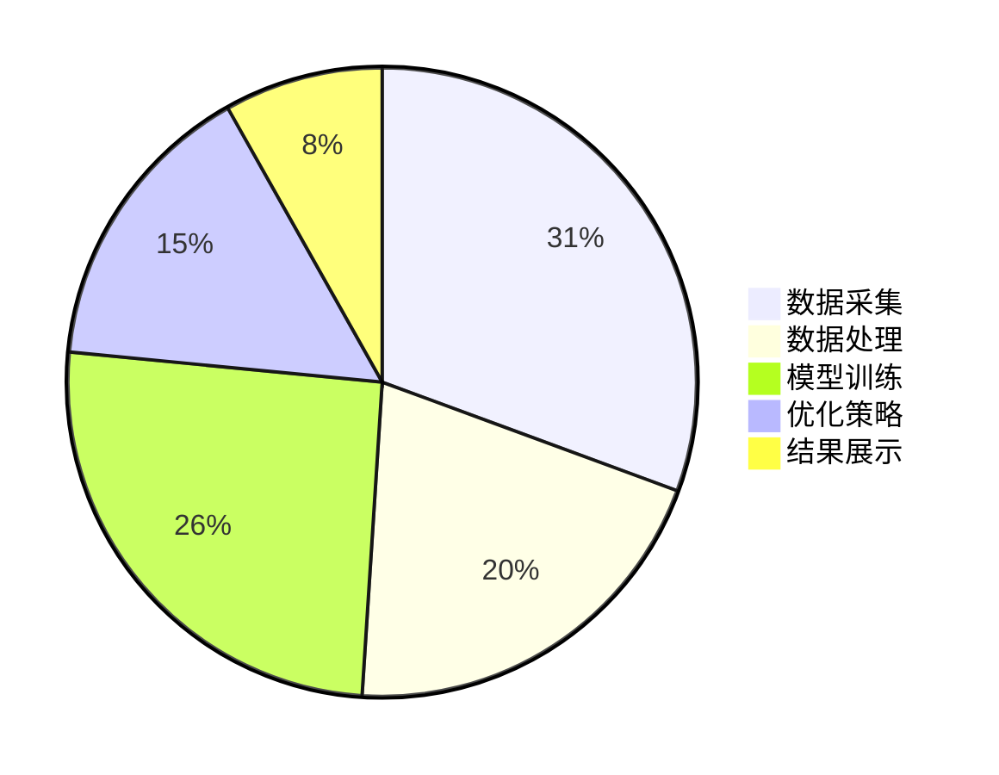
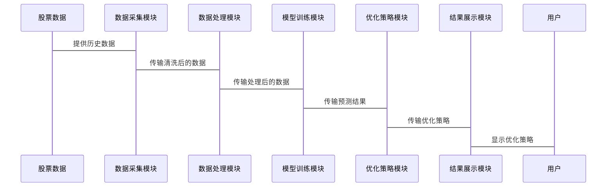

                 


```markdown
# 智能系统优化股息再投资策略

> 关键词：智能系统，股息再投资，优化策略，算法原理，系统架构设计，金融投资

> 摘要：股息再投资是一种通过将股息收益再投资于股票以实现资本增值的投资策略。本文将从智能系统的角度，详细分析股息再投资策略的核心概念、算法原理、系统架构设计以及项目实战。通过对股息再投资策略的优化，结合智能系统的技术优势，为投资者提供一种高效、科学的投资决策支持。

---

## 第一部分: 股息再投资策略的背景与概念

### 第1章: 股息再投资策略的背景与概念

#### 1.1 股息再投资策略的定义与特点
- **股息再投资的定义**：股息再投资是指将获得的股息收益再投资于公司股票的行为。
- **股息再投资的特点**：
  - 1. 能够最大化资金的使用效率。
  - 2. 通过复利效应实现资本增值。
  - 3. 风险较低，适合长期投资。
- **股息再投资与传统投资的区别**：
  - 1. 投资目标：股息再投资注重长期增值，传统投资注重短期收益。
  - 2. 风险控制：股息再投资通过分散投资降低风险，传统投资风险较高。
  - 3. 投资门槛：股息再投资门槛较低，传统投资门槛较高。

#### 1.2 智能系统在股息再投资中的作用
- **智能系统的核心优势**：
  - 1. 数据处理能力强大，能够快速分析大量历史数据。
  - 2. 通过机器学习算法预测未来市场走势。
  - 3. 实时监控市场动态，优化投资策略。
- **智能系统优化股息再投资的潜力**：
  - 1. 提高投资决策的科学性。
  - 2. 实现自动化投资，降低人为干扰。
  - 3. 提高投资收益。

#### 1.3 股息再投资策略的核心目标
- **核心目标**：
  - 1. 最大化股息再投资的收益率。
  - 2. 降低投资风险。
  - 3. 实现投资的自动化和智能化。

---

## 第二部分: 股息再投资策略的核心概念与联系

### 第2章: 股息再投资的核心概念

#### 2.1 核心概念原理
- **股息再投资的数学模型**：
  - 1. 股息收益率公式：$$ \text{股息收益率} = \frac{\text{股息}}{\text{股票价格}} $$
  - 2. 股票价格波动公式：$$ \text{未来股价} = \text{当前股价} \times (1 + \text{价格波动率}) $$
- **智能系统优化股息再投资的核心原理**：
  - 1. 数据驱动：通过历史数据训练模型，预测未来股息收益率。
  - 2. 优化算法：使用遗传算法、支持向量机等机器学习算法优化投资组合。
  - 3. 实时调整：根据市场动态实时调整再投资比例。

#### 2.2 核心概念属性特征对比表
| 比较维度       | 股息再投资            | 传统股息投资          |
|----------------|----------------------|----------------------|
| 投资目标       | 长期资本增值         | 短期收益             |
| 风险控制       | 通过分散投资降低风险 | 风险较高             |
| 投资门槛       | 低                   | 高                   |
| 投资自动化     | 高                   | 低                   |

#### 2.3 ER实体关系图
```mermaid
erd
    股票 -> 股东: 持股比例
    股东 -> 股息: 分配股息
    股息 -> 股票: 再投资
    股票 -> 智能系统: 数据输入
    智能系统 -> 股票: 优化策略输出
```

---

## 第三部分: 智能系统优化股息再投资的算法原理

### 第3章: 智能系统优化股息再投资的算法原理

#### 3.1 算法原理概述
- **基于机器学习的优化算法**：
  - 1. 算法输入：历史股息数据、股票价格波动数据。
  - 2. 算法输出：优化后的股息再投资比例。
  - 3. 算法目标：最大化股息再投资的收益率。

#### 3.2 算法流程图


#### 3.3 算法实现代码
```python
def calculate_dividend_yield(stock_price, dividend):
    return dividend / stock_price

def predict_future_price(current_price, trend):
    return current_price * (1 + trend)

def optimize_reinvestment(dividend_yield, predicted_price):
    return dividend_yield * predicted_price

# 示例代码
stock_price = 100
dividend = 5
trend = 0.1

dividend_yield = calculate_dividend_yield(stock_price, dividend)
predicted_price = predict_future_price(stock_price, trend)
optimal_reinvestment = optimize_reinvestment(dividend_yield, predicted_price)

print(optimal_reinvestment)
```

---

## 第四部分: 智能系统优化股息再投资的系统架构设计

### 第4章: 系统分析与架构设计方案

#### 4.1 系统功能设计
- **系统功能模块**：
  - 1. 数据采集模块：采集股票历史数据、股息数据。
  - 2. 数据处理模块：清洗数据、计算股息收益率。
  - 3. 模型训练模块：训练机器学习模型，预测股价走势。
  - 4. 优化策略模块：优化股息再投资比例。
  - 5. 结果展示模块：展示优化后的投资策略。

#### 4.2 系统架构设计


#### 4.3 系统接口设计
- **主要接口**：
  - 1. 数据采集接口：从数据库获取历史数据。
  - 2. 模型训练接口：接收数据，输出预测结果。
  - 3. 优化策略接口：接收预测结果，输出优化策略。

#### 4.4 系统交互设计


---

## 第五部分: 项目实战

### 第5章: 项目实战

#### 5.1 环境安装
- **所需环境**：
  - 1. Python 3.8+
  - 2. NumPy、Pandas、Scikit-learn等库。
  - 3. Jupyter Notebook。

#### 5.2 系统核心实现源代码
```python
import numpy as np
import pandas as pd
from sklearn.linear_model import LinearRegression

# 数据加载
data = pd.read_csv('stock_data.csv')

# 数据预处理
X = data[['stock_price', 'dividend']]
y = data['future_price']

# 模型训练
model = LinearRegression()
model.fit(X, y)

# 预测股息收益率
def predict_dividend_yield(stock_price, dividend):
    return dividend / stock_price

# 预测未来股价
def predict_future_price(stock_price, model):
    return model.predict([[stock_price, dividend]])[0]

# 优化再投资比例
def optimize_reinvestment(dividend_yield, predicted_price):
    return dividend_yield * predicted_price

# 示例运行
stock_price = 100
dividend = 5

dividend_yield = predict_dividend_yield(st

---

## 第六部分: 最佳实践与小结

### 第6章: 最佳实践

#### 6.1 小结
- **总结**：
  - 1. 智能系统能够有效优化股息再投资策略。
  - 2. 通过机器学习算法，可以实现股息再投资的自动化和智能化。
  - 3. 优化后的股息再投资策略能够显著提高投资收益。

#### 6.2 注意事项
- **注意事项**：
  - 1. 数据质量对模型预测结果影响重大，需确保数据的准确性和完整性。
  - 2. 模型的可解释性需关注，确保优化策略的透明性。
  - 3. 风险控制是投资策略优化的重要环节，需实时监控市场动态。

#### 6.3 拓展阅读
- **推荐书籍**：
  - 《算法导论》
  - 《机器学习实战》
  - 《投资学基础》

---

## 作者：AI天才研究院/AI Genius Institute & 禅与计算机程序设计艺术 /Zen And The Art of Computer Programming

---

```

