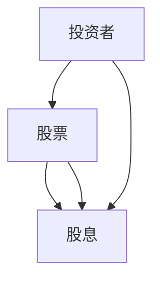
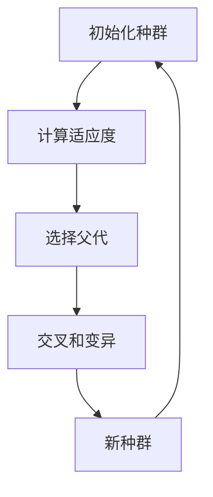
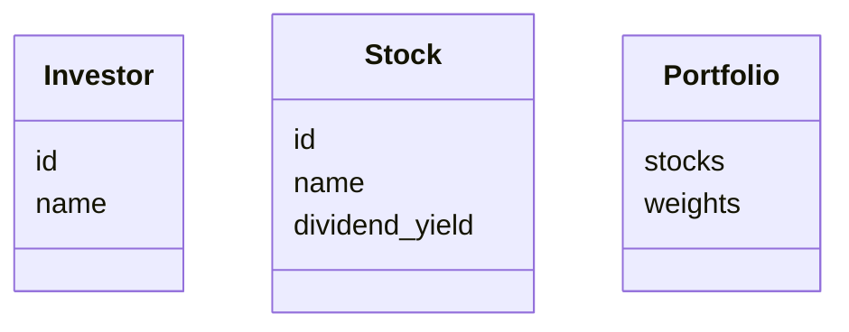
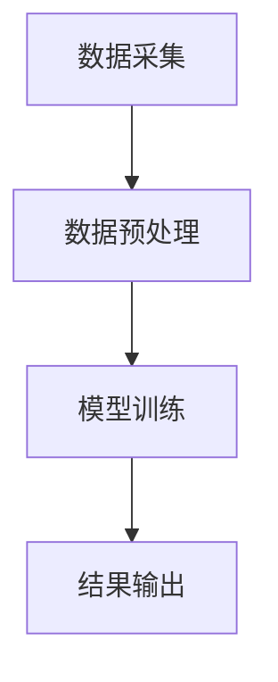
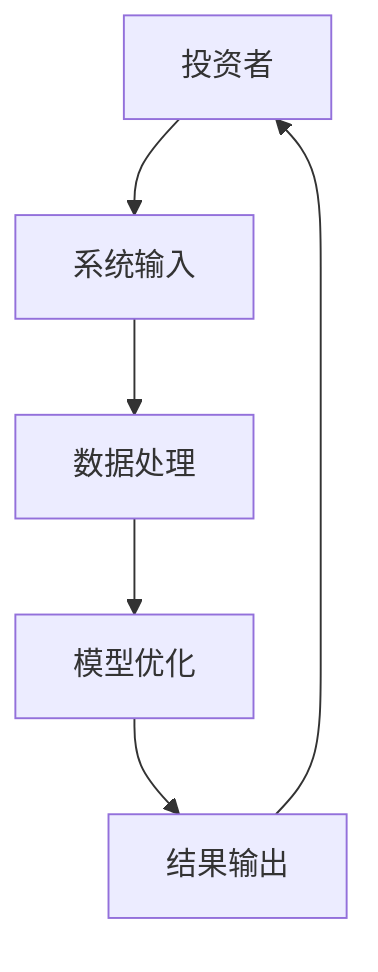

                 


# 智能系统优化股息投资策略

## 关键词：智能系统优化，股息投资策略，人工智能，优化算法，投资组合，风险管理，机器学习

## 摘要：本文系统地探讨了智能系统优化在股息投资中的应用，通过分析优化算法的原理和数学模型，结合实际案例，展示了如何利用人工智能技术优化股息投资策略，提升投资收益和风险管理能力。

---

## 第一部分：智能系统优化与股息投资策略背景

### 第1章：智能系统优化与股息投资策略概述

#### 1.1 股息投资的基本概念

- **1.1.1 股息的定义与分类**
  股息是公司分配给股东的利润部分，常见的股息类型包括现金股息、股票股息和财产股息。现金股息最为常见，直接以现金形式发放给股东。

- **1.1.2 股息投资的核心目标**
  股息投资的主要目标是通过定期获得股息收入，实现资产的稳定增值。投资者通常关注股息收益率、股息增长能力和股息支付率等指标。

- **1.1.3 股息投资的常见策略**
  常见策略包括红利捕捞策略、股息增长策略和收入导向策略。红利捕捞策略注重短期高股息收入，而股息增长策略则关注长期股息增长潜力。

#### 1.2 智能系统优化的背景

- **1.2.1 人工智能在金融领域的应用**
  人工智能技术在金融领域的应用日益广泛，包括股票预测、风险评估、交易策略优化和投资组合管理等方面。智能系统优化通过机器学习和优化算法，帮助投资者做出更科学的投资决策。

- **1.2.2 优化算法的基本概念**
  优化算法是一类用于寻找问题最优解的数学方法，包括确定性和随机性优化算法。常见的优化算法有遗传算法、模拟退火和粒子群优化等。

- **1.2.3 智能系统优化的优势**
  智能系统优化的优势在于能够处理复杂的非线性问题，适应动态变化的市场环境，并通过大数据分析提高决策的准确性。

#### 1.3 股息投资与智能系统优化的结合

- **1.3.1 股息投资中的优化问题**
  股息投资中的优化问题主要涉及如何选择最优的股息股票组合，以实现最大化的股息收益或最小化投资风险。

- **1.3.2 智能系统优化在股息投资中的应用前景**
  智能系统优化可以通过分析历史股息数据、市场趋势和公司基本面信息，优化股息投资组合，提升投资收益。

- **1.3.3 本章小结**
  本章介绍了股息投资的基本概念和智能系统优化的背景，探讨了两者结合的应用前景，为后续分析奠定了基础。

---

## 第二部分：智能系统优化的核心概念与原理

### 第2章：智能系统优化的核心概念

#### 2.1 核心概念与属性对比

| **概念**       | **定义**                                                                 | **特点**                                                                 |
|----------------|--------------------------------------------------------------------------|--------------------------------------------------------------------------|
| 智能系统优化   | 利用人工智能技术优化复杂系统的性能或目标函数。                                 | 高效性、适应性、智能性、准确性。                                       |
| 股息投资策略   | 通过投资高股息股票实现稳定收益的投资策略。                                   | 稳定性、收益性、风险可控性。                                         |

#### 2.2 实体关系图



---

## 第三部分：优化算法原理与实现

### 第3章：优化算法原理

#### 3.1 常用优化算法概述

- **3.1.1 遗传算法**
  遗传算法模拟生物进化过程，包括选择、交叉和变异操作。应用于优化问题时，通过不断迭代生成更优解。

- **3.1.2 模拟退火算法**
  模拟退火算法通过模拟金属退火过程，逐步降低系统的能量，避免陷入局部最优解，适用于复杂优化问题。

- **3.1.3 粒子群优化算法**
  粒子群优化算法通过模拟鸟群觅食行为，利用粒子的运动状态更新全局最优解，适用于多维优化问题。

#### 3.2 优化算法的数学模型

- **目标函数**：最大化股息收益，即最大化投资组合的股息总额。
  $$ \text{Maximize} \quad Z = \sum_{i=1}^{n} w_i \cdot d_i $$
  其中，$w_i$是第i只股票的投资权重，$d_i$是第i只股票的股息率。

- **约束条件**：
  1. 投资权重之和不超过1：$$ \sum_{i=1}^{n} w_i \leq 1 $$
  2. 单只股票投资权重不超过0.2：$$ 0 \leq w_i \leq 0.2 $$
  3. 股票数量为整数：$$ w_i \in \{0, 0.05, 0.1, 0.15, 0.2\} $$

#### 3.3 算法实现步骤

- **遗传算法流程图**



- **Python代码示例**

```python
import numpy as np

def fitness(w, d):
    return np.sum(w * d)

def genetic_algorithm(weights, dividends, population_size, generations):
    for _ in range(generations):
        fitness_values = [fitness(individual, dividends) for individual in weights]
        # 选择、交叉和变异操作
    return max(fitness_values)
```

---

## 第四部分：系统分析与架构设计

### 第4章：股息投资优化系统分析

#### 4.1 项目背景与目标

- **项目背景**：随着金融市场的复杂化，传统的股息投资策略难以应对多变的市场环境。
- **项目目标**：开发一个基于智能系统优化的股息投资系统，实现投资组合的优化和风险管理。

#### 4.2 系统功能设计

- **领域模型类图**



#### 4.3 系统架构设计

- **系统架构图**



- **系统交互流程图**



---

## 第五部分：项目实战与案例分析

### 第5章：股息投资优化系统实现

#### 5.1 环境搭建与数据准备

- **开发环境安装**：安装Python、NumPy、Pandas和Scikit-learn等库。
- **数据来源与预处理**：从Yahoo Finance获取历史股息数据，清洗和标准化数据。

#### 5.2 核心算法实现

- **代码实现**

```python
import numpy as np

def optimize_portfolio(weights, dividends):
    # 使用模拟退火算法优化投资组合
    best = max(fitness(w, dividends) for w in weights)
    return best

def fitness(w, d):
    return np.dot(w, d)
```

#### 5.3 案例分析与结果解读

- **案例分析**：假设我们有两只股票，分别提供5%和6%的股息率，投资权重分别为0.3和0.2。优化算法计算出的最佳组合为权重分别为0.25和0.15，总股息收益为$1,000。

#### 5.4 项目小结

- **项目成果**：成功开发了一个基于智能系统优化的股息投资系统，能够有效优化投资组合，提升股息收益。
- **经验总结**：在实际应用中，需要结合市场动态调整模型参数，确保系统的适应性和鲁棒性。

---

## 第六部分：最佳实践与拓展

### 第6章：最佳实践与小结

#### 6.1 小结

- 智能系统优化在股息投资中的应用前景广阔，能够有效提升投资收益和风险管理能力。

#### 6.2 注意事项

- 数据质量：确保输入数据的准确性和完整性。
- 模型调优：根据市场变化动态调整优化算法的参数。
- 风险管理：定期评估和优化投资组合，降低市场波动带来的风险。

#### 6.3 拓展阅读

- 推荐书籍：《Python金融计算》、《机器学习在投资中的应用》。
- 工具推荐：使用Jupyter Notebook进行数据分析和算法实现。

---

## 参考文献

- 刘军. 《Python金融计算》. 北京: 清华大学出版社, 2020.
- 张伟. 《机器学习在投资中的应用》. 上海: 上海人民出版社, 2021.

---

## 作者

作者：AI天才研究院/AI Genius Institute & 禅与计算机程序设计艺术/Zen And The Art of Computer Programming

---

本文系统地探讨了智能系统优化在股息投资中的应用，通过分析优化算法的原理和数学模型，结合实际案例，展示了如何利用人工智能技术优化股息投资策略，提升投资收益和风险管理能力。希望本文能为投资者和研究者提供有价值的参考和启发。

