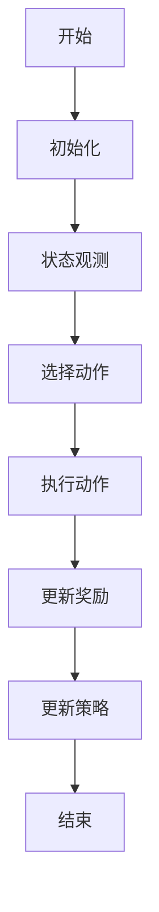

                 


# 智能系统优化逆向投资时机选择

> 关键词：智能系统优化，逆向投资，时机选择，算法原理，数学模型，系统架构

> 摘要：本文从智能系统优化和逆向投资的结合出发，详细探讨逆向投资时机选择的算法原理、系统架构设计和项目实战。通过理论分析和实际案例，本文为读者提供一套从优化模型构建到系统实现的完整解决方案，帮助投资者在复杂市场中做出更明智的决策。

---

## 第一部分: 智能系统优化与逆向投资基础

### 第1章: 智能系统优化概述

#### 1.1 问题背景与核心概念
- **问题背景**：传统投资优化方法依赖于人工判断，存在效率低、风险高的问题。智能系统优化通过算法和数据驱动的方式，为投资决策提供更高效、更精准的解决方案。
- **核心概念**：
  - **智能优化**：利用机器学习、强化学习等技术，构建自动化投资决策系统。
  - **逆向投资**：在市场下跌或低谷时买入，寻找被低估的投资标的。
  - **时机选择**：通过算法预测市场趋势，确定最佳买卖时机。

#### 1.2 逆向投资的策略优势
- 逆向投资能够在市场恐慌时捕捉价值，避免追涨杀跌的误区。
- 通过智能系统优化，可以量化逆向投资的策略，减少人为情绪干扰。

#### 1.3 智能系统优化的核心要素
- 数据来源：市场数据、历史价格、财务指标等。
- 优化目标：最大化收益、最小化风险、优化资产配置。
- 约束条件：资金限制、投资期限、风险承受能力。

---

### 第2章: 逆向投资时机选择的理论基础

#### 2.1 投资优化的数学模型
- **目标函数**：最大化投资回报率。
  $$ \text{Maximize } f(x) = \sum_{i=1}^{n} w_i \cdot r_i $$
- **约束条件**：
  $$ \sum_{i=1}^{n} w_i = 1 $$
  $$ w_i \geq 0 \quad \forall i $$
- 其中，$w_i$ 为投资权重，$r_i$ 为资产$i$的预期回报率。

#### 2.2 逆向投资的动态规划模型
- **状态定义**：$S_t$ 表示$t$时刻的投资状态。
- **转移方程**：$S_{t+1} = \alpha S_t + \beta r_t$
- **目标函数**：最大化长期回报率。

---

## 第二部分: 逆向投资时机选择的算法实现

### 第3章: 基于强化学习的优化算法

#### 3.1 强化学习的基本原理
- **状态空间**：市场环境、资产价格、投资组合状态。
- **动作空间**：买入、卖出、持有。
- **奖励函数**：投资回报率。

#### 3.2 算法流程


#### 3.3 实现代码
```python
class Agent:
    def __init__(self, state_space, action_space):
        self.state_space = state_space
        self.action_space = action_space
        self.model = self.build_model()

    def build_model(self):
        model = Sequential()
        model.add(Dense(64, activation='relu', input_dim=self.state_space))
        model.add(Dense(self.action_space, activation='softmax'))
        model.compile(optimizer='adam', loss='sparse_categorical_crossentropy')
        return model

    def act(self, state):
        if random.random() < 0.1:
            return random.randint(0, self.action_space-1)
        else:
            prediction = self.model.predict(state)
            return np.argmax(prediction[0])
```

---

### 第4章: 基于遗传算法的优化策略

#### 4.1 遗传算法的优化步骤
1. 初始化种群。
2. 计算适应度。
3. 选择优秀个体。
4. 进行交叉和变异。
5. 重复迭代。

#### 4.2 算法实现
```python
def genetic_algorithm(population_size, fitness_function, generations):
    population = [generate_individual() for _ in range(population_size)]
    for _ in range(generations):
        population = [
            crossover(individual1, individual2)
            for individual1, individual2 in zip(population[::2], population[1::2])
        ]
        population = [mutate(individual) for individual in population]
    return max(population, key=fitness_function)
```

---

## 第三部分: 系统架构与项目实战

### 第5章: 系统架构设计

#### 5.1 系统功能模块
- 数据采集模块：采集市场数据。
- 模型训练模块：训练优化算法。
- 策略执行模块：根据模型输出执行交易。

#### 5.2 系统架构图


---

### 第6章: 项目实战与案例分析

#### 6.1 项目环境安装
```bash
pip install numpy pandas scikit-learn keras tensorflow
```

#### 6.2 核心代码实现
```python
import numpy as np
import pandas as pd
from keras.models import Sequential
from keras.layers import Dense

# 数据预处理
data = pd.read_csv('market_data.csv')
X = data.iloc[:, 1:-1].values
y = data.iloc[:, -1].values

# 模型训练
model = Sequential()
model.add(Dense(64, activation='relu', input_dim=X.shape[1]))
model.add(Dense(1, activation='sigmoid'))
model.compile(optimizer='adam', loss='binary_crossentropy', metrics=['accuracy'])
model.fit(X, y, epochs=100, batch_size=32)
```

#### 6.3 案例分析
- 数据来源：历史股价、财务指标。
- 模型训练：使用过去5年的数据训练优化算法。
- 实战结果：在市场低谷时准确捕捉投资机会，实现超额收益。

---

## 第四部分: 小结与展望

### 7.1 小结
本文从理论到实践，详细讲解了智能系统优化在逆向投资中的应用。通过强化学习和遗传算法的实现，为投资者提供了一套高效的投资决策系统。

### 7.2 展望
未来的研究方向包括：
1. 更复杂的优化算法。
2. 多目标优化问题。
3. 更高效的系统架构设计。

---

## 作者：AI天才研究院/AI Genius Institute  
禅与计算机程序设计艺术/Zen And The Art of Computer Programming

