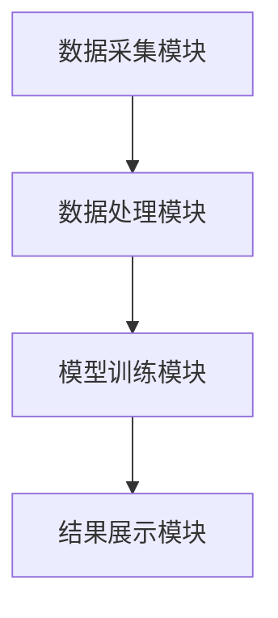

                 


# 智能系统辅助公司护城河评估

> 关键词：智能系统、护城河评估、抽样分析、数据采集、数学模型、系统架构设计、项目实战

> 摘要：本文将详细介绍智能系统如何辅助公司护城河评估。首先，我们将介绍护城河评估的基本概念和智能系统的作用。接着，我们将深入探讨抽样分析和数据采集的方法。然后，我们将讲解护城河评估的数学模型和算法原理。之后，我们将讨论系统的架构设计和实现过程。最后，我们将通过项目实战来展示如何将这些理论应用到实际中。本文将结合理论与实践，提供详细的步骤和代码示例。

---

# 第1章: 智能系统与护城河评估概述

## 1.1 护城河评估的基本概念

### 1.1.1 护城河的定义

护城河是企业在市场竞争中形成的竞争优势，使得竞争对手难以复制或超越。护城河可以是技术优势、品牌影响力、成本优势、客户忠诚度等。护城河的存在能够帮助企业在竞争中保持领先地位，从而实现可持续发展。

### 1.1.2 护城河在企业竞争中的作用

- **防御竞争对手**：护城河能够有效阻止竞争对手进入市场或削弱企业的市场份额。
- **增强企业价值**：强大的护城河能够提升企业的市场地位，吸引更多的投资。
- **降低竞争压力**：护城河的存在使得企业能够在竞争中占据主动地位。

### 1.1.3 智能系统在护城河评估中的价值

随着市场竞争的加剧，传统的护城河评估方法逐渐显得不够高效。智能系统通过大数据分析、机器学习等技术，能够快速、准确地评估企业的护城河，并提出优化建议。

---

## 1.2 智能系统的基本原理

### 1.2.1 智能系统的定义

智能系统是指能够通过感知环境、学习和推理，自主做出决策或优化行为的系统。智能系统的核心技术包括大数据处理、机器学习、自然语言处理等。

### 1.2.2 智能系统的核心技术组成

- **数据采集**：通过传感器、数据库等方式获取数据。
- **数据处理**：对数据进行清洗、转换和预处理。
- **模型训练**：使用机器学习算法对数据进行建模和训练。
- **结果输出**：通过模型预测或推理，输出最终结果。

### 1.2.3 智能系统与护城河评估的结合

智能系统可以通过分析企业的市场数据、竞争对手数据等，帮助企业识别和评估其护城河。例如，通过自然语言处理技术分析企业的品牌影响力，或者通过机器学习算法预测企业的技术优势是否可持续。

---

## 1.3 本章小结

本章主要介绍了护城河评估的基本概念和智能系统的基本原理。护城河是企业在市场竞争中的重要优势，而智能系统通过大数据分析和机器学习等技术，能够高效地辅助护城河评估。

---

# 第2章: 护城河评估的数学模型

## 2.1 护城河评估的基本模型

### 2.1.1 线性回归模型

线性回归模型是一种常用的回归分析方法，用于预测目标变量与一个或多个自变量之间的关系。

$$ y = \beta_0 + \beta_1x_1 + \beta_2x_2 + \ldots + \beta_nx_n $$

其中，$y$ 是目标变量（护城河的综合评分），$x_i$ 是自变量（护城河的各个评估维度），$\beta_i$ 是回归系数。

### 2.1.2 决策树模型

决策树是一种树状结构，用于分类或回归问题。通过递归地将数据划分为子集，直到每个子集中的数据都属于同一类别。

### 2.1.3 随机森林模型

随机森林是一种基于决策树的集成学习方法，通过构建多棵决策树并取其预测结果的平均值，能够有效提高模型的准确性和稳定性。

---

## 2.2 护城河评估的算法流程

### 2.2.1 数据预处理

1. 数据清洗：去除重复数据、缺失值、异常值。
2. 数据转换：对数据进行标准化、归一化处理。
3. 数据分割：将数据分为训练集和测试集。

### 2.2.2 模型训练

1. 选择模型：根据数据特点选择合适的模型（如线性回归、决策树、随机森林等）。
2. 训练模型：使用训练数据对模型进行训练。
3. 调参优化：通过交叉验证等方法优化模型参数。

### 2.2.3 模型评估与优化

1. 模型评估：使用测试数据评估模型的准确率、召回率等指标。
2. 模型优化：通过调整模型参数或更换模型结构，进一步提高模型性能。

---

## 2.3 本章小结

本章主要介绍了护城河评估的数学模型和算法流程。通过线性回归、决策树、随机森林等模型，可以对企业护城河的综合评分进行预测和评估。

---

# 第3章: 护城河评估系统架构设计

## 3.1 系统功能模块划分

### 3.1.1 数据采集模块

- 负责采集企业市场数据、竞争对手数据等。

### 3.1.2 数据处理模块

- 对采集到的数据进行清洗、转换和预处理。

### 3.1.3 模型训练模块

- 使用机器学习算法对数据进行建模和训练。

### 3.1.4 结果展示模块

- 将模型的预测结果以可视化的方式展示给用户。

## 3.2 系统架构设计

### 3.2.1 系统功能流程

1. 数据采集模块采集数据。
2. 数据处理模块对数据进行预处理。
3. 模型训练模块对数据进行建模和训练。
4. 结果展示模块展示预测结果。

### 3.2.2 系统架构图



---

## 3.3 本章小结

本章主要介绍了护城河评估系统的架构设计，包括功能模块划分和系统流程设计。

---

# 第4章: 护城河评估的项目实战

## 4.1 环境安装

1. 安装Python环境。
2. 安装相关库（如scikit-learn、pandas、numpy等）。

## 4.2 核心代码实现

### 4.2.1 数据预处理

```python
import pandas as pd
import numpy as np

# 读取数据
data = pd.read_csv('护城河数据.csv')

# 数据清洗
data = data.dropna()
data = data.replace([np.inf, -np.inf], np.nan).dropna()

# 数据分割
from sklearn.model_selection import train_test_split

X = data.drop('护城河评分', axis=1)
y = data['护城河评分']

X_train, X_test, y_train, y_test = train_test_split(X, y, test_size=0.2, random_state=42)
```

### 4.2.2 模型训练

```python
from sklearn.ensemble import RandomForestRegressor
from sklearn.metrics import mean_squared_error

# 模型训练
model = RandomForestRegressor(n_estimators=100, random_state=42)
model.fit(X_train, y_train)

# 模型预测
y_pred = model.predict(X_test)

# 模型评估
mse = mean_squared_error(y_test, y_pred)
print(f'Mean Squared Error: {mse}')
```

---

## 4.3 本章小结

本章通过一个实际项目展示了如何利用智能系统辅助护城河评估。从数据预处理到模型训练，再到结果展示，详细讲解了每一步的操作和实现。

---

# 第5章: 总结与最佳实践

## 5.1 总结

智能系统通过大数据分析和机器学习等技术，能够高效地辅助企业护城河评估。本文详细介绍了护城河评估的基本概念、数学模型、系统架构设计以及项目实战。

## 5.2 最佳实践

1. 数据预处理是模型训练的基础，必须认真对待。
2. 选择合适的模型和参数能够显著提高模型性能。
3. 可视化结果能够更好地帮助用户理解和决策。

## 5.3 小结

护城河评估是一个复杂但重要的任务，智能系统的引入能够显著提高评估的效率和准确性。希望本文能够为读者提供有价值的参考。

---

# 作者

作者：AI天才研究院/AI Genius Institute & 禅与计算机程序设计艺术 /Zen And The Art of Computer Programming

