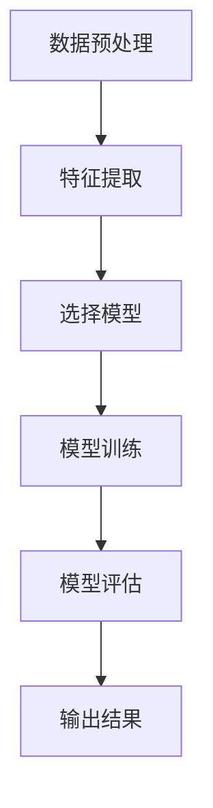
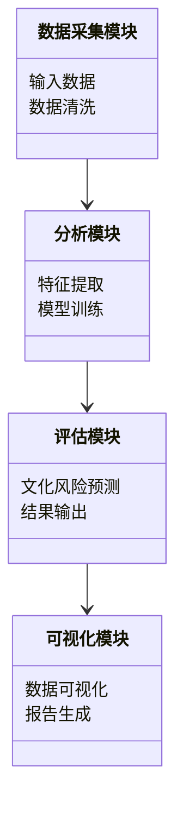
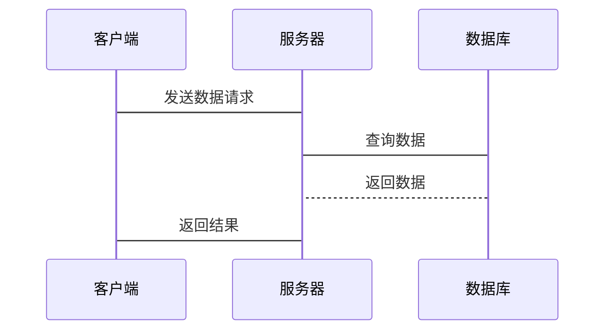

                 


# 智能系统辅助公司文化影响评估

## 关键词：智能系统、公司文化、文化评估、数据分析、人工智能、算法原理、系统架构

## 摘要：本文探讨了如何利用智能系统辅助公司文化影响评估，结合数据分析和人工智能技术，详细介绍了文化评估的核心概念、算法原理、系统架构设计及实际应用案例，旨在为企业提供有效的文化管理工具。

---

### 第一部分：背景与概述

#### 第1章：公司文化与文化评估概述

##### 1.1 公司文化的定义与重要性
- **1.1.1 公司文化的定义**
  - 公司文化是企业在长期发展过程中形成的价值观、行为准则和企业精神的总和。
- **1.1.2 公司文化在企业中的作用**
  - 企业文化是企业的灵魂，影响员工行为、企业凝聚力和市场竞争力。
- **1.1.3 公司文化评估的意义**
  - 评估公司文化有助于优化企业内部管理，提升员工满意度和企业绩效。

##### 1.2 传统公司文化评估方法的局限性
- **1.2.1 传统评估方法的不足**
  - 主观性较强，缺乏数据支持。
- **1.2.2 数据采集与处理的挑战**
  - 数据来源单一，难以全面反映企业文化。
- **1.2.3 评估结果的局限性**
  - 评估结果难以量化，缺乏动态调整能力。

##### 1.3 智能系统在公司文化评估中的作用
- **1.3.1 智能系统的优势**
  - 利用数据挖掘和机器学习技术，提供客观、动态的评估结果。
- **1.3.2 智能系统在文化评估中的应用场景**
  - 通过自然语言处理技术分析员工反馈，识别文化问题。
- **1.3.3 智能系统与传统方法的结合**
  - 结合定性和定量分析，提升评估的准确性和全面性。

---

### 第二部分：智能系统与公司文化评估

#### 第2章：智能系统的核心概念与原理

##### 2.1 智能系统的定义与特点
- **2.1.1 智能系统的定义**
  - 智能系统是指能够感知环境、处理信息并做出决策的计算机系统。
- **2.1.2 智能系统的核心特点**
  - 数据驱动、自适应、可扩展。
- **2.1.3 智能系统与传统系统的区别**
  - 智能系统具备学习和自适应能力，能够处理复杂问题。

##### 2.2 数据采集与处理
- **2.2.1 数据来源**
  - 包括员工反馈、管理数据、市场反馈等。
- **2.2.2 数据清洗与预处理**
  - 去除噪声数据，标准化处理。
- **2.2.3 数据存储与管理**
  - 使用数据库或大数据平台存储和管理数据。

##### 2.3 智能系统与公司文化评估的核心联系
- **2.3.1 数据分析**
  - 通过统计分析识别文化问题。
- **2.3.2 机器学习模型**
  - 使用分类和回归模型预测文化风险。
- **2.3.3 自然语言处理**
  - 分析文本数据，提取情感和主题。

##### 2.4 核心概念原理对比
- **表2-1：传统评估与智能系统评估的对比**

| 对比维度        | 传统评估                  | 智能系统评估               |
|-----------------|---------------------------|---------------------------|
| 数据来源        | 主要依赖问卷调查          | 结构化和非结构化数据       |
| 分析方法        | 定性分析为主              | 定量和定性分析结合         |
| 评估结果        | 主观性强                  | 客观且动态                |

---

#### 第3章：智能系统辅助公司文化评估的算法原理

##### 3.1 算法选择与原理
- **3.1.1 自然语言处理（NLP）**
  - 使用NLP技术分析员工反馈文本，提取关键词和主题。
- **3.1.2 机器学习模型**
  - 使用监督学习模型预测文化风险。

##### 3.2 算法流程
- **图3-1：文化评估算法流程图**



##### 3.3 数学模型与公式
- **模型结构**
  - 使用LSTM网络处理序列数据。
- **损失函数**
  $$L = -\sum_{i=1}^{n} y_i \log p(y_i)$$

---

### 第三部分：系统分析与架构设计

#### 第4章：系统架构与功能设计

##### 4.1 问题场景介绍
- 系统目标：实现公司文化影响的智能评估。
- 使用场景：企业内部管理、文化优化。

##### 4.2 系统功能设计
- **图4-1：系统功能模块类图**



##### 4.3 系统架构设计
- **图4-2：系统架构图**


##### 4.4 系统接口与交互
- **图4-3：系统交互序列图**



---

### 第四部分：项目实战与应用

#### 第5章：项目实战

##### 5.1 环境安装与配置
- **安装步骤**
  1. 安装Python和相关库（如scikit-learn、TensorFlow）。
  2. 安装Jupyter Notebook用于数据分析和可视化。

##### 5.2 核心代码实现
- **代码示例：员工反馈分析**

```python
import numpy as np
from sklearn.feature_extraction.text import TfidfVectorizer
from sklearn.naive_bayes import MultinomialNB

# 数据预处理
data = [...]  # 文本数据
labels = [...]  # 标签

# 特征提取
vectorizer = TfidfVectorizer()
X = vectorizer.fit_transform(data)

# 模型训练
model = MultinomialNB()
model.fit(X, labels)

# 模型预测
new_data = ["员工反馈内容"]
X_new = vectorizer.transform(new_data)
predicted = model.predict(X_new)
print(predicted)
```

##### 5.3 案例分析与结果解读
- **案例分析**
  - 使用NLP分析员工反馈，识别主要问题。
- **结果解读**
  - 通过模型预测，识别高风险区域。

##### 5.4 项目小结
- 项目成功实现了智能评估系统，提升了企业文化管理效率。

---

### 第五部分：总结与展望

#### 第6章：总结与未来展望

##### 6.1 系统实现总结
- 成功构建了智能评估系统，提升了评估的准确性和效率。

##### 6.2 未来优化方向
- 结合更多数据源，提升模型准确性。
- 开发用户友好的可视化界面。

##### 6.3 注意事项与建议
- 数据隐私保护需重视。
- 系统维护和更新要及时。

---

## 结语

通过智能系统辅助公司文化影响评估，企业能够更有效地识别和解决文化问题，提升管理效率和员工满意度。未来，随着技术的进步，智能系统在企业文化管理中的应用将更加广泛和深入。

---

## 作者：AI天才研究院 & 禅与计算机程序设计艺术

