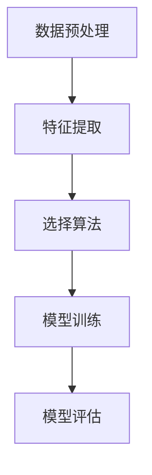
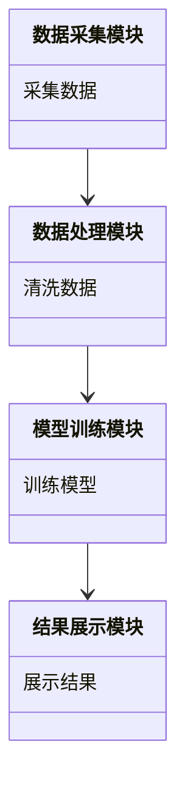

                 


# 智能系统辅助并购协同效应量化

## 关键词：智能系统，并购协同效应，量化方法，数据挖掘，机器学习，数学模型

## 摘要：  
并购协同效应的量化是企业在并购决策中面临的核心问题之一。本文通过分析智能系统在并购协同效应量化中的应用，提出了基于数据挖掘和机器学习的协同效应量化方法，构建了协同效应的数学模型，并通过实际案例展示了算法的实现和应用效果。文章从背景、理论基础、算法实现、系统架构、项目实战、案例分析到总结，层层递进，为读者提供了全面的技术指导和实践参考。

---

# 第1章：并购协同效应概述

## 1.1 什么是并购协同效应

### 1.1.1 协同效应的定义  
协同效应（Synergy）是指企业在并购过程中，通过资源整合、业务协同、成本节约等方式实现的超出单独价值的额外价值。协同效应是企业并购的核心价值所在，通常表现为收入增加、成本降低或资产价值提升。

### 1.1.2 协同效应的分类  
协同效应主要分为以下几种类型：
- **收入协同效应**：通过整合销售渠道、客户资源等实现收入增长。
- **成本协同效应**：通过共享资源、减少重复投入等方式降低成本。
- **资产协同效应**：通过资产优化配置提升资产使用效率。

### 1.1.3 协同效应的度量方式  
协同效应的度量方式包括：
- **绝对协同效应**：具体数值，如成本节约的具体金额。
- **相对协同效应**：相对于并购前的比率，如成本节约率。

---

## 1.2 智能系统辅助并购的背景

### 1.2.1 并购过程中的信息不对称问题  
并购过程中，信息不对称可能导致估值偏差，影响协同效应的准确评估。

### 1.2.2 传统协同效应评估方法的局限性  
传统方法依赖主观判断，缺乏数据支持，难以量化。

### 1.2.3 智能系统在并购中的应用价值  
智能系统可以通过大数据分析、机器学习等技术，提供更精准的协同效应评估。

---

## 1.3 协同效应量化的核心问题

### 1.3.1 协同效应的边界与外延  
协同效应的边界包括哪些业务、哪些资源可以被整合；外延则包括协同效应的具体表现形式。

### 1.3.2 协同效应的关键影响因素  
包括企业规模、行业特性、管理能力等。

### 1.3.3 协同效应的量化目标  
通过量化协同效应，为并购决策提供数据支持。

---

## 1.4 本章小结  
本章介绍了并购协同效应的基本概念、分类、度量方式以及智能系统在并购中的应用背景，为后续分析奠定了基础。

---

# 第2章：协同效应的数学模型与分析方法

## 2.1 协同效应的数学模型

### 2.1.1 协同效应的线性回归模型  
$$ y = \beta_0 + \beta_1x_1 + \beta_2x_2 + \ldots + \beta_nx_n + \epsilon $$  
其中，$y$表示协同效应，$x_i$表示影响协同效应的因素，$\beta_i$表示回归系数。

### 2.1.2 协同效应的非线性模型  
$$ y = f(x_1, x_2, \ldots, x_n) $$  
非线性模型可以更灵活地拟合复杂的协同效应关系。

---

## 2.2 数据挖掘与协同效应分析

### 2.2.1 数据预处理方法  
包括数据清洗、特征提取等步骤。

### 2.2.2 关键特征的提取与选择  
通过数据分析工具提取影响协同效应的关键特征。

### 2.2.3 数据分析方法对比  
对比回归分析、聚类分析等方法的优劣。

---

## 2.3 机器学习在协同效应预测中的应用

### 2.3.1 监督学习与非监督学习的对比  
监督学习适用于有标签的数据，非监督学习适用于无标签的数据。

### 2.3.2 常见算法的适用场景  
例如，线性回归适合线性关系，支持向量机适合高维数据。

### 2.3.3 算法性能评估指标  
包括准确率、召回率、F1值等。

---

## 2.4 本章小结  
本章从数学模型和数据分析方法两个方面，详细介绍了协同效应的量化方法。

---

# 第3章：协同效应预测算法

## 3.1 算法原理

### 3.1.1 线性回归算法  
线性回归用于预测连续型协同效应。

### 3.1.2 支持向量机（SVM）  
SVM适用于分类问题，但也可用于回归问题。

---

## 3.2 算法实现

### 3.2.1 算法流程图  


### 3.2.2 Python代码实现  
```python
import numpy as np
from sklearn import svm

# 示例数据
X = np.array([[1, 2], [3, 4], [5, 6]])
y = np.array([1, 1, 0])

# 创建SVM模型
model = svm.SVC()

# 训练模型
model.fit(X, y)

# 预测
print(model.predict([[7, 8]]))
```

### 3.2.3 算法性能评估  
通过混淆矩阵、准确率等指标评估算法性能。

---

## 3.3 本章小结  
本章详细介绍了协同效应预测的算法原理和实现方法。

---

# 第4章：系统架构设计

## 4.1 功能模块设计

### 4.1.1 数据采集模块  
负责收集并购相关数据。

### 4.1.2 数据处理模块  
对数据进行清洗和预处理。

### 4.1.3 模型训练模块  
训练协同效应预测模型。

### 4.1.4 结果展示模块  
可视化协同效应预测结果。

---

## 4.2 系统架构图  


---

## 4.3 本章小结  
本章从系统架构的角度，设计了协同效应量化系统的功能模块和整体架构。

---

# 第5章：项目实战

## 5.1 环境搭建

### 5.1.1 安装Python和相关库  
如numpy、pandas、scikit-learn等。

---

## 5.2 数据预处理

### 5.2.1 数据清洗  
删除缺失值、处理异常值。

---

## 5.3 模型训练

### 5.3.1 选择算法  
选择线性回归或SVM等算法。

### 5.3.2 训练模型  
使用训练数据训练模型。

---

## 5.4 结果分析

### 5.4.1 模型评估  
评估模型的准确率、召回率等指标。

### 5.4.2 结果解读  
解释模型预测结果的含义。

---

## 5.5 本章小结  
本章通过实际案例，展示了协同效应量化项目的具体实施过程。

---

# 第6章：案例分析

## 6.1 案例背景

### 6.1.1 案例公司介绍  
介绍并购双方的基本情况。

---

## 6.2 数据分析

### 6.2.1 数据来源  
包括财务数据、业务数据等。

### 6.2.2 数据处理  
清洗和预处理数据。

---

## 6.3 模型部署

### 6.3.1 模型训练  
训练协同效应预测模型。

### 6.3.2 模型部署  
将模型部署到实际业务系统中。

---

## 6.4 结果应用

### 6.4.1 协同效应预测  
预测并购后的协同效应。

### 6.4.2 业务决策  
根据预测结果制定并购策略。

---

## 6.5 本章小结  
本章通过实际案例，展示了智能系统在并购协同效应量化中的应用。

---

# 第7章：总结与展望

## 7.1 本章总结  
总结全文的主要内容和研究成果。

## 7.2 未来研究方向  
提出未来在协同效应量化方面的研究方向。

---

# 作者：AI天才研究院 & 禅与计算机程序设计艺术

