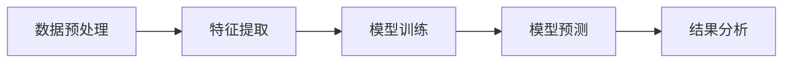
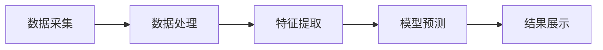

                 


# 智能系统辅助识别隐藏冠军股

## 关键词：隐藏冠军股、智能系统、机器学习、金融数据分析、大数据、股票预测

## 摘要：  
本文通过分析隐藏冠军股的特点和识别难点，结合金融数据分析、机器学习和大数据技术，探讨如何利用智能系统辅助识别隐藏冠军股。文章从背景介绍、核心概念、算法原理、系统架构设计、项目实战等多方面展开，详细讲解了如何通过技术手段提高隐藏冠军股识别的准确性和效率。

---

# 第一部分: 背景介绍与核心概念

## 第1章: 隐藏冠军股的定义与识别意义

### 1.1 什么是隐藏冠军股  
隐藏冠军股是指那些在当前市场中表现不显眼，但具备高成长潜力、低估值、竞争优势明显、行业地位稳固的股票。这类股票通常被市场忽视，但长期来看，其回报率远超市场平均水平。

### 1.2 隐藏冠军股的识别意义  
- **投资机会**：隐藏冠军股往往具有较高的成长潜力，能够在未来市场中脱颖而出。
- **降低风险**：通过技术手段识别隐藏冠军股，可以减少人为情绪化决策的影响，降低投资风险。
- **提高效率**：传统股票筛选方法依赖人工经验，效率低下；智能系统可以快速处理海量数据，提高识别效率。

### 1.3 识别隐藏冠军股的技术挑战  
- **数据复杂性**：股票市场数据涉及海量信息，包括财务数据、市场数据、技术指标等。
- **特征选择**：如何从海量数据中筛选出有效的特征是关键。
- **模型优化**：不同股票具有不同的特征，模型需要不断优化以适应不同场景。

## 第2章: 核心概念与联系

### 2.1 金融数据分析的核心原理  
金融数据分析包括对历史数据的统计分析、趋势预测和模式识别。通过分析股票的历史价格、成交量、财务报表等数据，可以发现潜在的投资机会。

### 2.2 机器学习在股票预测中的应用  
机器学习通过训练模型，从历史数据中提取特征，预测未来股票价格走势。常用算法包括线性回归、支持向量机（SVM）、随机森林、神经网络等。

### 2.3 隐藏冠军股识别的逻辑框架  
- 数据采集：获取股票的历史价格、财务数据、市场数据等。
- 数据清洗：处理缺失值、异常值等。
- 特征提取：从原始数据中提取有用的特征。
- 模型训练：训练分类或回归模型。
- 结果分析：根据模型预测结果，筛选出隐藏冠军股。

---

# 第二部分: 算法原理与实现

## 第3章: 隐藏冠军股识别的算法原理

### 3.1 算法选择与流程  
- **支持向量机（SVM）**：适用于小样本、高维数据的分类问题。
- **随机森林**：适用于特征较多、数据量较大的场景。
- **神经网络**：适用于复杂非线性关系的预测。

### 3.2 算法流程图  


### 3.3 算法实现代码  
```python
import pandas as pd
from sklearn.svm import SVC
from sklearn.model_selection import train_test_split

# 数据加载
data = pd.read_csv('stock_data.csv')

# 特征选择
X = data[['revenue', 'net_profit', 'market_cap', 'pe_ratio']]
y = data['target']  # 目标变量（如是否为隐藏冠军股）

# 数据分割
X_train, X_test, y_train, y_test = train_test_split(X, y, test_size=0.2, random_state=42)

# 模型训练
model = SVC()
model.fit(X_train, y_train)

# 模型预测
y_pred = model.predict(X_test)
```

### 3.4 数学模型与公式  
- 支持向量机的目标函数：
  $$ \min_{\theta, \xi} \frac{1}{2}\|\theta\|^2 + C\sum_{i=1}^n \xi_i $$
  $$ \text{subject to} \quad y_i(\theta^T x_i + \theta_0) \geq 1 - \xi_i $$
  $$ \xi_i \geq 0 $$

---

# 第三部分: 系统分析与架构设计

## 第4章: 系统架构设计

### 4.1 问题场景介绍  
- 数据来源：股票历史数据、财务数据、市场数据。
- 业务目标：通过智能系统筛选出隐藏冠军股。
- 用户需求：投资者需要快速、准确地识别隐藏冠军股。

### 4.2 系统功能设计  
- 数据采集模块：实时获取股票数据。
- 数据处理模块：清洗和转换数据。
- 特征提取模块：提取有用的特征。
- 模型预测模块：训练和预测模型。
- 结果展示模块：可视化预测结果。

### 4.3 系统架构图  


---

# 第四部分: 项目实战

## 第5章: 项目实战与案例分析

### 5.1 环境搭建  
- 安装Python、Pandas、Scikit-learn等库。
- 数据来源：股票数据可以从Yahoo Finance或东方财富网获取。

### 5.2 核心代码实现  
```python
import pandas as pd
from sklearn.ensemble import RandomForestClassifier
from sklearn.metrics import accuracy_score

# 数据加载
data = pd.read_csv('stock_data.csv')

# 特征选择
X = data[['revenue', 'net_profit', 'market_cap', 'pe_ratio']]
y = data['target']

# 数据分割
X_train, X_test, y_train, y_test = train_test_split(X, y, test_size=0.2, random_state=42)

# 模型训练
model = RandomForestClassifier()
model.fit(X_train, y_train)

# 模型预测
y_pred = model.predict(X_test)

# 模型评估
print("Accuracy:", accuracy_score(y_test, y_pred))
```

### 5.3 案例分析  
以某科技公司为例，通过模型预测，识别出其为隐藏冠军股的可能性，并分析其财务数据和技术指标，验证模型的准确性。

---

# 第五部分: 最佳实践与小结

## 第6章: 最佳实践与小结

### 6.1 最佳实践  
- 数据质量是关键：确保数据的完整性和准确性。
- 特征选择要谨慎：避免过多特征导致的维度灾难。
- 模型调优要细致：通过交叉验证优化模型参数。

### 6.2 小结  
本文详细介绍了隐藏冠军股的识别过程，从背景到算法实现，再到系统设计，为投资者提供了一套技术化的解决方案。通过智能系统辅助识别隐藏冠军股，可以提高投资效率，降低投资风险。

### 6.3 注意事项  
- 避免过度依赖模型：模型预测结果仅供参考，需结合市场实际情况进行决策。
- 定期更新模型：市场环境不断变化，需定期更新模型以保持预测准确性。

### 6.4 拓展阅读  
- 《Python机器学习实战》
- 《股票技术分析实战》

---

# 作者：AI天才研究院/AI Genius Institute & 禅与计算机程序设计艺术 /Zen And The Art of Computer Programming

