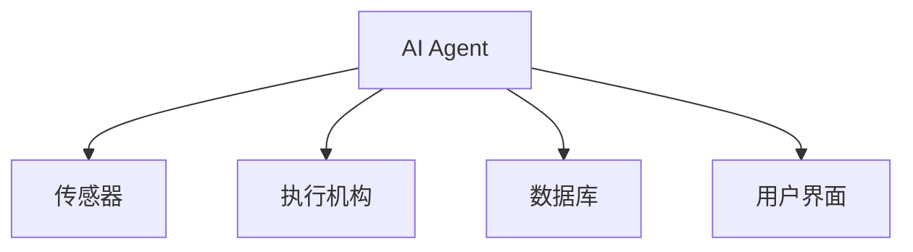
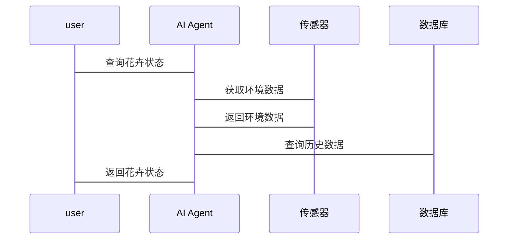

                 


# 智能花瓶：AI Agent的花卉保鲜技巧指导

> 关键词：智能花瓶，AI Agent，花卉保鲜，机器学习，物联网，自动化控制

> 摘要：本文深入探讨了AI Agent在花卉保鲜中的应用，结合背景介绍、核心算法、系统设计、项目实战和案例分析，详细讲解了智能花瓶如何通过AI技术优化花卉保鲜过程。文章从理论到实践，全面分析了AI Agent在花卉保鲜中的潜力与实现方案。

---

# 第1章: 花卉保鲜的智能化需求

## 1.1 花卉保鲜的背景与挑战

### 1.1.1 花卉保鲜的传统方法与局限性

花卉保鲜是一项长期存在的需求，传统的保鲜方法主要包括：

1. **温度控制**：通过调节环境温度，延缓花卉的生长速度。
2. **湿度控制**：保持适当的湿度，防止花朵和茎叶的干枯。
3. **光照调节**：通过控制光照时间，影响花卉的生长周期。
4. **营养供给**：通过水培或添加营养液，提供必要的养分。

然而，传统方法存在以下局限性：
- **人工干预依赖**：需要频繁的人工检查和调整，效率低下。
- **精准度不足**：难以实时监测和精确控制环境参数。
- **数据孤岛**：各个监测点的数据无法有效整合，缺乏整体优化。

### 1.1.2 现代花卉保鲜的需求与趋势

随着科技的发展，花卉保鲜的需求逐渐向智能化和自动化方向转变。现代花卉保鲜的需求主要体现在以下几个方面：
1. **实时监测与反馈**：能够实时监测花卉的生长状态，并根据数据进行反馈调节。
2. **智能化决策**：基于历史数据和实时信息，自动优化保鲜策略。
3. **远程控制**：通过物联网技术，实现远程监控和管理。
4. **节能环保**：采用节能技术，减少资源浪费。

### 1.1.3 AI技术在花卉保鲜中的应用潜力

AI技术的引入为花卉保鲜带来了新的可能性。通过AI Agent（智能代理），可以实现以下功能：
- **环境感知**：通过传感器实时采集环境数据，如温度、湿度、光照等。
- **数据分析**：利用机器学习算法，分析数据，识别花卉的生长状态。
- **智能决策**：根据分析结果，自动调整环境参数，优化保鲜效果。
- **预测与预警**：预测花卉的生长趋势，提前发出预警，避免花卉损坏。

## 1.2 智能花瓶的概念与目标

### 1.2.1 智能花瓶的定义

智能花瓶是一种结合了物联网和人工智能技术的花卉保鲜装置。它通过内置的传感器和AI Agent，实时监测花卉的生长环境，并根据数据自动调整环境参数，以延长花卉的保鲜期。

### 1.2.2 智能花瓶的核心功能与目标

智能花瓶的核心功能包括：
1. **环境监测**：实时监测花卉的生长环境，如温度、湿度、光照等。
2. **数据分析**：利用AI算法分析数据，识别花卉的健康状态。
3. **智能调节**：根据分析结果，自动调整环境参数，如温度、湿度、光照等。
4. **远程控制**：通过手机或其他设备远程监控和管理花瓶。
5. **预警与通知**：当环境参数异常或花卉状态不佳时，及时通知用户。

### 1.2.3 智能花瓶的市场定位与用户需求

智能花瓶的目标市场包括：
- **高端花卉爱好者**：追求高品质花卉体验的用户。
- **礼品市场**：用于高端礼品赠送，提升礼品的附加值。
- **花卉零售商**：用于展示和保鲜花卉，延长销售周期。

用户需求主要集中在：
- **便捷性**：用户希望花瓶能够自动调节环境，无需频繁手动操作。
- **智能化**：用户希望花瓶能够提供智能的保鲜方案，延长花卉寿命。
- **美观性**：花瓶的设计需要美观，适合家庭或办公室摆放。

## 1.3 AI Agent在花卉保鲜中的角色

### 1.3.1 AI Agent的基本概念

AI Agent（智能代理）是一种能够感知环境、自主决策并执行任务的智能系统。它通过传感器获取环境信息，利用算法进行分析和决策，并通过执行机构完成任务。

### 1.3.2 AI Agent在花卉保鲜中的应用场景

在智能花瓶中，AI Agent主要应用于以下场景：
1. **环境监测**：实时监测花卉的生长环境，如温度、湿度、光照等。
2. **状态识别**：通过分析环境数据，识别花卉的健康状态。
3. **决策与控制**：根据花卉的状态，自动调整环境参数，优化保鲜效果。
4. **用户交互**：通过语音或手机APP与用户交互，提供保鲜建议和通知。

### 1.3.3 AI Agent的优势与局限性

**优势：**
- **高效性**：AI Agent能够快速分析数据，做出决策，提高保鲜效率。
- **精准性**：通过机器学习算法，能够精准识别花卉状态，优化保鲜策略。
- **便捷性**：用户可以通过远程控制，随时随地管理花瓶。

**局限性：**
- **技术复杂性**：AI Agent的开发和部署需要较高的技术门槛。
- **成本问题**：智能花瓶的成本较高，可能限制其普及。

---

# 第2章: AI Agent的核心原理

## 2.1 AI Agent的基本构成

### 2.1.1 感知层：环境数据的采集与处理

感知层主要通过传感器采集环境数据，如温度、湿度、光照等。这些数据需要经过预处理，去除噪声，提取有用的信息。

### 2.1.2 决策层：花卉保鲜策略的制定

决策层通过分析感知层提供的数据，利用机器学习算法，制定最优的保鲜策略。例如，当温度过高时，决策层会触发降温机制。

### 2.1.3 执行层：智能调节与反馈

执行层根据决策层的指令，调整环境参数，如打开风扇降温，或者关闭灯光调节光照强度。同时，执行层会将反馈信息传递给感知层，形成闭环控制系统。

## 2.2 AI Agent的工作流程

### 2.2.1 数据采集与分析

AI Agent通过传感器采集环境数据，如温度、湿度、光照等，并将这些数据传输到决策层。

### 2.2.2 状态识别与判断

决策层利用机器学习算法，分析环境数据，识别花卉的健康状态。例如，通过分析光照强度，判断花卉是否需要调整光照。

### 2.2.3 决策生成与执行

根据花卉的状态，决策层制定相应的保鲜策略，并通过执行层调整环境参数，如降低温度或增加湿度。

## 2.3 AI Agent的关键技术

### 2.3.1 机器学习在花卉保鲜中的应用

机器学习在花卉保鲜中的应用主要体现在以下几个方面：
1. **分类**：通过机器学习算法，对花卉的状态进行分类，如健康、异常等。
2. **回归**：预测花卉的生长趋势，如开花时间。
3. **聚类**：将花卉的环境数据进行聚类分析，发现潜在的规律。

### 2.3.2 自然语言处理在用户交互中的应用

自然语言处理（NLP）技术主要用于AI Agent与用户的交互。例如，用户可以通过语音指令控制花瓶，AI Agent通过NLP技术理解用户的意图，并执行相应的操作。

### 2.3.3 大数据分析在花卉保鲜优化中的应用

大数据分析技术可以用于优化AI Agent的决策算法。通过分析大量的历史数据，可以发现花卉保鲜的最优策略，并不断优化算法模型。

---

# 第3章: AI Agent的核心算法

## 3.1 机器学习算法在花卉保鲜中的应用

### 3.1.1 监督学习：基于历史数据的保鲜策略预测

监督学习是一种常用的机器学习算法，可以通过历史数据训练模型，预测未来的保鲜策略。例如，通过训练模型，AI Agent可以预测在不同温度下，花卉的最佳保鲜策略。

### 3.1.2 无监督学习：花卉状态的异常检测

无监督学习可以用于异常检测。通过分析环境数据，识别异常情况，如温度突然升高，可能预示着花卉的状态即将恶化。

### 3.1.3 强化学习：动态环境下的保鲜策略优化

强化学习是一种通过试错机制优化决策的算法。AI Agent可以在动态环境中，通过不断尝试不同的保鲜策略，找到最优的解决方案。

## 3.2 算法原理的数学模型

### 3.2.1 监督学习的数学模型

监督学习的数学模型通常包括输入特征和输出标签。例如，花卉的温度、湿度、光照强度等特征，以及对应的保鲜策略标签。

$$ y = f(x) $$

其中，$x$ 表示输入特征，$y$ 表示输出标签，$f$ 是模型的函数。

### 3.2.2 强化学习的数学模型

强化学习的数学模型通常包括状态、动作和奖励。例如，AI Agent的状态是当前的环境参数，动作是调整温度或湿度，奖励是花卉的健康评分。

$$ R = r(s, a) $$

其中，$R$ 表示奖励，$s$ 表示状态，$a$ 表示动作。

---

# 第4章: 系统设计与实现

## 4.1 系统架构设计

### 4.1.1 系统架构图



### 4.1.2 系统功能模块

1. **传感器模块**：负责采集环境数据，如温度、湿度、光照等。
2. **AI Agent模块**：负责分析数据，制定决策。
3. **执行机构模块**：负责调整环境参数，如温度、湿度、光照等。
4. **数据库模块**：负责存储历史数据和保鲜策略。
5. **用户界面模块**：负责与用户交互，展示数据和操作界面。

## 4.2 系统交互设计

### 4.2.1 用户与AI Agent的交互流程



### 4.2.2 系统反馈机制

AI Agent通过传感器获取环境数据，分析后反馈给用户，如“花卉当前状态正常”或“需要调整温度”。

---

# 第5章: 项目实战与案例分析

## 5.1 项目实战

### 5.1.1 环境安装

需要安装以下环境和工具：
- **Python**：编程语言
- **TensorFlow**：机器学习框架
- **IoT传感器**：如温度传感器、湿度传感器
- **Raspberry Pi**：控制硬件

### 5.1.2 核心代码实现

以下是AI Agent的核心代码示例：

```python
import numpy as np
from sklearn.linear_model import LinearRegression

# 数据预处理
X = np.array([[20, 50], [22, 48], [18, 60]])  # 温度，湿度
y = np.array([70, 65, 80])  # 保鲜评分

# 训练模型
model = LinearRegression()
model.fit(X, y)

# 预测新的环境参数
new_temp = 21
new_humidity = 55
predicted_score = model.predict([[new_temp, new_humidity]])

print(f"预测的保鲜评分为：{predicted_score}")
```

### 5.1.3 代码解读与分析

上述代码通过线性回归模型，训练了一个基于温度和湿度的保鲜评分预测模型。AI Agent可以根据当前的环境参数，预测花卉的保鲜评分，并根据评分调整环境参数。

## 5.2 案例分析

### 5.2.1 案例一：玫瑰花的保鲜

假设我们有一个玫瑰花的花瓶，AI Agent通过传感器监测到温度为25℃，湿度为60%，光照强度为100lux。通过分析历史数据，AI Agent发现当温度超过24℃时，玫瑰花的保鲜评分会下降。因此，AI Agent会自动调整温度至23℃，并降低光照强度至80lux，以延长玫瑰花的保鲜期。

### 5.2.2 案例二：多肉植物的保鲜

对于多肉植物，AI Agent通过分析环境数据，发现湿度较高时容易导致根部腐烂。因此，AI Agent会自动开启除湿功能，降低湿度至40%，并关闭灯光，减少光照强度，以防止多肉植物过度生长。

---

# 第6章: 未来展望与最佳实践

## 6.1 未来发展趋势

### 6.1.1 技术进步

随着AI和物联网技术的不断发展，智能花瓶的功能将更加智能化和自动化。例如，未来的AI Agent可能会具备自我学习和自我优化的能力，能够根据花卉的种类和生长阶段，动态调整保鲜策略。

### 6.1.2 应用扩展

除了个人用户，智能花瓶可能会应用于商业领域，如花卉零售商和酒店。通过智能花瓶，商家可以延长花卉的保鲜期，降低损耗，提高利润。

### 6.1.3 伦理与安全

随着智能花瓶的普及，数据安全和隐私保护问题也需要引起重视。AI Agent需要确保用户数据的安全，防止被恶意攻击和窃取。

## 6.2 最佳实践

### 6.2.1 注意事项

1. **数据安全**：确保用户的环境数据不会被泄露或滥用。
2. **设备维护**：定期检查传感器和执行机构，确保其正常运行。
3. **用户教育**：提供详细的使用说明和培训，帮助用户更好地使用智能花瓶。

### 6.2.2 拓展阅读

建议读者进一步阅读以下书籍和文章，深入了解AI在农业和园艺中的应用：
1. 《机器学习实战》
2. 《物联网技术与应用》
3. 《智能系统设计与实现》

---

# 作者：AI天才研究院/AI Genius Institute & 禅与计算机程序设计艺术 /Zen And The Art of Computer Programming

---

**感谢您的阅读！**

