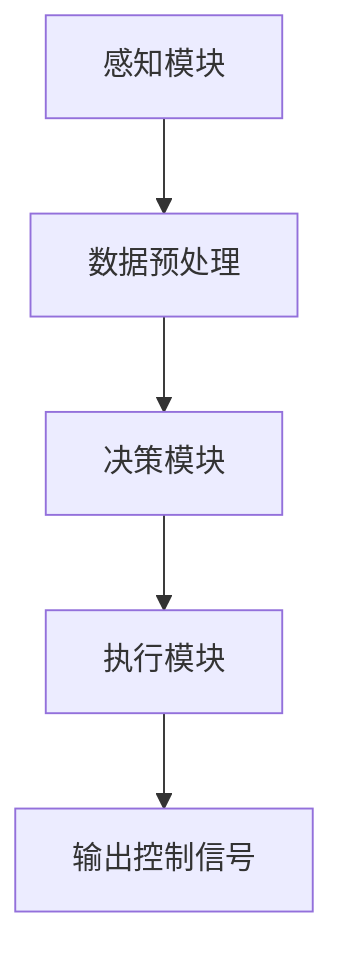
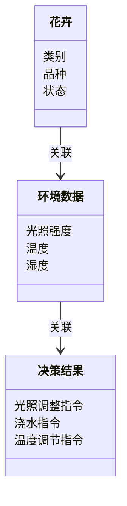
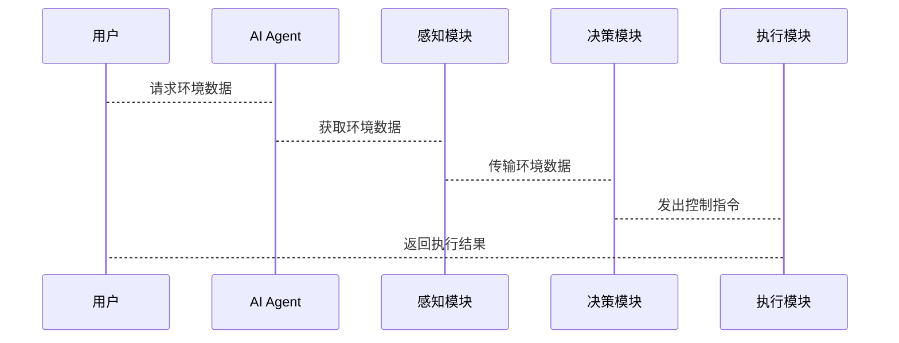

                 


# 智能花瓶：AI Agent的花卉养护专家

> 关键词：AI Agent，花卉养护，智能花瓶，算法原理，系统架构

> 摘要：本文探讨了AI Agent在花卉养护中的应用，详细分析了AI Agent的核心概念、算法原理、系统架构设计，以及在实际项目中的应用。通过结合花卉养护的实际需求，本文提出了一个基于AI Agent的智能花瓶解决方案，展示了AI技术在园艺领域的创新应用和未来发展潜力。

---

# 第1章: AI Agent与花卉养护的背景介绍

## 1.1 AI Agent的核心概念

### 1.1.1 AI Agent的定义与特点
AI Agent（人工智能代理）是指能够感知环境、自主决策并执行任务的智能实体。AI Agent的核心特点包括自主性、反应性、目标导向和学习能力。在花卉养护中，AI Agent能够通过传感器感知环境数据，根据数据做出决策，并通过执行机构实现养护任务。

### 1.1.2 花卉养护的需求与挑战
花卉养护涉及光照、温度、湿度、土壤条件等多种环境因素。传统养护方式依赖人工经验，存在效率低、误差大、难以大规模应用的问题。AI Agent可以通过自动化感知和决策，显著提高养护效率和精准度。

### 1.1.3 AI Agent在花卉养护中的问题解决
AI Agent能够实时监测花卉的生长状态，分析环境数据，预测潜在问题，并采取相应的措施，例如自动调整光照强度、控制浇水量等。这种智能化的解决方案能够实现花卉的精准养护，减少资源浪费，提高养护效率。

## 1.2 花卉养护的核心要素

### 1.2.1 花卉生长的环境因素
花卉的生长受光照、温度、湿度、土壤酸碱度等多种环境因素的影响。AI Agent需要感知并分析这些因素，以确保花卉的健康生长。

### 1.2.2 花卉养护的关键问题
花卉养护的关键问题包括光照管理、水分管理、温度控制、病虫害预防等。这些问题需要通过多传感器数据融合和智能决策算法来解决。

### 1.2.3 AI Agent在花卉养护中的边界与外延
AI Agent在花卉养护中的应用边界包括传感器数据的采集范围、决策模型的适用范围以及执行机构的控制能力。外延则涉及与其他智能家居设备的联动、数据的远程监控等。

## 1.3 AI Agent与花卉养护的结合

### 1.3.1 AI Agent在花卉养护中的应用场景
AI Agent可以应用于家庭花卉养护、温室花卉种植、花卉展销等多种场景，为用户提供智能化的养护解决方案。

### 1.3.2 花卉养护中的AI Agent功能模块
AI Agent的功能模块包括感知模块（环境数据采集）、决策模块（智能分析与决策）、执行模块（自动控制设备）。

### 1.3.3 AI Agent与花卉养护的系统结构
AI Agent与花卉养护的系统结构包括传感器网络、数据处理单元、决策算法模块、执行机构和用户交互界面。

## 1.4 本章小结
本章介绍了AI Agent的核心概念、花卉养护的需求与挑战，以及AI Agent在花卉养护中的应用。通过分析AI Agent的功能模块和系统结构，为后续章节的深入探讨奠定了基础。

---

# 第2章: AI Agent的核心概念与联系

## 2.1 AI Agent的核心原理

### 2.1.1 AI Agent的感知模块
感知模块通过多种传感器（如光照传感器、温度传感器、湿度传感器）采集环境数据，并将数据传输到决策模块。

### 2.1.2 AI Agent的决策模块
决策模块基于感知数据和历史数据，结合机器学习算法，生成养护决策。例如，通过训练好的神经网络模型预测花卉的最佳光照时间和浇水频率。

### 2.1.3 AI Agent的执行模块
执行模块根据决策模块的指令，通过执行机构（如智能灯泡、自动喷水装置）实现具体的养护操作。

## 2.2 AI Agent与花卉养护的核心要素对比

### 2.2.1 感知模块的特征
感知模块的特征包括实时性、准确性、多样性。例如，光照传感器需要实时采集光照强度数据，温度传感器需要高精度的温度测量。

### 2.2.2 决策模块的特征
决策模块的特征包括智能化、适应性、可解释性。例如，决策算法需要能够根据不同的花卉种类调整养护策略。

### 2.2.3 执行模块的特征
执行模块的特征包括可靠性、可扩展性、可编程性。例如，自动喷水装置需要能够根据决策模块的指令精准控制浇水量。

## 2.3 AI Agent与花卉养护的ER实体关系图

```mermaid
erDiagram
    class 花卉 {
        类别
        品种
        状态
    }
    class 环境数据 {
        光照强度
        温度
        湿度
    }
    class 决策结果 {
        光照调整指令
        浇水指令
        温度调节指令
    }
    花卉 --> 环境数据 : 关联
    环境数据 --> 决策结果 : 关联
```

## 2.4 本章小结
本章详细介绍了AI Agent的核心原理和与花卉养护的核心要素的联系，通过ER实体关系图展示了AI Agent与花卉养护系统之间的数据关联关系。

---

# 第3章: AI Agent的算法原理与数学模型

## 3.1 AI Agent的核心算法

### 3.1.1 感知算法
感知算法包括数据采集和数据预处理。例如，使用光照传感器采集光照强度数据，并通过滑动平均法去除噪声。

### 3.1.2 决策算法
决策算法基于感知数据和历史数据，结合机器学习模型生成决策。例如，使用随机森林算法预测花卉的最佳浇水时间。

### 3.1.3 执行算法
执行算法将决策指令转化为具体的执行动作。例如，通过PWM信号控制LED灯的亮度。

## 3.2 算法原理的数学模型

### 3.2.1 感知模块的数学模型
感知模块的数学模型可以表示为：
$$
y = f(x) + \epsilon
$$
其中，$x$ 是输入数据，$y$ 是输出数据，$\epsilon$ 是噪声。

### 3.2.2 决策模块的数学模型
决策模块的数学模型可以表示为：
$$
D(x) = \argmax_{c} P(c|x)
$$
其中，$D(x)$ 是决策函数，$P(c|x)$ 是条件概率。

### 3.2.3 执行模块的数学模型
执行模块的数学模型可以表示为：
$$
u = g(x)
$$
其中，$u$ 是控制信号，$x$ 是输入信号。

## 3.3 算法流程图



## 3.4 本章小结
本章详细介绍了AI Agent的核心算法及其数学模型，并通过流程图展示了算法的执行流程。

---

# 第4章: 系统分析与架构设计方案

## 4.1 问题场景介绍

### 4.1.1 花卉养护的场景分析
以家庭花卉养护为例，用户希望通过智能花瓶实现花卉的自动浇水、光照调节和温度控制。

### 4.1.2 AI Agent在花卉养护中的应用
AI Agent通过传感器采集环境数据，分析数据并生成决策，通过执行机构实现自动控制。

### 4.1.3 系统需求分析
系统需要实现的功能包括环境数据采集、智能决策、自动控制、用户交互等。

## 4.2 系统功能设计

### 4.2.1 领域模型


### 4.2.2 系统架构设计


### 4.2.3 系统交互设计


## 4.3 本章小结
本章通过系统分析与架构设计方案，详细描述了AI Agent在花卉养护中的系统设计，包括领域模型、系统架构和系统交互设计。

---

# 第5章: 项目实战

## 5.1 环境安装

### 5.1.1 硬件设备安装
安装光照传感器、温度传感器、湿度传感器、LED灯和自动喷水装置。

### 5.1.2 软件环境配置
安装Python、TensorFlow、OpenCV等开发工具和库。

## 5.2 系统核心实现

### 5.2.1 感知模块实现
```python
import numpy as np
from sklearn.ensemble import RandomForestClassifier

# 数据预处理
def preprocess_data(data):
    return (data - np.mean(data)) / np.std(data)

# 感知模块
class PerceptionModule:
    def __init__(self):
        self.model = RandomForestClassifier()

    def train(self, X, y):
        X_processed = preprocess_data(X)
        self.model.fit(X_processed, y)

    def predict(self, X):
        X_processed = preprocess_data(X)
        return self.model.predict(X_processed)
```

### 5.2.2 决策模块实现
```python
# 决策模块
class DecisionModule:
    def __init__(self):
        self.models = {}

    def add_model(self, name, model):
        self.models[name] = model

    def decide(self, data):
        decisions = {}
        for name, model in self.models.items():
            decisions[name] = model.predict(data)
        return decisions
```

### 5.2.3 执行模块实现
```python
# 执行模块
class ExecutionModule:
    def __init__(self):
        self.controllers = {}

    def add_controller(self, name, controller):
        self.controllers[name] = controller

    def execute(self, decisions):
        for name, decision in decisions.items():
            if name in self.controllers:
                self.controllers[name].control(decision)
```

## 5.3 代码应用解读与分析

### 5.3.1 感知模块解读
感知模块通过数据预处理和机器学习模型实现环境数据的分类和预测。

### 5.3.2 决策模块解读
决策模块通过集成学习算法生成多个决策结果，并根据具体需求选择最优决策。

### 5.3.3 执行模块解读
执行模块通过控制器实现具体的执行动作，例如调节光照强度或控制喷水装置。

## 5.4 实际案例分析

### 5.4.1 案例背景
以玫瑰花为例，分析AI Agent在实际养护中的应用。

### 5.4.2 数据采集与分析
通过传感器采集光照、温度、湿度等数据，分析玫瑰花的生长状态。

### 5.4.3 决策与执行
AI Agent根据分析结果生成决策，例如在光照不足时自动开启LED灯。

## 5.5 本章小结
本章通过项目实战，详细展示了AI Agent在花卉养护中的具体实现，包括环境安装、系统核心实现和实际案例分析。

---

# 第6章: 最佳实践与小结

## 6.1 最佳实践

### 6.1.1 小结
AI Agent在花卉养护中的应用显著提高了养护效率和精准度，为未来的智能化园艺管理提供了新的思路。

### 6.1.2 注意事项
在实际应用中，需要注意传感器的精度、算法的可解释性和系统的可扩展性。

### 6.1.3 拓展阅读
推荐阅读相关领域的最新研究成果，例如基于深度学习的花卉病虫害检测和智能温室控制系统。

## 6.2 本章小结
本章总结了AI Agent在花卉养护中的应用，并提出了未来的研究方向和注意事项。

---

# 作者：AI天才研究院/AI Genius Institute & 禅与计算机程序设计艺术 /Zen And The Art of Computer Programming

