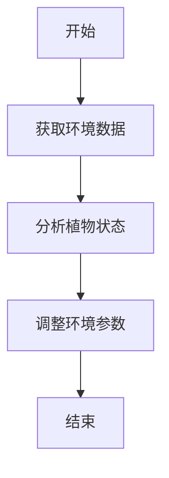
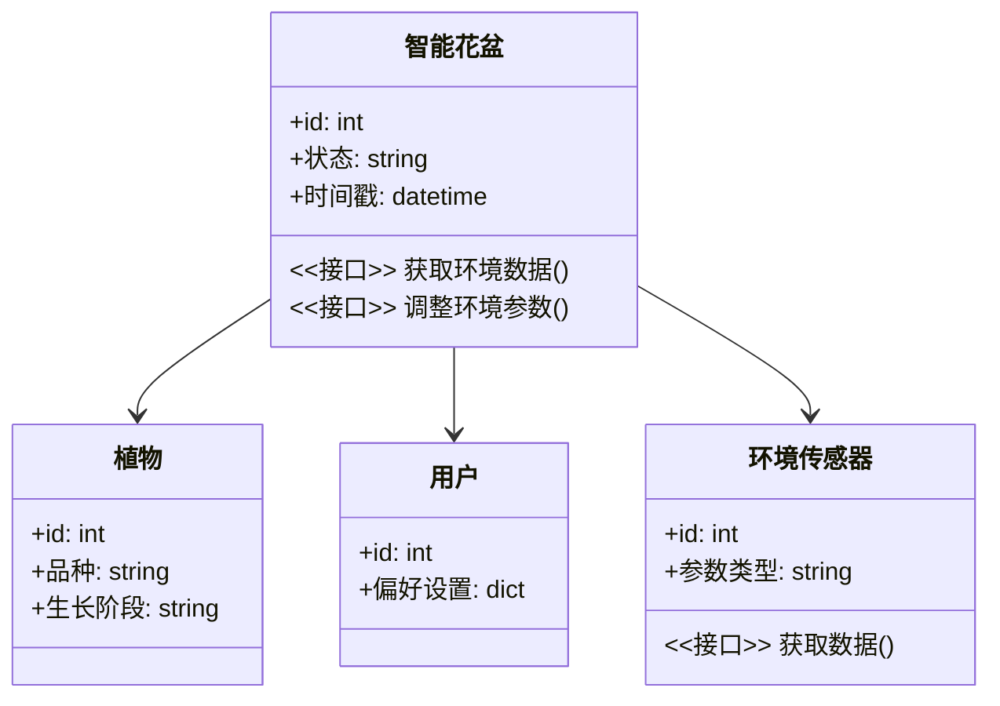
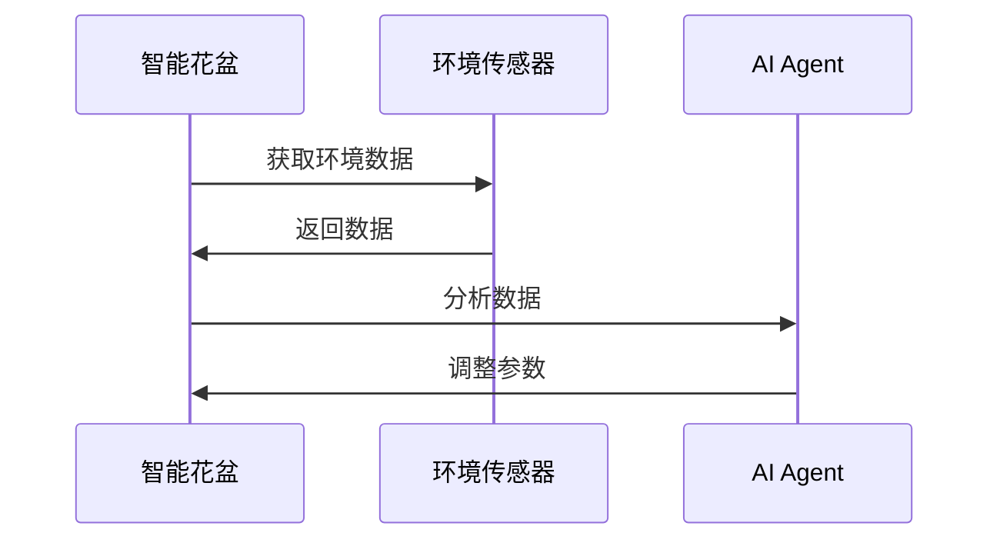

                 


```markdown
# 智能花盆：AI Agent的植物生长优化管理器

> 关键词：AI Agent，智能花盆，物联网，植物生长优化，环境传感器，模糊逻辑算法，机器学习

> 摘要：本文探讨了AI Agent在智能花盆中的应用，通过物联网技术优化植物生长环境。文章从背景、概念、算法、系统架构到项目实战，详细讲解了智能花盆的设计与实现。

---

## 第一部分：背景与问题背景

### 第1章：智能花盆的概念与问题背景

#### 1.1 传统园艺的局限性
- **挑战**：传统园艺依赖人工经验，难以精确控制环境因素，导致生长不稳定。
- **关键因素**：光照、温度、湿度、土壤pH值和养分水平。
- **不足**：人工管理耗时，难以大规模应用，缺乏智能化。

#### 1.2 智能花盆的定义与目标
- **定义**：结合AI和物联网技术的智能设备，实时监测并优化植物生长环境。
- **目标**：通过AI算法自动调整环境参数，促进植物高效生长。
- **边界与外延**：仅关注环境因素，不涉及植物病虫害。

#### 1.3 核心要素
- **硬件**：传感器、执行器、通信模块。
- **软件**：AI算法、数据处理、用户界面。
- **交互**：用户设置偏好，系统反馈环境数据。

### 第2章：AI Agent与物联网技术的核心概念

#### 2.1 AI Agent的基本原理
- **定义**：智能体，感知环境并采取行动。
- **核心属性**：反应式、目标导向、学习能力。
- **对比**：传统算法依赖固定规则，AI Agent具备自适应能力。

#### 2.2 物联网技术的应用
- **基本概念**：通过传感器和网络连接设备，实现数据采集与传输。
- **核心组件**：传感器节点、通信网络、数据处理中心。
- **结合**：AI Agent处理物联网数据，优化环境参数。

#### 2.3 实体关系图
```mermaid
er
    entity 智能花盆 {
        id
        状态
        时间戳
    }
    entity 植物 {
        id
        品种
        生长阶段
    }
    entity 用户 {
        id
        偏好设置
    }
    entity 环境传感器 {
        id
        参数类型
    }
    智能花盆 -[1]-> 植物
    智能花盆 -[1]-> 用户
    智能花盆 -[1]-> 环境传感器
```

---

## 第二部分：算法原理与数学模型

### 第3章：AI Agent的算法原理

#### 3.1 核心算法
- **模糊逻辑算法**：处理不确定性，例如模糊控制温度。
- **机器学习算法**：训练模型预测最佳环境参数。
- **基于规则的算法**：简单规则，如光照不足时增加光照。

#### 3.2 算法流程图


#### 3.3 代码实现
```python
import numpy as np

def adjust_light intensity(current_light, target_light):
    # 模糊逻辑算法
    if current_light < target_light:
        return target_light + 0.1
    else:
        return target_light - 0.1

# 机器学习模型训练示例
class PlantOptimizer:
    def __init__(self):
        self.model = self.build_model()

    def build_model(self):
        # 简单线性回归模型
        return lambda x: x * 0.8 + 0.2

    def predict(self, input_data):
        return self.model(input_data)

# 示例应用
optimizer = PlantOptimizer()
current_light = 500
target_light = 600
adjusted_light = adjust_light intensity(current_light, target_light)
predicted_light = optimizer.predict(current_light)
print(f"Adjusted Light: {adjusted_light}, Predicted Light: {predicted_light}")
```

#### 3.4 数学模型
- **模糊逻辑**：
  $$ \text{adjusted\_light} = \text{fuzzy\_adjust}(\text{current\_light}, \text{target\_light}) $$
- **机器学习模型**：
  $$ \text{predicted\_parameter} = w \times \text{input} + b $$

---

## 第三部分：系统架构设计

### 第4章：系统分析与架构设计

#### 4.1 问题场景
- **目标**：实时监测并优化植物生长环境。
- **输入**：环境传感器数据、用户偏好。
- **输出**：环境调整指令。

#### 4.2 系统架构


#### 4.3 接口设计
- **传感器接口**：获取数据。
- **用户接口**：设置偏好，显示状态。
- **AI Agent接口**：接收数据，输出调整指令。

#### 4.4 交互流程


---

## 第四部分：项目实战

### 第5章：智能花盆的实现

#### 5.1 环境安装
- **硬件**：Raspberry Pi、传感器套件。
- **软件**：Python、机器学习库（如scikit-learn）。

#### 5.2 核心代码实现
```python
import time
from gpiozero import LED, MoistureSensor

# 初始化硬件
led = LED(17)
sensor = MoistureSensor(4)

def monitor_moisture():
    while True:
        moisture = sensor.value
        print(f"Moisture: {moisture}")
        time.sleep(60)

def control_light(moisture, target):
    if moisture < target:
        led.on()
    else:
        led.off()

# 示例应用
target_moisture = 0.6
monitor_moisture()
control_light(moisture, target_moisture)
```

#### 5.3 代码解读
- **monitor_moisture**：持续监测土壤湿度。
- **control_light**：根据湿度控制LED灯。

#### 5.4 实际案例分析
- **案例1**：湿度低于目标，开启LED灯。
- **案例2**：湿度达标，关闭LED灯。

#### 5.5 项目小结
- **实现步骤**：安装硬件，编写代码，测试功能。
- **注意事项**：传感器校准，系统稳定性测试。

---

## 第五部分：总结与展望

### 第6章：总结与展望

#### 6.1 最佳实践
- **传感器校准**：确保准确性。
- **模型优化**：定期更新AI模型。

#### 6.2 小结
- **核心知识点**：AI Agent、物联网、算法原理。
- **应用价值**：提升植物生长效率，降低管理成本。

#### 6.3 注意事项
- **传感器精度**：影响系统准确性。
- **系统维护**：定期检查硬件和软件。

#### 6.4 拓展阅读
- 推荐书籍：《机器学习实战》、《物联网开发入门》。

---

## 作者

作者：AI天才研究院/AI Genius Institute & 禅与计算机程序设计艺术 /Zen And The Art of Computer Programming
```

