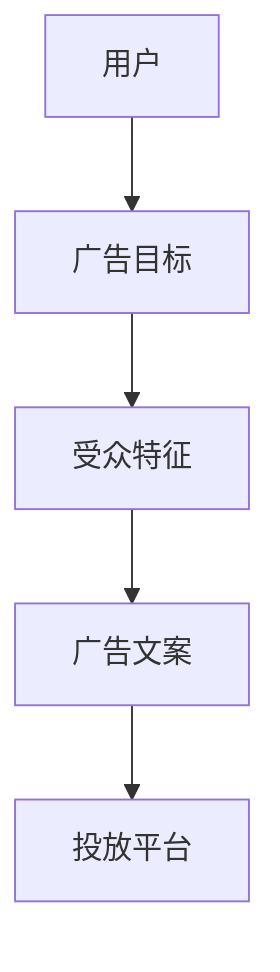
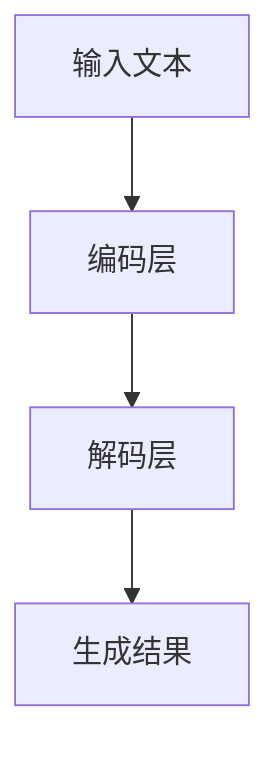
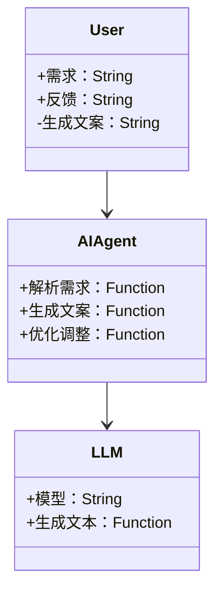
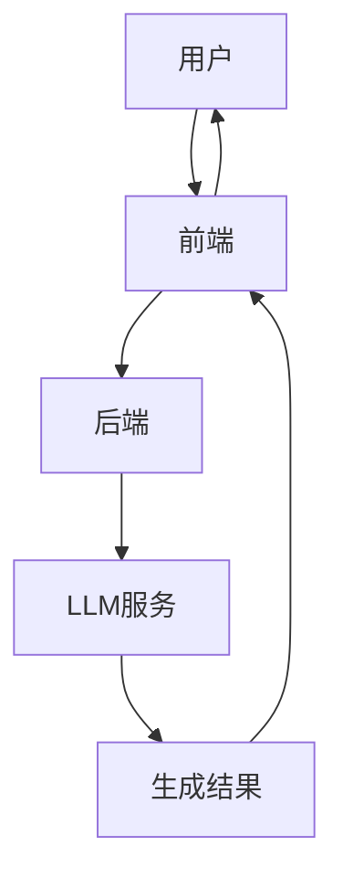

                 


# 智能营销文案AI Agent：LLM辅助的广告创意生成

> 关键词：智能营销，AI Agent，大语言模型（LLM），广告创意，文案生成

> 摘要：本文将探讨如何利用大语言模型（LLM）构建智能营销文案AI Agent，通过分析其背景、原理、系统架构及项目实战，揭示LLM在广告创意生成中的潜力与应用。

---

## 第一章：智能营销文案的现状与挑战

### 1.1 营销行业的发展现状

#### 1.1.1 传统营销文案创作的痛点
传统营销文案创作依赖人工经验，存在以下痛点：
- **效率低**：文案创作周期长，尤其在应对大量广告需求时，效率难以提升。
- **创意受限**：创意依赖个人经验，难以覆盖多样化的需求。
- **精准度不足**：缺乏数据支持，难以精准匹配目标受众。

#### 1.1.2 数字营销时代的机遇与挑战
数字营销时代带来了数据和技术的双重机遇：
- **数据驱动**：通过数据分析，可以精准定位目标受众，生成个性化文案。
- **技术驱动**：AI技术，尤其是大语言模型（LLM），为文案生成提供了新可能。

#### 1.1.3 用户需求的多样化与个性化
现代用户需求呈现多样化与个性化趋势：
- 用户期望获得个性化、精准的营销信息。
- 不同场景下，文案需求差异显著。

### 1.2 AI技术在营销领域的应用趋势

#### 1.2.1 AI技术在广告创意中的潜力
AI技术能够显著提升广告创意的效率和质量：
- **快速生成**：AI可以在短时间内生成大量文案，供营销人员选择。
- **多样性**：通过参数调整，AI可以生成不同风格的文案，满足多样化需求。

#### 1.2.2 大语言模型（LLM）的核心优势
大语言模型在文案生成中的独特优势：
- **强大的语言理解能力**：LLM能够理解上下文，生成连贯的文案。
- **多任务处理**：LLM可以同时处理多种任务，如文案生成、数据分析等。

#### 1.2.3 智能营销文案生成的必要性
随着市场竞争加剧，精准营销成为制胜关键：
- 智能营销文案生成能够提高效率，降低成本。
- 通过AI辅助，营销团队可以更专注于策略制定和创意优化。

---

## 第二章：智能营销文案AI Agent的核心概念与技术原理

### 2.1 智能营销文案AI Agent的定义

#### 2.1.1 核心概念的界定
智能营销文案AI Agent定义：
- **AI Agent**：一种基于AI的智能体，能够根据输入需求生成广告文案。
- **LLM**：大语言模型，用于文案生成的核心技术。

#### 2.1.2 AI Agent的基本特征
AI Agent的特征包括：
- **智能性**：能够理解和生成自然语言。
- **自适应性**：能够根据反馈优化生成结果。
- **实时性**：能够快速响应需求，生成文案。

#### 2.1.3 LLM在其中的作用
LLM在AI Agent中的作用：
- **生成文案**：通过LLM生成多样化、高质量的广告文案。
- **理解上下文**：LLM能够理解用户需求和场景，生成更精准的文案。

### 2.2 智能营销文案AI Agent的工作原理

#### 2.2.1 从输入到输出的完整流程
文案生成的完整流程：
1. **输入需求**：用户输入广告目标、受众特征等信息。
2. **需求解析**：AI Agent解析需求，提取关键信息。
3. **生成文案**：LLM基于需求生成多个文案选项。
4. **优化调整**：根据反馈优化文案，输出最终结果。

#### 2.2.2 基于LLM的生成机制
LLM的生成机制：
- **解码过程**：模型通过解码生成文本。
- **概率分布**：模型根据概率分布选择最优词。

#### 2.2.3 多轮对话与上下文理解
AI Agent支持多轮对话：
- **上下文记忆**：模型能够记忆上下文，保持对话连贯。
- **动态调整**：根据对话进展，动态调整生成策略。

### 2.3 核心概念对比与关系

#### 2.3.1 核心概念属性特征对比表

| 概念       | 输入需求 | 输出结果 | 是否支持多轮对话 | 自适应能力 |
|------------|----------|----------|------------------|------------|
| AI Agent   | 是       | 是       | 是               | 强          |
| LLM        | 是       | 是       | 否               | 弱          |

#### 2.3.2 ER实体关系图


---

## 第三章：基于LLM的智能营销文案生成算法原理

### 3.1 LLM的基本原理

#### 3.1.1 模型结构与训练方法
LLM的模型结构：
- **编码层**：将输入文本编码为向量。
- **解码层**：将向量解码为输出文本。

#### 3.1.2 概率分布与损失函数
- **概率分布**：模型预测下一个词的概率分布。
- **损失函数**：交叉熵损失函数，用于衡量预测与真实分布的差距。
$$ \text{损失函数} = -\sum_{i=1}^{n} \log P(y_i) $$

#### 3.1.3 文本生成的数学模型
- **生成过程**：基于概率分布，生成序列。
- **解码策略**：贪心解码或随机采样。

### 3.2 智能营销文案生成的算法实现

#### 3.2.1 算法流程图


#### 3.2.2 核心代码实现
```python
import torch
import torch.nn as nn

class LLM(nn.Module):
    def __init__(self, vocab_size, embedding_dim, hidden_dim):
        super().__init__()
        self.embedding = nn.Embedding(vocab_size, embedding_dim)
        self.lstm = nn.LSTM(embedding_dim, hidden_dim)
        self.fc = nn.Linear(hidden_dim, vocab_size)

    def forward(self, input_ids):
        embed = self.embedding(input_ids)
        output, (h, c) = self.lstm(embed)
        output = self.fc(output)
        return output

# 示例生成过程
model = LLM(vocab_size=10000, embedding_dim=512, hidden_dim=512)
input_ids = torch.randint(0, 10000, (1, 5))
output = model(input_ids)
print(output)
```

---

## 第四章：系统分析与架构设计方案

### 4.1 项目背景与需求分析

#### 4.1.1 项目背景
- **目标**：构建一个智能营销文案生成系统。
- **用户需求**：快速生成高质量广告文案。

#### 4.1.2 功能需求
- **输入处理**：接收广告目标和受众特征。
- **文案生成**：生成多个文案选项。
- **优化调整**：根据反馈优化文案。

### 4.2 系统功能设计

#### 4.2.1 领域模型（类图）


#### 4.2.2 系统架构设计


#### 4.2.3 接口设计与交互流程
```mermaid
sequenceDiagram
    User ->+> AI Agent: 提交需求
    AI Agent ->+> LLM: 生成文案
    LLM ->+> AI Agent: 返回文案
    AI Agent ->+> User: 展示结果
    User ->+> AI Agent: 提供反馈
    AI Agent ->+> LLM: 优化调整
```

---

## 第五章：项目实战与应用

### 5.1 项目环境安装

#### 5.1.1 安装依赖
```bash
pip install torch transformers
```

### 5.2 核心代码实现

#### 5.2.1 文案生成器
```python
from transformers import GPT2LMHeadModel, GPT2Tokenizer

tokenizer = GPT2Tokenizer.from_pretrained('gpt2')
model = GPT2LMHeadModel.from_pretrained('gpt2')

def generate_creative_text(prompt, max_length=50):
    inputs = tokenizer.encode(prompt, return_tensors='pt')
    outputs = model.generate(inputs, max_length=max_length)
    return tokenizer.decode(outputs[0], skip_special_tokens=True)
```

#### 5.2.2 应用案例分析
- **案例1**：汽车广告文案生成。
  - **输入**：目标受众为30岁以下年轻人，强调车辆的性能和设计。
  - **输出**：生成多个文案选项，供选择。

### 5.3 项目总结与经验分享

#### 5.3.1 项目小结
- 项目成功实现了智能营销文案生成系统。
- 系统具有高效性、多样性和可扩展性。

#### 5.3.2 经验分享
- **数据质量**：高质量的数据是生成优质文案的关键。
- **模型调优**：根据实际需求，调整模型参数，优化生成效果。

---

## 第六章：最佳实践与未来展望

### 6.1 最佳实践

#### 6.1.1 数据处理
- 数据清洗：去除无效数据，确保数据质量。
- 数据增强：通过数据增强技术，扩大数据集。

#### 6.1.2 模型优化
- 参数微调：根据具体任务，微调模型参数。
- 多模态模型：结合视觉、听觉等多模态信息，提升生成效果。

### 6.2 未来展望

#### 6.2.1 多模态模型的应用
- 结合视觉、听觉等多模态信息，生成更丰富的广告内容。

#### 6.2.2 智能创意优化
- 引入强化学习，优化广告文案的创意和效果。

#### 6.2.3 行业应用拓展
- 将智能营销文案生成技术应用于更多行业，如教育、医疗等。

---

## 作者简介

作者：AI天才研究院/AI Genius Institute & 禅与计算机程序设计艺术 /Zen And The Art of Computer Programming

---

这篇文章系统地探讨了智能营销文案AI Agent的构建与应用，从背景分析到技术实现，再到项目实战，全面揭示了LLM在广告创意生成中的巨大潜力。通过本文的阅读，读者可以深入了解如何利用AI技术提升营销效率与效果。

