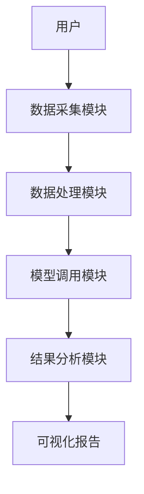

                 


# 智能调研 AI Agent：LLM 辅助市场分析与用户洞察

> 关键词：AI Agent，LLM，市场分析，用户洞察，智能调研，NLP

> 摘要：本文探讨了如何利用大语言模型（LLM）构建智能调研 AI Agent，通过自然语言处理技术实现市场分析与用户洞察。文章从背景、算法原理、系统设计、项目实战等多角度展开，详细分析了LLM在智能调研中的应用，并通过具体案例展示了其实现过程。

---

# 第一部分: 背景与基础

## 第1章: AI Agent 与 LLM 的基本概念

### 1.1 AI Agent 的定义与特点

#### 1.1.1 AI Agent 的定义
AI Agent（人工智能代理）是指能够感知环境、自主决策并执行任务的智能体。它通过传感器获取信息，利用推理能力解决问题，并通过执行器与环境交互。

#### 1.1.2 AI Agent 的核心特点
- **自主性**：能够自主决策，无需人工干预。
- **反应性**：能够实时感知环境并做出响应。
- **学习能力**：通过数据学习提升性能。
- **目标导向**：所有行为均围绕目标展开。

#### 1.1.3 AI Agent 与其他技术的对比
| 技术 | 自主性 | 实时性 | 学习能力 |
|------|--------|--------|----------|
| AI Agent | 高 | 高 | 高 |
| 传统脚本 | 低 | 低 | 无 |

### 1.2 LLM 的定义与特点

#### 1.2.1 LLM 的定义
大语言模型（LLM，Large Language Model）是指基于Transformer架构训练的大型神经网络模型，能够理解并生成人类语言。

#### 1.2.2 LLM 的核心特点
- **大规模训练数据**：通常基于数十亿级别的语料库。
- **上下文理解能力**：能够理解上下文关系，生成连贯的文本。
- **多语言支持**：能够处理多种语言的输入和输出。

#### 1.2.3 LLM 与传统 NLP 模型的对比
| 模型类型 | 参数量（亿） | 上下文理解能力 | 可解释性 |
|----------|--------------|----------------|----------|
| 传统 NLP 模型 | 100M以下 | 弱 | 高 |
| LLM | 100B以上 | 强 | 低 |

### 1.3 AI Agent 在市场分析与用户洞察中的应用前景

#### 1.3.1 AI Agent 的潜在应用领域
- **市场调研**：分析市场趋势、竞争对手策略。
- **用户洞察**：挖掘用户需求、情感倾向。
- **商业决策支持**：辅助制定营销策略、优化产品设计。

#### 1.3.2 LLM 在市场分析中的优势
- **高效性**：快速处理大量文本数据。
- **准确性**：基于大数据分析，结果更可靠。
- **灵活性**：支持多种语言和文化背景的分析。

---

# 第二部分: LLM 的算法原理与数学模型

## 第2章: 大语言模型的算法原理

### 2.1 LLM 的核心算法

#### 2.1.1 变压器（Transformer）模型的基本原理

Transformer 模型由编码器和解码器组成，通过自注意力机制（Self-Attention）捕捉文本中的长距离依赖关系。

#### 2.1.2 注意力机制（Attention）的数学公式

自注意力机制的计算公式如下：

$$
\text{Attention}(Q, K, V) = \text{softmax}\left(\frac{QK^T}{\sqrt{d_k}}\right)V
$$

其中：
- $Q$ 是查询（Query）
- $K$ 是键（Key）
- $V$ 是值（Value）
- $d_k$ 是键的维度

#### 2.1.3 多层感知机（MLP）的数学模型

在Transformer模型中，前馈网络（FFN）的结构如下：

$$
\text{FFN}(x) = \max(0, xW_1 + b_1)W_2 + b_2
$$

---

## 第3章: 智能调研系统的系统分析与架构设计

### 3.1 系统功能模块划分

#### 3.1.1 数据采集模块

- **功能**：从多种数据源（如社交媒体、新闻网站）采集文本数据。
- **输入**：数据源 URL 或 API 接口。
- **输出**：结构化文本数据。

#### 3.1.2 数据处理模块

- **功能**：对采集到的数据进行清洗、分词、去停用词等预处理。
- **输入**：原始文本数据。
- **输出**：处理后的干净文本数据。

#### 3.1.3 模型调用模块

- **功能**：将处理后的数据输入 LLM 进行分析。
- **输入**：处理后的文本数据。
- **输出**：模型生成的分析结果。

#### 3.1.4 结果分析模块

- **功能**：对模型输出的结果进行可视化和解读。
- **输入**：模型输出的结果。
- **输出**：可理解的分析报告。

### 3.2 系统架构设计

#### 3.2.1 系统架构的分层设计



---

# 第三部分: 项目实战

## 第4章: 项目实战

### 4.1 环境安装

```bash
pip install transformers torch
```

### 4.2 核心实现代码

#### 4.2.1 数据采集模块

```python
import requests

def fetch_data(url):
    response = requests.get(url)
    return response.text
```

#### 4.2.2 数据处理模块

```python
import re

def preprocess(text):
    # 分词
    tokens = re.findall(r'\b\w+\b', text)
    return tokens
```

#### 4.2.3 模型调用模块

```python
from transformers import pipeline

def analyze_data(model_name):
    analyzer = pipeline("text-classification", model=model_name)
    return analyzer("分析结果：")
```

#### 4.2.4 结果分析模块

```python
def generate_report(results):
    print("分析报告：", results)
```

### 4.3 案例分析

#### 4.3.1 数据采集

```python
data = fetch_data("https://example.com")
```

#### 4.3.2 数据处理

```python
processed_data = preprocess(data)
```

#### 4.3.3 模型调用

```python
result = analyze_data("facebook/roberta-base")
```

#### 4.3.4 结果分析

```python
generate_report(result)
```

---

# 第四部分: 总结与展望

## 第5章: 总结与最佳实践

### 5.1 总结

通过本文的介绍，我们可以看到，LLM 在智能调研中的应用前景广阔。AI Agent 的引入极大地提升了市场分析与用户洞察的效率和准确性。

### 5.2 最佳实践 tips

- **数据质量**：确保数据来源可靠，避免噪声数据。
- **模型选择**：根据任务需求选择合适的模型。
- **结果解读**：结合业务背景，合理解读模型输出。

---

作者：AI天才研究院/AI Genius Institute & 禅与计算机程序设计艺术 /Zen And The Art of Computer Programming

