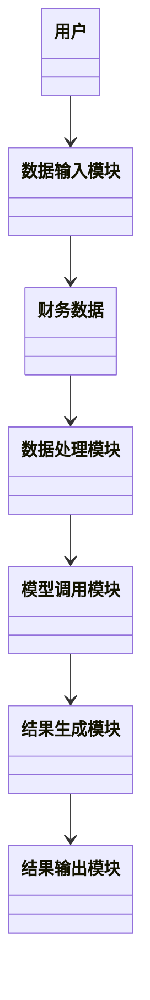
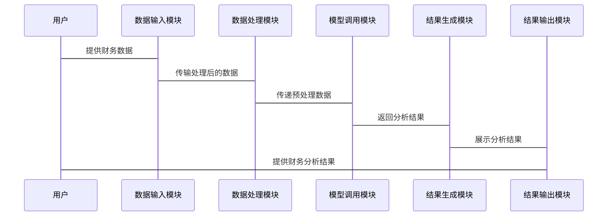

                 


# 智能财务分析 AI Agent：LLM 在企业财务管理中的应用

> 关键词：智能财务分析，AI Agent，大语言模型，企业财务管理，LLM 应用

> 摘要：本文探讨了大语言模型（LLM）在企业财务管理中的应用，详细分析了智能财务分析 AI Agent 的背景、原理、系统架构和实际案例，为企业智能化转型提供了技术参考和实践指导。

---

## 第一部分: 智能财务分析 AI Agent 的背景与概念

### 第1章: 问题背景与需求分析

#### 1.1 问题背景
在现代企业中，财务管理是一项复杂而关键的任务，涉及大量的数据处理、分析和决策。传统的财务分析方法依赖于人工操作，效率低下且容易出错，难以满足现代企业对高效、精准财务管理的需求。

##### 1.1.1 传统财务分析的局限性
- 数据处理效率低：人工处理大量财务数据耗时耗力，容易出错。
- 分析深度有限：传统方法难以深入挖掘数据背后的趋势和规律。
- 决策支持不足：缺乏实时性和动态性，难以提供有效的决策支持。

##### 1.1.2 企业财务管理的痛点
- 数据分散：财务数据可能分布在不同的系统中，难以整合和分析。
- 数据清洗复杂：数据清洗和预处理耗时且容易出错。
- 需求多样化：企业对财务分析的需求日益多样化，传统方法难以应对。

##### 1.1.3 AI技术在财务管理中的潜力
- 提高效率：AI技术可以快速处理大量数据，显著提高工作效率。
- 深度分析：AI能够挖掘数据中的潜在规律，提供更深入的分析结果。
- 实时支持：AI可以实时分析财务数据，为企业提供及时的决策支持。

#### 1.2 问题描述
智能财务分析 AI Agent 的目标是通过大语言模型（LLM）实现对企业财务数据的智能化分析，解决传统财务分析中的效率低下、深度不足等问题。

##### 1.2.1 财务数据分析的复杂性
- 数据来源多样：财务数据可能来自不同的系统和渠道。
- 数据格式多样：数据格式多样，包括文本、表格、图像等。
- 数据量大：企业的财务数据通常非常庞大，需要高效的处理能力。

##### 1.2.2 传统财务分析的效率瓶颈
- 人工操作繁琐：传统财务分析依赖人工操作，效率低下。
- 数据处理耗时：数据清洗和预处理需要大量时间和精力。
- 分析结果单一：传统分析方法难以提供多样化的分析结果。

##### 1.2.3 企业对智能化财务管理的需求
- 提高效率：企业需要更高效的财务管理方法。
- 深化分析：企业希望得到更深入的财务分析结果。
- 实时支持：企业需要实时的财务数据支持决策。

#### 1.3 问题解决与边界
##### 1.3.1 智能财务分析 AI Agent 的目标
- 提供高效、智能的财务数据分析工具。
- 深入挖掘财务数据，提供有价值的分析结果。
- 实时支持企业的财务决策。

##### 1.3.2 解决方案的核心要素
- 高效的数据处理能力。
- 强大的数据分析能力。
- 实时的决策支持能力。

##### 1.3.3 边界与外延
- 数据范围：仅限于企业内部的财务数据。
- 功能范围：不包括企业的其他业务数据处理。
- 使用场景：仅限于企业内部的财务管理。

### 第2章: 核心概念与联系

#### 2.1 核心概念原理
##### 2.1.1 大语言模型（LLM）的基本原理
大语言模型（LLM）是一种基于深度学习的自然语言处理模型，能够理解和生成人类语言。其核心是通过大量数据的预训练，学习语言的结构和语义，从而能够完成多种任务，如文本生成、翻译、问答等。

##### 2.1.2 智能财务分析 AI Agent 的工作原理
智能财务分析 AI Agent 是基于大语言模型构建的智能财务分析工具，能够通过自然语言处理技术，对企业财务数据进行分析、理解和生成报告。其工作流程包括数据输入、数据处理、模型调用、结果生成和结果输出。

##### 2.1.3 LLM 在财务管理中的应用机制
LLM 在财务管理中的应用机制主要包括数据输入、模型调用、结果生成和结果输出四个阶段。数据输入阶段，模型接收财务数据；模型调用阶段，模型对数据进行分析和处理；结果生成阶段，模型生成分析结果；结果输出阶段，模型将结果输出给用户。

#### 2.2 核心概念对比分析
##### 2.2.1 LLM 与其他 AI 模型的对比
| 比较维度 | LLM | 其他 AI 模型（如传统机器学习模型） |
|----------|------|-----------------------------------|
| 数据需求 | 需要大量数据 | 数据需求相对较低                 |
| 任务多样性 | 能够处理多种任务 | 通常专注于单一任务               |
| 模型复杂度 | 模型复杂度高 | 模型复杂度相对较低               |

##### 2.2.2 智能财务分析与传统财务分析的对比
| 比较维度 | 智能财务分析 | 传统财务分析 |
|----------|-------------|---------------|
| 数据处理能力 | 高效、智能 | 低效、人工     |
| 分析深度 | 深入、全面 | 浅显、片面     |
| 决策支持 | 实时、精准 | 延时、粗放     |

##### 2.2.3 AI Agent 与传统财务工具的对比
| 比较维度 | AI Agent | 传统财务工具 |
|----------|----------|---------------|
| 智能性 | 高度智能 | 低智能         |
| 可扩展性 | 高度可扩展 | 可扩展性有限   |
| 使用成本 | 高 | 低             |

#### 2.3 实体关系图


---

## 第二部分: 大语言模型（LLM）在财务管理中的应用

### 第3章: 算法原理与实现

#### 3.1 大语言模型的训练过程
##### 3.1.1 预训练阶段
预训练阶段是模型学习语言的基本阶段，模型通过大量未标注数据的学习，掌握语言的基本结构和语义。这个过程通常使用Transformer架构，通过自注意力机制和前馈网络，对数据进行编码和解码。

##### 3.1.2 微调阶段
微调阶段是模型针对特定任务进行优化的阶段。在财务管理任务中，模型需要通过大量财务相关数据的微调，进一步优化模型在财务分析任务中的表现。

##### 3.1.3 模型优化与部署
模型优化阶段是对模型进行剪枝、量化等技术处理，以减少模型的计算量和存储需求。部署阶段是将优化后的模型部署到实际的生产环境中，提供实时的财务分析服务。

#### 3.2 算法流程图


#### 3.3 数学模型和公式
##### 3.3.1 概率分布
在自然语言处理中，概率分布是模型预测的基础。模型通过计算每个词的概率，生成最可能的输出。例如，模型会计算给定输入条件下，每个词的概率分布：
$$ P(y|x) = \text{softmax}(Wx + b) $$

##### 3.3.2 损失函数
损失函数是衡量模型预测与真实值之间差异的函数。常用的损失函数包括交叉熵损失函数：
$$ \text{Loss} = -\sum_{i=1}^{n} y_i \log(p_i) $$

##### 3.3.3 优化算法
优化算法是模型训练的核心，常用的优化算法包括随机梯度下降（SGD）和Adam优化器。Adam优化器的更新公式为：
$$ \theta_{t+1} = \theta_t - \eta \frac{g_t}{\beta_1 (1 - \beta_1^t) + (1 - \beta_1)(1 - \beta_2^t)} $$

---

## 第4章: 系统分析与架构设计

### 4.1 系统功能设计
智能财务分析 AI Agent 的系统功能包括数据输入、数据处理、模型调用、结果生成和结果输出五个模块。

#### 4.1.1 数据输入模块
数据输入模块负责接收企业的财务数据，包括财务报表、交易记录等。数据格式可以是文本、表格或图像。

#### 4.1.2 数据处理模块
数据处理模块负责对输入的财务数据进行清洗、转换和预处理，确保数据符合模型的输入要求。

#### 4.1.3 模型调用模块
模型调用模块负责将处理后的数据输入到大语言模型中，调用模型进行分析和处理。

#### 4.1.4 结果生成模块
结果生成模块负责根据模型的输出生成财务分析结果，包括财务指标分析、趋势预测等。

#### 4.1.5 结果输出模块
结果输出模块负责将分析结果输出给用户，可以通过文本、图表等形式展示。

### 4.2 系统架构设计
##### 4.2.1 类图


##### 4.2.2 序列图


---

## 第5章: 项目实战

### 5.1 环境安装
为了运行智能财务分析 AI Agent，需要安装以下环境：
- Python 3.8+
- PyTorch 1.9+
- transformers库 4.16+

### 5.2 系统核心实现源代码
以下是智能财务分析 AI Agent 的核心实现代码：

```python
from transformers import AutoTokenizer, AutoModelForCausalLM
import torch

# 加载预训练模型和tokenizer
model_name = "facebook/llama-7b"
tokenizer = AutoTokenizer.from_pretrained(model_name)
model = AutoModelForCausalLM.from_pretrained(model_name)

# 定义输入数据
inputs = "财务报表分析："

# 编码输入数据
input_ids = tokenizer.encode(inputs, return_tensors="pt")

# 生成输出
with torch.no_grad():
    outputs = model.generate(input_ids, max_length=500, do_sample=True)

# 解码输出
output = tokenizer.decode(outputs[0], skip_special_tokens=True)
print(output)
```

### 5.3 代码应用解读与分析
上述代码展示了如何使用大语言模型进行财务报表分析。首先，加载预训练模型和tokenizer，然后定义输入数据，对输入数据进行编码，生成输出，并对输出进行解码，得到财务分析结果。

### 5.4 实际案例分析
假设我们有一个企业的财务报表数据，包括收入、支出、利润等指标。通过上述代码，模型可以生成一份详细的财务分析报告，包括收入分析、成本分析、利润分析等。

### 5.5 项目小结
通过上述代码实现，我们可以看到大语言模型在财务分析中的强大能力。模型可以根据输入的财务数据，生成详细的分析报告，为企业提供有力的决策支持。

---

## 第6章: 最佳实践、小结、注意事项、拓展阅读

### 6.1 最佳实践 tips
- 数据预处理：确保输入数据的格式和内容符合模型要求。
- 模型调优：根据具体任务对模型进行微调和优化。
- 结果验证：对模型的输出进行验证和评估，确保分析结果的准确性。

### 6.2 小结
本文详细探讨了大语言模型（LLM）在企业财务管理中的应用，从背景、原理到系统架构和实际案例，全面分析了智能财务分析 AI Agent 的实现和应用。

### 6.3 注意事项
- 数据隐私：在处理财务数据时，需要注意数据的隐私和安全。
- 模型性能：需要根据具体任务对模型进行优化，确保模型的性能满足需求。
- 技术更新：随着技术的发展，需要不断更新模型和算法，保持系统的先进性。

### 6.4 拓展阅读
- 《Deep Learning for NLP》
- 《Transformers: State-of-the-art Neural Networks for Sequence Processing》
- 《Large Language Models for Financial Analysis》

---

## 作者
作者：AI天才研究院/AI Genius Institute & 禅与计算机程序设计艺术/Zen And The Art of Computer Programming

