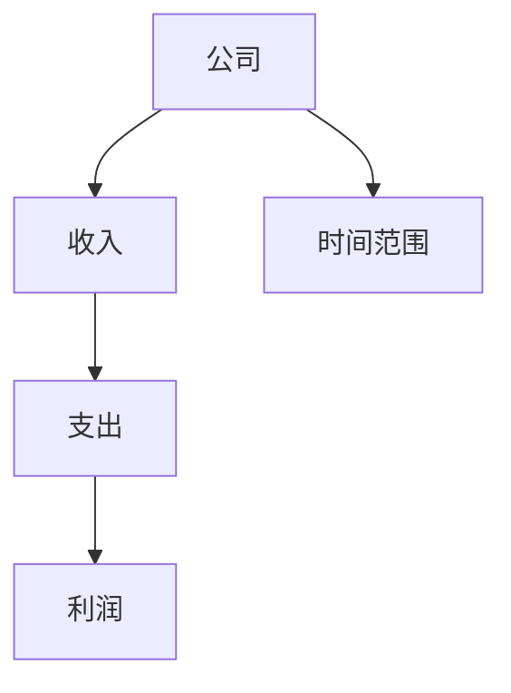

                 

# 智能财务报告关键信息提取与分析系统

> 关键词：财务报告，关键信息提取，智能分析系统，自然语言处理，机器学习，深度学习

> 摘要：本文详细探讨了智能财务报告关键信息提取与分析系统的构建与应用。通过自然语言处理、机器学习和深度学习技术，该系统能够高效地从财务报告中提取关键信息并进行智能分析，从而提升财务数据处理的效率和准确性。文章从背景介绍、核心概念、算法原理、系统架构、项目实战到最佳实践，全面阐述了系统的实现过程和应用价值。

---

## 第一章: 背景介绍

### 1.1 问题背景

#### 1.1.1 财务报告的重要性  
财务报告是企业经济活动的重要记录，包含大量关键信息，如收入、支出、利润等。然而，传统的人工分析方式效率低下，容易出错，且难以应对海量数据的处理需求。

#### 1.1.2 传统财务报告分析的局限性  
传统财务分析依赖人工阅读和计算，存在以下问题：  
1. **效率低**：手动处理大量数据耗时耗力。  
2. **准确性差**：人为疏忽可能导致分析结果偏差。  
3. **可扩展性弱**：难以应对海量数据的分析需求。  

#### 1.1.3 智能化分析的需求  
随着企业规模的扩大和数据量的激增，智能化财务分析的需求日益迫切。通过引入人工智能技术，可以实现自动化、高效化的财务报告分析。

---

### 1.2 问题描述

#### 1.2.1 关键信息提取的挑战  
财务报告中的关键信息（如公司名称、财务数据、时间范围等）分散在文本中，需要通过自然语言处理技术提取。

#### 1.2.2 分析系统的构建目标  
构建一个智能系统，能够自动提取财务报告中的关键信息，并进行深度分析，生成直观的可视化结果。

#### 1.2.3 边界与外延  
该系统专注于财务报告的文本分析，不涉及外部数据库的集成，但可以与其他财务系统进行数据交互。

---

### 1.3 问题解决

#### 1.3.1 智能化技术的应用  
利用自然语言处理（NLP）、机器学习和深度学习技术，实现财务报告的自动化分析。

#### 1.3.2 数据处理流程  
1. 数据采集：获取财务报告文本。  
2. 数据清洗：去除无关信息，提取关键内容。  
3. 数据分析：识别实体、提取关系、生成报告。  

#### 1.3.3 系统功能定位  
该系统旨在辅助财务人员快速提取和分析财务数据，提升工作效率和准确性。

---

### 1.4 核心概念与联系

#### 1.4.1 核心概念原理  
- **实体识别**：识别文本中的关键实体（如公司名称、金额、日期等）。  
- **关系抽取**：分析实体之间的关系（如“公司在2022年实现净利润1000万元”）。  

#### 1.4.2 概念属性特征对比表格  
| 概念 | 属性 | 特征 |  
|------|------|------|  
| 实体识别 | 数据类型 | 文本 |  
| 关系抽取 | 数据类型 | 文本 |  
| 统计分析 | 数据类型 | 数值 |  

#### 1.4.3 ER实体关系图架构  

---

## 第二章: 核心概念与联系

### 2.1 信息提取与分析的原理

#### 2.1.1 自然语言处理技术  
NLP技术用于从文本中提取关键实体和关系。例如，使用分词、词性标注等技术处理财务报告文本。

#### 2.1.2 实体识别与关系抽取  
通过NER模型识别公司名称、金额等实体，通过关系抽取模型分析实体间的关联。

#### 2.1.3 文本分类与情感分析  
对财务报告进行分类（如按行业分类），并分析文本情感（如财务状况的好坏）。

---

### 2.2 概念属性特征对比表格

| 概念 | 属性 | 特征 |  
|------|------|------|  
| 实体识别 | 算法 | 基于CRF或BERT |  
| 关系抽取 | 算法 | 基于规则或深度学习 |  
| 文本分类 | 算法 | 基于SVM或CNN |  

---

### 2.3 ER实体关系图架构

---

## 第三章: 信息提取算法原理

### 3.1 命名实体识别（NER）模型

#### 3.1.1 模型结构与流程  
NER模型通过序列标注技术（如CRF）识别文本中的实体。

#### 3.1.2 实体识别的数学模型  
条件随机场（CRF）公式：  
$$ P(y|x) = \frac{\exp(f(y|x))}{\sum_{y'} \exp(f(y'|x))} $$  

#### 3.1.3 模型训练与优化  
使用训练数据训练NER模型，并通过交叉验证优化模型参数。

---

### 3.2 关系抽取算法

#### 3.2.1 基于规则的关系抽取  
通过预定义规则匹配文本中的关系。例如，匹配“公司在2022年实现净利润1000万元”。

#### 3.2.2 基于深度学习的关系抽取  
使用Transformer模型（如BERT）进行关系抽取。

#### 3.2.3 算法实现与优化  
通过调整模型超参数和优化训练数据提升关系抽取的准确率。

---

## 第四章: 信息分析算法原理

### 4.1 统计分析模型

#### 4.1.1 数据预处理与特征提取  
对财务数据进行清洗和特征提取，如计算收入增长率。

#### 4.1.2 统计分析方法  
使用均值、方差等统计方法分析财务数据。

#### 4.1.3 模型评估与优化  
通过交叉验证评估模型性能，并优化模型参数。

---

### 4.2 深度学习模型

#### 4.2.1 RNN与Transformer模型  
使用RNN或Transformer模型进行文本分类和情感分析。

#### 4.2.2 模型训练与调参  
通过调整学习率、批量大小等参数优化模型性能。

#### 4.2.3 模型在财务分析中的应用  
将深度学习模型应用于财务报告的分类和预测。

---

## 第五章: 数学模型与公式

### 5.1 命名实体识别的公式  
条件随机场（CRF）公

