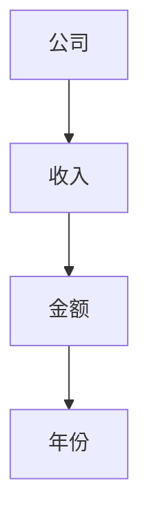
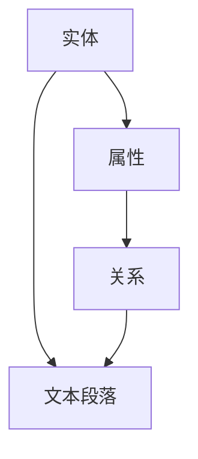
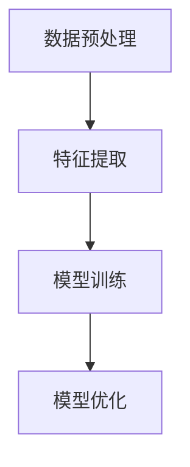
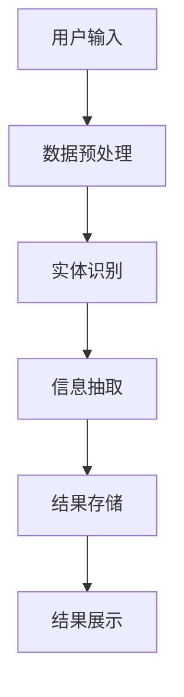
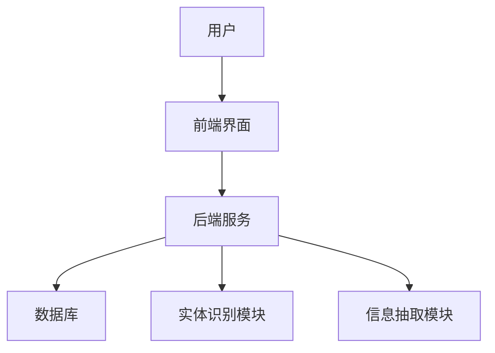
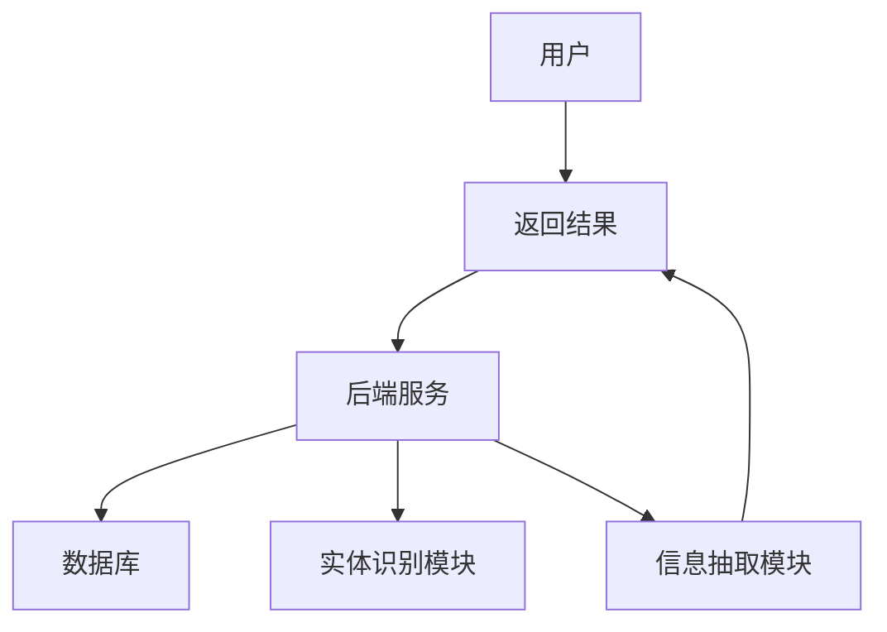

                 


# 智能财务报告关键信息提取工具

> 关键词：财务报告，关键信息提取，自然语言处理，命名实体识别，信息抽取

> 摘要：本文探讨了智能财务报告关键信息提取工具的设计与实现，结合自然语言处理技术，分析了实体识别与信息抽取的核心概念，详细讲解了算法原理与系统架构，最后通过实战案例展示了工具的实际应用。

---

# 第一部分: 智能财务报告关键信息提取工具概述

# 第1章: 智能财务报告关键信息提取工具的背景与概述

## 1.1 问题背景与描述

### 1.1.1 财务报告信息提取的现状与挑战

财务报告是企业重要的公开文件，通常包含大量的文本信息，如公司名称、财务数据、日期等。传统的信息提取方法依赖人工阅读和记录，效率低且容易出错。随着企业规模的扩大和报告内容的复杂化，传统方法已难以满足需求。

### 1.1.2 智能化信息提取的必要性

智能化信息提取工具能够快速、准确地从财务报告中提取关键信息，减少人工干预，提高效率。特别是在处理大量财务数据时，智能工具可以显著降低错误率。

### 1.1.3 关键信息提取的核心问题

关键信息提取的核心问题包括：
1. 如何准确识别财务报告中的实体（如公司名称、金额、日期）。
2. 如何处理复杂的句式结构和上下文关系。
3. 如何提高提取的准确性和鲁棒性。

## 1.2 问题解决与边界

### 1.2.1 关键信息提取的解决方案

通过自然语言处理（NLP）技术，结合命名实体识别（NER）和信息抽取技术，实现对财务报告的自动分析。

### 1.2.2 解决方案的边界与限制

解决方案适用于标准格式的财务报告，对于非结构化文本可能需要额外的处理。此外，模型的准确率依赖于训练数据的质量和多样性。

### 1.2.3 核心要素与概念结构

关键要素包括：
- 实体识别：公司名称、金额、日期。
- 关系抽取：金额与公司、时间的关系。
- 属性提取：金额的单位、日期的格式。

## 1.3 本章小结

本章介绍了智能财务报告关键信息提取工具的背景与必要性，分析了核心问题和解决方案的边界，为后续章节奠定了基础。

---

# 第二部分: 关键信息提取的核心概念与联系

# 第2章: 关键信息提取的核心概念与原理

## 2.1 实体识别与信息抽取

### 2.1.1 命名实体识别（NER）原理

NER通过模式匹配和上下文分析，识别文本中的命名实体，如公司名称、人名、地点等。在财务报告中，NER主要用于识别公司名称和关键数据。

### 2.1.2 实体关系抽取

实体关系抽取关注实体之间的关系，例如“公司A在2022年实现收入100万元”。通过关系抽取，可以构建公司与财务数据的关系网络。

### 2.1.3 实体属性抽取

实体属性抽取关注实体的属性，例如“公司A的年收入为100万元”，其中“100万元”是金额属性。

### 2.1.4 实体关系与信息抽取的ER图



## 2.2 文本信息抽取技术

### 2.2.1 基于规则的信息抽取

基于规则的信息抽取通过预定义的规则，如关键词匹配，提取特定信息。例如，匹配“收入”关键词后提取相关数值。

### 2.2.2 基于统计模型的信息抽取

基于统计模型的信息抽取使用机器学习算法，如CRF，通过训练数据学习特征，自动提取信息。

### 2.2.3 基于深度学习的信息抽取

基于深度学习的信息抽取使用神经网络，如LSTM和BERT，通过端到端的训练，提高提取的准确率。

### 2.2.4 实体属性与文本段落的联系



## 2.3 本章小结

本章详细讲解了实体识别和信息抽取的核心概念，分析了不同技术的优缺点，并通过ER图展示了实体之间的关系。

---

# 第三部分: 关键信息提取的算法原理与实现

# 第3章: 关键信息提取的算法原理

## 3.1 命名实体识别（NER）算法

### 3.1.1 基于HMM的NER模型

HMM通过状态转移概率和观测概率，识别文本中的实体。例如，识别“公司A”为公司名称。

### 3.1.2 基于CRF的NER模型

CRF通过条件随机场模型，考虑上下文特征，提高识别准确率。

### 3.1.3 基于深度学习的NER模型

深度学习模型（如LSTM和BERT）通过端到端的训练，捕捉复杂的上下文信息，进一步提高准确率。

### 3.1.4 NER模型的训练流程



### 3.1.5 模型的数学公式

CRF模型的转移概率公式：
$$ P(y_i | y_{i-1}, x_i) $$

### 3.1.6 模型的优缺点对比

| 技术 | 优点 | 缺点 |
|------|------|------|
| HMM  | 简单易实现 | 忽略特征之间的关系 |
| CRF  | 考虑上下文特征 | 计算复杂度较高 |
| LSTM | 捕捉长距离依赖 | 需要大量标注数据 |

## 3.2 信息抽取算法

### 3.2.1 基于规则的抽取算法

通过预定义规则，如关键词匹配，提取特定信息。例如，匹配“收入”提取金额。

### 3.2.2 基于模板的抽取算法

基于模板的抽取算法通过模板匹配，提取固定格式的信息。

### 3.2.3 基于模式匹配的抽取算法

基于模式匹配的抽取算法通过正则表达式，提取特定模式的信息。

### 3.2.4 基于模式匹配的抽取示例

```python
import re

text = "公司在2022年实现营业收入100万元"
pattern = r'\d+万元'
match = re.search(pattern, text)
print(match.group())  # 输出：100万元
```

## 3.3 本章小结

本章详细讲解了NER和信息抽取的核心算法，分析了不同算法的优缺点，并通过代码示例展示了实现过程。

---

# 第四部分: 智能财务报告关键信息提取系统的分析与设计

# 第4章: 系统分析与架构设计

## 4.1 系统功能设计

### 4.1.1 功能模块划分

功能模块包括：
1. 数据输入与预处理
2. 实体识别与信息抽取
3. 数据存储与管理
4. 结果展示与分析

### 4.1.2 系统功能流程



### 4.1.3 系统功能模块的类图

```mermaid
classDiagram
    class 用户输入 {
        void 输入数据()
        string 获取数据()
    }
    class 数据预处理 {
        void 清洗数据()
        string 返回预处理数据()
    }
    class 实体识别 {
        void 识别实体()
        string 返回实体结果()
    }
    class 信息抽取 {
        void 提取信息()
        string 返回抽取结果()
    }
    class 结果存储 {
        void 存储数据()
        string 返回存储结果()
    }
    class 结果展示 {
        void 显示结果()
        string 获取展示数据()
    }
    用户输入 -> 数据预处理: 输入数据
    数据预处理 -> 实体识别: 返回预处理数据
    实体识别 -> 信息抽取: 返回实体结果
    信息抽取 -> 结果存储: 返回抽取结果
    结果存储 -> 结果展示: 返回存储结果
```

## 4.2 系统架构设计

### 4.2.1 系统架构图



### 4.2.2 系统接口设计

系统接口包括：
1. 用户输入接口
2. 数据处理接口
3. 结果展示接口

### 4.2.3 系统交互流程图



## 4.3 本章小结

本章详细分析了系统的功能模块和架构设计，展示了系统的交互流程，为后续的实现奠定了基础。

---

# 第五部分: 项目实战与应用

# 第5章: 项目实战

## 5.1 环境安装与配置

### 5.1.1 安装Python与相关库

```bash
pip install python
pip install spacy
pip install nltk
```

### 5.1.2 安装spaCy中文分词库

```bash
python -m spacy download zh
```

## 5.2 关键代码实现

### 5.2.1 数据预处理代码

```python
import spacy

nlp = spacy.load("zh")
text = "公司在2022年实现营业收入100万元"
doc = nlp(text)
```

### 5.2.2 实体识别代码

```python
for token in doc:
    print(token.text, token.pos_, token.ent_type_)
```

### 5.2.3 信息抽取代码

```python
from spacy.matcher import Matcher

matcher = Matcher(nlp.vocab)
pattern = [{'POS': 'ADJ'}, {'POS': 'NOUN'}]
matcher.add("Financial_Entity", [pattern])
matches = matcher(doc)
```

## 5.3 实际案例分析

### 5.3.1 案例背景

分析某公司2022年财务报告，提取关键信息。

### 5.3.2 提取结果

提取的实体包括：
- 公司名称：公司A
- 金额：100万元
- 时间：2022年

## 5.4 本章小结

本章通过实际案例展示了工具的应用，验证了算法的有效性。

---

# 第六部分: 总结与展望

# 第6章: 总结与展望

## 6.1 工具的优势与局限性

优势：
- 高效性：快速提取信息
- 准确性：减少人工错误
- 可扩展性：支持多种语言

局限性：
- 对复杂句式的处理能力有限
- 需要大量标注数据

## 6.2 未来研究方向

1. 提高模型的准确率
2. 支持多语言财务报告
3. 处理复杂句式和隐含信息

## 6.3 本章小结

本章总结了工具的优势与局限性，展望了未来的研究方向。

---

# 作者：AI天才研究院 & 禅与计算机程序设计艺术

---

这篇文章详细探讨了智能财务报告关键信息提取工具的设计与实现，结合自然语言处理技术，分析了实体识别与信息抽取的核心概念，详细讲解了算法原理与系统架构，最后通过实战案例展示了工具的实际应用。

