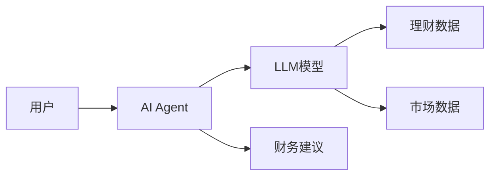

                 


# 智能财务规划AI Agent：LLM在个人理财中的应用

> 关键词：智能财务规划、AI Agent、LLM、个人理财、人工智能

> 摘要：随着人工智能技术的快速发展，AI Agent在个人理财领域的应用日益广泛。本文将深入探讨智能财务规划AI Agent的核心概念、算法原理、系统架构以及实际应用，分析其在个人理财中的优势和挑战，为读者提供全面的技术解读。

---

## 第一部分：智能财务规划AI Agent概述

### 第1章：智能财务规划的背景与需求

#### 1.1 个人理财的现状与挑战

- **传统个人理财方式的局限性**  
  传统理财方式依赖于人工分析和经验判断，存在效率低、成本高、覆盖面有限的问题。此外，个人理财需求的多样化和个性化使得传统方法难以满足现代人的需求。

- **数字化与智能化理财的需求**  
  随着互联网和大数据技术的普及，用户对理财服务的需求逐渐从“人工咨询”转向“智能服务”。智能财务规划不仅能提高效率，还能通过数据分析为用户提供更精准的建议。

- **AI技术在理财中的应用潜力**  
  AI技术，尤其是大语言模型（LLM），在自然语言处理、模式识别和数据挖掘方面具有显著优势，能够帮助用户实现个性化的财务规划和实时市场分析。

#### 1.2 AI Agent的基本概念

- **什么是AI Agent**  
  AI Agent（人工智能代理）是一种能够感知环境、自主决策并执行任务的智能系统。它能够通过与用户交互，理解用户需求并提供相应的解决方案。

- **AI Agent的核心特征**  
  - 自主性：能够在没有人工干预的情况下独立运行。
  - 反应性：能够根据环境变化实时调整行为。
  - 目标导向：具有明确的目标，并通过行动实现目标。

- **AI Agent与传统软件的区别**  
  AI Agent能够学习和适应，而传统软件依赖于固定的规则和程序。

#### 1.3 LLM在个人理财中的应用

- **大语言模型的基本原理**  
  LLM（Large Language Model）通过深度学习技术训练而成，能够理解和生成自然语言文本。其核心是Transformer模型，具有强大的上下文理解和生成能力。

- **LLM在理财咨询中的优势**  
  - 高效性：能够快速分析大量数据并生成建议。
  - 精准性：通过深度学习模型，能够捕捉到数据中的细微差别。
  - 可扩展性：适用于多种理财场景，如投资建议、风险管理等。

- **智能财务规划AI Agent的定义与目标**  
  智能财务规划AI Agent是以LLM为核心技术，结合用户需求和市场数据，提供个性化财务规划和实时建议的智能系统。其目标是帮助用户实现财务目标，优化资产配置。

---

## 第2章：智能财务规划AI Agent的核心概念与联系

### 2.1 核心概念原理

- **AI Agent的决策机制**  
  AI Agent通过分析用户需求和市场数据，结合预设的财务模型，生成最优的财务规划方案。

- **LLM的语言理解能力**  
  LLM能够理解用户的自然语言输入，如“我需要制定一个退休计划”，并生成相应的财务建议。

- **智能财务规划的实现路径**  
  通过数据采集、模型训练、用户交互等步骤，实现个性化的财务规划。

### 2.2 核心概念对比分析

#### 表2-1：AI Agent与传统财务顾问的对比

| 特性                | AI Agent                 | 传统财务顾问             |
|---------------------|--------------------------|--------------------------|
| 服务效率            | 高效，24/7可用           | 依赖人工，时间受限       |
| 服务成本            | 低成本，按需付费         | 高成本，固定收费         |
| 服务范围            | 全球化，覆盖所有用户     | 局限于特定领域           |
| 个性化程度          | 高度个性化               | 中等个性化               |

#### 图2-1：实体关系图



### 2.3 实体关系图

通过上述对比和分析，可以看出AI Agent在个人理财中的优势和潜力。

---

## 第3章：算法原理与数学模型

### 3.1 LLM的算法原理

- **Transformer模型的工作流程**  
  Transformer模型由编码器和解码器组成，通过自注意力机制（Self-Attention）捕捉文本中的长距离依赖关系。

- **注意力机制的数学表达**  
  注意力机制的公式为：
  $$\text{Attention}(Q, K, V) = \text{softmax}\left(\frac{QK^T}{\sqrt{d_k}}\right)V$$

- **模型训练的优化策略**  
  通过Adam优化器和学习率衰减技术，提升模型的训练效率和准确性。

### 3.2 智能财务规划的算法实现

- **数据预处理与特征提取**  
  对用户的财务数据进行清洗和特征提取，如收入、支出、资产等。

- **基于LLM的决策树构建**  
  通过LLM生成决策树，帮助用户制定最优的财务规划方案。

- **多目标优化算法的设计**  
  在财务规划中，通常需要在风险和收益之间找到平衡点，这可以通过多目标优化算法实现。

### 3.3 数学模型与公式

- **注意力机制公式**  
  $$\text{Attention}(Q, K, V) = \text{softmax}\left(\frac{QK^T}{\sqrt{d_k}}\right)V$$

- **智能财务规划的优化目标**  
  $$\min_{x} \sum_{i=1}^{n} w_i (x_i - x)^2$$

---

## 第4章：系统分析与架构设计

### 4.1 系统功能设计

- **功能模块**  
  - 用户交互模块：与用户进行自然语言交互。
  - 数据处理模块：对用户的财务数据进行清洗和分析。
  - 模型推理模块：基于LLM生成财务建议。

- **领域模型类图**  
  ```mermaid
  classDiagram
      class 用户 {
          收入
          支出
          资产
      }
      class AI Agent {
          接收请求
          处理请求
          返回建议
      }
      class LLM模型 {
          接收输入
          生成输出
      }
      用户 --> AI Agent
      AI Agent --> LLM模型
  ```

### 4.2 系统架构设计

- **分层架构**  
  - 数据层：存储用户的财务数据和市场数据。
  - 业务逻辑层：处理用户的请求并生成建议。
  - 用户界面层：展示结果并提供交互界面。

- **系统架构图**  
  ```mermaid
  architecture
  A[用户] --> B[数据层]
  B --> C[业务逻辑层]
  C --> D[用户界面层]
  ```

### 4.3 系统接口设计

- **API接口**  
  - 输入接口：接收用户的财务数据和请求。
  - 输出接口：返回财务建议和相关数据。

- **交互流程图**  
  ```mermaid
  sequenceDiagram
      User -> AI Agent: 提出理财需求
      AI Agent -> LLM模型: 分析需求
      LLM模型 -> User: 提供财务建议
  ```

---

## 第5章：项目实战

### 5.1 环境安装

- **工具安装**  
  - Python 3.8+
  - TensorFlow/PyTorch
  - Hugging Face Transformers

### 5.2 核心实现

- **代码实现**  
  ```python
  from transformers import AutoModelForCausalLM, AutoTokenizer

  model_name = "gpt2"
  tokenizer = AutoTokenizer.from_pretrained(model_name)
  model = AutoModelForCausalLM.from_pretrained(model_name)

  input_text = "我需要制定一个投资计划..."
  inputs = tokenizer.encode(input_text, return_tensors="pt")
  outputs = model.generate(inputs, max_length=50)
  print(tokenizer.decode(outputs[0]))
  ```

### 5.3 实际案例分析

- **案例分析**  
  通过一个实际案例，展示AI Agent如何根据用户需求生成财务建议，如投资组合优化、风险管理等。

---

## 第6章：总结与展望

### 6.1 总结

- 本文详细探讨了智能财务规划AI Agent的核心概念、算法原理和系统架构。
- 通过实际案例分析，展示了AI Agent在个人理财中的应用潜力。

### 6.2 展望

- 随着AI技术的不断进步，智能财务规划AI Agent将在更多场景中得到应用，为用户提供更高效、更精准的理财服务。

---

## 作者信息

作者：AI天才研究院/AI Genius Institute & 禅与计算机程序设计艺术 /Zen And The Art of Computer Programming

---

以上就是《智能财务规划AI Agent：LLM在个人理财中的应用》的技术博客文章大纲和内容。通过系统的分析和详细的讲解，读者可以全面了解AI Agent在个人理财中的应用及其技术实现。

