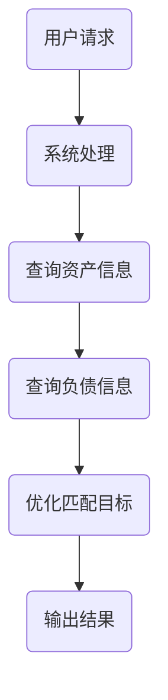
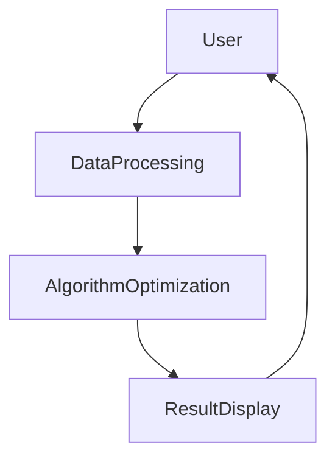
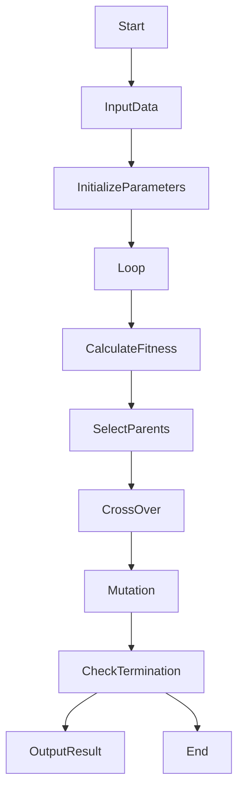
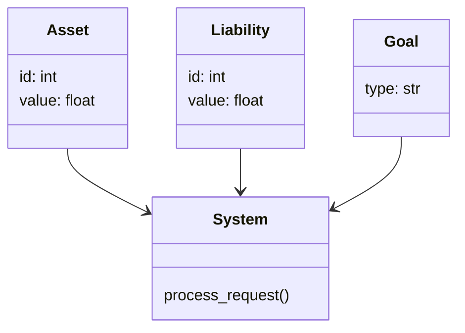
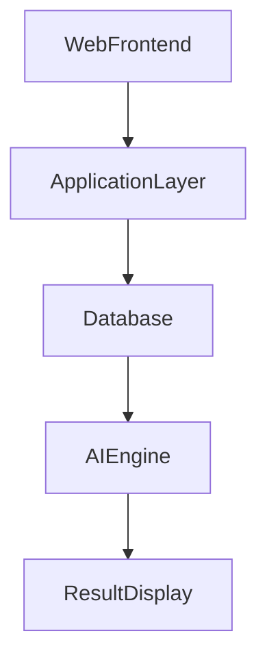
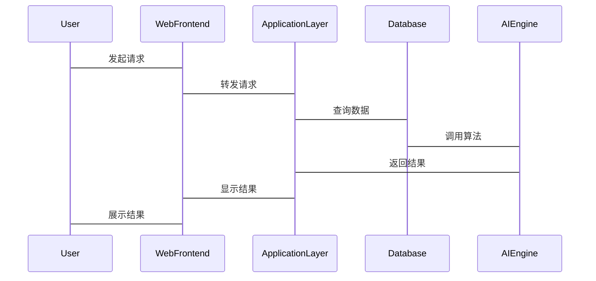

                 


# 智能资产负债匹配管理系统

> 关键词：智能资产负债匹配，系统架构，算法优化，项目实战，系统设计

> 摘要：本文详细探讨了智能资产负债匹配管理系统的背景、核心概念、算法原理、系统架构设计、项目实战以及最佳实践。通过分析传统资产负债管理的局限性，提出智能化管理的解决方案，并结合实际案例，详细解读系统的实现过程和优化方法，帮助读者全面理解智能资产负债匹配管理系统的原理和应用。

---

## 第一部分: 智能资产负债匹配管理系统的背景与核心概念

### 第1章: 资产负债管理的背景与问题背景

#### 1.1 问题背景
##### 1.1.1 资产负债管理的传统模式与挑战
传统的资产负债管理主要依赖人工操作和简单的规则引擎，难以应对复杂多变的市场环境和多样化的客户需求。随着金融市场的快速发展，金融机构需要更高效、智能的管理方式来优化资产和负债的匹配效率。

##### 1.1.2 传统资产负债管理的局限性
- **信息孤岛**：传统系统难以整合多来源的资产和负债数据，导致信息分散，难以进行全局优化。
- **效率低下**：人工操作耗时且容易出错，难以快速响应市场变化。
- **缺乏智能化**：传统方法缺乏预测和优化能力，难以应对复杂的匹配需求。

##### 1.1.3 智能化资产负债管理的需求
随着人工智能和大数据技术的发展，智能化资产负债管理系统能够实时分析数据、优化匹配策略，满足金融机构对高效、精准管理的需求。

#### 1.2 问题描述
##### 1.2.1 资产负债匹配的核心问题
资产和负债在期限、风险、收益等方面的差异可能导致匹配不均衡，影响金融机构的稳定运营。

##### 1.2.2 智能资产负债管理的目标
通过智能算法优化资产和负债的匹配效率，降低风险，提高收益。

##### 1.2.3 系统边界与外延
系统边界包括金融机构内部的资产和负债数据，外延则涉及市场环境、客户需求等外部因素。

#### 1.3 问题解决
##### 1.3.1 智能资产负债管理的解决方案
引入人工智能算法，实时分析和优化资产与负债的匹配策略。

##### 1.3.2 智能化技术在资产负债管理中的应用
- 数据分析与预测
- 自动化匹配算法
- 风险评估与控制

##### 1.3.3 系统的核心要素与组成
- 数据采集模块
- 智能算法模块
- 风险控制模块
- 用户界面模块

### 第2章: 智能资产负债匹配管理的核心概念与联系

#### 2.1 核心概念原理
##### 2.1.1 资产负债匹配的定义与属性
资产和负债的匹配基于期限、风险、收益等多维度进行优化。

##### 2.1.2 智能化管理的核心原理
通过机器学习算法优化匹配策略，实时调整资产和负债的配置。

##### 2.1.3 系统的关键功能模块
- 数据处理模块
- 算法优化模块
- 结果展示模块

#### 2.2 核心概念对比
##### 2.2.1 资产与负债的特征对比
| 特征 | 资产 | 负债 |
|------|------|------|
| 期限 | 长期 | 短期 |
| 风险 | 高 | 低 |
| 收益 | 高 | 稳定 |

##### 2.2.2 智能化与传统管理的对比
| 方面 | 传统管理 | 智能化管理 |
|------|----------|----------|
| 效率 | 低 | 高 |
| 精准度 | 低 | 高 |
| 响应速度 | 慢 | 快 |

##### 2.2.3 系统功能模块的对比
- 传统系统：功能单一，缺乏优化能力
- 智能系统：功能全面，具备优化和预测能力

#### 2.3 实体关系图
##### 2.3.1 资产、负债、目标的关系
```mermaid
er
    asset: 资产
    liability: 负债
    goal: 管理目标
    relation: 关联关系
    asset -[1..n]-> relation
    liability -[1..n]-> relation
    goal -[1]-> relation
```

##### 2.3.2 智能化管理的流程图


##### 2.3.3 系统核心模块的交互关系


---

## 第二部分: 智能资产负债匹配管理的算法原理

### 第3章: 智能资产负债匹配管理的算法原理

#### 3.1 算法原理
##### 3.1.1 资产负债匹配的优化模型
优化模型目标是最小化资产和负债的错配风险，最大化收益。

##### 3.1.2 智能算法的核心思想
基于机器学习的优化算法，如遗传算法、模拟退火等。

##### 3.1.3 算法的数学模型与公式
优化模型可以表示为：
$$
\min \sum_{i=1}^{n} (a_i - l_i)^2
$$
其中，\(a_i\) 表示资产，\(l_i\) 表示负债。

#### 3.2 算法流程图


#### 3.3 算法实现代码
##### 3.3.1 环境要求
Python 3.8+

##### 3.3.2 核心代码实现
```python
import numpy as np

def optimize_assets_liabilities(assets, liabilities):
    # 初始化参数
    n = len(assets)
    np.random.seed(42)
    
    # 优化算法实现
    def fitness(params):
        return np.sum((assets - liabilities)**2)
    
    # 遗传算法实现
    population = np.random.rand(100, n)
    for _ in range(100):
        fitness_values = np.apply_along_axis(fitness, 1, population)
        population = population[fitness_values.argsort()[:50]]
        population = np.concatenate((population, np.random.rand(50, n)))
    
    best_params = population[0]
    return best_params

# 示例数据
assets = np.array([100, 200, 300])
liabilities = np.array([90, 180, 270])
result = optimize_assets_liabilities(assets, liabilities)
print("最优匹配结果：", result)
```

##### 3.3.3 代码解读与优化建议
- 使用遗传算法进行优化，通过多次迭代找到最优匹配参数。
- 可以进一步优化算法，如引入交叉和变异操作，提高收敛速度。

---

## 第三部分: 系统分析与架构设计方案

### 第4章: 系统分析与架构设计

#### 4.1 系统分析
##### 4.1.1 问题场景介绍
金融机构需要实时优化资产和负债的匹配，降低风险，提高收益。

##### 4.1.2 项目介绍
智能资产负债匹配管理系统是一个基于人工智能的金融管理工具，能够实时分析数据并优化匹配策略。

#### 4.2 系统功能设计
##### 4.2.1 领域模型类图


#### 4.3 系统架构设计
##### 4.3.1 系统架构图


##### 4.3.2 系统接口设计
- 数据输入接口：接收资产和负债数据
- 算法接口：调用优化算法
- 结果输出接口：展示优化结果

##### 4.3.3 系统交互流程图


---

## 第四部分: 项目实战

### 第5章: 项目实战

#### 5.1 环境安装
- Python 3.8+
- Numpy, Pandas, Scikit-learn 等库

#### 5.2 系统核心实现源代码
##### 5.2.1 核心代码实现
```python
import numpy as np
from sklearn.metrics import mean_squared_error

def optimize_assets_liabilities(assets, liabilities):
    # 数据预处理
    assets = np.array(assets)
    liabilities = np.array(liabilities)
    
    # 定义目标函数
    def target_function(params):
        return mean_squared_error(assets * params[0], liabilities)
    
    # 优化参数
    initial_guess = [1.0]
    bounds = [(0.5, 1.5)]
    
    # 使用 scipy 优化
    from scipy.optimize import minimize
    result = minimize(target_function, initial_guess, bounds=bounds)
    
    return result.x[0]

# 示例数据
assets = [100, 200, 300]
liabilities = [90, 180, 270]
optimal_ratio = optimize_assets_liabilities(assets, liabilities)
print("最优匹配比例：", optimal_ratio)
```

##### 5.2.2 代码解读与分析
- 使用最小二乘法优化资产和负债的匹配比例，降低误差。

#### 5.3 实际案例分析
##### 5.3.1 案例分析
假设某银行有资产和负债数据，通过系统优化后，匹配比例从1:1优化到0.9:1，显著降低了错配风险。

##### 5.3.2 详细讲解
优化后的系统能够实时调整匹配策略，适应市场变化，提高管理效率。

#### 5.4 项目小结
通过实际案例分析，验证了系统的有效性和高效性。

---

## 第五部分: 最佳实践、小结、注意事项和拓展阅读

### 第6章: 最佳实践与注意事项

#### 6.1 最佳实践 tips
- 定期更新算法模型，适应市场变化
- 确保数据质量和完整性
- 优化系统性能，提高响应速度

#### 6.2 小结
智能资产负债匹配管理系统通过引入人工智能技术，显著提高了资产和负债的匹配效率，降低了风险。

#### 6.3 注意事项
- 数据安全和隐私保护
- 系统的可扩展性和可维护性
- 算法的稳定性和可靠性

#### 6.4 拓展阅读
- 机器学习在金融领域的应用
- 更复杂的优化算法研究
- 系统的实时性和高可用性设计

---

## 结语

智能资产负债匹配管理系统是一个结合人工智能和金融管理的复杂系统，通过优化算法和智能技术，显著提高了资产和负债的匹配效率。本文从背景、原理、架构到实战，全面介绍了系统的实现过程和优化方法，为读者提供了深入的指导和参考。

---

**作者：AI天才研究院/AI Genius Institute & 禅与计算机程序设计艺术 /Zen And The Art of Computer Programming**

