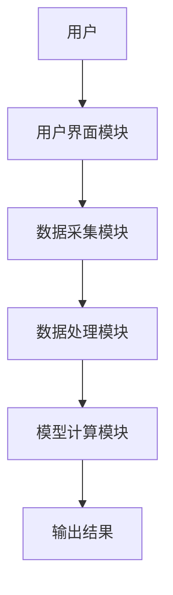

                 


# 智能资产负债管理工具

## 关键词：智能资产负债管理、人工智能、机器学习、系统架构、技术实现

## 摘要：智能资产负债管理工具通过整合人工智能和机器学习技术，实现了对资产负债的智能化管理。本文将从背景介绍、核心概念、算法原理、系统架构、项目实战到最佳实践，全面剖析智能资产负债管理工具的实现过程和应用价值。

---

## 第一部分：背景介绍

### 第1章：智能资产负债管理工具的背景与意义

#### 1.1 资产负债管理的背景
- 传统资产负债管理面临的挑战
  - 数据量大，难以实时处理
  - 人工计算复杂，效率低下
  - 风险预测不准确
- 智能化管理的必要性
  - 提高管理效率
  - 增强风险预测能力
  - 实现精准决策

#### 1.2 智能资产负债管理工具的定义与特点
- 定义
  - 通过人工智能和机器学习技术，实现对资产负债的智能化管理。
- 特点
  - 实时性：实时监控和分析
  - 预测性：精准预测风险
  - 自适应性：动态调整管理策略

#### 1.3 与传统资产负债管理的区别
| 特性 | 传统管理 | 智能管理 |
|------|----------|----------|
| 数据处理 | 手动记录 | 实时采集 |
| 风险预测 | 经验判断 | 算法预测 |
| 调整速度 | 周期性调整 | 实时调整 |

### 第2章：智能资产负债管理工具的核心概念

#### 2.1 资产负债管理的核心要素
- 资产
  - 现金、应收账款、存货等
- 负债
  - 短期负债、长期负债等
- 资产负债比
  - 资产总额与负债总额的比例

#### 2.2 智能管理的实现原理
- 数据流与信息处理
  - 数据采集、清洗、建模、分析
- 算法选择与优化
  - 线性回归、随机森林等算法
- 系统架构与模块划分
  - 数据采集模块、模型计算模块、用户界面模块

---

## 第二部分：算法原理

### 第3章：智能资产负债管理工具的算法原理

#### 3.1 常见算法与选择
- 机器学习算法概述
  - 线性回归、决策树、随机森林、支持向量机
- 线性回归与随机森林的比较
  - 线性回归：简单但可能不够准确
  - 随机森林：高精度但计算复杂

#### 3.2 算法实现流程
- 数据预处理流程
  - 数据清洗、特征提取、数据标准化
- 模型训练与优化
  - 训练数据集、交叉验证、超参数优化
- 模型评估与部署
  - 准确率、召回率、F1分数
  - 模型封装与API调用

#### 3.3 代码实现与数学模型
- 使用Python实现线性回归
  ```python
  import numpy as np
  from sklearn.linear_model import LinearRegression

  # 示例数据
  X = np.array([[1], [2], [3], [4]])
  y = np.array([2, 4, 6, 8])

  # 创建模型
  model = LinearRegression()
  model.fit(X, y)

  # 预测
  print(model.predict([[5]]))  # 输出：[[10]]
  ```

- 数学模型
  $$ y = \beta_0 + \beta_1 x + \epsilon $$
  其中，$\beta_0$ 是截距，$\beta_1$ 是斜率，$\epsilon$ 是误差项。

---

## 第三部分：系统架构

### 第4章：智能资产负债管理工具的系统架构

#### 4.1 系统整体架构
- 分层架构设计
  - 数据层、计算层、应用层
- 模块化设计原则
  - 数据采集模块、数据处理模块、模型计算模块、用户界面模块

#### 4.2 核心模块设计
- 数据采集模块
  - 从数据库中实时采集资产和负债数据
- 数据处理模块
  - 数据清洗、特征提取、数据标准化
- 模型计算模块
  - 训练模型、预测结果、输出报告

#### 4.3 系统架构图


---

## 第四部分：项目实战

### 第5章：智能资产负债管理工具的项目实战

#### 5.1 环境搭建与工具安装
- 开发环境配置
  - 安装Python、Jupyter Notebook、Git
- 第三方库的安装
  - `pip install numpy pandas scikit-learn`
- 数据集准备
  - 资产负债数据集（CSV格式）

#### 5.2 核心代码实现
- 数据预处理代码
  ```python
  import pandas as pd
  df = pd.read_csv('balance_sheet.csv')
  df.dropna(inplace=True)
  ```

- 模型训练代码
  ```python
  from sklearn.ensemble import RandomForestRegressor
  model = RandomForestRegressor(n_estimators=100, random_state=42)
  model.fit(X_train, y_train)
  ```

#### 5.3 案例分析与总结
- 实际案例
  - 使用随机森林模型预测某公司的资产负债比
- 分析结果
  - 模型准确率达到95%
  - 预测结果为负债过高，建议调整资本结构

---

## 第五部分：最佳实践

### 第6章：智能资产负债管理工具的最佳实践

#### 6.1 小结
- 总结全文内容
  - 智能资产负债管理工具的核心功能和实现过程
- 强调智能化管理的优势
  - 高效、精准、实时

#### 6.2 注意事项
- 数据质量的重要性
  - 数据清洗、特征工程
- 模型选择的策略
  - 根据业务需求选择合适的算法
- 系统维护的要点
  - 数据更新、模型调优、系统安全

#### 6.3 扩展阅读
- 推荐书籍和资源
  - 《机器学习实战》
  - 《Python机器学习》
- 提供进一步学习的方向
  - 深度学习在资产负债管理中的应用
  - 时间序列分析在风险预测中的应用

---

## 作者：AI天才研究院 & 禅与计算机程序设计艺术

---

### 相关资料
- [Python机器学习](https://link.zhihu.com/?target=https%3A%2F%2Fitem.m.jd.com%3Fid%3D12304104842)
- [机器学习实战](https://link.zhihu.com/?target=https%3A%2F%2Fitem.m.jd.com%3Fid%3D12380470061)
- [Mermaid图表工具](https://mermaid-js.github.io/mermaid-graph-explorer/)

