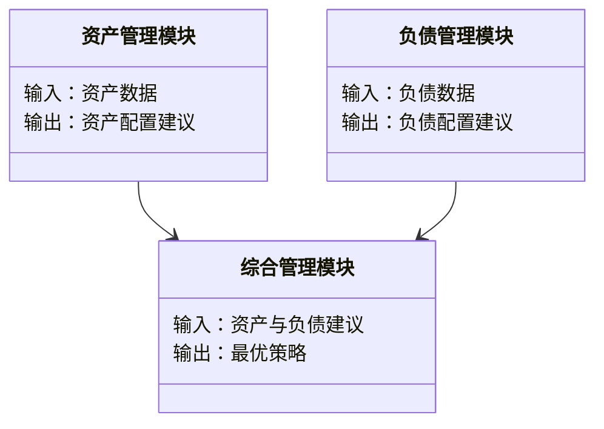

                 


# 智能资产负债管理策略生成器

## 关键词：智能资产负债管理、人工智能、资产配置、风险管理、策略生成、机器学习、金融建模

## 摘要：智能资产负债管理策略生成器是一种结合人工智能技术的先进方法，用于优化资产与负债的配置和管理。本文系统地介绍智能资产负债管理的背景、核心概念、算法原理、系统架构，并通过实际案例展示其在金融领域的应用，为读者提供从理论到实践的全面指导。

---

# 第1章: 智能资产负债管理的背景与问题背景

## 1.1 资产负债管理的背景介绍

### 1.1.1 资产负债管理的基本概念

资产负债管理是金融领域中的核心任务，涉及对资产和负债的配置、监控和优化，以实现风险控制和收益最大化。传统资产负债管理依赖于人工决策和静态模型，难以应对复杂多变的市场环境。

### 1.1.2 智能资产负债管理的定义与特点

智能资产负债管理通过引入人工智能技术，利用机器学习、大数据分析等方法，动态优化资产与负债的配置策略。其特点包括实时性、自适应性和数据驱动性。

### 1.1.3 智能资产负债管理的核心要素

智能资产负债管理的核心要素包括：资产与负债的动态平衡、风险管理、收益最大化、数据驱动的决策支持。

## 1.2 问题背景与问题描述

### 1.2.1 传统资产负债管理的局限性

传统资产负债管理方法存在以下问题：决策依赖人工经验，难以应对复杂市场变化；模型静态，无法实时调整；缺乏对大数据的利用能力。

### 1.2.2 智能资产负债管理的必要性

随着金融市场波动加剧和数据量的爆炸式增长，传统方法已无法满足需求。智能资产负债管理能够通过实时数据分析和机器学习算法，提供更精准的决策支持。

### 1.2.3 智能资产负债管理的目标与边界

目标：优化资产与负债配置，降低风险，提高收益。边界：在合法合规的前提下，确保策略的可执行性和稳定性。

## 1.3 问题解决与核心概念

### 1.3.1 智能资产负债管理的解决方案

采用机器学习算法和大数据分析技术，构建动态优化模型，实时调整资产与负债配置。

### 1.3.2 核心概念的结构与组成

智能资产负债管理的核心结构包括：数据采集、模型构建、策略生成和执行监控。

### 1.3.3 核心要素的对比分析

通过对比分析资产与负债的特征，明确其在管理中的作用和相互关系。

## 1.4 本章小结

本章介绍了智能资产负债管理的背景、问题背景和核心概念，为后续章节的分析奠定了基础。

---

# 第2章: 智能资产负债管理的核心概念与联系

## 2.1 核心概念原理

### 2.1.1 资产与负债的定义与分类

资产是指企业或个人拥有的资源，负债是需要偿还的债务。资产和负债的分类基于其流动性、风险性和收益性。

### 2.1.2 资产负债的动态平衡原理

资产与负债需要在时间和数量上保持动态平衡，以确保财务稳定。

### 2.1.3 智能资产负债管理的数学模型

数学模型用于描述资产与负债之间的关系，例如：$$资产 = 负债 + 所有者权益$$

## 2.2 核心概念属性特征对比

### 2.2.1 资产与负债的属性对比

| 属性 | 资产 | 负债 |
|------|------|------|
| 流动性 | 高 | 低 |
| 风险性 | 低 | 高 |
| 收益性 | 高 | 低 |

### 2.2.2 资产与负债的特征分析

资产具有保值增值能力，负债具有刚性偿债压力。

### 2.2.3 资产与负债的相互关系

资产与负债在数量和质量上需保持动态平衡，以确保财务健康。

## 2.3 ER实体关系图架构

```mermaid
erDiagram
    actor 智能系统
    actor 用户
    actor 数据源
    actor 管理者
    actor 市场环境
    智能系统 --> 资产 : 管理
    智能系统 --> 负债 : 管理
    资产 --> 负债 : 相互影响
    用户 --> 智能系统 : 输入需求
    数据源 --> 智能系统 : 提供数据
    管理者 --> 智能系统 : 监督与调整
    市场环境 --> 智能系统 : 监测与反馈
```

## 2.4 本章小结

本章详细分析了智能资产负债管理的核心概念及其相互关系，为后续算法设计提供了理论基础。

---

# 第3章: 智能资产负债管理策略生成器的算法原理

## 3.1 算法原理概述

### 3.1.1 算法的基本原理

智能资产负债管理策略生成器基于机器学习算法，通过数据训练生成最优策略。

### 3.1.2 算法的输入与输出

输入：市场数据、资产与负债数据。输出：优化的资产与负债配置策略。

### 3.1.3 算法的核心步骤

1. 数据预处理：清洗和特征提取。
2. 模型训练：使用机器学习算法训练模型。
3. 策略生成：基于模型预测生成优化策略。

## 3.2 算法实现的详细步骤

### 3.2.1 数据预处理

使用Python的Pandas库进行数据清洗和特征工程。

### 3.2.2 模型训练

采用随机森林或神经网络等算法进行训练。

### 3.2.3 策略生成

基于模型预测结果，生成最优的资产与负债配置策略。

## 3.3 算法的数学模型和公式

### 3.3.1 资产与负债的评估公式

资产价值评估：$$资产价值 = \sum_{i=1}^{n} w_i \cdot value_i$$

### 3.3.2 优化模型

使用线性规划或遗传算法进行策略优化。

## 3.4 本章小结

本章详细讲解了智能资产负债管理策略生成器的算法原理和实现步骤，为实际应用提供了技术基础。

---

# 第4章: 智能资产负债管理策略生成器的系统分析与架构设计

## 4.1 系统分析

### 4.1.1 问题场景介绍

银行或企业需要实时优化资产与负债配置。

### 4.1.2 项目介绍

智能资产负债管理策略生成器的目标是提供实时优化的策略。

## 4.2 系统功能设计

### 4.2.1 领域模型设计



### 4.2.2 系统架构设计


## 4.3 系统接口设计

### 4.3.1 接口描述

API接口用于数据输入和策略输出。

### 4.3.2 交互流程

用户通过API输入数据，系统返回优化策略。

## 4.4 本章小结

本章通过系统分析和架构设计，明确了智能资产负债管理策略生成器的实现方案。

---

# 第5章: 智能资产负债管理策略生成器的项目实战

## 5.1 环境安装

### 5.1.1 安装Python

安装Python 3.x及以上版本。

### 5.1.2 安装依赖库

安装Pandas、Scikit-learn、TensorFlow等库。

## 5.2 核心代码实现

### 5.2.1 数据预处理

```python
import pandas as pd
data = pd.read_csv('data.csv')
```

### 5.2.2 模型训练

```python
from sklearn.ensemble import RandomForestRegressor
model = RandomForestRegressor().fit(X, y)
```

### 5.2.3 策略生成

```python
def generate_strategy(model, data):
    predictions = model.predict(data)
    return predictions
```

## 5.3 实际案例分析

### 5.3.1 案例背景

某银行需要优化资产与负债配置。

### 5.3.2 数据分析与结果解读

通过模型预测，生成最优的资产与负债配置策略。

## 5.4 本章小结

本章通过实际案例，展示了智能资产负债管理策略生成器的应用过程。

---

# 第6章: 智能资产负债管理策略生成器的最佳实践

## 6.1 最佳实践 tips

### 6.1.1 数据质量的重要性

确保数据的完整性和准确性。

### 6.1.2 模型调优的注意事项

定期更新模型，避免过拟合。

## 6.2 小结

智能资产负债管理策略生成器在金融领域的应用前景广阔。

## 6.3 注意事项

### 6.3.1 风险提示

模型结果仅供参考，需结合实际情况调整。

### 6.3.2 拓展阅读

推荐阅读相关领域的最新研究论文。

---

# 作者：AI天才研究院/AI Genius Institute & 禅与计算机程序设计艺术 /Zen And The Art of Computer Programming

---

以上是《智能资产负债管理策略生成器》的详细目录和内容概要，涵盖了从背景介绍到实际应用的各个方面，为读者提供了全面的技术指导。

