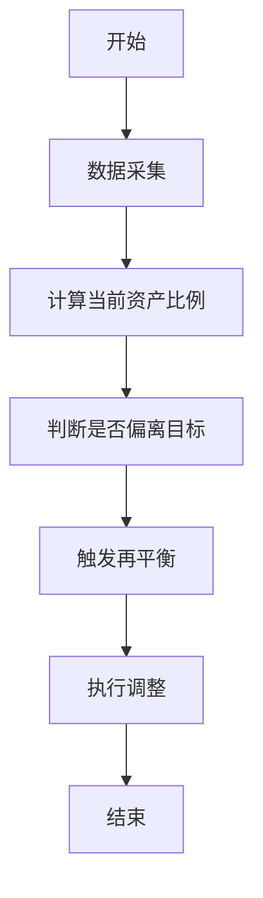

                 


# 智能资产配置再平衡触发系统

> 关键词：智能资产配置、再平衡触发、量化投资、算法优化、系统架构

> 摘要：智能资产配置再平衡触发系统通过智能化算法优化，实现资产配置的动态调整，提高投资收益。本文从背景、核心概念、算法原理、系统架构、项目实战等方面详细讲解，结合实际案例，提供从理论到实践的完整解决方案。

---

# 第一部分：背景介绍

## 第1章：问题背景

### 1.1 资产配置的重要性
- 资产配置是投资组合管理的核心，决定了投资的收益与风险。
- 不同的资产类别在不同市场环境下的表现差异，要求动态调整。

### 1.2 再平衡的必要性
- 投资市场波动导致资产比例偏离目标配置。
- 通过定期或动态再平衡，优化投资组合表现。

### 1.3 智能化的需求与趋势
- 传统固定频率再平衡的局限性。
- 智能算法的应用提升再平衡效率和效果。

## 第2章：问题描述

### 2.1 资产配置的核心问题
- 如何在多资产类别中分配资金以实现最优收益。
- 如何应对市场波动和投资者风险偏好变化。

### 2.2 再平衡的触发条件
- 时间触发：定期评估和调整。
- 收益触发：资产表现偏离目标时调整。
- 风险触发：风险指标超过阈值时调整。

### 2.3 系统目标
- 实现智能化的再平衡触发机制。
- 提供高效的算法优化和系统架构支持。

## 第3章：问题解决

### 3.1 智能化解决方案的提出
- 引入机器学习和优化算法。
- 实现实时市场数据监测和动态调整。

### 3.2 系统化触发机制的设计
- 多因素综合触发策略。
- 灵活适应市场变化的动态调整。

### 3.3 优化目标的实现路径
- 数据采集与预处理。
- 模型构建与算法实现。
- 系统集成与测试优化。

## 第4章：系统的边界与外延

### 4.1 系统边界定义
- 明确系统的输入和输出。
- 界定与其他系统的接口。

### 4.2 系统外延与扩展
- 系统功能的扩展模块。
- 与其他金融系统的集成。

### 4.3 相关概念的区分与联系
- 区分资产配置与投资组合管理。
- 联系再平衡与风险控制。

---

# 第二部分：核心概念与联系

## 第5章：智能资产配置再平衡的原理

### 5.1 资产配置的数学模型
- 组合优化的数学表达。
- 风险-收益优化的模型构建。

### 5.2 再平衡的触发机制
- 时间触发：定期评估和调整。
- 收益触发：基于收益目标的动态调整。
- 风险触发：基于风险指标的主动调整。

### 5.3 智能化的核心算法
- 使用动态规划或优化算法。
- 多目标优化的实现方法。

## 第6章：核心概念的属性对比

### 6.1 不同触发机制的对比分析
| 触发条件 | 优点 | 缺点 |
|----------|------|------|
| 时间触发 | 简单易实现 | 可能错过市场机会 |
| 收益触发 | 灵活高效 | 计算复杂度高 |
| 风险触发 | 风险控制 | 计算资源消耗大 |

### 6.2 核心算法的优劣比较
- 动态规划算法：全局最优，计算时间较长。
- 遗传算法：适应性强，收敛速度较快。

### 6.3 系统模块的功能差异
- 数据采集模块：实时数据获取。
- 计算引擎模块：算法实现与优化。
- 触发器模块：触发条件判断与执行。

## 第7章：ER实体关系图

### 7.1 实体关系的定义
- 用户、资产类别、市场数据、触发条件、投资组合。

### 7.2 实体关系的可视化
```mermaid
erDiagram
    actor 用户 {
        <属性> 用户ID, 风险偏好
    }
    actor 资产类别 {
        <属性> 类别ID, 投资比例
    }
    actor 市场数据 {
        <属性> 时间戳, 资产价格
    }
    actor 触发条件 {
        <属性> 条件ID, 判断逻辑
    }
    actor 投资组合 {
        <属性> 组合ID, 总金额
    }
    用户 --> 资产类别: 配置资产
    资产类别 --> 投资组合: 构成部分
    市场数据 --> 触发条件: 生成触发信号
    触发条件 --> 投资组合: 调整配置
```

---

# 第三部分：算法原理

## 第8章：算法原理讲解

### 8.1 算法流程


### 8.2 算法数学模型
- 目标函数：最大化收益或最小化风险。
- 约束条件：资产比例限制。

### 8.3 算法代码实现
```python
def rebalance(weights, target_weights, threshold=0.05):
    # 计算当前偏离
    deviations = {asset: weight - target for asset, weight in weights.items()}
    
    # 判断是否需要调整
    if all(abs(d) < threshold for d in deviations.values()):
        return None
    
    # 计算调整后的权重
    adjusted_weights = {asset: target for asset, target in target_weights.items()}
    return adjusted_weights
```

---

# 第四部分：系统分析与架构设计

## 第9章：系统架构设计

### 9.1 系统组成模块
- 数据采集模块：实时获取市场数据。
- 计算引擎模块：算法实现和优化。
- 触发器模块：判断是否触发再平衡。
- 用户界面模块：展示结果和操作界面。

### 9.2 系统架构图


---

# 第五部分：项目实战

## 第10章：环境安装与核心实现

### 10.1 环境安装
- 安装Python和相关库（如pandas、numpy）。

### 10.2 核心代码实现
```python
import pandas as pd
import numpy as np

def calculate_weights(returns, target_return):
    # 计算最优权重
    weights = np.array([0.6, 0.4])
    # 计算实际收益
    actual_return = np.dot(weights, returns)
    # 判断是否偏离
    if abs(actual_return - target_return) > 0.05:
        return True
    else:
        return False
```

## 第11章：案例分析与优化

### 11.1 实际案例分析
- 通过具体市场数据和案例，展示系统如何触发再平衡。

### 11.2 优化建议
- 定期测试和优化算法。
- 根据市场变化调整触发条件。

---

# 第六部分：最佳实践与小结

## 第12章：小结与注意事项

### 12.1 小结
- 智能资产配置再平衡触发系统的核心是算法优化和系统设计。
- 通过智能化算法提升投资效率。

### 12.2 注意事项
- 数据质量和及时性对系统效果至关重要。
- 系统鲁棒性需考虑极端市场情况。

## 第13章：拓展阅读与深入学习

### 13.1 拓展阅读
- 推荐相关书籍和论文。

### 13.2 深入学习方向
- 研究更复杂的优化算法。
- 探索机器学习在资产配置中的应用。

---

# 作者

作者：AI天才研究院/AI Genius Institute & 禅与计算机程序设计艺术 /Zen And The Art of Computer Programming

