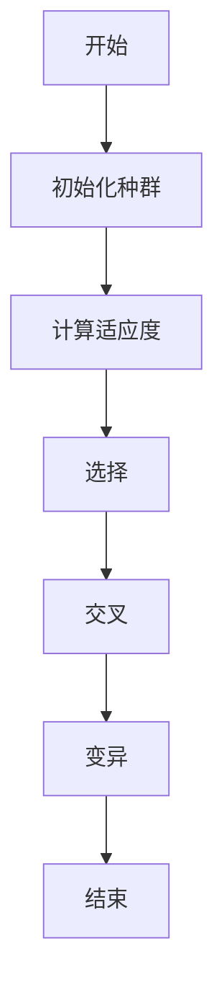
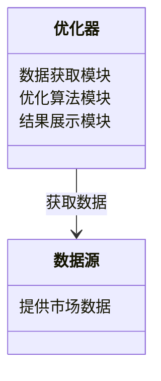

                 


# 智能资产配置策略动态优化器

## 关键词：
智能资产配置，动态优化器，优化算法，系统架构，项目实战

## 摘要：
本文详细介绍了智能资产配置策略动态优化器的设计与实现，从背景介绍、核心概念、算法原理到系统架构，再到项目实战，全面阐述了该优化器的工作原理和实际应用。通过本文，读者可以深入了解如何利用智能算法动态优化资产配置，提升投资收益并降低风险。

---

## 第一部分：智能资产配置策略动态优化器概述

### 第1章：智能资产配置策略动态优化器的背景与概念

#### 1.1 问题背景
智能资产配置策略动态优化器是一种利用智能算法动态调整资产配置的工具，旨在在不断变化的市场环境中优化投资组合。传统资产配置方法依赖于固定的模型，无法实时适应市场波动，而智能优化器通过动态调整，能够捕捉市场机会，降低风险。

#### 1.2 问题描述
资产配置的核心问题在于如何在不同资产之间分配资金，以实现收益最大化和风险最小化。传统方法往往基于历史数据和静态模型，难以应对市场环境的快速变化。动态优化器的目标是实时调整资产配置，以适应当前市场条件。

#### 1.3 问题解决
智能资产配置策略动态优化器通过智能算法（如遗传算法、粒子群优化）动态调整资产权重，实时优化投资组合。优化器能够根据市场数据和风险偏好，快速生成最优配置方案。

#### 1.4 边界与外延
优化器的适用范围包括股票、债券、基金等多种资产，支持多目标优化（如收益、风险）。与传统优化方法相比，智能优化器更具灵活性和适应性，但其性能依赖于数据质量和算法参数设置。

#### 1.5 核心要素组成
- **数据输入**：市场数据、用户风险偏好
- **智能算法**：遗传算法、粒子群优化
- **优化结果**：资产权重、收益预测

---

### 第2章：核心概念原理

#### 2.1 智能资产配置的原理
智能资产配置通过分析市场数据和投资者需求，动态调整资产权重。优化器实时监控市场变化，根据最新的数据重新计算最优配置。

#### 2.2 智能优化算法
常用的优化算法包括遗传算法（GA）和粒子群优化（PSO）。这些算法通过模拟自然进化或粒子运动，找到最优解。

#### 2.3 核心概念属性对比
表2-1：智能优化算法对比表

| 算法名称 | 特点 | 优点 | 缺点 |
|----------|------|------|------|
| 遗传算法 | 基于适应度函数的自然选择 | 全局搜索能力强 | 计算复杂度高 |
| 粒子群优化 | 基于粒子运动的群体智能 | 收敛速度快 | 易陷入局部最优 |

#### 2.4 ER实体关系图
图2-1：优化器实体关系图
```mermaid
er
actor
    投资者
        --> [提交] 请求
        <-- [返回] 结果
    优化器
        --> [获取] 数据
        <-- [反馈] 结果
    市场数据
        --> [提供] 数据
        <-- [请求] 更新
```

---

## 第二部分：智能资产配置策略动态优化器的算法原理

### 第3章：优化算法的实现

#### 3.1 算法原理
遗传算法和粒子群优化是两种常用算法。遗传算法通过适应度函数选择、交叉和变异操作生成新解；粒子群优化通过更新个体和全局最优解，引导粒子搜索最优解。

#### 3.2 算法实现
使用Python实现遗传算法：
```python
import random

def fitness(individual):
    # 计算收益与风险
    return -1 * (0.05 * sum(individual) - 0.02 * random variance(individual))

def mutate(individual):
    # 随机变异
    return [i if random.random() > 0.1 else 1 - i for i in individual]

def crossover(parent1, parent2):
    # 单点交叉
    point = random.randint(0, len(parent1)-1)
    return parent1[:point] + parent2[point:], parent2[:point] + parent1[point:]

# 初始化种群
population = [generate_individual() for _ in range(100)]
for _ in range(100):
    # 计算适应度
    population = sorted(population, key=fitness)
    # 选择
    selected = population[:50]
    # 交叉
    new_pop = []
    for i in range(0, len(selected), 2):
        p1, p2 = crossover(selected[i], selected[i+1])
        new_pop.append(p1)
        new_pop.append(p2)
    # 变异
    for ind in new_pop:
        mutate(ind)
    population = new_pop
```

#### 3.3 算法流程图


---

### 第4章：数学模型与公式

优化目标：最大化收益，最小化风险。

数学模型：
$$
\text{maximize} \quad \sum_{i=1}^{n} w_i r_i - \lambda \sum_{i=1}^{n} \sum_{j=1}^{n} w_i w_j \sigma_{i,j}
$$

约束条件：
$$
\sum_{i=1}^{n} w_i = 1
$$

其中：
- \( w_i \) 表示第i个资产的权重
- \( r_i \) 表示第i个资产的预期收益
- \( \sigma_{i,j} \) 表示第i和j个资产的协方差
- \( \lambda \) 表示风险厌恶系数

---

## 第三部分：系统分析与架构设计方案

### 第5章：问题场景介绍

#### 5.1 项目介绍
智能资产配置策略动态优化器旨在帮助投资者根据市场变化实时调整资产配置，提升收益并降低风险。

#### 5.2 系统功能设计
- 数据获取与处理
- 智能优化算法实现
- 结果展示与分析

#### 5.3 系统架构设计


---

## 第四部分：项目实战

### 第6章：环境安装与代码实现

#### 6.1 环境安装
- 安装Python和必要的库（如numpy、pandas）
- 安装优化算法库（如scipy）

#### 6.2 核心代码实现
```python
import numpy as np
from scipy.optimize import minimize

def portfolio_optimization(returns, weights=None):
    n = len(returns)
    if weights is None:
        weights = np.ones(n) / n
    def objective(weights):
        return - (weights.T @ returns @ weights)
    def constraint(weights):
        return np.sum(weights) - 1
    result = minimize(objective, weights, method='SLSQP', constraints={'type': 'eq', 'fun': constraint})
    return result.x
```

#### 6.3 代码解读与分析
上述代码实现了资产配置的优化，通过最小化目标函数，求解最优权重。使用scipy.optimize模块的SLSQP方法进行优化。

---

### 第7章：案例分析与详细讲解

#### 7.1 案例分析
以模拟股票投资组合为例，使用优化器调整资产权重，比较优化前后的收益与风险。

#### 7.2 实施步骤
1. 数据获取
2. 模型训练
3. 优化计算
4. 结果展示

---

## 第五部分：最佳实践与总结

### 第8章：最佳实践

#### 8.1 小结
智能资产配置策略动态优化器通过智能算法动态调整资产配置，显著提升了投资收益和风险管理能力。

#### 8.2 注意事项
- 数据的及时性和准确性
- 模型的可解释性
- 算法的收敛速度

#### 8.3 拓展阅读
建议深入学习强化学习在投资中的应用，探索更多优化算法。

---

## 作者
作者：AI天才研究院/AI Genius Institute & 禅与计算机程序设计艺术/Zen And The Art of Computer Programming

---

通过以上内容，您可以深入了解智能资产配置策略动态优化器的设计与实现，从理论到实践，全面掌握其工作原理和应用方法。

