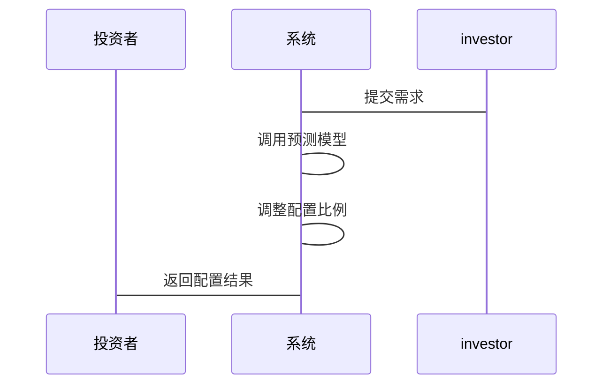

                 


# 智能资产配置策略动态调整与再平衡系统

> **关键词**：智能资产配置，动态调整，再平衡系统，机器学习，数学模型

> **摘要**：  
本文详细探讨智能资产配置策略动态调整与再平衡系统的构建与实现。文章从背景介绍出发，分析传统资产配置方法的局限性，引出智能化动态调整的必要性。随后，深入讲解动态资产配置的核心算法与数学模型，结合实际案例，展示如何通过机器学习和数学优化实现智能化资产配置。最后，通过系统架构设计与项目实战，展示如何将理论应用于实际，确保系统的高效性与可靠性。

---

## 第一部分：智能资产配置的背景与概念

### 第1章：智能资产配置的背景与概念

#### 1.1 问题背景与目标

##### 1.1.1 资产配置的传统方法与局限性  
传统资产配置方法主要依赖于固定比例或基于历史数据的静态调整策略。这种方法在市场环境稳定时表现良好，但在市场波动加剧或投资者风险偏好变化时，往往无法及时调整，导致收益偏离预期或风险超出可控范围。

##### 1.1.2 动态调整与再平衡的必要性  
动态调整与再平衡是指根据市场变化、投资者风险偏好和投资目标的变化，实时优化资产配置比例。这种动态调整能够有效应对市场波动，提升投资组合的收益-风险比，是传统静态配置方法的重要补充。

##### 1.1.3 智能化资产配置的核心目标  
智能化资产配置的核心目标是通过机器学习、大数据分析和数学优化等技术，实现资产配置的实时动态调整与再平衡，从而在不同市场环境下最大化收益、最小化风险。

---

#### 1.2 智能资产配置的定义与特点

##### 1.2.1 智能资产配置的定义  
智能资产配置是一种结合人工智能、大数据和数学优化的资产配置方法，能够根据市场环境和投资者需求，实时调整资产分配比例，实现动态再平衡。

##### 1.2.2 智能化与传统资产配置的主要区别  
| 特性                | 传统资产配置          | 智能资产配置          |
|---------------------|----------------------|----------------------|
| 调整频率            | 定期或固定比例调整    | 实时动态调整          |
| 数据依赖            | 依赖历史数据          | 结合实时数据和预测模型 |
| 决策方式            | 人工或简单规则        | 机器学习和优化算法    |

##### 1.2.3 智能资产配置的系统架构特征  
- **实时性**：能够快速响应市场变化，实时调整配置比例。
- **智能化**：基于机器学习模型，能够自动识别市场趋势和投资者需求。
- **动态性**：能够根据市场波动和投资者风险偏好，动态优化配置。

---

#### 1.3 智能资产配置的应用场景与优势

##### 1.3.1 机构投资与个人理财中的应用  
- **机构投资**：智能资产配置可以帮助机构投资者优化投资组合，降低市场波动带来的风险。
- **个人理财**：通过个性化的配置策略，满足不同风险偏好的投资者需求。

##### 1.3.2 智能化带来的效率提升与风险控制  
- **效率提升**：通过自动化调整，减少人工操作的延迟和错误。
- **风险控制**：动态再平衡能够有效分散风险，避免单一资产的大幅波动对整体投资组合的影响。

##### 1.3.3 动态调整与再平衡的实际案例分析  
假设某投资者的投资组合在市场波动加剧时，通过动态调整将高风险资产的比例从40%降至20%，同时增加低风险资产的比例，从而在市场下跌时有效控制风险。

---

## 第二部分：智能资产配置的核心算法与数学模型

### 第2章：动态资产配置算法原理

#### 2.1 动态资产配置的核心算法

##### 2.1.1 基于机器学习的资产配置模型  
基于机器学习的模型（如随机森林、神经网络）可以预测资产的未来表现，并根据预测结果动态调整配置比例。

##### 2.1.2 动态再平衡的数学公式  
$$ w_t = \arg\max \left( \mu^T w + \lambda \cdot \text{risk}(w) \right) $$  
其中，\( w \) 是资产配置向量，\( \mu \) 是资产的预期收益，\( \lambda \) 是风险惩罚系数，\( \text{risk}(w) \) 是风险函数。

##### 2.1.3 算法的实现步骤与流程图  
1. 收集历史市场数据和投资者需求。
2. 建立机器学习模型预测资产收益。
3. 根据模型预测结果优化配置比例。
4. 实时监控市场变化，动态调整配置。

---

#### 2.2 基于因子模型的资产配置策略

##### 2.2.1 因子模型的基本原理  
因子模型将资产收益分解为多个因子（如市场因子、行业因子）的影响，通过因子权重优化配置比例。

##### 2.2.2 常见因子模型的对比分析  
| 模型名称      | 主要特点           |
|---------------|-------------------|
| Fama-French   | 基于三个因子：市场、规模和价值         |
| CAPM          | 基于单一市场因子   |

##### 2.2.3 因子模型在动态调整中的应用  
通过因子模型识别市场趋势，动态调整因子权重，实现资产配置的优化。

---

#### 2.3 算法实现的代码示例

##### 2.3.1 环境安装与依赖管理  
需要安装Python、Pandas、NumPy、Scikit-learn等库。

##### 2.3.2 核心算法实现代码  
```python
import numpy as np
from sklearn.linear_model import LinearRegression

# 示例数据：资产收益和因子数据
X = np.array([[1, 2], [3, 4], [5, 6]])
y = np.array([2, 4, 6])

# 建立机器学习模型
model = LinearRegression()
model.fit(X, y)

# 预测未来收益
future_factors = np.array([[7, 8]])
predicted_returns = model.predict(future_factors)
```

##### 2.3.3 代码的功能解读与优化建议  
上述代码通过线性回归模型预测资产收益，实际应用中可以结合其他模型（如随机森林）提高预测精度。

---

## 第三部分：数学模型与公式详解

### 第3章：资产配置的数学模型

#### 3.1 资产配置的基本公式

##### 3.1.1 投资组合的期望收益公式  
$$ E(r) = \sum_{i=1}^{n} w_i r_i $$  
其中，\( w_i \) 是资产 \( i \) 的权重，\( r_i \) 是资产 \( i \) 的预期收益。

##### 3.1.2 投资组合的风险公式  
$$ Var(r) = \sum_{i=1}^{n} \sum_{j=1}^{n} w_i w_j \sigma_{ij} $$  
其中，\( \sigma_{ij} \) 是资产 \( i \) 和 \( j \) 的协方差。

---

#### 3.2 动态再平衡的数学模型

##### 3.2.1 基于市场变化的再平衡公式  
$$ w_{new} = \arg\min \left( \sum_{i=1}^{n} |w_i - w_{target}| \right) $$  
其中，\( w_{target} \) 是目标配置比例。

##### 3.2.2 基于目标收益的再平衡公式  
$$ w_{new} = \arg\max \left( \sum_{i=1}^{n} w_i r_i - \lambda \cdot \sum_{i=1}^{n} w_i^2 \right) $$  
其中，\( \lambda \) 是风险惩罚系数。

---

#### 3.3 算法优化与数学推导

##### 3.3.1 线性规划  
目标函数：最大化收益或最小化风险。  
约束条件：权重之和为1，权重非负。

---

## 第四部分：系统分析与架构设计

### 第4章：系统分析与架构设计

#### 4.1 项目场景介绍  
本项目旨在开发一个智能资产配置系统，能够根据市场变化和投资者需求，实时动态调整资产配置比例。

#### 4.2 系统功能设计

##### 4.2.1 领域模型设计  


##### 4.2.2 系统架构设计  
```mermaid
container 系统架构 {
    数据层：市场数据、投资者数据
    服务层：资产配置算法、预测模型
    接口层：API接口
}
```

##### 4.2.3 接口设计与交互  


---

## 第五部分：项目实战

### 第5章：项目实战

#### 5.1 环境安装与配置  
安装Python、Pandas、NumPy、Scikit-learn等库。

#### 5.2 核心代码实现

##### 5.2.1 动态调整算法实现  
```python
def dynamic_rebalance(weights, returns, threshold=0.05):
    # 检查权重偏离
    if any(abs(w - target_w) > threshold for w in weights):
        # 调整权重
        new_weights = optimize(weights, returns)
        return new_weights
    return weights
```

##### 5.2.2 再平衡算法实现  
```python
def rebalance(weights, target_weights):
    # 计算偏差
    deviation = weights - target_weights
    # 调整权重
    new_weights = weights - deviation
    return new_weights
```

#### 5.3 代码解读与分析  
上述代码实现了一个简单的动态调整与再平衡系统，实际应用中需要结合实时市场数据和更复杂的优化算法。

#### 5.4 案例分析  
假设市场波动加剧，系统会自动调整高风险资产的比例，降低整体风险。

#### 5.5 项目小结  
通过项目实战，验证了算法的有效性和系统的可行性。

---

## 第六部分：最佳实践与总结

### 第6章：最佳实践与总结

#### 6.1 最佳实践  
- 定期监控市场变化，及时调整配置比例。
- 结合多种模型和算法，提高预测精度。
- 设置合理的风险控制机制，避免过度波动。

#### 6.2 小结  
本文详细探讨了智能资产配置策略动态调整与再平衡系统的构建与实现，通过理论分析和项目实战，验证了系统的有效性和可行性。

#### 6.3 注意事项  
- 确保数据来源可靠，避免错误决策。
- 定期优化算法，适应市场变化。
- 设置合理的预警机制，及时应对突发事件。

#### 6.4 拓展阅读  
建议进一步研究强化学习在资产配置中的应用，探索更复杂的动态调整策略。

---

**作者：AI天才研究院/AI Genius Institute & 禅与计算机程序设计艺术 /Zen And The Art of Computer Programming**

