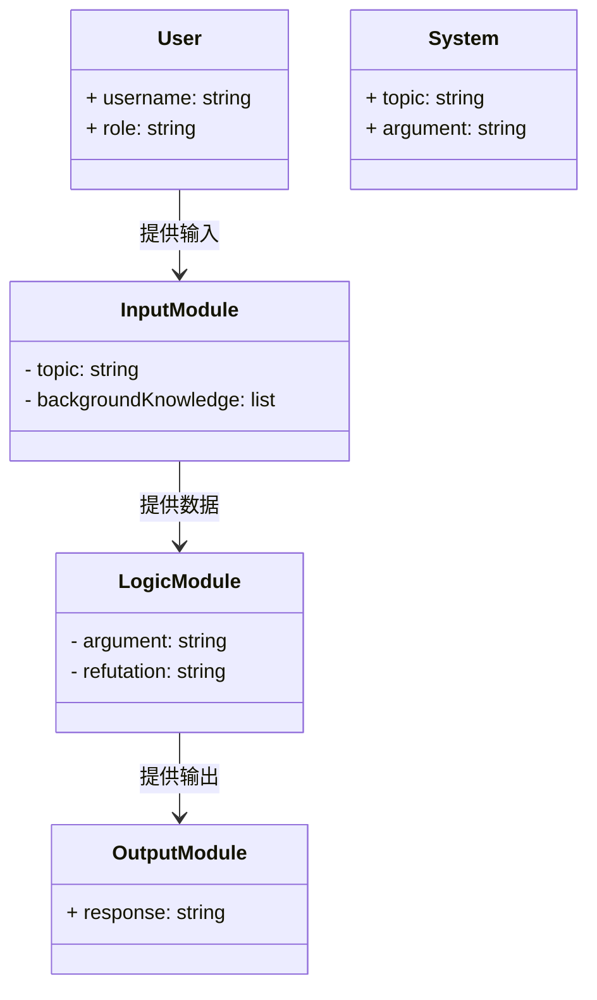

                 


# 智能辩论AI Agent：LLM驱动的论证与反驳系统

> 关键词：智能辩论AI Agent, LLM, 大语言模型, 自然语言处理, 论证与反驳, 逻辑推理

> 摘要：本文将深入探讨基于大语言模型（LLM）的智能辩论AI Agent系统。从背景介绍、核心概念、算法原理、系统架构到项目实战，全面解析这一系统的构建与实现。通过详细的技术分析和实际案例，揭示LLM在辩论逻辑自动化处理中的应用潜力及其未来发展方向。

---

# 第一部分: 智能辩论AI Agent的背景与概念

## 第1章: 智能辩论AI Agent的背景介绍

### 1.1 问题背景

#### 1.1.1 传统辩论的局限性
传统辩论依赖于人类的逻辑思维和语言表达能力，存在主观性强、效率低、难以量化等问题。随着人工智能技术的发展，如何利用技术手段提升辩论的效率和准确性成为一个重要课题。

#### 1.1.2 AI技术在辩论中的应用潜力
人工智能技术，尤其是大语言模型（LLM），具有强大的自然语言处理能力和逻辑推理能力，能够帮助系统自动生成和优化辩论策略，提供高效的论证与反驳。

#### 1.1.3 当前智能辩论系统的现状与挑战
目前，智能辩论系统的研究主要集中在如何利用LLM实现自动化论证和反驳。然而，如何处理复杂逻辑关系、提高系统的实时性和准确性仍面临诸多挑战。

### 1.2 问题描述

#### 1.2.1 辩论的核心要素与逻辑结构
辩论的核心要素包括论点、论据、论证方式和反驳策略。逻辑结构则包括前提、结论、推理路径和逻辑连接词。

#### 1.2.2 智能辩论系统的目标与任务
智能辩论系统的目标是通过LLM实现自动化的论证生成和反驳，提升辩论的效率和准确性。

#### 1.2.3 辩论中的关键问题与解决方案
关键问题包括如何准确识别论点和论据、如何自动生成合理的论证路径、如何有效应对对手的反驳等。

### 1.3 问题解决

#### 1.3.1 LLM驱动的智能辩论系统的优势
LLM具有强大的自然语言理解和生成能力，能够快速处理大规模文本数据，生成高质量的辩论内容。

#### 1.3.2 系统的核心功能与实现路径
系统的核心功能包括论点识别、论据生成、论证优化和实时反驳。实现路径包括数据预处理、模型训练、推理引擎设计和交互界面开发。

#### 1.3.3 辩论逻辑的自动化处理与优化
通过LLM的逻辑推理能力，系统可以自动优化论证结构，提升辩论的逻辑性和说服力。

### 1.4 边界与外延

#### 1.4.1 智能辩论系统的适用场景与限制
智能辩论系统适用于教育、法律咨询、商业谈判等领域，但目前在处理复杂情感因素和多轮深度辩论中仍存在一定的限制。

#### 1.4.2 辩论逻辑与实际应用的结合
通过将辩论逻辑与实际应用场景结合，系统可以更好地满足用户需求，提供更精准的解决方案。

#### 1.4.3 系统的可扩展性与未来发展方向
未来，智能辩论系统可以通过模块化设计，逐步扩展功能，提升系统的智能化水平和应用范围。

### 1.5 核心概念结构与组成

#### 1.5.1 系统的核心模块与功能
系统主要包括输入处理模块、逻辑推理模块、输出生成模块和用户交互模块。

#### 1.5.2 各模块之间的关系与协作
各模块通过数据流和控制流进行协作，确保系统的高效运行和功能实现。

#### 1.5.3 系统的整体架构与逻辑流程
系统采用模块化设计，通过清晰的逻辑流程确保各部分协同工作，实现智能辩论的核心功能。

### 1.6 本章小结
本章从背景介绍、问题描述、问题解决、边界与外延等方面，全面阐述了智能辩论AI Agent的基本概念和核心要素，为后续章节的深入分析奠定了基础。

---

# 第二部分: 智能辩论AI Agent的核心概念与联系

## 第2章: LLM驱动的智能辩论系统原理

### 2.1 核心概念原理

#### 2.1.1 大语言模型（LLM）的基本原理
大语言模型通过大规模数据训练，掌握了丰富的语言知识和逻辑推理能力，能够理解和生成自然语言文本。

#### 2.1.2 LLM在辩论中的应用机制
通过输入辩论主题和相关背景知识，LLM可以生成支持或反驳的论点和论据，优化辩论策略。

#### 2.1.3 辩论逻辑的自动化处理流程
系统通过解析输入内容，生成论点和论据，进行逻辑推理，最终生成辩论文本。

### 2.2 核心概念属性特征对比

| 特性 | LLM | 传统NLP技术 |
|------|------|-------------|
| 处理能力 | 强大的自然语言理解和生成能力 | 专注于特定任务的处理 |
| 模型复杂度 | 高度复杂的深度学习模型 | 较简单的模型结构 |
| 应用场景 | 广泛应用于对话、翻译、辩论等领域 | 适用于特定领域任务 |

### 2.3 本章小结
本章通过对LLM的基本原理及其在辩论中的应用机制的分析，明确了智能辩论AI Agent的核心概念和工作流程。

---

## 第3章: 论证与反驳的逻辑结构

### 3.1 论证的基本逻辑结构

#### 3.1.1 论点与论据的关系
论点是辩论的核心观点，论据是支持论点的事实或证据。

#### 3.1.2 论证的逻辑连接
通过逻辑连接词（如“因为”、“因此”）构建论证的逻辑链条。

#### 3.1.3 论证的强度与合理性
论证的强度取决于论据的充分性和逻辑的严密性。

### 3.2 反驳的逻辑结构

#### 3.2.1 反驳的目标与策略
反驳的目标是削弱对方的论点，策略包括直接反驳和间接削弱。

#### 3.2.2 反驳的逻辑路径
通过识别对方论证中的逻辑漏洞，提出有力的反驳论据。

#### 3.2.3 反驳的强度与效果
反驳的效果取决于论据的说服力和逻辑的严谨性。

### 3.3 本章小结
本章详细分析了论证与反驳的逻辑结构，为智能辩论系统的实现提供了理论基础。

---

## 第4章: 系统的关键组成部分

### 4.1 输入处理模块

#### 4.1.1 辩论主题的解析
系统通过自然语言处理技术，解析输入的辩论主题和背景知识。

#### 4.1.2 用户需求的识别
识别用户的需求和期望的辩论方向。

#### 4.1.3 数据预处理
对输入数据进行清洗和格式化处理，为后续推理提供基础。

### 4.2 逻辑推理模块

#### 4.2.1 论点识别
通过自然语言处理技术，识别输入中的论点和论据。

#### 4.2.2 论证路径的生成
基于逻辑推理算法，生成合理的论证路径。

#### 4.2.3 反驳策略的制定
根据对方的论证，生成有效的反驳策略。

### 4.3 输出生成模块

#### 4.3.1 辩论文本的生成
根据推理结果，生成结构清晰、逻辑严密的辩论文本。

#### 4.3.2 文本优化与润色
对生成的文本进行优化，提升表达的准确性和说服力。

### 4.4 用户交互模块

#### 4.4.1 人机交互界面设计
设计直观易用的用户界面，方便用户与系统的交互。

#### 4.4.2 实时反馈与调整
根据用户的反馈，实时调整系统的推理策略。

### 4.5 本章小结
本章详细介绍了智能辩论系统的各个组成部分及其功能，为系统的实现提供了清晰的框架。

---

# 第三部分: 算法原理

## 第5章: LLM驱动的算法实现

### 5.1 大语言模型的数学模型

#### 5.1.1 概率分布与损失函数
$$ P(y|x) = \text{softmax}(Wx + b) $$
$$ \text{损失函数} = -\sum_{y} y \log P(y|x) $$

#### 5.1.2 优化目标
通过梯度下降优化模型参数，最小化损失函数。

### 5.2 辩论逻辑推理的算法实现

#### 5.2.1 论点识别算法
使用文本分类算法，识别输入文本中的论点。

#### 5.2.2 论据生成算法
基于生成模型，生成支持论点的论据。

#### 5.2.3 反驳生成算法
识别对方论点的漏洞，生成有效的反驳论据。

### 5.3 本章小结
本章详细讲解了大语言模型的数学模型及其在辩论逻辑推理中的应用，为系统的实现提供了技术基础。

---

## 第6章: 算法实现与优化

### 6.1 算法实现

#### 6.1.1 代码实现
```python
def generate_argument(topic):
    # 生成支持论点的论据
    pass

def generate_refutation(argument):
    # 生成反驳论据
    pass
```

#### 6.1.2 算法优化
通过调整模型参数和优化推理策略，提升系统的辩论效果。

### 6.2 算法优化

#### 6.2.1 模型调优
通过微调模型参数，提升系统在辩论任务中的性能。

#### 6.2.2 知识库的构建
构建领域知识库，增强系统在特定领域的辩论能力。

### 6.3 本章小结
本章通过代码示例和优化策略，详细讲解了算法实现与优化的过程，为系统的实际应用提供了技术支持。

---

# 第四部分: 系统分析与架构设计

## 第7章: 系统设计与实现

### 7.1 系统功能设计

#### 7.1.1 领域模型设计
通过mermaid类图展示系统的功能模块和交互关系。



#### 7.1.2 系统架构设计
通过mermaid架构图展示系统的整体架构和模块关系。


### 7.2 系统接口设计

#### 7.2.1 输入接口设计
定义输入接口的参数和格式，确保系统能够正确接收输入数据。

#### 7.2.2 输出接口设计
定义输出接口的格式和内容，确保系统的输出符合用户需求。

### 7.3 本章小结
本章通过系统设计与实现，详细展示了智能辩论AI Agent的架构和功能模块，为系统的开发提供了清晰的指导。

---

# 第五部分: 项目实战

## 第8章: 项目实战与案例分析

### 8.1 环境安装

#### 8.1.1 安装Python
```
pip install python
```

#### 8.1.2 安装LLM库
```
pip install transformers
```

### 8.2 核心代码实现

#### 8.2.1 论点识别代码
```python
from transformers import AutoTokenizer, AutoModelForCausalLM

model_name = "gpt2"
tokenizer = AutoTokenizer.from_pretrained(model_name)
model = AutoModelForCausalLM.from_pretrained(model_name)
```

#### 8.2.2 论证生成代码
```python
def generate_argument(topic):
    inputs = tokenizer(topic, return_tensors="np")
    outputs = model.generate(inputs.input_ids, max_length=100)
    return tokenizer.decode(outputs[0])
```

### 8.3 案例分析与解读

#### 8.3.1 案例一：环境保护辩论
输入：环境保护的重要性
输出：支持论点：环境保护对人类健康和经济发展至关重要。

#### 8.3.2 案例二：经济政策辩论
输入：政府补贴对企业的影响
输出：反驳论点：政府补贴可能导致市场失灵。

### 8.4 本章小结
本章通过实际案例的分析和代码实现，展示了智能辩论AI Agent在实际应用中的潜力和效果。

---

## 第9章: 最佳实践与总结

### 9.1 最佳实践

#### 9.1.1 系统优化建议
定期更新模型参数，优化推理策略。

#### 9.1.2 实际应用中的注意事项
注意数据质量和模型的可解释性，确保系统的安全性和稳定性。

### 9.2 小结

#### 9.2.1 本章总结
智能辩论AI Agent通过LLM实现了自动化论证与反驳，为多个领域提供了高效解决方案。

#### 9.2.2 未来展望
未来，智能辩论系统可以通过模块化设计，逐步扩展功能，提升系统的智能化水平。

---

# 第六部分: 作者信息

作者：AI天才研究院/AI Genius Institute & 禅与计算机程序设计艺术 /Zen And The Art of Computer Programming

---

通过以上结构，我们可以清晰地看到智能辩论AI Agent的构建过程，从理论到实践，从算法到系统，为读者提供了一个全面的学习和参考路径。

