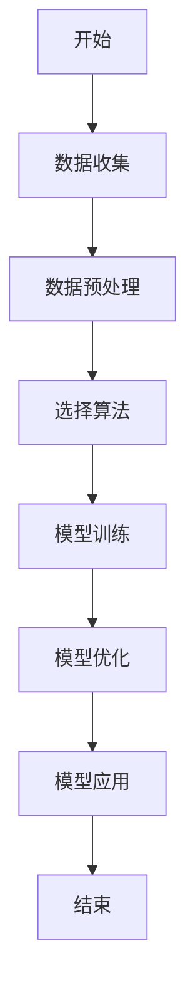
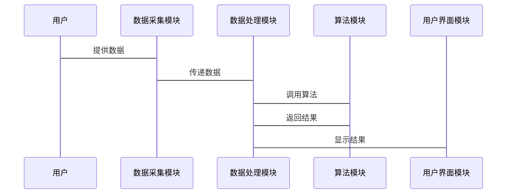
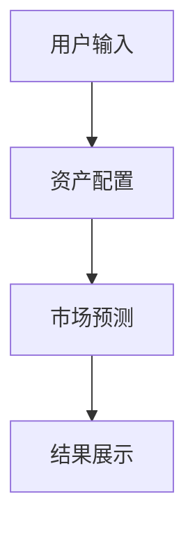

                 


# 智能退休收入规划动态调整器

> 关键词：智能退休规划、动态调整器、人工智能、投资组合优化、财务规划

> 摘要：本文详细介绍了智能退休收入规划动态调整器的设计与实现，结合人工智能技术，提出了一种基于动态规划和机器学习的退休收入规划方法。通过系统架构设计、算法实现和项目实战，展示了如何利用智能技术优化退休收入规划，实现动态调整。

---

## 第1章 智能退休收入规划概述

### 1.1 退休收入规划的核心概念

#### 1.1.1 退休收入规划的基本定义
退休收入规划是指通过合理的资产配置和投资策略，确保在退休期间获得稳定的收入来源，以维持生活质量。传统的退休规划通常基于静态模型，难以应对市场波动和个体需求的变化。

#### 1.1.2 动态调整器的核心功能
动态调整器是一种智能化工具，能够根据市场环境和个人财务状况的变化，实时优化退休收入规划。它通过动态调整资产配置和投资组合，确保退休收入的可持续性。

#### 1.1.3 智能技术在退休规划中的应用
人工智能和大数据技术的快速发展，为退休收入规划提供了新的可能性。通过机器学习算法，动态调整器可以分析海量数据，预测市场趋势，并制定最优的投资策略。

### 1.2 动态调整器的背景与需求

#### 1.2.1 传统退休规划的局限性
传统退休规划通常基于固定的投资组合和假设，难以应对实际中的不确定性。例如，市场波动、通货膨胀和寿命延长等因素可能导致收入不足。

#### 1.2.2 智能技术的应用潜力
智能技术能够实时监测市场变化和个体需求，动态调整退休收入规划。通过机器学习和大数据分析，动态调整器可以提供更加精准和个性化的建议。

#### 1.2.3 动态调整器的目标与意义
动态调整器的目标是通过智能化手段，帮助用户在退休期间保持稳定的收入来源。其意义在于解决了传统退休规划的静态问题，提高了规划的灵活性和适应性。

### 1.3 本章小结

---

## 第2章 智能退休收入规划的理论基础

### 2.1 生命周期理论与退休规划

#### 2.1.1 生命周期理论概述
生命周期理论认为，个人在不同的人生阶段有不同的储蓄和消费模式。在退休阶段，个体需要依靠前期积累的资产来维持生活。

#### 2.1.2 生命周期理论在退休规划中的应用
通过生命周期理论，可以制定个性化的退休储蓄计划，确保在退休期间有足够的收入来源。

#### 2.1.3 生命周期理论对动态调整器的启示
动态调整器可以根据生命周期理论，动态调整资产配置，以应对不同人生阶段的需求变化。

### 2.2 投资组合理论与退休收入规划

#### 2.2.1 投资组合理论的基本原理
投资组合理论通过分散投资，降低风险并提高收益。动态调整器可以通过调整投资组合，优化退休收入的稳定性。

#### 2.2.2 投资组合理论在退休规划中的应用
通过投资组合理论，可以制定不同的资产配置策略，以适应不同的市场环境和个人需求。

#### 2.2.3 投资组合理论对动态调整器的影响
动态调整器可以通过投资组合理论，优化资产配置，提高退休收入的稳定性。

### 2.3 动态调整的数学模型

#### 2.3.1 动态规划的基本原理
动态规划是一种通过分解问题，找到最优解的方法。在退休规划中，动态规划可以用于优化资产配置和投资组合。

#### 2.3.2 动态规划在退休规划中的应用
通过动态规划，可以制定最优的资产分配策略，以应对市场波动和个体需求变化。

#### 2.3.3 动态调整器的数学模型
动态调整器的数学模型可以通过动态规划和机器学习算法实现，优化退休收入的规划。

### 2.4 本章小结

---

## 第3章 智能退休收入规划动态调整器的核心算法

### 3.1 动态规划算法

#### 3.1.1 动态规划算法的基本原理
动态规划算法通过分解问题，找到最优解。在退休规划中，动态规划可以用于优化资产配置和投资组合。

#### 3.1.2 动态规划算法在退休规划中的应用
通过动态规划算法，可以制定最优的资产分配策略，以应对市场波动和个体需求变化。

#### 3.1.3 动态规划算法的实现步骤
1. 确定目标函数和约束条件。
2. 分解问题，找到子问题的最优解。
3. 组合子问题的最优解，得到全局最优解。

### 3.2 机器学习算法

#### 3.2.1 机器学习算法的基本原理
机器学习算法通过数据训练，找到模式和规律。在退休规划中，机器学习可以用于预测市场趋势和优化投资组合。

#### 3.2.2 机器学习算法在退休规划中的应用
通过机器学习算法，可以预测市场波动，制定动态的资产配置策略。

#### 3.2.3 机器学习算法的实现步骤
1. 数据收集与预处理。
2. 模型训练与优化。
3. 模型应用与调整。

### 3.3 算法实现的具体步骤

#### 3.3.1 算法流程图


#### 3.3.2 核心算法的数学模型
动态规划的目标函数可以表示为：
$$ \max_{x} \sum_{t=1}^{T} f(x_t, u_t) $$
其中，\( x_t \) 表示状态，\( u_t \) 表示控制变量。

### 3.4 本章小结

---

## 第4章 系统架构与设计

### 4.1 系统架构设计

#### 4.1.1 系统模块划分
智能退休收入规划动态调整器系统可以划分为数据采集模块、数据处理模块、算法模块和用户界面模块。

#### 4.1.2 系统架构图


#### 4.1.3 模块交互流程


### 4.2 数据处理与特征工程

#### 4.2.1 数据预处理
数据预处理包括数据清洗、特征提取和数据归一化。

#### 4.2.2 数据特征工程
特征工程通过选择关键特征，提高模型的准确性和鲁棒性。

#### 4.2.3 数据处理流程
1. 数据清洗：处理缺失值和异常值。
2. 特征提取：选择对退休规划影响较大的特征。
3. 数据归一化：标准化数据，便于模型训练。

### 4.3 系统功能设计

#### 4.3.1 功能模块划分
系统功能模块包括用户信息输入、资产配置优化、市场预测和结果展示。

#### 4.3.2 功能流程图


#### 4.3.3 系统功能实现
1. 用户信息输入：收集用户的财务状况和退休目标。
2. 资产配置优化：根据算法，优化资产配置。
3. 市场预测：预测市场趋势，调整投资组合。
4. 结果展示：展示优化后的退休收入规划。

### 4.4 本章小结

---

## 第5章 项目实战与实现

### 5.1 项目环境搭建

#### 5.1.1 开发工具安装
安装Python、Jupyter Notebook和相关库（如pandas、numpy、scikit-learn）。

#### 5.1.2 数据集准备
收集和整理相关数据，包括市场数据和个人财务数据。

### 5.2 核心代码实现

#### 5.2.1 数据预处理代码
```python
import pandas as pd
import numpy as np

# 数据加载
data = pd.read_csv('retire_data.csv')

# 数据清洗
data.dropna(inplace=True)
data = data[~data['age'].isnull()]
```

#### 5.2.2 算法实现代码
```python
from sklearn.linear_model import LinearRegression

# 模型训练
model = LinearRegression()
model.fit(X_train, y_train)

# 模型预测
y_pred = model.predict(X_test)
```

#### 5.2.3 结果展示代码
```python
import matplotlib.pyplot as plt

# 绘制结果
plt.plot(y_true, y_pred)
plt.xlabel('True Values')
plt.ylabel('Predictions')
plt.show()
```

### 5.3 项目测试与优化

#### 5.3.1 测试环境配置
配置测试环境，确保代码运行正常。

#### 5.3.2 测试用例设计
设计测试用例，验证系统的功能和性能。

#### 5.3.3 系统优化
根据测试结果，优化算法和系统性能。

### 5.4 本章小结

---

## 第6章 总结与展望

### 6.1 实现过程中的经验和教训

#### 6.1.1 关键经验
在项目实施过程中，数据预处理和算法选择是非常重要的环节。

#### 6.1.2 问题与教训
在数据处理和算法优化过程中，遇到了一些问题，如数据缺失和模型过拟合。

### 6.2 未来的发展方向

#### 6.2.1 智能化与个性化
未来，动态调整器可以进一步智能化和个性化，提供更加精准的退休规划。

#### 6.2.2 多因素分析
引入更多的因素，如通货膨胀和税收政策，进一步优化退休收入规划。

#### 6.2.3 技术创新
结合新的技术，如区块链和云计算，提升系统的安全性和效率。

### 6.3 本章小结

---

## 作者

作者：AI天才研究院/AI Genius Institute & 禅与计算机程序设计艺术 /Zen And The Art of Computer Programming

---

通过以上内容，我们可以看到，智能退休收入规划动态调整器的设计与实现是一个复杂而重要的任务。通过结合人工智能和大数据技术，动态调整器能够帮助用户在退休期间实现收入的动态优化。希望本文能够为相关领域的研究和实践提供有价值的参考。

