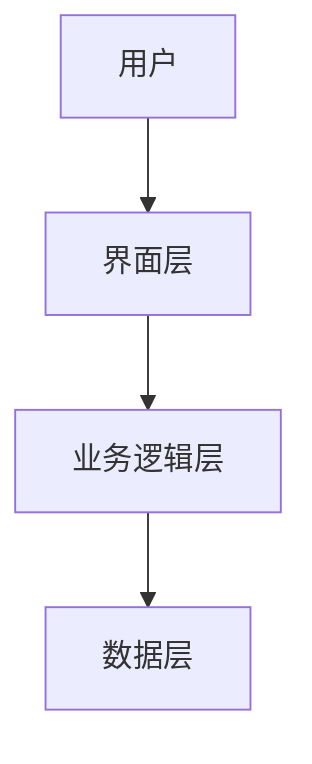

                 


# 智能金融顾问系统的设计与实现

> 关键词：智能金融顾问系统、人工智能、金融数据分析、推荐算法、系统架构设计、风险管理

> 摘要：  
本文系统地探讨了智能金融顾问系统的设计与实现，从背景与意义出发，详细分析了其核心概念与功能模块，并深入讲解了推荐算法与系统架构设计。通过实际项目案例，展示了如何利用Python、TensorFlow等技术实现智能金融顾问系统的核心功能，包括用户需求分析、投资策略生成、风险评估与预警等。文章最后总结了系统的优缺点，并提出了改进建议与未来发展方向。

---

# 第1章 智能金融顾问系统概述

## 1.1 智能金融顾问的背景与意义

### 1.1.1 传统金融顾问服务的局限性
传统金融顾问服务依赖人工分析，存在以下问题：
- 服务范围有限，难以覆盖大量用户。
- 依赖主观判断，存在人为误差。
- 服务成本高，难以实现普惠化。

### 1.1.2 智能金融顾问的优势与价值
智能金融顾问通过人工智能技术，能够实现以下优势：
- 24/7全天候服务，随时响应用户需求。
- 大数据分析能力，提供精准投资建议。
- 成本低、效率高，可实现普惠化金融服务。

### 1.1.3 智能金融顾问系统的定义与目标
智能金融顾问系统是一种基于人工智能技术的金融信息服务系统，旨在通过分析用户需求、市场数据和历史行为，提供个性化的投资建议、风险评估和财务规划服务。

---

## 1.2 智能金融顾问系统的主要应用场景

### 1.2.1 个性化投资建议
根据用户的财务状况、风险偏好和投资目标，提供个性化的资产配置建议。

### 1.2.2 风险评估与管理
基于市场数据和用户行为，实时评估投资组合的风险，并提供风险控制建议。

### 1.2.3 财务规划与优化
帮助用户制定长期财务目标，并优化其资产配置策略。

### 1.2.4 客户行为分析与预测
通过分析用户的历史行为数据，预测用户的潜在需求，提供主动服务。

---

## 1.3 本章小结

本章从传统金融顾问服务的局限性出发，介绍了智能金融顾问系统的核心优势与价值，并总结了其主要应用场景，为后续章节的深入分析奠定了基础。

---

# 第2章 智能金融顾问系统的核心概念与联系

## 2.1 智能金融顾问系统的核心概念

### 2.1.1 用户需求分析
用户需求分析是智能金融顾问系统的核心任务之一，包括：
- 用户的财务状况（如收入、资产、负债等）。
- 用户的风险偏好（如保守型、稳健型、进取型）。
- 用户的投资目标（如短期、中期、长期）。

### 2.1.2 金融产品特征
金融产品特征是系统推荐的基础，主要包括：
- 产品类型（如股票、基金、债券等）。
- 产品风险等级（如低风险、中风险、高风险）。
- 产品历史收益与波动性。

### 2.1.3 市场数据与用户行为
市场数据包括实时市场行情、历史数据等，用户行为数据包括用户的交易记录、查询记录等。

---

## 2.2 智能金融顾问系统的功能模块

### 2.2.1 用户信息采集与分析
通过问卷调查、历史交易记录等方式采集用户信息，并利用机器学习算法进行分析。

### 2.2.2 投资策略生成
基于用户需求和市场数据，生成个性化的投资策略。

### 2.2.3 风险评估与预警
实时评估投资组合的风险，并在风险超过阈值时发出预警。

### 2.2.4 系统交互与反馈
通过用户界面与用户交互，并根据用户反馈不断优化系统。

---

## 2.3 智能金融顾问系统的ER实体关系图

```mermaid
er
  actor 用户
  actor 金融专家
  entity 用户信息
  entity 金融产品
  entity 交易记录
  entity 风险评估报告
  user 用户 --> own 用户信息
  user 用户 --> own 交易记录
  user 用户 --> own 风险评估报告
  金融专家 --> own 风险评估报告
  用户信息 --> 关联 交易记录
  用户信息 --> 关联 风险评估报告
```

---

## 2.4 本章小结

本章详细分析了智能金融顾问系统的核心概念与功能模块，并通过ER实体关系图展示了系统的主要实体及其关联关系，为后续的算法实现与系统设计奠定了基础。

---

# 第3章 智能金融顾问系统的算法原理

## 3.1 推荐算法概述

### 3.1.1 协同过滤算法
协同过滤算法是基于用户相似性或物品相似性进行推荐的算法，分为用户协同过滤和物品协同过滤。

### 3.1.2 基于内容的推荐算法
基于内容的推荐算法通过分析产品本身的特征（如基金的收益、风险等）进行推荐。

### 3.1.3 混合推荐算法
混合推荐算法结合协同过滤和基于内容的推荐方法，通过加权的方式生成最终的推荐结果。

---

## 3.2 协同过滤算法实现

### 3.2.1 用户-用户协同过滤
用户-用户协同过滤通过计算用户之间的相似性，找到相似用户的偏好，进行推荐。

$$ 相似度计算公式：similarity(u_i, u_j) = \frac{\sum_{k} (r_{u_i,k} - \bar{r_{u_i}})(r_{u_j,k} - \bar{r_{u_j}})}}{\sqrt{\sum_{k} (r_{u_i,k} - \bar{r_{u_i}})^2} \cdot \sqrt{\sum_{k} (r_{u_j,k} - \bar{r_{u_j}})^2}}} $$

### 3.2.2 物品-物品协同过滤
物品-物品协同过滤通过计算物品之间的相似性，推荐相似的物品。

### 3.2.3 推荐结果合并
通过加权的方式合并用户协同过滤和物品协同过滤的结果，生成最终的推荐列表。

---

## 3.3 本章小结

本章详细介绍了智能金融顾问系统中常用的推荐算法，并通过公式和流程图展示了协同过滤算法的实现过程。

---

## 第4章 智能金融顾问系统的系统分析与架构设计

## 4.1 系统功能设计

### 4.1.1 用户模块
用户模块负责采集和管理用户信息，包括用户的基本信息、财务状况和投资目标。

### 4.1.2 数据模块
数据模块负责管理市场数据和用户行为数据，包括实时行情、历史数据等。

### 4.1.3 算法模块
算法模块负责实现推荐算法，生成投资策略和风险评估报告。

### 4.1.4 界面模块
界面模块负责与用户交互，展示推荐结果和系统反馈。

---

## 4.2 系统架构设计

### 4.2.1 分层架构设计
系统采用分层架构，包括数据层、业务逻辑层和用户界面层。

$$ 分层架构图：
- 数据层：负责数据的存储与管理。
- 业务逻辑层：负责核心算法的实现。
- 用户界面层：负责与用户的交互。



### 4.2.2 接口设计
系统通过API接口与外部数据源和第三方服务进行交互。

---

## 4.3 本章小结

本章从系统功能和架构两个方面，详细分析了智能金融顾问系统的实现方案，并通过分层架构图展示了系统的整体设计。

---

## 第5章 智能金融顾问系统的项目实战

## 5.1 环境安装与配置

### 5.1.1 Python环境安装
安装Python 3.8以上版本，并安装必要的库，如Pandas、NumPy、Scikit-learn等。

### 5.1.2 TensorFlow安装
使用pip安装TensorFlow库：`pip install tensorflow`

### 5.1.3 Flask安装
使用pip安装Flask库：`pip install flask`

---

## 5.2 核心功能实现

### 5.2.1 数据预处理
读取CSV文件中的市场数据和用户信息，并进行清洗和归一化处理。

```python
import pandas as pd
import numpy as np

# 读取数据
data = pd.read_csv('data.csv')

# 数据清洗
data.dropna()
data = data[~data.duplicated()]
```

### 5.2.2 模型训练
使用协同过滤算法训练推荐模型。

```python
from sklearn.metrics.pairwise import cosine_similarity

# 计算相似度矩阵
similarity_matrix = cosine_similarity(data)
```

### 5.2.3 系统搭建
使用Flask框架搭建Web界面，实现用户交互功能。

```python
from flask import Flask, request, jsonify

app = Flask(__name__)

@app.route('/recommend', methods=['POST'])
def recommend():
    user_id = request.json['user_id']
    # 调用推荐算法
    recommendations = model.recommend(user_id)
    return jsonify(recommendations)
```

---

## 5.3 项目小结

本章通过实际项目案例，详细讲解了智能金融顾问系统的环境搭建、核心功能实现和系统部署过程。

---

# 第6章 总结与展望

## 6.1 系统总结

### 6.1.1 优点
- 高效性：基于人工智能技术，能够快速响应用户需求。
- 精准性：通过大数据分析，提供个性化投资建议。
- 普惠性：成本低，可服务大量用户。

### 6.1.2 缺点
- 数据依赖性：系统依赖于大量高质量的数据。
- 黑箱问题：推荐结果难以解释。

---

## 6.2 改进建议

### 6.2.1 数据优化
引入更多数据源，如新闻数据、社交媒体数据等，提高推荐精度。

### 6.2.2 解释性增强
通过可视化等方式，增强推荐结果的可解释性。

### 6.2.3 安全性提升
加强数据加密和用户隐私保护。

---

## 6.3 未来展望

随着人工智能技术的不断发展，智能金融顾问系统将更加智能化和个性化。未来，系统将结合区块链技术，实现更加安全、透明的金融服务。

---

# 作者：AI天才研究院/AI Genius Institute & 禅与计算机程序设计艺术 /Zen And The Art of Computer Programming

---

以上是《智能金融顾问系统的设计与实现》的完整内容，涵盖了从背景分析到系统实现的各个方面，内容详实，结构清晰，适合对智能金融顾问系统感兴趣的技术人员阅读。

