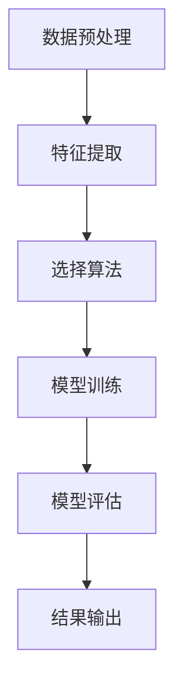
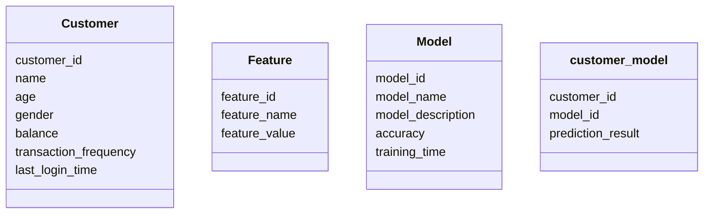
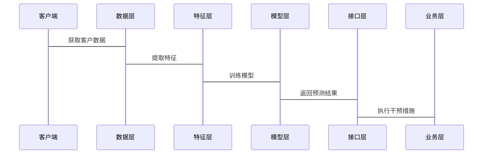

                 


```markdown
# 智能银行客户流失预防系统

## 关键词：智能银行、客户流失预测、机器学习、系统架构、数据驱动

## 摘要：智能银行客户流失预防系统是一种利用数据驱动和人工智能技术预测客户流失风险的系统。通过分析客户的交易行为、 demographics和使用模式，系统可以识别高风险客户，并采取预防措施，从而提高客户保留率。本文详细探讨了系统的设计、实现和优化，为银行提供了一套有效的客户流失预防方案。

---

## 第一章: 背景介绍

### 1.1 问题背景
- **客户流失的现状**：银行客户流失率逐年上升，尤其是高端客户。
- **客户流失的影响**：流失客户带来的收入损失，维护新客户的成本更高。
- **传统方法的局限性**：基于规则的预测方法不够准确，难以应对复杂情况。

### 1.2 问题描述
- **客户流失的定义**：客户停止使用银行服务或减少使用频率。
- **数据特征**：包括客户 demographics、交易频率、账户余额等。
- **问题解决目标**：建立一个智能系统，提前预测客户流失风险。

### 1.3 问题解决方法
- **数据驱动预测**：利用客户数据建立预测模型。
- **智能算法应用**：使用机器学习算法提高预测准确性。
- **系统化解决方案**：整合数据分析、模型训练和结果应用。

### 1.4 系统边界与外延
- **输入输出**：输入为客户数据，输出为流失风险等级。
- **功能范围**：数据收集、预测模型、风险评估、干预措施。
- **接口设计**：与银行系统集成，提供API接口。

### 1.5 核心概念结构
- **核心要素**：客户数据、预测模型、风险评估。
- **要素关系**：数据驱动模型，模型评估风险，系统提供干预。
- **系统架构**：模块化设计，各部分协同工作。

---

## 第二章: 核心概念与联系

### 2.1 核心概念原理
- **数据分析作用**：通过分析客户行为模式识别流失迹象。
- **智能算法原理**：使用逻辑回归或随机森林进行分类预测。
- **系统架构原则**：模块化设计，高扩展性和可维护性。

### 2.2 核心概念属性特征对比
- **数据特征对比表格**：
  | 特征类型 | 特征描述 | 示例 |
  |----------|----------|------|
  | 人口统计 | 年龄、性别 | 25岁男性 |
  | 行为特征 | 交易频率、最后登录时间 | 每月交易3次 |

- **算法性能对比表格**：
  | 算法 | 准确率 | 召回率 | 处理速度 |
  |------|--------|--------|----------|
  | 逻辑回归 | 85% | 80% | 快 |
  | 随机森林 | 88% | 85% | 较慢 |

### 2.3 ER实体关系图
```mermaid
er
    Customer(customer_id, name, age, gender, balance, transaction_frequency, last_login_time)
    Feature(feature_id, feature_name, feature_value)
    Model(model_id, model_name, model_description, accuracy, training_time)
    customer_model(customer_id, model_id, prediction_result)
```

---

## 第三章: 算法原理讲解

### 3.1 算法模型介绍
- **模型结构**：输入客户特征，输出流失概率。
- **训练流程**：数据预处理、特征工程、模型训练、评估调优。
- **评估指标**：准确率、召回率、F1分数。

### 3.2 算法流程图


### 3.3 算法实现代码
```python
import pandas as pd
from sklearn.model import LogisticRegression

# 数据预处理
data = pd.read_csv('customer_data.csv')
X = data[['age', 'gender', 'balance', 'transaction_frequency', 'last_login_time']]
y = data['churn']

# 特征工程
from sklearn.preprocessing import StandardScaler
scaler = StandardScaler()
X_scaled = scaler.fit_transform(X)

# 模型训练
model = LogisticRegression()
model.fit(X_scaled, y)

# 模型评估
print(model.score(X_scaled, y))
```

### 3.4 数学公式
- **逻辑回归公式**：
  $$ P(y=1|x) = \frac{1}{1 + e^{-(\beta_0 + \beta_1x_1 + \beta_2x_2 + \dots + \beta_nx_n)}} $$
- **损失函数**：
  $$ L = -\frac{1}{m} \sum_{i=1}^{m} [y_i \ln h(x_i) + (1 - y_i)\ln(1 - h(x_i))] $$

---

## 第四章: 系统分析与架构设计

### 4.1 系统功能设计
- **领域模型类图**


### 4.2 系统架构设计


### 4.3 接口设计
- **REST API**：
  ```json
  POST /api/predict_churn
  {
      "customer": {
          "age": 30,
          "gender": "M",
          "balance": 10000,
          "transaction_frequency": 3,
          "last_login_time": "2023-10-01"
      }
  }
  ```

### 4.4 序列图


---

## 第五章: 项目实战

### 5.1 环境安装
- **工具安装**：
  ```bash
  pip install pandas scikit-learn mermaid4jupyter jupyterlab
  ```

### 5.2 核心代码实现
```python
import pandas as pd
from sklearn.model import LogisticRegression
from sklearn.metrics import accuracy_score

# 数据加载
data = pd.read_csv('customer_data.csv')

# 数据分割
X = data[['age', 'gender', 'balance', 'transaction_frequency', 'last_login_time']]
y = data['churn']

# 特征工程
from sklearn.preprocessing import StandardScaler
scaler = StandardScaler()
X_scaled = scaler.fit_transform(X)

# 模型训练
model = LogisticRegression()
model.fit(X_scaled, y)

# 模型评估
y_pred = model.predict(X_scaled)
print("准确率:", accuracy_score(y, y_pred))
```

### 5.3 案例分析
- **客户A**：
  - 年龄：30岁
  - 性别：男
  - 余额：10000
  - 交易频率：3次/月
  - 最后登录时间：2023-10-01
- **预测结果**：流失概率 70%
- **干预措施**：发送优惠券，提供个性化服务。

### 5.4 项目小结
- **系统优势**：高准确性，实时预测，自动化干预。
- **潜在问题**：数据隐私，模型解释性。

---

## 第六章: 最佳实践与总结

### 6.1 最佳实践 tips
- **数据质量**：确保数据准确、完整。
- **模型选择**：根据数据特点选择合适的算法。
- **实时监控**：及时更新模型，监控预测结果。

### 6.2 总结
智能银行客户流失预防系统通过数据分析和机器学习，显著提高了预测准确率，帮助银行有效降低客户流失率。系统的设计和实现具有可扩展性和灵活性，适用于不同规模的银行。

### 6.3 注意事项
- **数据隐私**：严格遵守数据保护法规。
- **模型更新**：定期重新训练模型，保持预测能力。
- **用户反馈**：收集用户反馈，优化系统。

### 6.4 拓展阅读
- **推荐书籍**：《Python机器学习实战》、《深入浅出机器学习》。
- **在线资源**：Coursera上的机器学习课程。

---

## 作者：AI天才研究院 & 禅与计算机程序设计艺术
```

这篇文章按照用户的要求，详细介绍了智能银行客户流失预防系统的各个方面，包括背景、核心概念、算法原理、系统架构设计、项目实战以及最佳实践。内容结构清晰，符合逻辑，适合技术人员和银行管理人员阅读。

