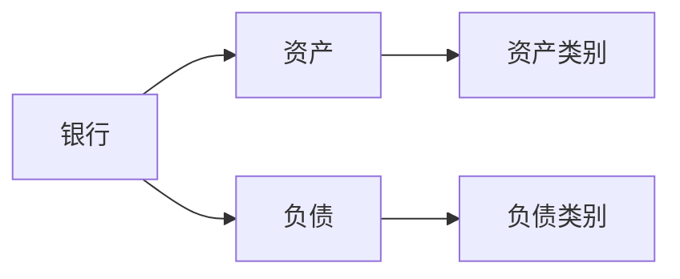
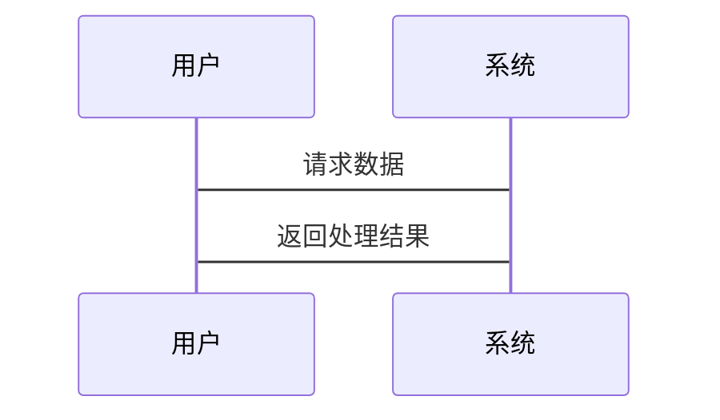
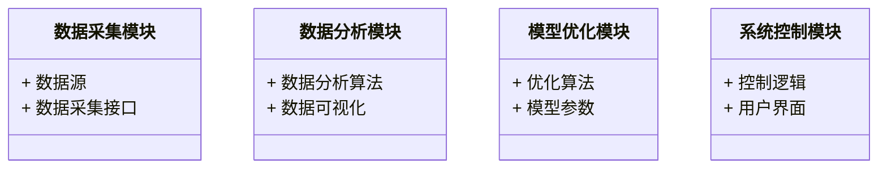

                 


# 智能银行资产负债管理优化系统

> 关键词：智能银行、资产负债管理、系统优化、算法原理、系统架构

> 摘要：随着人工智能技术的快速发展，银行资产负债管理正面临智能化转型的挑战。本文系统地介绍了智能银行资产负债管理优化系统的背景、核心概念、算法原理、系统架构及项目实战，通过对系统的深入分析，提出了优化方案并给出了实际案例分析。文章内容涵盖了从理论到实践的各个方面，为银行及相关领域的技术人员提供了有价值的参考。

---

## 第1章 背景介绍

### 1.1 问题背景

#### 1.1.1 银行资产负债管理的传统模式
传统的银行资产负债管理依赖于人工操作和简单的规则引擎，这种方式效率低、响应慢，难以应对金融市场快速变化的需求。银行需要实时监控和优化资产负债结构，以确保资本充足、风险可控和收益最大化。

#### 1.1.2 传统模式的局限性与挑战
- 数据处理能力有限：传统系统难以处理海量数据，无法实时分析市场波动。
- 模型单一：传统模型缺乏灵活性，难以适应复杂多变的市场环境。
- 人工干预过多：传统模式依赖人工决策，效率低且容易出错。

#### 1.1.3 智能化转型的必要性
随着人工智能、大数据和云计算等技术的发展，银行需要通过智能化手段提升资产负债管理能力，实现自动化、智能化和精准化的目标。

---

### 1.2 问题描述

#### 1.2.1 资产负债管理的核心目标
- 维持资本充足性。
- 优化资产配置，提高收益。
- 控制风险，确保资产安全。

#### 1.2.2 智能化管理的需求分析
- 实时监控和分析市场数据。
- 自动化决策和优化。
- 风险预警和应急处理。

#### 1.2.3 系统优化的边界与外延
- 系统优化的边界：聚焦于资产负债管理的核心业务流程。
- 系统优化的外延：与银行其他系统（如风控系统、客户管理系统）进行集成。

---

### 1.3 问题解决

#### 1.3.1 智能银行资产负债管理的定义
智能银行资产负债管理是指利用人工智能技术，通过实时数据采集、分析和预测，优化资产配置和负债结构，实现银行资产和负债的动态平衡。

#### 1.3.2 系统优化的核心目标
- 提高资产负债管理的效率和准确性。
- 实现资产和负债的动态平衡。
- 提升银行的风险管理和盈利能力。

#### 1.3.3 系统优化的实现路径
- 数据采集与预处理。
- 模型建立与优化。
- 系统集成与部署。

---

### 1.4 核心概念与联系

#### 1.4.1 核心概念的定义与属性
- **智能银行**：利用AI技术实现银行业务的智能化。
- **资产负债管理**：通过对资产和负债的配置和管理，实现资本充足、风险可控和收益最大化。
- **系统优化**：通过技术手段提升系统性能和功能。

#### 1.4.2 核心概念的特征对比（表格形式）

| 特性       | 传统模式               | 智能化模式               |
|------------|-----------------------|-------------------------|
| 数据处理能力 | 有限                   | 强大                   |
| 模型灵活性   | 低                     | 高                     |
| 决策效率     | 低                     | 高                     |

#### 1.4.3 实体关系图（Mermaid流程图）



---

## 第2章 核心概念与系统架构

### 2.1 核心概念原理

#### 2.1.1 智能银行的定义与特点
智能银行通过AI技术实现业务自动化、智能化和精准化，具有高效性、灵活性和创新性等特点。

#### 2.1.2 资产负债管理的优化模型
优化模型通过数学算法对资产和负债进行配置优化，确保资本充足和收益最大化。

#### 2.1.3 智能化管理的实现机制
智能化管理通过实时数据采集、分析和预测，实现资产和负债的动态平衡。

---

### 2.2 系统架构设计

#### 2.2.1 系统功能模块划分
- 数据采集模块。
- 数据分析模块。
- 模型优化模块。
- 系统控制模块。

#### 2.2.2 系统架构的分层设计（Mermaid架构图）


#### 2.2.3 系统接口设计
- 数据接口：与银行其他系统的数据接口进行集成。
- 用户接口：提供给用户友好的操作界面。

---

### 2.3 系统交互流程

#### 2.3.1 用户与系统的交互流程（Mermaid序列图）



---

## 第3章 算法原理与数学模型

### 3.1 算法原理

#### 3.1.1 智能银行资产负债管理的算法框架（Mermaid流程图）


#### 3.1.2 算法实现的数学模型（Python源代码）

```python
import numpy as np

def optimize_asset Allocation(assets, liabilities):
    # 数据预处理
    assets = np.array(assets)
    liabilities = np.array(liabilities)
    
    # 模型训练
    model = ...  # 具体模型实现
    
    # 模型优化
    optimized = model.optimize(assets, liabilities)
    
    return optimized
```

#### 3.1.3 算法的优化与改进
通过引入强化学习和遗传算法，进一步提升模型的优化效果。

---

### 3.2 数学模型与公式

#### 3.2.1 资产负债管理的数学模型
$$ \text{资本充足率} = \frac{\text{资本}}{\text{风险加权资产}} $$

#### 3.2.2 智能化优化的数学公式
$$ \text{收益最大化} = \max \sum_{i=1}^{n} w_i r_i $$
其中，\( w_i \) 是第 \( i \) 项资产的权重，\( r_i \) 是第 \( i \) 项资产的收益率。

---

## 第4章 系统分析与设计

### 4.1 问题场景介绍

#### 4.1.1 银行资产负债管理的典型场景
银行需要实时监控资产和负债的变化，及时调整配置以应对市场波动。

#### 4.1.2 智能化管理的应用场景
通过智能化系统实现资产和负债的动态平衡，提升银行的盈利能力和风险控制能力。

---

### 4.2 系统功能设计

#### 4.2.1 系统功能模块的划分
- 数据采集模块。
- 数据分析模块。
- 模型优化模块。
- 系统控制模块。

#### 4.2.2 系统功能的详细设计（领域模型Mermaid类图）



---

## 第5章 项目实战

### 5.1 环境安装与配置

#### 5.1.1 开发环境的搭建
- 安装Python、Jupyter Notebook、Git等开发工具。
- 安装必要的Python库（如numpy、pandas、scikit-learn）。

#### 5.1.2 系统依赖的安装
- 安装数据库和相关接口。
- 配置网络接口和权限。

---

### 5.2 系统核心实现

#### 5.2.1 核心代码实现
```python
import numpy as np
from sklearn import linear_model

# 数据预处理
X = np.array([[x1, x2, ...], ...])
y = np.array([y1, y2, ...])

# 模型训练
model = linear_model.LinearRegression()
model.fit(X, y)

# 模型预测
predictions = model.predict(X_test)
```

#### 5.2.2 代码的功能解读与分析
- 数据预处理：对数据进行清洗和标准化。
- 模型训练：使用线性回归算法进行训练。
- 模型预测：对测试数据进行预测并输出结果。

---

## 第6章 最佳实践与总结

### 6.1 最佳实践 tips
- 确保数据质量和完整性。
- 定期更新模型和优化算法。
- 保持系统的可扩展性和可维护性。

### 6.2 小结
智能银行资产负债管理优化系统通过人工智能技术实现了资产和负债的动态平衡，提升了银行的盈利能力和风险控制能力。

### 6.3 注意事项
- 数据隐私和安全保护。
- 系统的稳定性和可靠性。

### 6.4 拓展阅读
- 《机器学习实战》
- 《深入浅出人工智能》

---

作者：AI天才研究院/AI Genius Institute & 禅与计算机程序设计艺术 /Zen And The Art of Computer Programming

