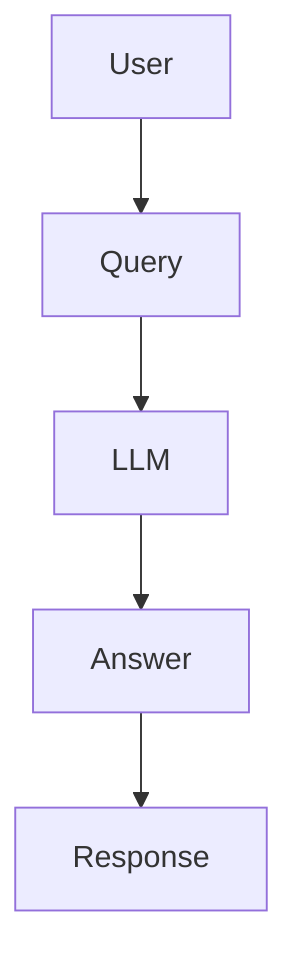
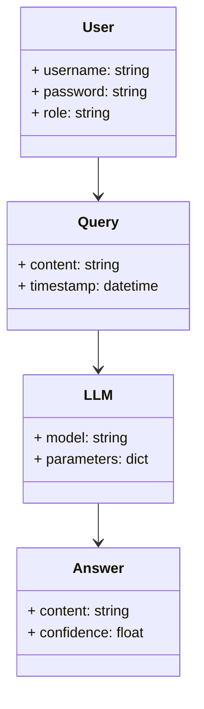

                 


# 智能问答系统AI Agent：基于LLM的精确信息检索

## 关键词：智能问答系统，AI Agent，大语言模型，信息检索，LLM

## 摘要：  
本文深入探讨了基于大语言模型（LLM）的智能问答系统AI Agent的设计与实现。从智能问答系统的背景、核心概念、算法原理到系统架构设计，再到项目实战与应用案例，本文详细分析了如何利用LLM实现精确的信息检索。文章内容涵盖理论与实践，适合技术开发者、研究人员以及对智能问答系统感兴趣的读者阅读。通过本文，读者将能够理解基于LLM的智能问答系统的实现原理，并掌握实际应用中的关键技术和最佳实践。

---

# 第1章: 智能问答系统AI Agent概述

## 1.1 智能问答系统的发展与现状

### 1.1.1 智能问答系统的定义  
智能问答系统是一种能够理解和回答用户问题的人工智能系统。通过自然语言处理（NLP）技术，系统能够解析用户的意图，并基于大规模数据进行推理和生成，最终提供准确的回答。

### 1.1.2 智能问答系统的核心特征  
- **理解能力**：能够解析用户的问题，识别意图和实体。
- **知识库支持**：依赖于丰富的知识库或上下文进行推理。
- **实时性**：能够快速响应用户的问题，提供实时答案。
- **自适应性**：能够根据用户反馈优化回答质量。

### 1.1.3 智能问答系统的主要应用场景  
- **客服系统**：解决用户的常见问题，提升客户满意度。
- **教育领域**：为学生提供学习辅导和问题解答。
- **企业内部查询**：帮助员工快速获取内部知识和政策信息。
- **智能家居**：通过语音助手实现生活信息查询。

---

## 1.2 AI Agent与智能问答系统的结合

### 1.2.1 AI Agent的基本概念  
AI Agent（人工智能代理）是一种智能实体，能够感知环境并采取行动以实现特定目标。在智能问答系统中，AI Agent负责接收用户输入、分析问题，并调用相应的服务来生成回答。

### 1.2.2 AI Agent在智能问答系统中的作用  
- **问题解析**：AI Agent通过NLP技术理解用户的问题。
- **信息检索**：基于LLM进行语义理解，从知识库中检索相关信息。
- **对话管理**：协调对话流程，确保回答的连贯性和准确性。

### 1.2.3 基于LLM的AI Agent的优势  
- **语义理解能力强**：LLM能够捕捉上下文中的深层语义信息。
- **动态知识库支持**：能够实时更新和学习新的知识。
- **多轮对话能力**：支持复杂的对话流程，提供更自然的交互体验。

---

## 1.3 基于LLM的智能问答系统的发展趋势

### 1.3.1 大语言模型在智能问答中的应用  
- **模型规模扩大**：通过训练更大的模型参数，提升问答系统的准确性。
- **多模态能力**：结合视觉、听觉等多模态信息，提供更丰富的交互体验。
- **个性化服务**：根据用户偏好和行为，提供定制化的回答。

### 1.3.2 精确信息检索的重要性  
- **信息检索的准确性**：直接影响用户对系统的信任度和满意度。
- **实时性和相关性**：用户希望得到最相关、最新的信息。
- **高效性**：快速响应用户的问题，提升用户体验。

### 1.3.3 未来智能问答系统的发展方向  
- **增强学习能力**：通过与用户的交互不断优化回答质量。
- **跨语言支持**：支持多语言问答，扩大用户群体。
- **边缘计算结合**：将智能问答系统部署在边缘设备上，提升响应速度。

---

# 第2章: 智能问答系统的核心概念与联系

## 2.1 智能问答系统的核心概念

### 2.1.1 信息检索模型  
信息检索模型是智能问答系统的核心模块，负责将用户的问题映射到知识库中的相关信息。常见的信息检索模型包括向量空间模型和BM25模型。

### 2.1.2 大语言模型（LLM）  
LLM是一种基于深度学习的NLP模型，能够生成高质量的文本，并理解复杂的语义关系。LLM在智能问答系统中用于生成回答和优化检索结果。

### 2.1.3 对话系统设计  
对话系统设计是智能问答系统的关键部分，负责管理对话流程，确保回答的连贯性和准确性。

---

## 2.2 核心概念之间的关系

### 2.2.1 信息检索模型与LLM的关系  
- **信息检索模型**：用于将用户的问题映射到知识库中的相关信息。
- **LLM**：用于生成高质量的回答，并优化检索结果的相关性。

### 2.2.2 对话系统与LLM的结合  
- **对话管理**：通过LLM生成回答，并根据用户反馈调整对话流程。
- **上下文理解**：LLM能够捕捉对话中的上下文信息，确保回答的连贯性。

### 2.2.3 精确信息检索与智能问答的关联  
- **精确检索**：确保用户得到最相关的信息，提升回答的准确性。
- **语义理解**：LLM通过语义理解，实现更精准的信息检索。

---

## 2.3 智能问答系统的ER实体关系图



---

# 第3章: 智能问答系统的算法原理

## 3.1 基于向量空间模型的算法

### 3.1.1 向量空间模型的基本原理  
向量空间模型将文本表示为向量，通过计算向量之间的相似度来衡量文本的相关性。

### 3.1.2 TF-IDF算法的实现  
TF-IDF（Term Frequency-Inverse Document Frequency）是一种常用的文本特征提取方法，用于衡量词项在文本中的重要性。

### 3.1.3 余弦相似度计算  
$$\text{余弦相似度} = \frac{\vec{A} \cdot \vec{B}}{|\vec{A}| |\vec{B}|}$$

---

## 3.2 基于BM25算法的信息检索

### 3.2.1 BM25算法的基本原理  
BM25是一种基于概率的文本检索算法，通过计算词项在文档中的概率来衡量相关性。

### 3.2.2 BM25算法的实现步骤  
1. 计算每个词项在文档中的概率。
2. 根据概率值对文档进行排序。
3. 返回相关性最高的文档。

### 3.2.3 BM25与向量空间模型的对比  
- **BM25**：基于概率模型，适用于小规模数据。
- **向量空间模型**：基于向量相似度，适用于大规模数据。

---

## 3.3 大语言模型的机制

### 3.3.1 LLM的基本工作原理  
LLM通过多层神经网络对文本进行编码和解码，生成高质量的回答。

### 3.3.2 梯度下降优化算法  
梯度下降是一种常用的优化算法，用于最小化模型的损失函数。

### 3.3.3 注意力机制的数学公式  
$$\text{注意力权重} = \text{softmax}(\frac{QK^T}{\sqrt{d}})$$

---

# 第4章: 智能问答系统的系统分析与架构设计

## 4.1 系统背景介绍

---

## 4.2 系统功能设计

### 4.2.1 领域模型类图  


### 4.2.2 系统架构图  


### 4.2.3 系统接口设计  
- **输入接口**：接收用户的查询请求。
- **输出接口**：返回生成的回答。

### 4.2.4 系统交互流程  
1. 用户输入问题。
2. 系统解析问题并调用LLM生成回答。
3. 回答返回给用户。

---

## 4.3 系统优化与实现

### 4.3.1 性能优化策略  
- **缓存机制**：减少重复查询，提升响应速度。
- **分布式架构**：通过分布式计算提升系统的处理能力。

### 4.3.2 系统实现细节  
- **数据存储**：使用数据库存储用户查询和回答记录。
- **日志管理**：记录系统运行日志，便于调试和优化。

---

## 4.4 系统测试与验证

### 4.4.1 测试用例设计  
- **功能测试**：验证系统的基本功能。
- **性能测试**：测试系统的响应速度和处理能力。
- **安全测试**：确保系统数据的安全性。

### 4.4.2 测试结果分析  
- **准确率**：系统回答的准确性。
- **响应时间**：系统处理请求的时间。

---

# 第5章: 智能问答系统AI Agent的项目实战

## 5.1 项目背景介绍

---

## 5.2 核心代码实现

### 5.2.1 信息检索模块  
```python
def search_engine(query, index, corpus):
    results = []
    for doc_id, doc in enumerate(corpus):
        similarity = cosine_similarity(query_vector, doc_vector)
        if similarity > threshold:
            results.append(doc)
    return results[:top_k]
```

### 5.2.2 对话管理模块  
```python
class DialogManager:
    def __init__(self):
        self.context = []
    
    def process_query(self, query):
        self.context.append(query)
        answer = self.llm.generate_answer(query)
        self.context.append(answer)
        return answer
```

---

## 5.3 项目优化与总结

### 5.3.1 优化策略  
- **模型优化**：使用更高效的模型减少计算成本。
- **数据优化**：增加多样化的训练数据。

### 5.3.2 项目总结  
- **项目成果**：实现了一个基于LLM的智能问答系统。
- **经验教训**：模型训练需要大量的优质数据，系统优化需要持续关注性能。

---

# 第6章: 智能问答系统AI Agent的最佳实践

## 6.1 最佳实践 tips  
- **数据质量**：确保训练数据的多样性和高质量。
- **模型选择**：根据需求选择合适的模型，平衡性能和成本。
- **用户体验**：注重交互设计，提升用户满意度。

## 6.2 未来展望  
随着AI技术的不断发展，智能问答系统将更加智能化和个性化。未来的智能问答系统将具备更强的语义理解和知识推理能力。

---

# 结语

通过本文的深入分析，读者可以全面了解基于LLM的智能问答系统AI Agent的设计与实现。从理论到实践，从算法到系统架构，本文为读者提供了丰富的知识和实用的指导。希望本文能够帮助技术开发者更好地理解和应用智能问答系统。

---

# 作者：AI天才研究院/AI Genius Institute & 禅与计算机程序设计艺术 /Zen And The Art of Computer Programming

