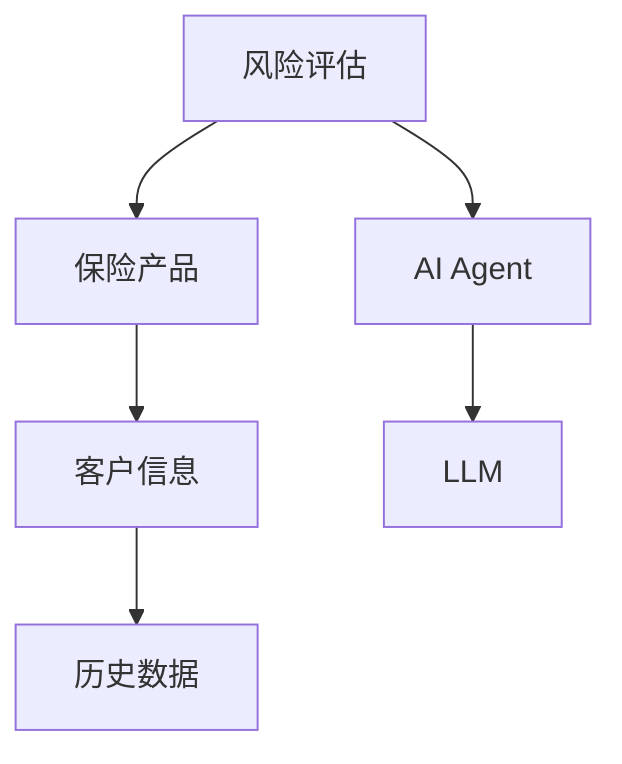
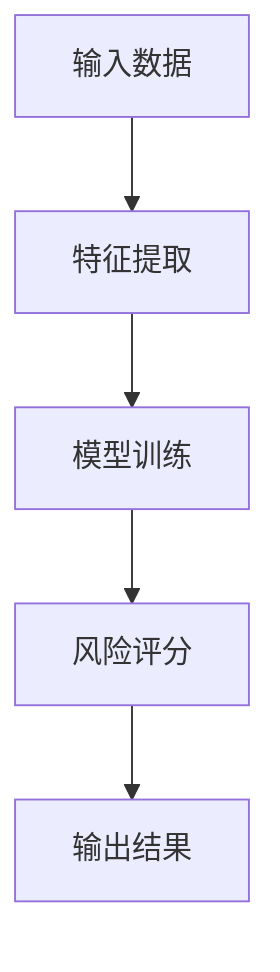
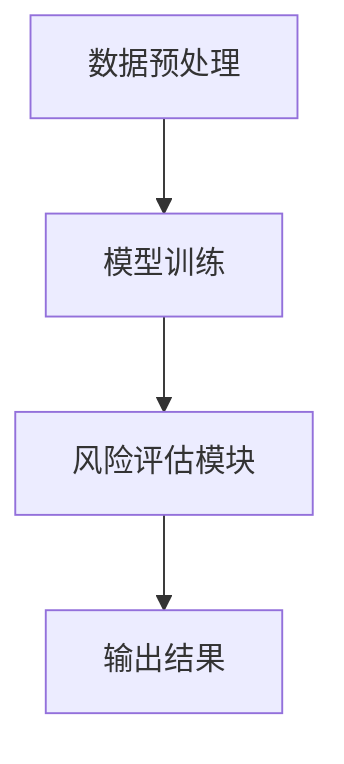

                 


# 智能风险评估 AI Agent：LLM 在保险行业中的应用

## 关键词：智能风险评估，AI Agent，LLM，保险行业，风险管理，人工智能

## 摘要：本文探讨了大语言模型（LLM）在保险行业智能风险评估中的应用。通过分析LLM的核心原理、系统架构设计、项目实战案例及最佳实践，本文为读者提供了从理论到实践的全面指南，帮助理解如何利用AI技术提升保险行业的风险管理能力。

---

## 第一部分: 智能风险评估 AI Agent 的基础与核心概念

### 第1章: 智能风险评估与 AI Agent 概述

#### 1.1 智能风险评估的定义与背景
智能风险评估是通过人工智能技术对潜在风险进行预测和评估的过程。传统风险评估依赖人工分析，效率低且主观性强，而智能风险评估借助AI技术，能够快速处理大量数据，提高评估的准确性和效率。

- **1.1.1 风险评估的传统方法**  
  传统风险评估方法包括问卷调查、历史数据分析等，但存在数据量小、覆盖范围有限、效率低等问题。

- **1.1.2 AI Agent 的概念与特点**  
  AI Agent（智能代理）是一种能够感知环境、自主决策并执行任务的智能系统。其特点包括自主性、反应性、主动性和社会性。

- **1.1.3 智能风险评估的核心要素**  
  智能风险评估的核心要素包括数据来源、模型算法、计算能力和决策机制。

#### 1.2 大语言模型（LLM）的定义与特点
大语言模型（LLM）是一种基于深度学习的自然语言处理模型，具有以下特点：
- **大规模数据训练**：使用海量数据进行训练，能够理解多种语言和复杂语境。
- **生成能力**：能够生成连贯且符合逻辑的文本。
- **上下文理解**：能够根据上下文理解用户需求并提供相关回答。

#### 1.3 LLM 在保险行业中的应用前景
- **保险行业的风险评估需求**  
  保险行业需要对客户、市场和产品进行风险评估，以制定合理的保险策略。
- **LLM 的潜在应用领域**  
  LLM 可以用于客户画像、风险预测、理赔评估等领域。
- **LLM 应用的挑战与机遇**  
  挑战包括数据隐私、模型解释性等问题；机遇则在于提高效率和准确性。

### 第2章: 智能风险评估的核心概念与联系

#### 2.1 核心概念原理
智能风险评估的核心概念包括：
- **风险评分**：通过模型计算客户或产品的风险评分。
- **风险分类**：将风险分为不同类别，以便制定差异化策略。

#### 2.2 概念属性特征对比表格
以下是风险评估方法的对比：

| 方法 | 优点 | 缺点 |
|------|------|------|
| 传统方法 | 简单易懂 | 效率低，覆盖面有限 |
| AI 方法 | 高效准确 | 技术复杂，成本高 |

#### 2.3 ER 实体关系图


---

## 第二部分: LLM 在保险风险评估中的算法原理

### 第3章: LLM 的工作流程与数学模型

#### 3.1 LLM 的工作流程


#### 3.2 数学模型与公式
- **风险评分公式**  
  $$ \text{风险评分} = \sum_{i=1}^{n} w_i \cdot x_i $$
  其中，$w_i$ 是权重，$x_i$ 是特征值。

- **概率计算公式**  
  $$ P(\text{风险发生}) = \frac{1}{1 + e^{-z}} $$
  其中，$z$ 是模型输出的线性组合。

---

## 第三部分: 系统分析与架构设计方案

### 第4章: 系统架构设计

#### 4.1 项目介绍
本项目旨在开发一个基于LLM的智能风险评估系统，用于保险行业的客户风险评估。

#### 4.2 系统功能设计
- **数据预处理模块**：对数据进行清洗和特征提取。
- **模型训练模块**：使用LLM训练风险评估模型。
- **风险评估模块**：根据模型输出风险评分。

#### 4.3 系统架构图


---

## 第四部分: 项目实战

### 第5章: 项目实战与案例分析

#### 5.1 环境安装
- 安装Python和相关库（如TensorFlow、Keras）。

#### 5.2 核心实现代码
```python
import tensorflow as tf
from tensorflow.keras import layers

model = tf.keras.Sequential()
model.add(layers.Dense(64, activation='relu', input_shape=(input_dim,)))
model.add(layers.Dense(1, activation='sigmoid'))
model.compile(optimizer='adam', loss='binary_crossentropy', metrics=['accuracy'])
```

#### 5.3 案例分析
通过实际案例分析，展示如何利用LLM进行客户风险评估。

---

## 第五部分: 最佳实践与总结

### 第6章: 最佳实践与总结

#### 6.1 经验总结
- 数据质量是关键。
- 模型解释性需重视。

#### 6.2 小结
本文详细介绍了LLM在保险行业智能风险评估中的应用，从理论到实践，为读者提供了全面的指导。

#### 6.3 注意事项
- 数据隐私需严格保护。
- 模型需定期更新。

#### 6.4 拓展阅读
推荐相关书籍和论文，供读者深入学习。

---

## 作者：AI天才研究院 & 禅与计算机程序设计艺术

感谢您的阅读！如需进一步探讨，欢迎关注我们的公众号或访问官方网站。

