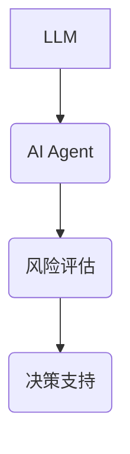
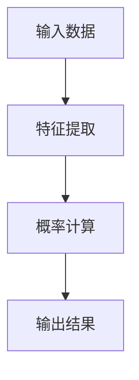
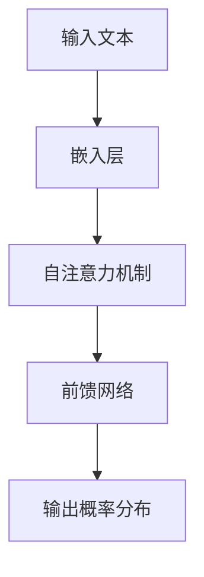
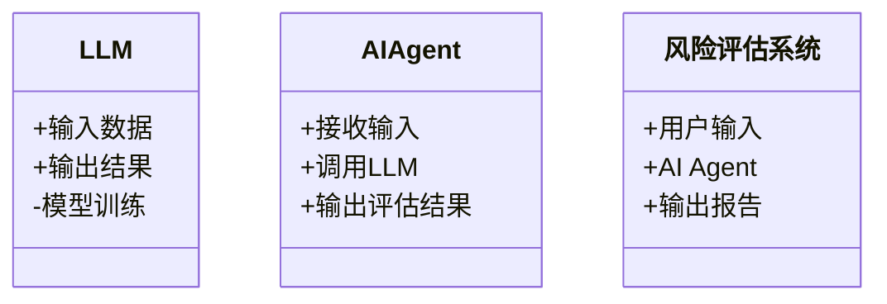
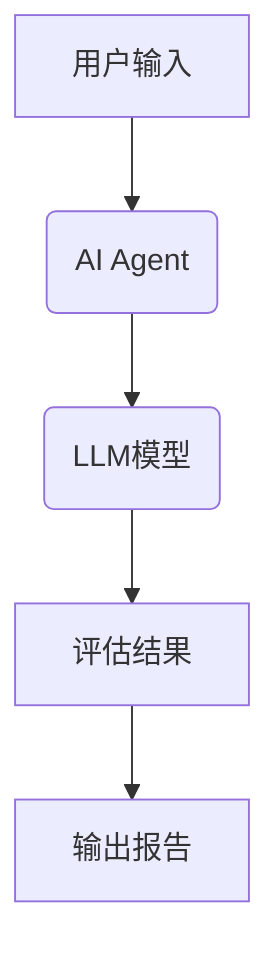
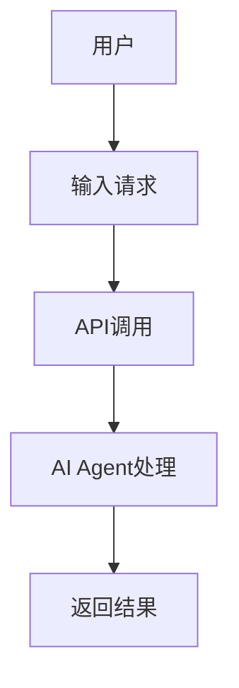

                 


# 智能风险评估AI Agent：LLM在复杂决策中的应用

> 关键词：智能风险评估，AI Agent，LLM，复杂决策，自然语言处理，风险评估系统

> 摘要：随着人工智能技术的迅速发展，LLM（Large Language Models）在复杂决策中的应用越来越广泛。本文将详细探讨智能风险评估AI Agent的核心概念、算法原理、系统架构以及实际应用案例，揭示LLM在风险评估中的独特优势和未来发展方向。

---

## 目录

### 第一部分: 智能风险评估AI Agent概述

#### 第1章: 智能风险评估与AI Agent的背景介绍

##### 1.1 问题背景与描述
- 1.1.1 风险评估的传统方法与局限性
  - 传统统计方法的局限性
  - 专家经验的局限性
- 1.1.2 AI技术在风险评估中的应用需求
  - 数据驱动的优势
  - 实时性与动态性需求
- 1.1.3 LLM在复杂决策中的独特优势
  - 大规模数据处理能力
  - 自然语言理解能力

##### 1.2 问题解决与边界
- 1.2.1 智能风险评估AI Agent的核心目标
  - 提供实时、动态的风险评估
  - 提供可解释的决策支持
- 1.2.2 解决方案的技术边界与外延
  - 数据范围与模型能力
  - 应用场景的限制
- 1.2.3 核心要素与组成结构分析
  - 数据输入、模型处理、结果输出的流程

#### 第2章: 智能风险评估AI Agent的核心概念与联系

##### 2.1 核心概念原理
- 2.1.1 LLM的基本原理
  - Transformer架构
  - 自注意力机制
- 2.1.2 AI Agent的定义与功能
  - 定义与角色
  - 主要功能模块
- 2.1.3 智能风险评估的实现机制
  - 数据处理流程
  - 模型推理过程

##### 2.2 核心概念对比分析
- 2.2.1 LLM与传统机器学习模型的对比
  - 模型复杂度与适用场景
  - 训练数据与计算资源需求
- 2.2.2 AI Agent与传统决策系统的区别
  - 自适应能力与实时性
  - 人机交互能力
- 2.2.3 智能风险评估与传统风险评估的差异
  - 数据来源与处理方式
  - 结果呈现与可解释性

##### 2.3 实体关系图


### 第二部分: LLM的算法原理与数学模型

#### 第3章: 算法原理

##### 3.1 算法原理


##### 3.2 数学模型
- 3.2.1 概率计算公式
  $$ P(y|x) = \frac{P(x|y)P(y)}{P(x)} $$
- 3.2.2 损失函数
  $$ L = -\sum_{i=1}^{n} y_i \log p(y_i) + (1 - y_i) \log (1 - p(y_i)) $$

##### 3.3 训练过程


### 第三部分: 系统分析与架构设计方案

#### 第4章: 系统分析与架构设计

##### 4.1 问题场景介绍
- 4.1.1 风险评估的典型场景
  - 金融投资风险
  - 企业信用评估
- 4.1.2 LLM在复杂决策中的应用场景
  - 情况分析
  - 方案制定

##### 4.2 系统功能设计


##### 4.3 系统架构设计


##### 4.4 接口设计与交互


### 第四部分: 项目实战

#### 第5章: 项目实战

##### 5.1 环境安装与配置
- 安装Python
- 安装必要的库（如TensorFlow、PyTorch）

##### 5.2 核心代码实现
```python
class RiskAssessmentAI:
    def __init__(self, model):
        self.model = model

    def assess_risk(self, input_text):
        result = self.model.generate(input_text)
        return result

# 示例用法
from transformers import AutoModelForCausalLM, AutoTokenizer

model_name = "facebook/llama2"
tokenizer = AutoTokenizer.from_pretrained(model_name)
model = AutoModelForCausalLM.from_pretrained(model_name)
agent = RiskAssessmentAI(model)

result = agent.assess_risk("Evaluate risk in this financial report")
print(result)
```

##### 5.3 案例分析
- 金融风险评估案例
  - 数据输入
  - 模型处理
  - 结果分析

##### 5.4 项目总结
- 成功经验
- 改进建议

### 第五部分: 最佳实践与展望

#### 第6章: 最佳实践

##### 6.1 小结
- 核心概念回顾
- 系统设计要点

##### 6.2 注意事项
- 数据质量的重要性
- 模型的可解释性
- 系统的实时性要求

##### 6.3 拓展阅读
- 推荐书籍与论文
- 行业动态与新技术

---

作者：AI天才研究院/AI Genius Institute & 禅与计算机程序设计艺术 /Zen And The Art of Computer Programming

