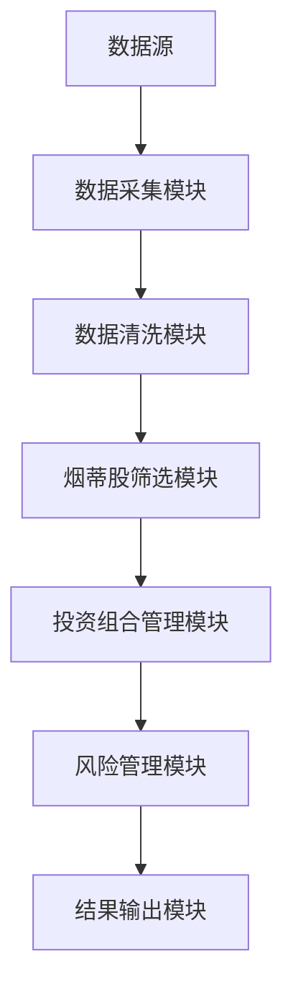
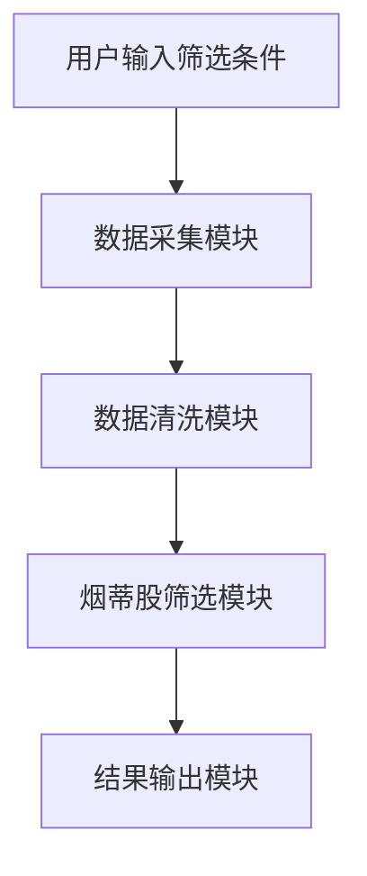

                 


# 本杰明·格雷厄姆的'烟蒂股'策略现代解读

---

## 关键词：烟蒂股、价值投资、本杰明·格雷厄姆、投资策略、现代解读

---

## 摘要：  
本杰明·格雷厄姆的烟蒂股策略是价值投资的重要组成部分，强调以低于内在价值的价格买入被市场忽视的优质股票。本文从烟蒂股的核心概念出发，结合现代市场环境，分析其在投资中的应用价值，并通过案例和系统设计，探讨其在当前市场中的优势与挑战。文章旨在为投资者提供一个全面的视角，帮助其在复杂多变的市场中运用烟蒂股策略实现长期稳健的投资回报。

---

## 第1章：烟蒂股策略的起源与核心思想

### 1.1 本杰明·格雷厄姆与价值投资的起源

#### 1.1.1 本杰明·格雷厄姆的生平简介  
本杰明·格雷厄姆（Benjamin Graham）是20世纪最具影响力的投资思想家之一，被誉为“价值投资之父”。他于1894年出生于英国伦敦，后移居美国，并在哥伦比亚大学获得了经济学博士学位。格雷厄姆的职业生涯始于1920年代，他与戴维·多德（David Dodd）共同开发了价值投资理论，并在1934年出版了经典著作《证券分析》（Security Analysis），奠定了价值投资的基础。

#### 1.1.2 价值投资理念的形成与核心思想  
格雷厄姆的价值投资理念的核心是：股票不仅仅是一个交易工具，而是一个企业的所有权证明。他强调以合理的估值买入股票，并长期持有，直到其内在价值被市场充分反映。这种投资理念与传统的投机性交易形成了鲜明对比，为后来的投资者提供了长期稳健的投资方法。

---

### 1.2 烟蒂股策略的定义与特点

#### 1.2.1 烟蒂股的定义与核心要素  
烟蒂股（Nifty Stock）是指那些被市场忽视、价格远低于其内在价值的股票。这类股票通常具有以下特征：  
- **低估值**：市盈率（P/E）和市净率（P/B）远低于行业平均水平。  
- **市场忽视**：公司基本面良好，但市场关注度低，投资者对其兴趣不大。  
- **竞争优势**：公司在行业内具有一定的竞争优势，但市场对其未来增长潜力缺乏信心。  

#### 1.2.2 烟蒂股与成长股、周期股的对比分析  
- **成长股**：注重高增长潜力，通常市盈率较高，价格远超内在价值。  
- **周期股**：受经济周期影响较大，价格波动剧烈，适合短期投资。  
- **烟蒂股**：价格被低估，适合长期持有，具有较高的安全边际。  

---

### 1.3 烟蒂股策略的核心思想与投资哲学

#### 1.3.1 "市场先生"理论  
格雷厄姆提出的“市场先生”（Mr. Market）理论是烟蒂股策略的重要基础。市场先生代表市场的波动性和不确定性，投资者应以理性和冷静的态度对待市场波动，避免被市场情绪左右。

#### 1.3.2 投资的三重维度：价格、价值与心理因素  
- **价格**：股票的市场价格由供求关系决定，可能偏离其内在价值。  
- **价值**：股票的内在价值是其未来现金流的现值，可通过财务分析估算。  
- **心理因素**：投资者的心理偏差（如过度恐惧或贪婪）可能导致市场定价的扭曲，为烟蒂股策略提供机会。

---

## 第2章：烟蒂股策略的核心概念与现代解读

### 2.1 烟蒂股的特征与识别方法

#### 2.1.1 烟蒂股的核心特征  
- **低估值**：通过市盈率、市净率等指标判断股票是否被低估。  
- **市场忽视**：公司基本面良好，但市场关注度低，投资者对其兴趣不大。  

#### 2.1.2 烟蒂股的评估标准  
- **ROE（净资产收益率）**：衡量公司盈利能力的重要指标，ROE越高，公司盈利能力越强。  
- **ROA（资产回报率）**：衡量公司资产使用效率的重要指标，ROA越高，资产利用效率越高。  

#### 2.1.3 烟蒂股的行业分布与投资机会  
- **周期性行业**：如能源、材料等，周期性波动较大，但在市场低谷时可能被低估。  
- **防御性行业**：如公用事业、消费品等，具有稳定的收益和较低的波动性。  

---

### 2.2 烟蒂股策略的现代挑战

#### 2.2.1 市场有效性与信息透明度的提升  
现代市场的信息透明度和交易效率显著提高，烟蒂股的机会窗口可能变得更窄。投资者需要更加高效的数据筛选和分析能力，以捕捉被市场忽视的机会。  

#### 2.2.2 竞争环境的变化与企业竞争优势的动态性  
企业竞争优势可能因市场变化而动态调整，传统的烟蒂股筛选标准需要结合新的市场环境进行优化。  

---

## 第3章：烟蒂股策略的现代挑战与应对

### 3.1 烟蒂股策略的现代挑战

#### 3.1.1 市场波动与短期因素的干扰  
现代市场的波动性增加，短期因素（如宏观经济政策、地缘政治等）可能对烟蒂股的价格产生较大影响，增加了投资的难度。  

#### 3.1.2 竞争环境的变化与企业竞争优势的动态性  
随着技术进步和行业竞争的加剧，企业的竞争优势可能迅速变化，传统的财务指标筛选方法可能无法完全反映企业的长期竞争力。  

---

## 第4章：烟蒂股策略的系统分析与架构设计

### 4.1 问题场景介绍  
烟蒂股策略的系统化实施需要结合现代数据分析技术，构建一个高效的数据筛选和分析系统，以应对复杂多变的市场环境。  

---

### 4.2 系统功能设计

#### 4.2.1 烟蒂股筛选模块  
- 数据采集：从多个数据源获取股票的财务数据和市场数据。  
- 数据清洗：对数据进行预处理，确保数据的准确性和完整性。  
- 烟蒂股筛选：基于格雷厄姆的选股公式，筛选出符合条件的烟蒂股。  

#### 4.2.2 投资组合管理模块  
- 股票筛选：根据烟蒂股的特征，筛选出潜在的投资标的。  
- 组合构建：根据风险偏好和收益目标，构建最优投资组合。  
- 风险管理：设定止损和止盈点，控制投资风险。  

---

### 4.3 系统架构设计

#### 4.3.1 烟蒂股筛选系统的架构图  


---

### 4.4 系统交互设计

#### 4.4.1 烟蒂股筛选流程图  


---

## 第5章：烟蒂股策略的项目实战

### 5.1 环境安装与数据准备

#### 5.1.1 环境安装  
- 安装Python和相关库（Pandas、NumPy、Matplotlib）。  

#### 5.1.2 数据准备  
- 下载相关股票的财务数据和市场数据。  

---

### 5.2 烟蒂股筛选算法实现

#### 5.2.1 烟蒂股筛选算法的Python实现  
```python
import pandas as pd
import numpy as np

# 数据加载
df = pd.read_csv('stock_data.csv')

# 计算市盈率和市净率
df['PE'] = df['股价'] / df['每股收益']
df['PB'] = df['股价'] / df['每股净资产']

# 烟蒂股筛选条件
low_pe = df[df['PE'] < df['PE'].mean()]
low_pb = low_pe[low_pe['PB'] < low_pe['PB'].mean()]

# 输出结果
print(low_pb.head())
```

---

### 5.3 案例分析与代码解读

#### 5.3.1 案例分析  
以某行业为例，分析烟蒂股的筛选过程，并解读代码实现。  

---

## 第6章：总结与展望

### 6.1 总结  
本文从烟蒂股的起源、核心概念出发，结合现代市场环境，分析了烟蒂股策略的优劣势，并通过系统设计和项目实战，展示了其在现代投资中的应用价值。  

### 6.2 展望  
未来，随着技术的进步和市场的变化，烟蒂股策略将更加依赖于数据分析和系统化的方法。投资者需要不断优化筛选模型，以应对复杂多变的市场环境。  

---

## 作者：AI天才研究院/AI Genius Institute & 禅与计算机程序设计艺术 /Zen And The Art of Computer Programming

---

通过以上结构，我们可以清晰地看到烟蒂股策略的现代解读与应用，从理论到实践，从系统设计到项目实战，为投资者提供了全面的指导。

