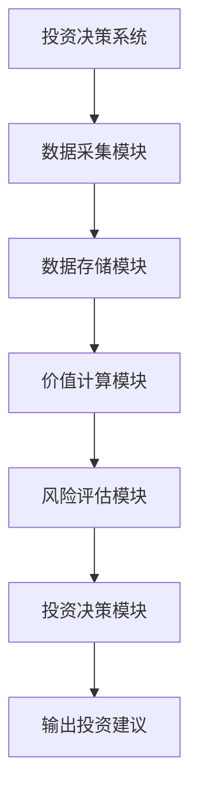

                 


# 本杰明·格雷厄姆的价值投资原则在债券市场的应用

## 关键词：
价值投资、本杰明·格雷厄姆、债券市场、投资策略、风险管理、安全边际

## 摘要：
本文探讨了如何将本杰明·格雷厄姆的价值投资原则应用于债券市场。通过分析债券市场的特点，结合价值投资的核心理念，本文提出了一套适用于债券市场的投资策略，包括安全边际、内在价值计算、风险控制等，并通过实际案例展示了其应用效果。

## 正文：

### 第一章：背景介绍

#### 1.1 价值投资的基本概念
- 价值投资的定义：寻找市场价低于内在价值的资产进行投资。
- 核心理念：安全边际，即购买价格远低于内在价值，以降低风险。
- 历史背景：由本杰明·格雷厄姆提出，影响了巴菲特等投资大师。

#### 1.2 债券市场的概述
- 债券市场的定义：发行人通过发行债券筹集资金，投资者购买债券获得定期利息和本金偿还的市场。
- 市场特点：低波动性，收益相对稳定，但存在信用风险和利率风险。
- 主要参与者：政府、企业、金融机构和个人投资者。

#### 1.3 价值投资与债券市场的结合
- 投资者可以通过价值投资原则在债券市场中寻找被低估的债券。
- 债券市场的波动性较低，适合长期投资者。

### 第二章：价值投资的核心原则与债券市场的特点

#### 2.1 价值投资的核心原则
- **安全边际**：购买价格远低于内在价值，以确保即使市场波动也能获利。
- **内在价值**：通过基本面分析计算债券的真正价值。
- **长期投资**：避免频繁交易，降低交易成本和市场波动影响。

#### 2.2 债券市场的特点
- **收益稳定**：债券通常提供固定的利息收入。
- **风险因素**：利率风险和信用风险。
- **市场流动性**：大型市场，流动性较好。

#### 2.3 价值投资与债券市场的结合
- 通过分析债券的内在价值，识别被低估的投资机会。
- 利用安全边际原则，降低投资风险。

### 第三章：价值投资原则在债券市场中的应用

#### 3.1 安全边际的应用
- 计算债券的内在价值，确保购买价格低于该价值。
- 考虑债券的信用评级和利率风险，选择具有足够安全边际的债券。

#### 3.2 内在价值的计算
- **债券价值计算公式**：
  $$ 债券价值 = \sum_{t=1}^{n} \frac{C}{(1 + r)^t} + \frac{P}{(1 + r)^n} $$
  其中，C为每年的利息，r为折现率，P为面值，n为期限。

#### 3.3 风险管理
- 分散投资：通过投资不同发行人和期限的债券降低风险。
- 定期再评估：根据市场变化调整投资组合。

### 第四章：算法与数学模型

#### 4.1 债券定价模型
- **现金流折现法**：计算债券的未来现金流现值。
- **计算步骤**：
  1. 确定债券的面值、票面利率和剩余期限。
  2. 确定合适的折现率（市场利率）。
  3. 计算各期现金流的现值并求和。

#### 4.2 Python代码实现
```python
def calculate_bond_value(face_value, coupon_rate, years, market_rate):
    value = 0
    for t in range(1, years + 1):
        cash_flow = face_value * coupon_rate
        value += cash_flow / (1 + market_rate) ** t
    value += face_value / (1 + market_rate) ** years
    return value

# 示例计算
face_value = 1000
coupon_rate = 0.05
years = 5
market_rate = 0.04
bond_value = calculate_bond_value(face_value, coupon_rate, years, market_rate)
print(f"债券价值为：${bond_value:.2f}")
```

### 第五章：系统架构与设计

#### 5.1 投资决策系统设计
- **功能模块**：
  - 数据采集：收集债券市场数据。
  - 价值计算：计算债券的内在价值。
  - 风险评估：评估债券的风险。
  - 投资决策：根据分析结果建议投资策略。

#### 5.2 系统架构图（Mermaid）


### 第六章：项目实战与案例分析

#### 6.1 实际案例分析
- **案例背景**：某公司发行的5年期债券，面值1000，票面利率5%，市场利率4%。
- **计算债券价值**：使用上述Python代码，计算出债券价值约为1071.12美元。
- **投资决策**：由于市场价低于内在价值，建议买入。

### 第七章：最佳实践与总结

#### 7.1 总结
- 价值投资原则在债券市场中同样有效，尤其在寻找被低估债券时。
- 需要结合市场变化和债券特性进行动态调整。

#### 7.2 注意事项
- 定期评估债券组合，及时调整。
- 考虑市场变化，如利率调整和经济周期波动。

#### 7.3 未来展望
- 进一步研究量化分析方法，结合大数据技术优化投资策略。
- 探索更多应用价值投资原则的领域。

## 作者：
AI天才研究院/AI Genius Institute  
禅与计算机程序设计艺术 /Zen And The Art of Computer Programming

---

**附录：**
- 常用债券市场术语表
- 值投资计算工具推荐
- 进一步阅读的书籍与资源

