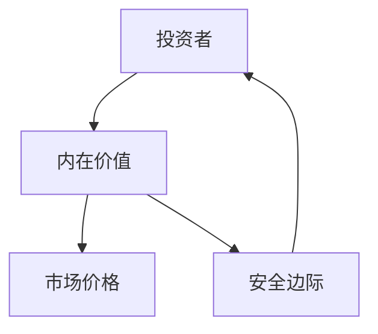
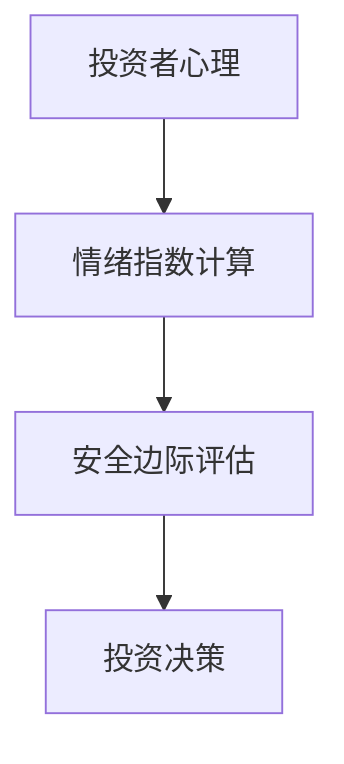

                 


# 《本杰明·格雷厄姆的价值投资心理学》

---

## 关键词

- 价值投资
- 投资心理学
- 安全边际
- 市场先生
- 内在价值

---

## 摘要

本杰明·格雷厄姆的价值投资理念深刻影响了现代投资理论，其核心在于通过安全边际和内在价值的计算，避免情绪化决策。本文从心理学视角分析格雷厄姆的投资理念，结合数学模型和算法原理，探讨其在实际投资中的应用。通过案例分析和系统设计，揭示如何在复杂市场环境中保持理性决策，实现长期稳健投资。

---

## 第一部分：价值投资心理学的背景与基础

### 第1章：价值投资心理学的起源与发展

#### 1.1 价值投资的起源与发展

投资学的发展历史可以追溯到古代，但真正系统化的发展始于20世纪初。本杰明·格雷厄姆是价值投资的奠基人，他的理念强调安全边际和内在价值的计算。现代投资理论的代表人物如马科维茨和夏普，为投资学提供了数学模型和量化方法，但格雷厄姆的理论在实际投资中依然具有重要地位。

#### 1.2 格雷厄姆的价值投资核心理念

格雷厄姆的价值投资理念基于以下几点：

1. **安全边际**：买入价格低于内在价值，确保投资的安全性。
2. **市场先生**：将市场波动比作情绪化的“市场先生”，提醒投资者避免被短期波动影响。
3. **心理因素**：强调投资者心理对决策的影响，避免情绪化决策。

---

## 第二部分：价值投资心理学的核心概念与联系

### 第2章：安全边际与心理因素的关系

#### 2.1 安全边际的数学模型与心理影响

安全边际的计算公式为：

$$ \text{安全边际} = \text{内在价值} - \text{市场价格} $$

内在价值的计算涉及对公司未来现金流的折现，公式为：

$$ \text{内在价值} = \sum_{t=1}^{n} \frac{C_t}{(1+r)^t} $$

其中，\( C_t \) 是第 \( t \) 年的现金流，\( r \) 是折现率。

安全边际的存在为投资者提供了心理上的保护，使其在市场波动中保持冷静。

#### 2.2 格雷厄姆模型的实体关系图

以下是格雷厄姆模型的实体关系图：



---

## 第三部分：价值投资心理学的算法原理与数学模型

### 第3章：安全边际的计算与心理因素的量化

#### 3.1 安全边际的数学模型

安全边际的计算依赖于内在价值的评估和市场价格的比较。以下是一个简单的计算示例：

假设某公司的内在价值为 $100，市场价格为 $90，安全边际为 $10。

$$ \text{安全边际} = 100 - 90 = 10 $$

#### 3.2 心理因素对投资决策的影响

情绪指数的计算可以量化投资者的心理状态，公式如下：

$$ \text{情绪指数} = \frac{\text{市场价格}}{\text{内在价值}} \times 100 $$

当情绪指数低于 80 时，市场可能被低估，反之则可能被高估。

---

## 第四部分：价值投资心理学的系统分析与架构设计

### 第4章：投资者心理与决策系统的架构

#### 4.1 投资者心理分析系统

以下是投资者心理分析系统的架构图：



系统模块包括：

1. 情绪指数计算模块：基于市场价格和内在价值计算情绪指数。
2. 安全边际评估模块：评估安全边际的宽幅。
3. 投资决策模块：基于上述评估结果制定投资策略。

---

## 第五部分：价值投资心理学的项目实战

### 第5章：基于格雷厄姆模型的实战分析

#### 5.1 项目环境与工具安装

推荐使用以下工具：

1. 数据分析工具：Python、Pandas、NumPy。
2. 可视化工具：Matplotlib、Seaborn。
3. 投资分析工具：Excel、Morningstar。

#### 5.2 投资分析系统的核心实现

以下是内在价值计算的Python代码：

```python
import pandas as pd
import numpy as np

def calculate_intrinsic_value(cash_flows, discount_rate):
    return np.sum(cash_flows / (1 + discount_rate) ** np.arange(len(cash_flows)))

# 示例数据
cash_flows = [100, 120, 150, 200]
discount_rate = 0.10

iv = calculate_intrinsic_value(cash_flows, discount_rate)
print(f"内在价值: {iv:.2f}")
```

---

## 第六部分：最佳实践与小结

### 6.1 小结

本杰明·格雷厄姆的价值投资心理学强调安全边际和内在价值的计算，提醒投资者避免情绪化决策。通过数学模型和系统设计，我们可以更好地理解和应用这些理念。

### 6.2 注意事项

1. **数据质量**：确保现金流和折扣率的准确性。
2. **模型局限性**：内在价值计算依赖于对未来现金流的预测，存在不确定性。
3. **心理调节**：投资者需定期反思心理状态，避免被市场波动影响。

### 6.3 拓展阅读

- 《The Intelligent Investor》 by Benjamin Graham
- “投资心理学”相关学术论文

---

## 作者：AI天才研究院/AI Genius Institute & 禅与计算机程序设计艺术 /Zen And The Art of Computer Programming

