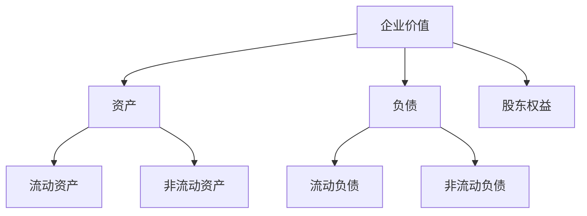
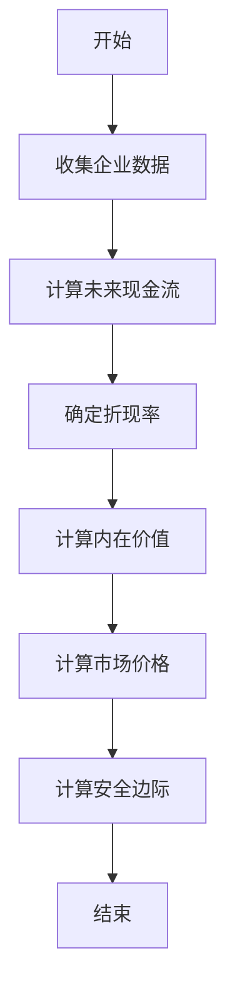
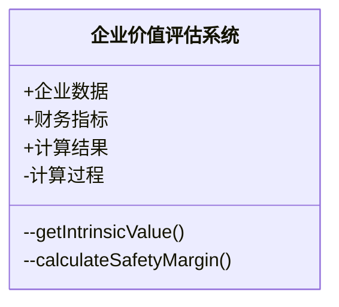
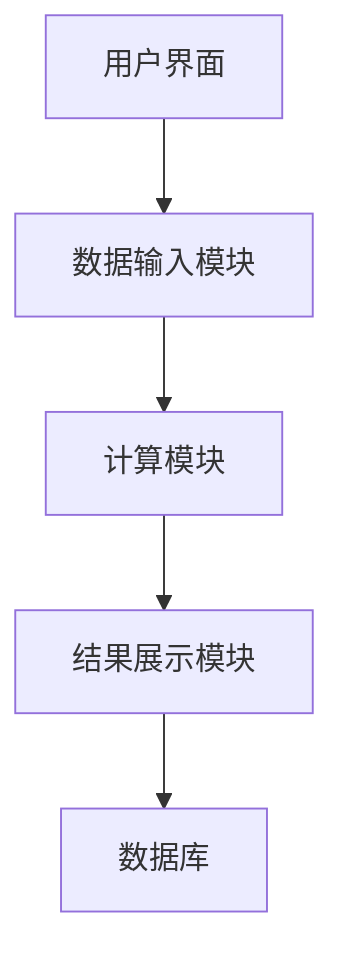

                 


# 本杰明·格雷厄姆的企业价值计算方法

> 关键词：价值投资，企业价值评估，内在价值，安全边际，本杰明·格雷厄姆，企业估值模型

> 摘要：本杰明·格雷厄姆是价值投资的鼻祖，他的企业价值计算方法为投资者提供了评估企业内在价值的重要工具。本文详细探讨了格雷厄姆的企业价值计算方法，包括其核心概念、算法原理、系统分析以及实际应用。通过本文，读者将能够理解并掌握如何使用格雷厄姆的方法进行企业价值评估。

---

## 第一部分: 本杰明·格雷厄姆的企业价值计算方法概述

### 第1章: 价值投资与企业价值评估的背景

#### 1.1 价值投资的起源与发展

价值投资是一种投资策略，其核心在于购买低于其内在价值的股票。本杰明·格雷厄姆是该领域的先驱，他强调以合理的价格购买优质的资产。价值投资的起源可以追溯到20世纪初，当时格雷厄姆在哥伦比亚大学教授投资课程，并在实践中发展出一套独特的估值方法。

**核心概念与属性对比**  
以下是价值投资与其它投资方法的核心概念对比：

| 投资方法 | 核心概念 | 目标 |
|----------|----------|------|
| 价值投资 | 内在价值 | 购买低于内在价值的资产 |
| 技术分析 | 趋势与形态 | 通过价格和成交量预测未来走势 |
| 成长投资 | 高增长企业 | 投资于增长潜力大的公司 |

**ER实体关系图架构**  
以下是企业价值评估的核心概念关系图：



### 1.2 企业价值计算的基本问题

格雷厄姆的企业价值计算方法基于以下基本问题：

1. 企业的内在价值如何计算？
2. 如何确定企业的安全边际？
3. 企业价值评估的边界与外延是什么？

#### 1.3 格雷厄姆企业价值计算的核心要素

格雷厄姆的价值计算方法的核心要素包括：

- **内在价值**：企业未来现金流的现值。
- **安全边际**：内在价值与市场价格之间的差异。
- **资产净值**：企业账面价值与市场价值的对比。

---

## 第二部分: 格雷厄姆企业价值计算的核心原理

### 第2章: 格雷厄姆的企业价值计算模型

#### 2.1 格雷厄姆的内在价值计算方法

格雷厄姆的内在价值计算方法基于以下公式：

$$
\text{内在价值} = \frac{\text{未来现金流的现值}}{折现率}
$$

**股息折现法**  
股息折现法是格雷厄姆常用的一种方法，公式如下：

$$
\text{内在价值} = \sum_{t=1}^{n} \frac{\text{股息}_t}{(1 + r)^t}
$$

其中，\( r \) 是折现率，\( \text{股息}_t \) 是第 \( t \) 年的股息。

#### 2.2 格雷厄姆的安全边际概念

安全边际是格雷厄姆理论中的重要概念，其计算公式为：

$$
\text{安全边际} = \text{内在价值} - \text{市场价格}
$$

安全边际越大，投资风险越小。

### 第3章: 格雷厄姆企业价值计算的算法原理

#### 3.1 格雷厄姆企业价值计算的流程图

以下是格雷厄姆企业价值计算的流程图：



#### 3.2 格雷厄姆企业价值计算的数学模型

以下是格雷厄姆企业价值计算的数学模型：

$$
\text{内在价值} = \frac{\text{股息}_1}{(1 + r)} + \frac{\text{股息}_2}{(1 + r)^2} + \dots + \frac{\text{股息}_n}{(1 + r)^n}
$$

其中，\( r \) 是折现率，\( \text{股息}_i \) 是第 \( i \) 年的股息。

---

## 第三部分: 格雷厄姆企业价值计算的系统分析与架构设计

### 第4章: 企业价值评估系统的功能设计

#### 4.1 企业价值评估系统的功能模块

以下是企业价值评估系统的功能模块：

1. **数据输入模块**：收集企业的财务数据。
2. **计算模块**：计算企业的内在价值和安全边际。
3. **结果展示模块**：显示评估结果。

### 4.2 企业价值评估系统的领域模型

以下是企业价值评估系统的领域模型：



### 第5章: 企业价值评估系统的架构设计

#### 5.1 系统架构设计的Mermaid架构图

以下是系统架构设计的Mermaid架构图：



---

## 第四部分: 格雷厄姆企业价值计算的项目实战

### 第6章: 项目实战

#### 6.1 环境安装

以下是项目实战所需的环境安装步骤：

1. 安装Python。
2. 安装Pandas和NumPy库。

#### 6.2 核心代码实现

以下是核心代码实现：

```python
import pandas as pd
import numpy as np

def calculate_intrinsic_value(dividends, discount_rate):
    return sum(dividend / (1 + discount_rate)**i for i, dividend in enumerate(dividends))

def calculate_safety_margin(intrinsic_value, market_price):
    return intrinsic_value - market_price

# 示例数据
dividends = [1, 1.05, 1.10, 1.15]
discount_rate = 0.10
market_price = 10

# 计算内在价值
intrinsic_value = calculate_intrinsic_value(dividends, discount_rate)

# 计算安全边际
safety_margin = calculate_safety_margin(intrinsic_value, market_price)

print(f"内在价值: {intrinsic_value:.2f}")
print(f"安全边际: {safety_margin:.2f}")
```

#### 6.3 案例分析

以下是案例分析：

某公司未来四年的股息分别为1元、1.05元、1.10元和1.15元，折现率为10%，市场价格为10元。计算其内在价值和安全边际。

计算结果如下：

$$
\text{内在价值} = 1 + \frac{1.05}{1.10} + \frac{1.10}{(1.10)^2} + \frac{1.15}{(1.10)^3} \approx 4.18 \text{元}
$$

$$
\text{安全边际} = 4.18 - 10 = -5.82 \text{元}
$$

---

## 第五部分: 总结与最佳实践

### 第7章: 总结与最佳实践

#### 7.1 最佳实践 tips

1. 在进行企业价值评估时，确保数据的准确性和完整性。
2. 合理选择折现率，避免高估或低估内在价值。
3. 定期更新评估结果，以反映市场变化。

#### 7.2 小结

本杰明·格雷厄姆的企业价值计算方法为投资者提供了重要的工具，帮助他们以合理的价格投资优质企业。通过本文的详细讲解，读者可以掌握格雷厄姆的计算方法，并在实际投资中加以应用。

#### 7.3 注意事项

1. 企业价值评估的结果仅供参考，实际投资需结合市场环境和其他因素。
2. 确保对企业的财务状况有充分的了解。

#### 7.4 拓展阅读

1. 《证券分析》（The Analysis of Investment Value）——本杰明·格雷厄姆
2. 《投资学原理》（Principles of Investment）——威廉·夏普

---

作者：AI天才研究院/AI Genius Institute & 禅与计算机程序设计艺术 /Zen And The Art of Computer Programming

