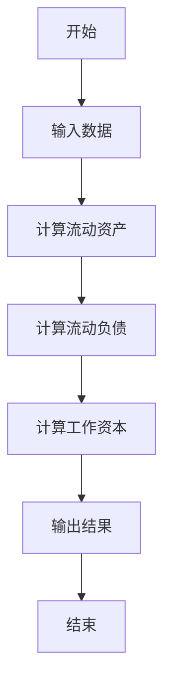
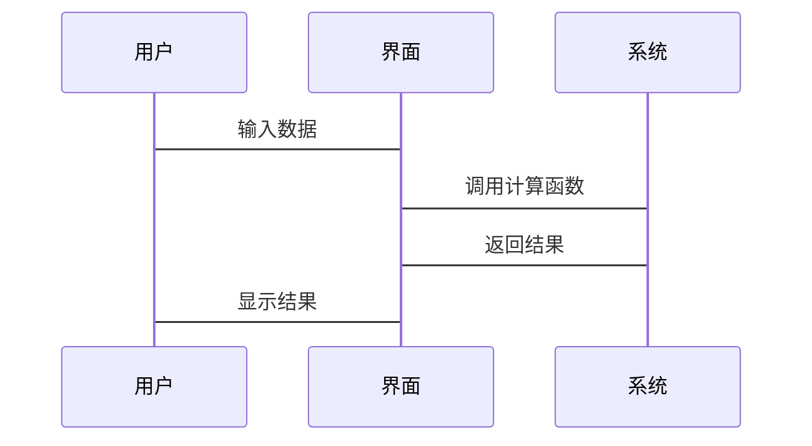

                 


# 本杰明·格雷厄姆的工作资本分析技巧

> 关键词：本杰明·格雷厄姆，工作资本分析，安全边际，内在价值，投资策略，资产评估

> 摘要：本杰明·格雷厄姆是价值投资的先驱，他的工作资本分析技巧是投资领域的重要理论基础。本文系统地介绍了格雷厄姆的工作资本分析方法，包括安全边际、内在价值评估、资产分析策略等核心概念，并通过实例分析展示了如何将这些技巧应用于实际投资决策。文章还探讨了工作资本分析的理论基础、系统架构设计及项目实战，为读者提供了全面且深入的指导。

---

# 第一部分：本杰明·格雷厄姆的投资理念与工作资本分析基础

## 第1章：本杰明·格雷厄姆的背景与投资理念

### 1.1 本杰明·格雷厄姆的生平简介

#### 1.1.1 早年经历与学术背景
本杰明·格雷厄姆（Benjamin Graham）是20世纪著名的投资学家，被誉为“价值投资之父”。他出生于1894年，早年在伦敦学习，后移居美国。他在哥伦比亚大学获得经济学博士学位，并执教于该校，培养了许多著名的投资学家，如沃伦·巴菲特。

#### 1.1.2 格雷厄姆的投资哲学与价值投资理念
格雷厄姆的投资理念以“安全边际”为核心，强调以低于内在价值的价格买入优质股票。他认为市场是不可预测的，投资者应关注企业的基本面，而非市场的短期波动。

#### 1.1.3 格雷厄姆对现代投资学的贡献
格雷厄姆的理论奠定了价值投资的基础，他的著作《证券分析》和《聪明的投资者》对全球投资界产生了深远影响。

### 1.2 工作资本分析的核心概念

#### 1.2.1 工作资本的定义与分类
工作资本（Working Capital）是指企业在日常经营中用于支持运营活动的流动资产减去流动负债的部分。它包括现金、应收账款、存货等流动资产。

#### 1.2.2 工作资本分析的目的与意义
工作资本分析旨在评估企业的短期偿债能力、流动性以及经营效率。通过分析工作资本，投资者可以判断企业的财务健康状况。

#### 1.2.3 工作资本分析与企业估值的关系
工作资本是企业估值的重要组成部分，直接影响企业的内在价值和市场价值。

### 1.3 本章小结
本章介绍了格雷厄姆的背景及其投资理念，重点阐述了工作资本分析的基本概念和意义，为后续分析奠定了基础。

---

## 第2章：安全边际与内在价值评估

### 2.1 安全边际的定义与作用

#### 2.1.1 安全边际的定义
安全边际是指股票的市场价格低于其内在价值的部分，确保投资者在买入时有一定的安全空间。

#### 2.1.2 安全边际在投资决策中的重要性
安全边际能够降低投资风险，确保在市场波动时仍能获得正收益。

#### 2.1.3 如何计算安全边际
安全边际 = 内在价值 - 市场价格

### 2.2 内在价值的计算方法

#### 2.2.1 内在价值的定义
内在价值是企业未来现金流的现值，反映了企业的实际价值。

#### 2.2.2 格雷厄姆的内在价值计算公式
$$\text{内在价值} = \sum_{t=1}^{n} \frac{\text{现金流}}{(1 + r)^t}$$

#### 2.2.3 内在价值与市场价值的对比分析
内在价值是理论上的价值，而市场价值受情绪和市场波动影响。

### 2.3 工作资本分析中的安全边际应用

#### 2.3.1 安全边际在企业估值中的应用
通过比较市场价格与内在价值，确定是否具备安全边际。

#### 2.3.2 安全边际与投资风险的控制
安全边际越大，投资风险越低。

#### 2.3.3 安全边际的动态调整方法
根据市场变化和企业情况，定期调整安全边际。

### 2.4 本章小结
本章详细讲解了安全边际的定义、作用及计算方法，并探讨了其在工作资本分析中的应用。

---

## 第3章：工作资本分析的理论基础

### 3.1 资产评估的基本原理

#### 3.1.1 资产评估的定义与分类
资产评估是对资产价值的估算，分为流动资产和非流动资产。

#### 3.1.2 资产评估的基本方法
包括市场法、成本法和收益法。

#### 3.1.3 资产评估与企业价值的关系
资产评估是企业价值评估的重要组成部分。

### 3.2 工作资本分析的理论框架

#### 3.2.1 工作资本分析的理论基础
基于财务报表分析，重点关注流动资产和流动负债。

#### 3.2.2 工作资本分析的假设条件
假设企业正常经营，市场环境稳定。

#### 3.2.3 工作资本分析的局限性
依赖于财务数据的准确性，且忽略了非财务因素。

### 3.3 格雷厄姆的资产分析方法

#### 3.3.1 格雷厄姆的资产分类方法
将资产分为核心资产和非核心资产。

#### 3.3.2 格雷厄姆的资产价值评估模型
$$\text{资产价值} = \text{核心资产价值} + \text{非核心资产价值}$$

#### 3.3.3 格雷厄姆的资产分析与工作资本分析的结合
通过分析工作资本，评估企业的短期偿债能力。

### 3.4 本章小结
本章介绍了资产评估的基本原理，分析了工作资本分析的理论框架，并探讨了格雷厄姆的资产分析方法。

---

## 第4章：工作资本分析的实践应用

### 4.1 工作资本分析的步骤

#### 4.1.1 收集财务报表
获取企业的资产负债表和利润表。

#### 4.1.2 计算工作资本
$$\text{工作资本} = \text{流动资产} - \text{流动负债}$$

#### 4.1.3 评估流动性比率
如流动比率、速动比率等。

### 4.2 工作资本分析的案例分析

#### 4.2.1 案例背景
假设某公司流动资产为1000万元，流动负债为800万元。

#### 4.2.2 计算工作资本
$$\text{工作资本} = 1000 - 800 = 200 \text{万元}$$

#### 4.2.3 分析结果
公司工作资本为正，说明短期偿债能力强。

### 4.3 工作资本分析的注意事项

#### 4.3.1 数据的准确性
确保财务数据的可靠性。

#### 4.3.2 行业差异
不同行业的标准不同，需结合行业特点分析。

#### 4.3.3 宏观经济影响
考虑宏观经济环境的影响。

### 4.4 本章小结
本章通过案例分析，展示了工作资本分析的实践应用，并强调了分析中的注意事项。

---

## 第5章：系统架构与工作资本分析的实现

### 5.1 系统架构设计

#### 5.1.1 系统功能设计
包括数据输入、计算分析、结果展示。

#### 5.1.2 系统架构设计
采用分层架构，包括数据层、业务逻辑层和表现层。

#### 5.1.3 系统接口设计
定义数据输入接口和结果输出接口。

### 5.2 工作资本分析的算法实现

#### 5.2.1 算法流程图


#### 5.2.2 核心代码实现
```python
def calculate_working_capital(current_assets, current_liabilities):
    return current_assets - current_liabilities

# 示例
current_assets = 1000
current_liabilities = 800
working_capital = calculate_working_capital(current_assets, current_liabilities)
print(f"工作资本: {working_capital}")
```

### 5.3 系统交互设计

#### 5.3.1 交互流程图


### 5.4 本章小结
本章通过系统架构设计和算法实现，展示了如何将工作资本分析应用于实际投资决策。

---

## 第6章：项目实战与最佳实践

### 6.1 项目环境安装

#### 6.1.1 安装Python
下载并安装Python 3.x版本。

#### 6.1.2 安装依赖库
安装pandas和numpy库：
```bash
pip install pandas numpy
```

### 6.2 核心代码实现

#### 6.2.1 数据加载
```python
import pandas as pd

# 加载财务数据
data = pd.read_csv('financial_data.csv')
```

#### 6.2.2 数据处理
计算工作资本：
```python
data['工作资本'] = data['流动资产'] - data['流动负债']
```

#### 6.2.3 数据可视化
绘制工作资本趋势图：
```python
import matplotlib.pyplot as plt

plt.plot(data['日期'], data['工作资本'])
plt.xlabel('日期')
plt.ylabel('工作资本（万元）')
plt.title('工作资本趋势图')
plt.show()
```

### 6.3 实际案例分析

#### 6.3.1 案例背景
分析某公司过去五年的财务数据。

#### 6.3.2 数据分析
计算每年的工作资本，并分析其变化趋势。

#### 6.3.3 结果解读
发现公司工作资本逐年增加，说明短期偿债能力增强。

### 6.4 本章小结
本章通过项目实战，展示了如何利用Python进行工作资本分析，并提供了最佳实践建议。

---

## 第7章：总结与展望

### 7.1 本章总结
本章总结了本杰明·格雷厄姆的工作资本分析技巧，包括安全边际、内在价值评估、资产分析策略等核心概念，并通过实例分析和系统实现，展示了这些技巧的实际应用。

### 7.2 未来展望
未来，随着大数据和人工智能的发展，工作资本分析将更加智能化和精准化。

---

# 作者：AI天才研究院 & 禅与计算机程序设计艺术

---

**小结**：本杰明·格雷厄姆的工作资本分析技巧是投资领域的重要理论基础。通过本文的系统讲解，读者可以掌握如何运用这些技巧进行企业估值和投资决策。希望本文能为投资者提供有价值的指导和启发。

