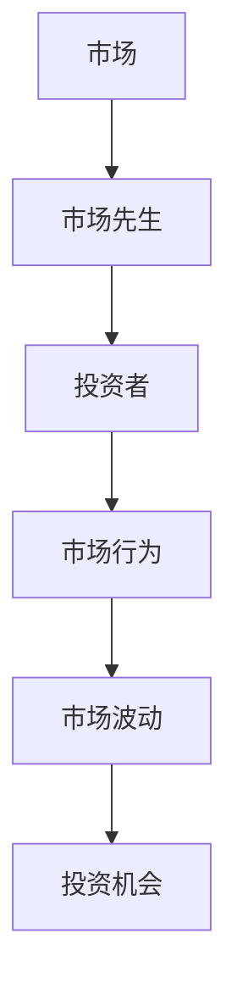

                 

# 本杰明·格雷厄姆的市场先生理论现代应用

## 关键词：市场先生理论、行为金融学、投资者心理、现代金融、算法交易、量化投资

## 摘要：本文深入探讨了本杰明·格雷厄姆提出的市场先生理论在现代金融中的应用。通过分析市场波动、投资者心理和市场行为，结合行为金融学和量化投资方法，展示了如何利用市场先生理论优化投资策略。文章内容涵盖理论背景、核心概念、数学模型构建、系统设计以及实际案例分析，旨在为投资者和金融从业者提供新的视角和实践指导。

---

## 第一部分：市场先生理论的背景与核心概念

### 第1章：市场先生理论的起源与背景

#### 1.1 本杰明·格雷厄姆的市场先生理论概述

##### 1.1.1 理论的提出背景
本杰明·格雷厄姆（Benjamin Graham）是20世纪著名的投资学家，被誉为“价值投资之父”。他在1949年出版的经典著作《股票做价的艺术》（The Theory of Investment Value）中提出了市场先生（Mr. Market）的概念。这一理论的核心在于将市场波动与投资者心理相结合，强调市场并非总是理性的，而是受情绪驱动的。

##### 1.1.2 理论的核心观点
市场先生代表了市场的整体行为，他每天都会以不同的价格出售企业的一部分。投资者通过与市场先生的互动，可以发现市场波动中的价值投资机会。格雷厄姆认为，市场先生的情绪化行为为理性投资者提供了套利机会。

##### 1.1.3 理论的现代意义
在现代金融市场中，市场先生理论仍然具有重要的现实意义。它帮助投资者理解市场波动的本质，并利用市场情绪的变化制定投资策略。尤其是在量化投资和算法交易日益普及的今天，市场先生理论为投资者提供了一个独特的视角。

#### 1.2 市场先生理论的核心概念

##### 1.2.1 市场波动的本质
市场波动并非完全随机，而是受投资者心理和行为的驱动。市场的短期波动反映了市场先生的情绪变化，而长期趋势则由基本面因素决定。

##### 1.2.2 投资者心理与市场行为
投资者心理偏差（如过度自信、从众心理）会导致市场情绪的波动。市场先生理论通过分析这些心理偏差，揭示了市场波动的内在规律。

##### 1.2.3 市场先生的双重角色
市场先生既是市场的反映者，也是市场的参与者。他既是市场波动的制造者，也是市场价值的发现者。这种双重角色使得市场先生理论能够解释市场的复杂行为。

### 第2章：市场先生理论的核心观点与现代应用

#### 2.1 市场先生理论的核心观点

##### 2.1.1 市场的非理性与情绪化
市场并非总是理性的，而是受投资者情绪驱动的。市场的短期波动反映了市场先生的非理性行为。

##### 2.1.2 投资者心理偏差的分析
投资者心理偏差（如羊群效应、过度反应）会导致市场波动。市场先生理论通过分析这些偏差，揭示了市场波动的内在规律。

##### 2.1.3 市场波动的周期性
市场波动具有周期性，从繁荣到衰退，再到复苏，循环往复。市场先生理论通过分析市场的周期性，帮助投资者制定长期策略。

#### 2.2 现代金融市场的变化与市场先生理论的延伸

##### 2.2.1 现代金融市场的复杂性
现代金融市场更加复杂，涉及更多的参与者和更多的金融工具。市场先生理论需要在复杂环境中重新审视其应用。

##### 2.2.2 技术进步对市场行为的影响
技术进步（如算法交易、高频交易）改变了市场的运行方式。市场先生理论需要结合技术进步进行调整。

##### 2.2.3 全球化背景下的市场波动
全球化使得市场更加紧密相连，市场的波动具有更强的传染性。市场先生理论需要在全球化背景下重新审视其应用。

#### 2.3 市场先生理论与现代金融理论的结合

##### 2.3.1 市场先生理论与行为金融学的联系
行为金融学研究投资者心理与市场行为，市场先生理论为行为金融学提供了理论基础。

##### 2.3.2 市场先生理论与现代投资策略的结合
市场先生理论为现代投资策略（如价值投资、量化投资）提供了理论支持。市场先生理论强调市场波动中的价值发现机会。

---

## 第二部分：市场先生理论的核心概念与联系

### 第3章：市场先生理论的核心原理

#### 3.1 市场先生理论的数学模型

##### 3.1.1 市场波动的数学表达
市场波动可以用随机过程模型（如布朗运动）进行描述。市场先生的情绪变化可以通过波动率的变化反映出来。

##### 3.1.2 投资者心理的数学建模
投资者心理偏差可以用非线性模型进行描述。市场情绪的变化可以用心理因素进行建模。

##### 3.1.3 市场情绪指数的计算公式
市场情绪指数可以通过投资者情绪指标（如恐慌指数）进行计算。例如，可以使用以下公式计算市场情绪指数：

$$
\text{市场情绪指数} = \frac{\text{投资者情绪指标}}{\text{市场波动率}}
$$

#### 3.2 市场先生理论的属性特征对比表

| 属性         | 理论观点                            |
|--------------|-----------------------------------|
| 市场波动      | 具有周期性，受情绪驱动             |
| 投资者心理    | 受心理偏差影响，具有非理性         |
| 市场行为      | 具有传染性，受群体心理影响         |

---

### 第4章：市场先生理论的ER实体关系图

#### 4.1 实体关系图的构建

#### 4.2 实体关系图的分析

通过上述ER实体关系图，我们可以看到市场、市场先生、投资者、市场行为和市场波动之间的关系。市场先生作为市场的代表，影响投资者的行为，进而影响市场波动和投资机会。

---

## 第三部分：市场先生理论的现代应用

### 第5章：市场先生理论与现代投资策略的结合

#### 5.1 市场先生理论与算法交易

##### 5.1.1 算法交易的定义
算法交易是指通过计算机算法自动执行交易。市场先生理论为算法交易提供了理论支持。

##### 5.1.2 算法交易与市场先生理论的结合
算法交易可以利用市场先生理论中的市场情绪指数进行交易决策。例如，当市场情绪指数较高时，算法交易系统可以触发卖出信号。

##### 5.1.3 算法交易的优势
算法交易可以快速捕捉市场波动，提高交易效率。市场先生理论为算法交易提供了理论支持。

#### 5.2 市场先生理论与量化投资

##### 5.2.1 量化投资的定义
量化投资是指通过量化模型进行投资决策。市场先生理论为量化投资提供了理论支持。

##### 5.2.2 量化投资与市场先生理论的结合
量化投资可以利用市场先生理论中的市场情绪指数进行投资决策。例如，当市场情绪指数较低时，量化投资系统可以触发买入信号。

##### 5.2.3 量化投资的优势
量化投资可以减少人为情绪干扰，提高投资决策的科学性。市场先生理论为量化投资提供了理论支持。

---

## 第四部分：总结与展望

### 6.1 总结

本杰明·格雷厄姆的市场先生理论在现代金融中的应用具有重要的现实意义。通过分析市场波动、投资者心理和市场行为，我们可以更好地理解市场的运行规律。市场先生理论为投资者提供了新的视角和实践指导。

### 6.2 展望

未来，市场先生理论可以在以下几个方面进一步研究：

1. 结合人工智能技术，进一步提高市场情绪的预测精度。
2. 研究市场先生理论在不同类型市场（如新兴市场、成熟市场）中的应用差异。
3. 探讨市场先生理论在风险管理中的应用。

---

## 作者：AI天才研究院/AI Genius Institute & 禅与计算机程序设计艺术 /Zen And The Art of Computer Programming

---

这篇文章系统地介绍了本杰明·格雷厄姆的市场先生理论，并结合现代金融环境进行了深入分析。通过数学模型和实际案例的分析，展示了市场先生理论在现代投资策略中的应用。希望本文能够为投资者和金融从业者提供新的视角和实践指导。

