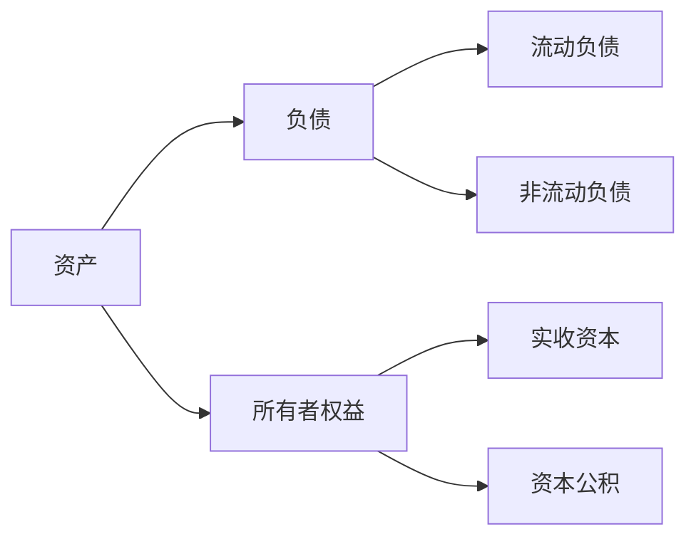

                 

# 本杰明格雷厄姆的财务分析方法

## 关键词
本杰明·格雷厄姆，财务分析，安全边际，内在价值，价值投资，财务报表分析

## 摘要
本杰明·格雷厄姆是价值投资的鼻祖，他的财务分析方法为投资者提供了评估企业内在价值和制定投资决策的重要工具。本文将详细介绍格雷厄姆的核心概念，如安全边际和内在价值，并结合实际案例，讲解如何通过财务报表分析和估值方法来应用这些理论。通过系统化的分析和实战指导，读者将能够掌握格雷厄姆的财务分析方法，并在实际投资中加以运用。

---

# 引言

在投资领域，本杰明·格雷厄姆被誉为“价值投资之父”。他的财务分析方法不仅深刻影响了投资理论的发展，也为无数投资者提供了实现长期稳健收益的路径。本文将从格雷厄姆的核心理论出发，系统地介绍其财务分析方法，并结合实际案例，帮助读者理解和应用这一方法。

---

# 第一部分：格雷厄姆的核心理论

## 第1章：安全边际

### 1.1 安全边际的定义

安全边际是格雷厄姆价值投资理念中的核心概念，它是指股票的市场价格低于其内在价值的部分。换句话说，当一只股票的市场价格显著低于其内在价值时，投资者可以以较低的风险买入该股票，从而为投资决策提供安全空间。

#### 安全边际的计算公式

$$ \text{安全边际} = \text{内在价值} - \text{市场价格} $$

### 1.2 安全边际的重要性

安全边际为投资者提供了风险保护。当市场价格远低于内在价值时，即使市场出现短期波动，投资者的本金也不会受到显著影响。这种安全边际的存在，使得投资者能够在市场恐慌时保持冷静，并在长期中获得超额收益。

---

## 第2章：内在价值评估

### 2.1 内在价值的定义

内在价值是指企业未来现金流的现值。格雷厄姆认为，只有通过对企业未来现金流的合理估算，才能准确衡量其内在价值。

#### 内在价值的计算公式

$$ \text{内在价值} = \sum_{t=1}^{n} \frac{\text{现金流}_t}{(1 + r)^t} $$

其中，\( r \) 是折现率，\( \text{现金流}_t \) 是第 \( t \) 年的现金流。

### 2.2 内在价值评估的关键步骤

1. **预测未来现金流**：基于企业的财务状况和市场环境，预测未来几年的现金流。
2. **确定合理的折现率**：通常使用企业的加权平均资本成本（WACC）作为折现率。
3. **计算现值**：将未来现金流折现，求和得到企业的内在价值。

---

# 第二部分：财务报表分析

## 第3章：资产负债表分析

### 3.1 资产负债表的核心要素

资产负债表反映了企业在某一特定时点的财务状况，主要包括资产、负债和所有者权益三部分。

#### 资产负债表的结构

### 3.2 资产负债表分析的关键指标

- **流动比率**：衡量企业短期偿债能力的指标。
- **速动比率**：流动比率的进一步优化，剔除存货等不易变现的资产。
- **资产负债率**：反映企业财务杠杆的指标。

---

## 第4章：利润表分析

### 4.1 利润表的核心要素

利润表反映了企业在一定会计期间内的经营成果，主要包括收入、成本和利润三部分。

#### 利润表的结构

### 4.2 利润表分析的关键指标

- **净利润率**：衡量企业盈利能力的指标。
- **毛利率**：反映企业核心业务的盈利能力。
- **净利率**：衡量企业整体盈利能力的指标。

---

## 第5章：现金流量表分析

### 5.1 现金流量表的核心要素

现金流量表反映了企业在一定会计期间内的现金流入和流出情况，主要包括经营活动、投资活动和筹资活动的现金流。

#### 现金流量表的结构

### 5.2 现金流量表分析的关键指标

- **自由现金流**：衡量企业实际可支配现金流的指标。
- **现金流量净额**：反映企业整体现金状况的指标。

---

# 第三部分：企业估值方法

## 第6章：市盈率法

### 6.1 市盈率法的定义

市盈率法是通过比较股票的市场价格与每股收益（EPS）的比率，来评估股票的估值是否合理。

#### 市盈率的计算公式

$$ \text{市盈率} = \frac{\text{市场价格}}{\text{每股收益}} $$

### 6.2 市盈率法的优缺点

- **优点**：简单易懂，便于比较。
- **缺点**：无法反映企业的实际盈利能力，容易受行业和市场波动影响。

---

## 第7章：市净率法

### 7.1 市净率法的定义

市净率法是通过比较股票的市场价格与每股净资产的比率，来评估股票的估值是否合理。

#### 市净率的计算公式

$$ \text{市净率} = \frac{\text{市场价格}}{\text{每股净资产}} $$

### 7.2 市净率法的优缺点

- **优点**：适用于净资产较多的行业，能够反映企业的资产价值。
- **缺点**：无法全面反映企业的盈利能力。

---

## 第8章：股息率法

### 8.1 股息率法的定义

股息率法是通过比较股票的股息与股票价格的比率，来评估股票的估值是否合理。

#### 股息率的计算公式

$$ \text{股息率} = \frac{\text{每股股息}}{\text{股价}} $$

### 8.2 股息率法的优缺点

- **优点**：适用于注重股息收益的投资者。
- **缺点**：无法反映企业的成长性。

---

# 第四部分：项目实战

## 第9章：应用格雷厄姆方法进行投资分析

### 9.1 实战案例：某公司财务分析

#### 步骤1：收集财务数据

假设我们选择一家制造公司进行分析，收集其最近三年的财务报表数据。

#### 步骤2：计算内在价值

基于公司的未来现金流预测和合理的折现率，计算出公司的内在价值。

#### 步骤3：计算安全边际

将计算出的内在价值与当前股价进行比较，得出安全边际。

#### 步骤4：制定投资策略

根据安全边际的大小，决定是否买入、持有或卖出该股票。

---

# 结论

本杰明·格雷厄姆的财务分析方法为投资者提供了一套科学的投资决策工具。通过安全边际和内在价值的评估，投资者可以在复杂的市场环境中找到具有长期投资价值的企业。然而，财务分析并非一成不变，投资者需要结合实际情况，灵活运用这些方法，并持续关注企业的财务状况和市场变化。

---

# 作者

作者：AI天才研究院/AI Genius Institute  
禅与计算机程序设计艺术 /Zen And The Art of Computer Programming

