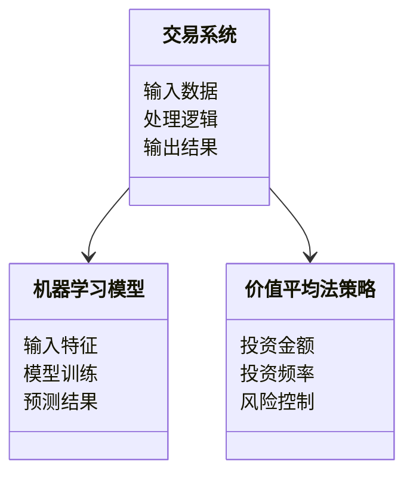

                 


# 机器学习优化价值平均法交易策略

> 关键词：机器学习，价值平均法，交易策略，优化算法，金融投资

> 摘要：本文探讨了如何利用机器学习技术优化传统价值平均法交易策略，通过详细分析机器学习的核心原理、价值平均法的数学模型以及两者的结合方式，提出了一种基于机器学习的优化算法，并通过实际案例展示了该方法的有效性。

---

## 第一部分：机器学习与价值平均法的背景介绍

### 第1章：机器学习的基本概念与应用

#### 1.1 机器学习的定义与核心概念
机器学习是一种人工智能技术，通过数据训练模型，使其能够从数据中学习并做出预测或决策。核心概念包括：
- **监督学习**：基于标记数据进行预测。
- **无监督学习**：在无标记数据中发现模式。
- **特征提取**：从数据中提取有用的特征。

#### 1.2 机器学习在金融领域的应用
- **股票预测**：利用历史数据预测股票价格走势。
- **风险控制**：评估投资组合的风险。
- **交易策略优化**：通过数据驱动的方法优化交易策略。

#### 1.3 价值平均法的定义与特点
价值平均法是一种投资策略，通过定期定额投资，分散投资风险，降低市场波动对投资组合的影响。其特点包括：
- **定期投资**：固定金额定期投入。
- **分散风险**：通过时间分散市场波动的影响。
- **长期视角**：适合长期投资者。

### 第2章：机器学习优化价值平均法的背景

#### 2.1 传统交易策略的局限性
- **市场预测的不确定性**：传统方法难以捕捉复杂市场变化。
- **策略静态性**：固定策略在动态市场中表现不佳。

#### 2.2 机器学习在优化交易策略中的作用
- **数据驱动决策**：利用历史数据优化投资决策。
- **动态调整**：根据市场变化实时调整投资策略。
- **提高收益**：通过优化模型提升投资回报。

---

## 第二部分：机器学习优化价值平均法的核心概念

### 第3章：机器学习的核心原理

#### 3.1 数据驱动的特征提取
- **特征选择**：识别影响投资回报的关键因素。
- **特征工程**：通过数据变换提取更有用的特征。

#### 3.2 监督学习与无监督学习的对比
- **监督学习**：适用于有标签的数据，如股票价格预测。
- **无监督学习**：适用于无标签数据，如市场风险评估。

#### 3.3 神经网络的基本结构
- **输入层**：接收输入数据。
- **隐藏层**：处理数据并提取特征。
- **输出层**：生成预测结果。

### 第4章：价值平均法的数学模型

#### 4.1 价值平均法的公式推导
$$ 价值平均法 = \frac{\sum_{i=1}^{n} p_i}{n} $$
其中，$p_i$ 是每次投资的金额，$n$ 是投资次数。

#### 4.2 价值平均法的变量分析
- **投资金额**：每次投资的固定金额。
- **投资频率**：定期投资的时间间隔。
- **市场波动**：市场波动对投资组合的影响。

### 第5章：机器学习与价值平均法的结合

#### 5.1 机器学习如何优化价值平均法
- **动态调整投资金额**：基于市场预测调整每次投资的金额。
- **优化投资频率**：根据市场周期调整投资频率。
- **风险控制**：利用机器学习模型预测市场风险并调整投资策略。

#### 5.2 机器学习在价值平均法中的应用案例
- **案例分析**：通过历史数据训练模型，优化投资金额和频率，提升投资回报。

---

## 第三部分：机器学习优化价值平均法的算法原理

### 第6章：机器学习算法的数学模型

#### 6.1 线性回归模型
$$ y = \beta_0 + \beta_1x + \epsilon $$
其中，$y$ 是目标变量，$x$ 是自变量，$\beta_0$ 和 $\beta_1$ 是模型参数，$\epsilon$ 是误差项。

#### 6.2 支持向量机模型
支持向量机通过找到最优超平面，将数据点分为两类。数学模型如下：
$$ \text{目标函数} = \frac{1}{2}\|w\|^2 + C\sum_{i=1}^{n} \xi_i $$
其中，$w$ 是权重向量，$C$ 是惩罚系数，$\xi_i$ 是松弛变量。

#### 6.3 随机森林模型
随机森林通过集成多个决策树模型，提高预测准确性和鲁棒性。

### 第7章：价值平均法的优化算法

#### 7.1 基于机器学习的特征选择
- **特征重要性分析**：识别影响投资回报的关键特征。
- **特征降维**：通过主成分分析等方法降低特征维度。

#### 7.2 基于机器学习的权重优化
- **线性回归优化**：通过最小二乘法优化投资权重。
- **神经网络优化**：通过反向传播算法优化投资权重。

#### 7.3 基于机器学习的动态调整
- **实时预测**：根据市场实时数据动态调整投资策略。
- **模型更新**：定期更新模型以适应市场变化。

---

## 第四部分：机器学习优化价值平均法的系统架构设计

### 第8章：交易系统的问题场景

#### 8.1 交易数据的获取与处理
- **数据来源**：包括股票价格、市场指数等。
- **数据清洗**：处理缺失值和异常值。
- **数据特征提取**：提取影响投资回报的关键特征。

#### 8.2 交易策略的实现与测试
- **策略实现**：基于机器学习模型实现优化的价值平均法交易策略。
- **策略测试**：通过回测验证策略的有效性。

#### 8.3 交易系统的边界与外延
- **边界条件**：包括数据范围、时间范围等。
- **外延分析**：分析策略在不同市场环境下的表现。

### 第9章：系统功能设计与架构

#### 9.1 领域模型（Mermaid 类图）


#### 9.2 系统架构设计（Mermaid 架构图）


---

## 第五部分：机器学习优化价值平均法的项目实战

### 第10章：环境安装与代码实现

#### 10.1 环境安装
- **Python**：安装Python 3.8及以上版本。
- **库安装**：使用pip安装numpy、pandas、scikit-learn等库。

#### 10.2 核心代码实现
```python
import numpy as np
import pandas as pd
from sklearn.linear_model import LinearRegression

# 数据加载
data = pd.read_csv('stock_data.csv')

# 特征提取
X = data[['open', 'close', 'volume']]
y = data['target']

# 模型训练
model = LinearRegression()
model.fit(X, y)

# 预测结果
predictions = model.predict(X)
```

#### 10.3 代码应用解读与分析
- **数据加载**：读取股票数据。
- **特征提取**：选择影响目标变量的相关特征。
- **模型训练**：训练线性回归模型。
- **预测结果**：生成投资策略的预测结果。

### 第11章：实际案例分析与详细讲解

#### 11.1 案例分析
- **数据来源**：某股票的历史数据。
- **模型训练**：基于历史数据训练机器学习模型。
- **策略优化**：优化价值平均法的投资金额和频率。

#### 11.2 详细讲解
- **数据预处理**：清洗和特征工程。
- **模型选择**：选择合适的机器学习算法。
- **策略实现**：将模型应用于实际交易策略。

### 第12章：项目小结

#### 12.1 项目成果
- 成功实现了基于机器学习的价值平均法交易策略。
- 提高了投资回报率和风险控制能力。

#### 12.2 经验总结
- 数据质量对模型性能影响重大。
- 模型选择和调优是关键步骤。
- 实时监控和模型更新是保证策略有效性的必要条件。

---

## 第六部分：机器学习优化价值平均法的最佳实践

### 第13章：最佳实践 tips

#### 13.1 优化建议
- 定期更新模型以适应市场变化。
- 选择合适的特征和算法。
- 结合市场专家意见进行策略调整。

#### 13.2 注意事项
- 数据泄漏：避免在模型训练中引入未来数据。
- 过度拟合：防止模型过拟合训练数据。
- 风险控制：设置止损和止盈机制。

### 第14章：小结与展望

#### 14.1 小结
本文详细介绍了机器学习优化价值平均法交易策略的实现过程，包括背景、原理、算法、系统架构和项目实战。

#### 14.2 展望
未来可以进一步研究更复杂的机器学习模型，如深度学习，以进一步提升交易策略的性能。

### 第15章：拓展阅读

#### 15.1 推荐书籍
- 《机器学习实战》
- 《金融数据分析与投资策略》

#### 15.2 推荐博客与资源
- 维基百科：机器学习
- Coursera：机器学习课程

---

## 作者：AI天才研究院/AI Genius Institute & 禅与计算机程序设计艺术 /Zen And The Art of Computer Programming

