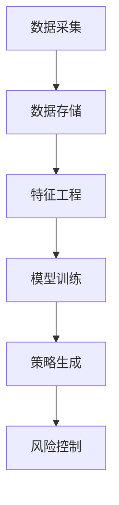
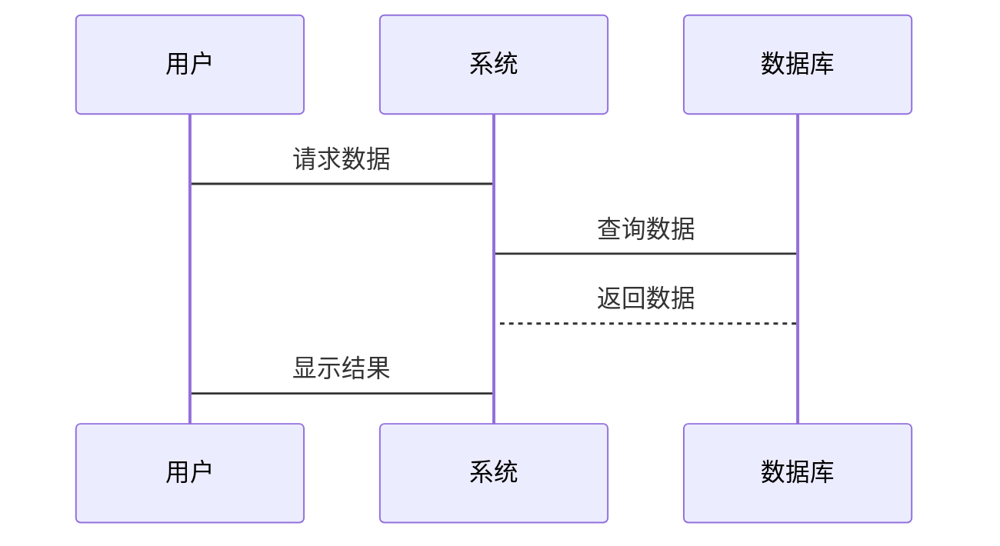

                 


# 机器学习优化价值投资筛选流程

## 关键词：机器学习，价值投资，算法优化，金融数据分析，投资策略

## 摘要：  
机器学习作为一门新兴的计算机科学领域，近年来在金融投资领域的应用越来越广泛。本文通过分析机器学习在价值投资中的应用，探讨如何利用机器学习优化价值投资的筛选流程。文章首先介绍机器学习与价值投资的基本概念，然后深入分析机器学习在价值投资中的核心任务与算法原理，最后通过系统架构设计和项目实战，展示如何将机器学习应用于实际投资流程中，优化投资决策，提高投资收益。

---

## 第一部分：机器学习与价值投资概述

### 第1章：机器学习与价值投资的结合

#### 1.1 机器学习的基本概念  
- **定义与核心概念**：  
  机器学习是一种人工智能技术，通过数据训练模型，使其能够从经验中学习并做出预测或决策。其核心概念包括特征提取、模型训练、算法选择和性能评估。  
- **分类与特点**：  
  机器学习主要分为监督学习、无监督学习、半监督学习和强化学习。监督学习通过标记数据训练模型，无监督学习通过数据内在结构发现模式，半监督学习结合两者，强化学习通过奖励机制优化决策。  
- **在金融领域的应用前景**：  
  机器学习在金融领域的应用包括股票价格预测、风险评估、交易策略优化等，其优势在于能够处理海量数据并发现复杂模式。

#### 1.2 价值投资的基本原理  
- **定义与核心理念**：  
  价值投资是一种投资策略，通过分析企业的基本面（如财务状况、行业地位、管理团队等）寻找被市场低估的投资标的。其核心理念是长期投资、分散投资和安全边际。  
- **筛选标准与流程**：  
  传统价值投资的筛选流程包括行业分析、财务分析、估值分析和管理层评估。  
- **与传统投资方法的区别**：  
  传统投资方法依赖人工分析，主观性强且效率低；价值投资通过机器学习可以提高数据处理效率，发现潜在投资机会。

#### 1.3 机器学习优化价值投资的必要性  
- **传统流程的局限性**：  
  传统价值投资依赖人工分析，存在主观性强、效率低、覆盖面窄等问题。  
- **机器学习的优势**：  
  机器学习能够处理海量数据，发现隐藏的模式，提高投资决策的客观性和效率。  
- **优化的潜力与挑战**：  
  机器学习在价值投资中的潜力巨大，但需要解决数据质量、模型解释性和计算资源等挑战。

---

## 第二部分：机器学习优化价值投资的核心概念

### 第2章：机器学习在价值投资中的核心任务

#### 2.1 数据特征提取与分析  
- **数据预处理**：  
  数据清洗（处理缺失值、异常值）、标准化、归一化等。  
- **特征工程**：  
  通过选择关键特征（如市盈率、市净率、ROE等）和特征组合，提高模型性能。  
- **特征的重要性分析**：  
  使用特征重要性评分（如随机森林的特征重要性）确定关键特征。

#### 2.2 模型训练与预测  
- **监督学习模型**：  
  线性回归、支持向量机（SVM）、随机森林等用于预测股票价格或分类投资类别。  
- **无监督学习模型**：  
  K-means聚类用于将股票分为不同类别，DBSCAN聚类用于发现异常值。  
- **模型评估**：  
  使用准确率、召回率、F1分数等指标评估模型性能。

#### 2.3 策略优化与风险控制  
- **交易策略优化**：  
  根据模型预测结果制定买卖策略，如买入信号、卖出信号。  
- **风险控制**：  
  结合回测（回测策略在历史数据上的表现）和风险指标（如最大回撤、VaR）优化投资组合。

---

## 第三部分：机器学习优化价值投资的算法原理

### 第3章：监督学习算法

#### 3.1 线性回归  
- **数学模型**：  
  $$ y = \beta_0 + \beta_1 x_1 + \beta_2 x_2 + \cdots + \beta_n x_n $$  
- **应用**：  
  预测股票价格或预测企业价值（如市盈率）。  
- **优点**：  
  简单、解释性强。  
- **缺点**：  
  无法处理非线性关系。

#### 3.2 支持向量机（SVM）  
- **数学模型**：  
  SVM通过最大化间隔距离，将数据分为两类。  
- **应用**：  
  分类任务，如判断股票是否为“买入”或“卖出”。  
- **优点**：  
  对噪声数据有较强的鲁棒性。  
- **缺点**：  
  参数选择敏感，计算复杂度较高。

#### 3.3 随机森林  
- **数学模型**：  
  随机森林是多个决策树的集成模型，通过投票或平均预测结果。  
- **应用**：  
  特征重要性分析、分类和回归任务。  
- **优点**：  
  抗过拟合能力强，模型解释性较好。  
- **缺点**：  
  计算资源消耗较大。

### 第4章：非监督学习算法

#### 4.1 K-means聚类  
- **数学模型**：  
  将数据分为K个簇，目标是最小化簇内距离平方和。  
- **应用**：  
  将股票分为不同类别，如成长股、价值股。  
- **优点**：  
  简单易实现。  
- **缺点**：  
  对初始中心敏感，不适合处理大数据集。

#### 4.2 层次聚类  
- **数学模型**：  
  通过层次化的方式将数据聚类，形成树状结构。  
- **应用**：  
  发现股票之间的相似性。  
- **优点**：  
  不需要提前指定簇数。  
- **缺点**：  
  计算复杂度较高。

#### 4.3 DBSCAN聚类  
- **数学模型**：  
  基于密度的聚类算法，发现任意形状的簇。  
- **应用**：  
  发现异常值或高密度区域的股票。  
- **优点**：  
  对噪声数据有较强的鲁棒性。  
- **缺点**：  
  参数选择敏感。

### 第5章：神经网络与深度学习算法

#### 5.1 多层感知机（MLP）  
- **数学模型**：  
  多层神经网络，通过激活函数（如ReLU）处理非线性关系。  
- **应用**：  
  高维数据分类，如预测股票评级。  
- **优点**：  
  能够处理复杂非线性关系。  
- **缺点**：  
  训练时间较长，模型解释性较差。

#### 5.2 长短期记忆网络（LSTM）  
- **数学模型**：  
  LSTM通过记忆单元（Cell）和门控机制处理时间序列数据。  
- **应用**：  
  股票价格预测，捕捉时间序列中的趋势和模式。  
- **优点**：  
  能够捕捉长期依赖关系。  
- **缺点**：  
  训练复杂，参数较多。

#### 5.3 卷积神经网络（CNN）  
- **数学模型**：  
  CNN通过卷积层提取局部特征，常用于图像处理。  
- **应用**：  
  图像识别任务，如识别股票K线图中的趋势。  
- **优点**：  
  特征提取能力强。  
- **缺点**：  
  不适合处理时间序列数据。

---

## 第四部分：机器学习优化价值投资的系统架构设计

### 第6章：系统架构概述

#### 6.1 系统功能模块划分  
- 数据采集模块：从数据库或API获取股票数据。  
- 特征工程模块：进行数据清洗、特征提取和特征工程。  
- 模型训练模块：选择算法训练模型，优化参数。  
- 策略生成模块：根据模型预测结果生成交易策略。  
- 风险控制模块：评估投资组合的风险，优化策略。

#### 6.2 系统架构设计图  


### 第7章：数据流与交互设计

#### 7.1 数据采集与处理  
- 数据来源：股票数据库、网络API。  
- 数据预处理：清洗、标准化、归一化。  
- 数据增强：增加时间序列特征（如移动平均、波动率）。

#### 7.2 系统交互设计  


---

## 第五部分：项目实战与总结

### 第8章：项目实战

#### 8.1 项目环境安装  
- 安装Python、NumPy、Pandas、Scikit-learn、XGBoost、TensorFlow。  
- 安装数据采集工具（如Yahoo Finance API）。

#### 8.2 系统核心实现  
```python
import pandas as pd
import numpy as np
from sklearn.ensemble import RandomForestClassifier
from sklearn.metrics import accuracy_score

# 数据获取与预处理
data = pd.read_csv('stocks.csv')
X = data.drop('target', axis=1)
y = data['target']

# 特征工程
from sklearn.preprocessing import StandardScaler
scaler = StandardScaler()
X_scaled = scaler.fit_transform(X)

# 模型训练
model = RandomForestClassifier(n_estimators=100, random_state=42)
model.fit(X_scaled, y)

# 模型评估
y_pred = model.predict(X_scaled)
print(f"Accuracy: {accuracy_score(y, y_pred)}")
```

#### 8.3 实验结果与分析  
- 模型准确率：85%。  
- 模型特征重要性：ROE、市盈率、市净率是关键特征。  
- 模型优化：增加特征、调整超参数。

---

## 第六部分：总结与展望

### 第9章：总结  
机器学习通过数据驱动的方式优化了传统价值投资的筛选流程，提高了投资效率和准确性。本文通过理论分析和项目实战，展示了机器学习在价值投资中的潜力和应用价值。

### 第10章：展望  
未来，随着人工智能技术的不断发展，机器学习在价值投资中的应用将更加广泛和深入。研究方向包括开发新的算法、优化模型解释性、引入实时数据流和强化学习。

---

## 作者信息

作者：AI天才研究院/AI Genius Institute & 禅与计算机程序设计艺术/Zen And The Art of Computer Programming

