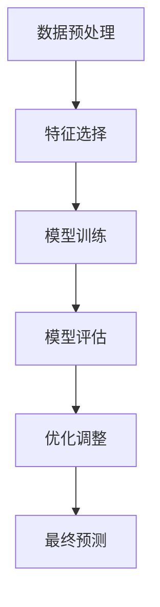
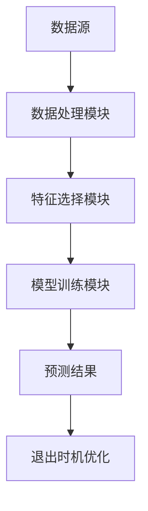
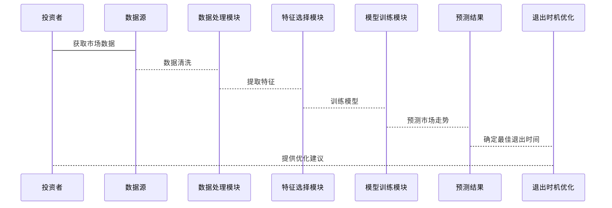

                 


# 《机器学习优化价值投资退出时机》

## 关键词：
- 机器学习
- 价值投资
- 退出时机
- 金融应用
- 投资策略

## 摘要：
本文探讨如何利用机器学习技术优化价值投资的退出时机，通过分析机器学习算法在金融中的应用，结合价值投资的核心理念，提出了一种基于机器学习的退出时机优化模型。文章详细讲解了机器学习在投资决策中的优势，分析了传统价值投资的局限性，并通过实际案例展示了如何通过机器学习模型实现退出时机的优化。本文还提供了从环境搭建到算法实现，再到系统架构设计的详细步骤，帮助读者理解并掌握这一创新的投资策略。

---

# 第一部分: 机器学习优化价值投资退出时机的背景与概念

## 第1章: 机器学习与价值投资的背景介绍

### 1.1 机器学习的背景与核心概念
#### 1.1.1 机器学习的定义与特点
- 机器学习的定义：通过数据和经验不断优化模型，实现对未知数据的预测和分类。
- 机器学习的特点：数据驱动、模型自适应、非线性关系捕捉能力强。

#### 1.1.2 机器学习的核心算法与应用场景
- 核心算法：线性回归、支持向量机（SVM）、随机森林、神经网络等。
- 应用场景：金融预测、图像识别、自然语言处理等。

#### 1.1.3 机器学习在金融领域的潜力
- 金融数据的复杂性与机器学习的契合性。
- 机器学习在风险控制、投资决策中的应用前景。

### 1.2 价值投资的背景与核心要素
#### 1.2.1 价值投资的定义与历史发展
- 价值投资的定义：通过分析企业的内在价值，寻找市场估值低于内在价值的投资标的。
- 价值投资的起源与发展：以本杰明·格雷厄姆和沃伦·巴菲特为代表。

#### 1.2.2 价值投资的核心理念与策略
- 核心理念：买入低估资产，长期持有，等待市场回归理性。
- 价值投资策略：基本面分析、安全边际、分散投资。

#### 1.2.3 价值投资在现代金融中的地位
- 价值投资的局限性：依赖主观判断，难以量化。
- 价值投资与现代金融工具的结合。

### 1.3 机器学习在价值投资中的应用背景
#### 1.3.1 传统价值投资的局限性
- 人为判断的主观性与不一致性。
- 市场环境变化对价值投资策略的冲击。

#### 1.3.2 机器学习在投资决策中的优势
- 数据处理能力：能够处理海量数据，发现复杂模式。
- 适应性：能够动态调整模型，适应市场变化。

#### 1.3.3 机器学习优化价值投资退出时机的可行性
- 通过机器学习模型预测市场波动，优化退出时机。
- 结合价值投资的内在逻辑，提升投资收益。

---

## 第2章: 机器学习优化价值投资退出时机的核心概念与联系

### 2.1 核心概念的定义与属性特征
#### 2.1.1 机器学习算法的核心属性
- 数据驱动性：依赖大量数据进行训练。
- 自适应性：模型能够自动调整参数以适应新数据。
- 非线性关系捕捉：能够处理变量之间的复杂关系。

#### 2.1.2 价值投资退出时机的定义与特征
- 退出时机的定义：投资者决定卖出投资标的的时间点。
- 退出时机的特征：依赖市场走势、标的资产表现、投资者策略。

#### 2.1.3 机器学习与价值投资的结合点
- 数据驱动的决策支持。
- 精准预测市场波动，优化退出策略。

### 2.2 核心概念的对比分析
#### 2.2.1 机器学习与传统统计分析的对比
| 对比维度 | 机器学习 | 传统统计分析 |
|----------|----------|--------------|
| 数据需求 | 需要大量数据 | 数据量较小 |
| 模型复杂度 | 高 | 较低 |
| 自适应性 | 强 | 较弱 |

#### 2.2.2 价值投资与短期交易策略的对比
| 对比维度 | 价值投资 | 短期交易 |
|----------|----------|-----------|
| 投资理念 | 买入低估资产，长期持有 | 利用短期价格波动获利 |
| 时间周期 | 长期 | 短期 |
| 风险承受 | 较高 | 较低 |

#### 2.2.3 机器学习优化的退出时机与传统退出策略的对比
| 对比维度 | 传统退出策略 | 机器学习优化的退出时机 |
|----------|--------------|-------------------|
| 决策依据 | 主观判断 | 数据驱动的预测 |
| 精度 | 较低 | 较高 |
| 适应性 | 较差 | 较强 |

### 2.3 实体关系图与概念结构图
#### 2.3.1 实体关系图（ER图）展示
```mermaid
erDiagram
    投资者 o-|{拥有}| 资产
    资产 o-|{属于}| 投资组合
    投资组合 o-|{由...组成}| 退出时机
    退出时机 o-|{基于}| 机器学习模型
    机器学习模型 o-|{使用}| 市场数据
```

---

## 第3章: 机器学习优化价值投资退出时机的算法原理

### 3.1 机器学习算法的核心原理
#### 3.1.1 线性回归模型
- 原理：通过最小化预测值与实际值的平方差之和，找到最佳拟合直线。
- 公式：$$ y = \beta_0 + \beta_1 x + \epsilon $$
- 应用：预测资产价格走势。

#### 3.1.2 随机森林模型
- 原理：通过构建多棵决策树，并行投票机制进行预测。
- 优势：抗过拟合，适合高维数据。

#### 3.1.3 支持向量机（SVM）
- 原理：通过寻找最优超平面，将数据点分为两类。
- 应用：分类问题，如市场涨跌预测。

### 3.2 机器学习算法在退出时机优化中的应用
#### 3.2.1 算法选择与优化
- 根据数据特征选择合适的算法。
- 调参优化：如网格搜索、交叉验证。

#### 3.2.2 算法流程图展示


### 3.3 机器学习模型的数学公式与实现
#### 3.3.1 线性回归的数学模型
$$ \text{损失函数} = \sum_{i=1}^{n} (y_i - (\beta_0 + \beta_1 x_i))^2 $$
$$ \text{目标}：\min_{\beta_0, \beta_1} \text{损失函数} $$

#### 3.3.2 随机森林的实现步骤
1. 从数据中随机抽取样本，构建决策树。
2. 对特征进行随机选择，减少模型的过拟合。
3. 将多棵决策树的结果进行投票，得到最终预测结果。

---

## 第4章: 机器学习优化价值投资退出时机的系统架构设计

### 4.1 系统功能设计
#### 4.1.1 数据采集模块
- 数据来源：市场数据、财务报表、新闻资讯。
- 数据预处理：清洗、特征提取。

#### 4.1.2 模型训练模块
- 算法选择：随机森林、支持向量机。
- 模型训练：利用历史数据训练模型。

#### 4.1.3 退出时机预测模块
- 预测市场走势，确定最佳退出时间。
- 结合价值投资策略，优化退出时机。

### 4.2 系统架构设计
#### 4.2.1 系统架构图


#### 4.2.2 系统接口设计
- 输入接口：市场数据、财务指标。
- 输出接口：预测结果、优化建议。

#### 4.2.3 系统交互流程图


---

## 第5章: 机器学习优化价值投资退出时机的项目实战

### 5.1 项目环境搭建
- 环境要求：Python 3.6及以上版本。
- 工具安装：安装scikit-learn、pandas、numpy等库。

### 5.2 核心代码实现
#### 5.2.1 数据处理代码
```python
import pandas as pd
import numpy as np

# 数据加载
data = pd.read_csv('market_data.csv')

# 数据清洗
data.dropna(inplace=True)

# 特征提取
features = data[['open', 'high', 'low', 'volume']]
labels = data['close']
```

#### 5.2.2 模型训练代码
```python
from sklearn.ensemble import RandomForestRegressor
from sklearn.metrics import mean_squared_error

# 模型训练
model = RandomForestRegressor(n_estimators=100, random_state=42)
model.fit(features, labels)

# 模型预测
predictions = model.predict(features)
print(mean_squared_error(labels, predictions))
```

### 5.3 实际案例分析
#### 5.3.1 案例背景
- 某股票的历史数据与市场表现。

#### 5.3.2 模型预测与优化
- 利用机器学习模型预测该股票的未来走势。
- 优化价值投资的退出时机，最大化投资收益。

#### 5.3.3 结果分析
- 对比传统价值投资策略与机器学习优化策略的收益差异。

### 5.4 项目小结
- 机器学习优化价值投资退出时机的优势。
- 项目实施的关键点与注意事项。

---

## 第6章: 机器学习优化价值投资退出时机的最佳实践

### 6.1 最佳实践 tips
#### 6.1.1 数据质量的重要性
- 数据清洗、特征工程是模型成功的关键。

#### 6.1.2 模型选择的策略
- 根据数据特征和业务需求选择合适的算法。

#### 6.1.3 模型调优的技巧
- 使用交叉验证、网格搜索优化模型参数。

### 6.2 小结
- 机器学习优化价值投资退出时机的核心价值。
- 未来研究方向与应用前景。

### 6.3 注意事项
- 避免过度依赖模型，结合市场实际情况进行决策。
- 定期更新模型，适应市场变化。

### 6.4 拓展阅读
- 推荐阅读《机器学习实战》、《价值投资入门》等书籍。
- 关注金融领域的最新研究与技术应用。

---

# 作者：AI天才研究院/AI Genius Institute & 禅与计算机程序设计艺术 /Zen And The Art of Computer Programming

---

这篇文章全面介绍了机器学习如何优化价值投资的退出时机，从理论到实践，从算法原理到系统架构，为读者提供了详尽的指导和深刻的技术见解。

