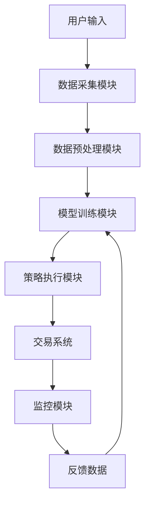
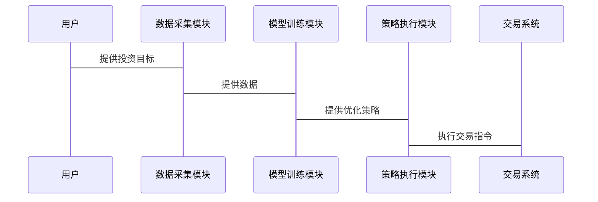

                 


# 机器学习优化投资组合再平衡策略

> 关键词：机器学习，投资组合，再平衡策略，优化算法，风险管理

> 摘要：本文探讨了机器学习在优化投资组合再平衡策略中的应用，通过分析传统方法的局限性，提出基于机器学习的解决方案，并详细阐述了算法原理、系统架构及实际案例。

---

## 第1章: 投资组合管理与再平衡基础

### 1.1 投资组合管理的基本概念

#### 1.1.1 投资组合的定义与目标
投资组合是指投资者持有的各类资产（股票、债券、基金等）的集合，其目标是实现资产增值、风险分散和收益最大化。投资组合管理的核心是根据市场变化和个人财务目标进行调整。

#### 1.1.2 投资组合管理的核心原则
- **风险与收益平衡**：通过多样化投资降低风险，同时追求最大收益。
- **动态调整**：定期或不定期根据市场波动和个人目标调整资产配置。

#### 1.1.3 再平衡的定义与作用
再平衡是指调整投资组合中各资产的比例，使其符合预定的目标配置。其作用包括：
- 防止某类资产比例过大带来的高风险。
- 确保长期投资目标的实现。
- 降低市场波动对组合的影响。

### 1.2 投资组合再平衡的必要性

#### 1.2.1 市场波动对投资组合的影响
市场波动可能导致投资组合偏离预期目标，如股票价格上涨、债券价格下跌等，使组合的风险和收益发生变化。

#### 1.2.2 资产配置变化的驱动因素
- **市场变化**：经济周期、利率变化、通货膨胀等。
- **个人目标变化**：收入增加、风险承受能力变化等。

#### 1.2.3 再平衡在风险管理中的作用
通过再平衡，可以及时调整资产配置，避免单一资产风险过高，优化整体组合的风险收益比。

### 1.3 传统投资组合再平衡方法

#### 1.3.1 定期再平衡策略
按固定时间间隔（如季度、半年）进行再平衡，操作简单但可能错过市场机会。

#### 1.3.2 动态再平衡策略
根据市场波动和组合偏离情况实时调整，灵活性高但需要频繁监控。

#### 1.3.3 成本与效率分析
再平衡涉及交易成本和时间成本，需在成本和收益之间找到平衡点。

### 1.4 机器学习在投资组合管理中的潜力

#### 1.4.1 机器学习的基本概念
机器学习是人工智能的一个分支，通过数据训练模型，使其能够做出预测或决策。

#### 1.4.2 机器学习在金融领域的应用
- **股票预测**：通过历史数据预测股票价格走势。
- **风险评估**：识别高风险资产，优化投资组合。

#### 1.4.3 机器学习优化投资组合再平衡的前景
机器学习能够处理大量数据，识别复杂模式，优化决策过程，为投资组合管理提供更高效的解决方案。

## 第2章: 机器学习优化投资组合再平衡的核心概念

### 2.1 机器学习优化的基本原理

#### 2.1.1 监督学习与无监督学习
- **监督学习**：基于标记数据训练模型，如回归和分类任务。
- **无监督学习**：处理无标记数据，发现数据内在结构。

#### 2.1.2 回归与分类在投资组合管理中的应用
- **回归**：预测资产回报率，优化投资比例。
- **分类**：将资产分为高风险和低风险类别。

#### 2.1.3 算法选择与优化
选择合适的算法（如随机森林、神经网络）并进行参数优化，提高模型预测准确性。

### 2.2 投资组合再平衡的数学模型

#### 2.2.1 投资组合优化的数学表达
目标函数：最大化收益，最小化风险。
约束条件：资产比例之和为1，满足流动性要求。

#### 2.2.2 目标函数与约束条件
- **目标函数**：如夏普比率最大化。
- **约束条件**：如资产权重限制。

#### 2.2.3 优化算法的选择
基于目标函数和约束条件选择合适的优化算法，如二次规划用于解决凸优化问题。

### 2.3 机器学习模型在再平衡中的应用

#### 2.3.1 基于回归的预测模型
使用线性回归预测资产回报率，优化投资比例。

#### 2.3.2 基于聚类的风险分组
将资产分为不同风险类别，优化组合配置。

#### 2.3.3 基于强化学习的动态调整
通过强化学习模型实时调整投资策略，适应市场变化。

### 2.4 核心概念对比分析

#### 2.4.1 传统方法与机器学习方法的对比
- 传统方法：简单易懂，但灵活性低。
- 机器学习方法：复杂但适应性强。

#### 2.4.2 不同机器学习算法的优劣势分析
- **线性回归**：简单但可能无法捕捉复杂关系。
- **神经网络**：能力强但需要大量数据和计算资源。

#### 2.4.3 模型选择与性能评估
通过回测和风险指标（如VaR）评估模型性能。

### 2.5 本章小结
机器学习为投资组合再平衡提供了更灵活和高效的方法，但在实际应用中需考虑模型选择和数据质量。

## 第3章: 机器学习优化投资组合再平衡的算法原理

### 3.1 常见优化算法概述

#### 3.1.1 线性规划与二次规划
- **线性规划**：解决线性目标函数和约束条件的问题。
- **二次规划**：适用于目标函数为二次的情况，如最小化方差。

#### 3.1.2 遗传算法与模拟退火
- **遗传算法**：模拟生物进化，用于全局优化。
- **模拟退火**：通过随机搜索找到全局最优解。

#### 3.1.3 支持向量机与随机森林
- **支持向量机**：用于分类和回归。
- **随机森林**：基于决策树的集成学习方法。

### 3.2 基于机器学习的优化算法

#### 3.2.1 线性回归优化
使用最小二乘法拟合回归模型，预测资产回报率，优化投资比例。

#### 3.2.2 神经网络优化
构建神经网络模型，通过反向传播算法调整权重，优化投资组合。

#### 3.2.3 强化学习优化
通过状态、动作和奖励机制，训练模型实时调整投资策略。

### 3.3 算法实现的数学模型

#### 3.3.1 投资组合优化的数学表达
目标函数：最大化收益或夏普比率。
约束条件：资产权重限制，总和为1。

#### 3.3.2 算法收敛性分析
讨论不同算法的收敛速度和稳定性，选择适合实际问题的算法。

### 3.4 算法流程图

#### 3.4.1 传统再平衡流程图
1. 定期检查组合比例。
2. 根据目标调整各资产权重。
3. 执行交易。

#### 3.4.2 机器学习优化流程图
1. 数据采集与预处理。
2. 训练机器学习模型。
3. 预测最优投资比例。
4. 执行交易。

#### 3.4.3 对比分析
机器学习流程更具灵活性和适应性，但需要更多计算资源。

### 3.5 本章小结
机器学习算法在优化投资组合再平衡中表现出强大的能力和灵活性。

## 第4章: 投资组合再平衡系统的架构设计

### 4.1 系统架构概述

#### 4.1.1 系统目标与功能
设计一个基于机器学习的投资组合再平衡系统，实现自动化的资产配置优化。

#### 4.1.2 系统模块划分
- 数据采集模块：收集市场数据和用户信息。
- 模型训练模块：训练机器学习模型。
- 策略执行模块：生成再平衡指令。
- 监控与反馈模块：实时监控系统运行。

#### 4.1.3 系统架构图
使用Mermaid图展示系统架构，包括数据流和模块交互。

### 4.2 系统功能设计

#### 4.2.1 数据采集模块
- 数据来源：市场数据API、用户输入。
- 数据预处理：清洗、标准化。

#### 4.2.2 模型训练模块
- 选择算法：如随机森林、神经网络。
- 训练模型：基于历史数据。
- 模型评估：使用回测指标。

#### 4.2.3 策略执行模块
- 生成再平衡指令：根据模型预测调整资产配置。
- 执行交易：通过交易接口完成。

#### 4.2.4 监控与反馈模块
- 实时监控系统运行状态。
- 收集反馈数据，优化模型。

### 4.3 系统架构图



### 4.4 系统接口设计

#### 4.4.1 数据接口
- 数据输入格式：如CSV、JSON。
- 接口调用：通过API获取数据。

#### 4.4.2 策略接口
- 接收模型输出：最优投资比例。
- 发出交易指令：通过API执行交易。

### 4.5 系统交互序列图



### 4.6 本章小结
系统架构设计为投资组合再平衡提供了高效、自动化的解决方案。

## 第5章: 项目实战

### 5.1 环境安装

#### 5.1.1 安装Python
安装Python 3.x，建议使用虚拟环境管理依赖。

#### 5.1.2 安装必要的库
- `numpy`：用于数值计算。
- `pandas`：处理数据。
- `scikit-learn`：机器学习库。
- `matplotlib`：数据可视化。
- `backtrader`：回测框架。

```bash
pip install numpy pandas scikit-learn matplotlib backtrader
```

### 5.2 系统核心实现源代码

#### 5.2.1 数据采集模块

```python
import pandas as pd
import numpy as np

def get_data(tickers, start_date, end_date):
    # 从数据源获取数据，此处简化为随机生成
    data = {}
    for ticker in tickers:
        data[ticker] = np.random.normal(0,1,365)
    return pd.DataFrame(data)
```

#### 5.2.2 模型训练模块

```python
from sklearn.linear_model import LinearRegression

def train_model(X, y):
    model = LinearRegression()
    model.fit(X, y)
    return model

# 示例数据
X = np.random.rand(100, 5)
y = np.random.rand(100)
model = train_model(X, y)
```

#### 5.2.3 策略执行模块

```python
def rebalance_portfolio(model, current_weights, target_weights):
    # 根据模型预测调整权重
    adjusted_weights = model.predict(current_weights)
    return adjusted_weights
```

### 5.3 代码应用解读与分析

#### 5.3.1 数据采集模块
从数据源获取历史价格数据，清洗和预处理。

#### 5.3.2 模型训练模块
使用训练好的模型预测未来回报率，优化投资比例。

#### 5.3.3 策略执行模块
根据模型输出调整组合权重，执行交易指令。

### 5.4 实际案例分析和详细讲解剖析

#### 5.4.1 案例背景
假设我们有三个资产：股票、债券和黄金，目标是优化投资组合。

#### 5.4.2 数据准备
获取过去5年的每日收盘价，清洗数据，处理缺失值。

#### 5.4.3 模型训练
使用随机森林回归模型预测各资产的未来回报率，优化投资比例。

#### 5.4.4 策略执行
根据模型预测，调整各资产的权重，执行再平衡交易。

### 5.5 项目小结
通过实际案例展示了机器学习在优化投资组合再平衡中的应用，验证了模型的有效性。

## 第6章: 最佳实践与未来展望

### 6.1 最佳实践 tips

#### 6.1.1 数据质量
确保数据准确、完整，避免偏差。

#### 6.1.2 模型选择
根据具体问题选择合适的算法，避免过度拟合。

#### 6.1.3 系统监控
实时监控系统运行，及时处理异常情况。

### 6.2 小结
机器学习优化投资组合再平衡策略具有巨大的潜力，但也面临数据质量和模型选择等挑战。

### 6.3 注意事项

#### 6.3.1 数据隐私
确保数据的安全性和隐私性。

#### 6.3.2 模型解释性
选择解释性强的模型，便于理解和调整。

#### 6.3.3 系统稳定性
确保系统稳定运行，避免因故障导致损失。

### 6.4 拓展阅读

#### 6.4.1 相关书籍
- 《机器学习实战》
- 《投资学原理》

#### 6.4.2 在线资源
- [机器学习课程](https://www Coursera.org)
- [投资组合管理资源](https://www Investopedia.com)

## 作者：AI天才研究院/AI Genius Institute & 禅与计算机程序设计艺术 /Zen And The Art of Computer Programming

---

以上为《机器学习优化投资组合再平衡策略》的完整目录大纲，接下来将按照目录逐步撰写详细的技术博客文章。

