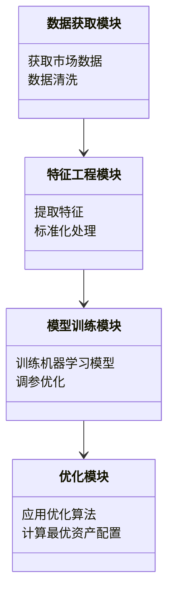

                 


# 机器学习优化投资组合分散化

> 关键词：机器学习，投资组合优化，分散化，风险管理，金融应用

> 摘要：本文探讨了机器学习在优化投资组合分散化中的应用。通过分析传统方法的局限性，结合机器学习算法的优势，提出了一种基于机器学习的投资组合优化框架。该框架通过数据预处理、特征选择、模型训练和优化算法实现投资组合的分散化优化，并通过实际案例验证了其有效性和优势。

---

## 第一部分: 机器学习与投资组合分散化的背景介绍

### 第1章: 机器学习与投资组合优化概述

#### 1.1 机器学习的基本概念
机器学习是一种人工智能技术，通过数据训练模型以实现特定任务，如分类、回归和聚类。其核心在于模型能够从数据中学习规律，并用于预测或决策。在金融领域，机器学习广泛应用于股票预测、风险评估和投资组合优化等场景。

#### 1.2 投资组合优化的基本原理
投资组合优化的目标是在给定的风险承受能力下，最大化预期收益。传统的优化方法如均值-方差模型通过优化资产配置实现这一目标，但其在高维数据和非线性关系下的表现有限。

#### 1.3 投资组合分散化的定义与重要性
分散化是通过投资不同资产或资产类别来降低风险的策略。其核心在于通过资产间的相关性降低整体组合的波动性，从而实现更稳定的收益。

### 第2章: 机器学习优化投资组合分散化的背景与挑战

#### 2.1 传统投资组合优化方法的局限性
传统的均值-方差模型假设资产收益呈正态分布，但在实际市场中，资产价格可能呈现非线性关系和厚尾分布，导致传统方法在复杂市场中的表现不佳。

#### 2.2 机器学习在投资组合优化中的优势
机器学习能够捕捉复杂的数据模式，处理高维数据，并通过自适应学习优化投资组合。此外，无监督学习和强化学习在资产聚类和动态优化中表现出色。

#### 2.3 当前研究中的主要挑战
数据质量、模型过拟合和解释性是机器学习在投资组合优化中面临的主要挑战。此外，如何在实时交易环境中快速优化投资组合也是需要解决的问题。

---

## 第二部分: 机器学习优化投资组合分散化的理论基础

### 第3章: 机器学习算法与投资组合优化

#### 3.1 常见的机器学习算法及其在投资组合优化中的应用
- **线性回归**：用于预测资产收益。
- **支持向量机**：用于分类资产风险等级。
- **随机森林与梯度提升树**：用于特征重要性分析和风险评估。
- **神经网络与深度学习**：用于捕捉复杂市场动态。

#### 3.2 无监督学习在投资组合优化中的应用
- **聚类分析**：将相似资产归为一类，优化资产配置。
- **主成分分析（PCA）**：降维处理，减少冗余特征。

#### 3.3 强化学习在投资组合优化中的应用
通过定义状态、动作和奖励函数，强化学习能够实现动态资产配置，适应市场变化。

### 第4章: 机器学习优化分散化的数学模型与算法

#### 4.1 投资组合优化的数学模型
- **均值-方差模型**：目标是最小化方差，同时满足收益约束。
  $$ \min_{w} w^T \Sigma w $$
  $$ \text{subject to } w^T \mu = \text{target return} $$

- **非均值-方差模型**：考虑更高风险调整后的收益目标。

- **多目标优化模型**：同时优化收益、风险和流动性等多目标。

#### 4.2 基于机器学习的优化算法
- **遗传算法**：通过交叉和变异操作优化资产配置。
- **模拟退火算法**：逐步降低温度，避免陷入局部最优。
- **粒子群优化算法**：通过粒子运动寻找全局最优解。

---

## 第三部分: 系统分析与架构设计

### 第5章: 系统功能设计

#### 5.1 数据预处理
- 数据清洗：处理缺失值和异常值。
- 特征工程：提取收益率、波动率等特征。

#### 5.2 模型训练与优化
- 使用机器学习算法训练模型。
- 通过交叉验证选择最优模型。

#### 5.3 优化结果分析
- 计算优化后的投资组合收益和风险指标。

### 第6章: 系统架构设计

#### 6.1 领域模型


#### 6.2 系统架构图


---

## 第四部分: 项目实战

### 第7章: 环境安装与代码实现

#### 7.1 环境配置
- Python 3.8+
- scikit-learn, numpy, pandas, matplotlib

#### 7.2 核心代码实现
```python
import numpy as np
from sklearn.ensemble import RandomForestRegressor
from sklearn.model_selection import GridSearchCV

# 示例数据
returns = np.array([...])  # 资产收益率矩阵
X = ...  # 特征矩阵
y = ...  # 目标收益

# 模型训练
model = RandomForestRegressor()
param_grid = {'n_estimators': [100, 200], 'max_depth': [None, 10]}
grid_search = GridSearchCV(model, param_grid, cv=5)
grid_search.fit(X, y)

# 优化模块
# 示例优化代码
```

#### 7.3 实际案例分析
通过具体案例展示模型在投资组合分散化中的应用，计算优化后的收益和风险指标，并进行结果分析。

---

## 第五部分: 高级主题与最佳实践

### 第8章: 高级主题

#### 8.1 模型可解释性与鲁棒性
提升模型的可解释性和鲁棒性，确保在实际应用中的可靠性。

#### 8.2 交易成本与滑点的考虑
在实际交易中，考虑交易成本和滑点对投资组合优化的影响。

### 第9章: 最佳实践与小结

#### 9.1 小结
总结机器学习在投资组合优化中的优势和挑战，强调其在复杂市场中的应用潜力。

#### 9.2 最佳实践 tips
- 数据预处理是关键，需谨慎处理异常值。
- 模型选择应基于实际需求和数据特性。
- 定期监控和调整优化模型，适应市场变化。

---

## 作者信息

作者：AI天才研究院/AI Genius Institute & 禅与计算机程序设计艺术 /Zen And The Art of Computer Programming

---

# 结语
机器学习正在 revolutionize 投资组合优化领域，通过本文的分析，读者可以深入了解其在分散化优化中的应用，并将其应用于实际投资决策中。未来，随着算法和数据科学的进步，机器学习在投资组合优化中的潜力将得到进一步释放。

