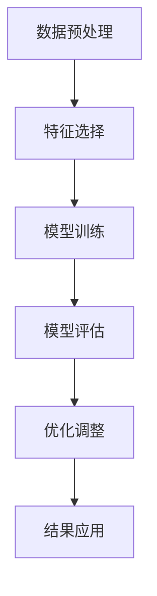
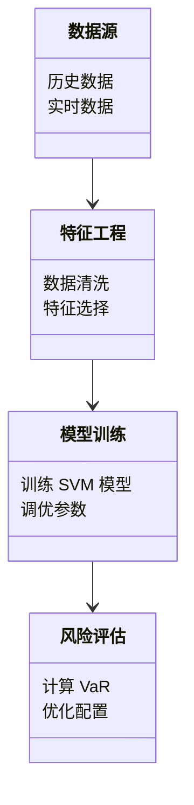
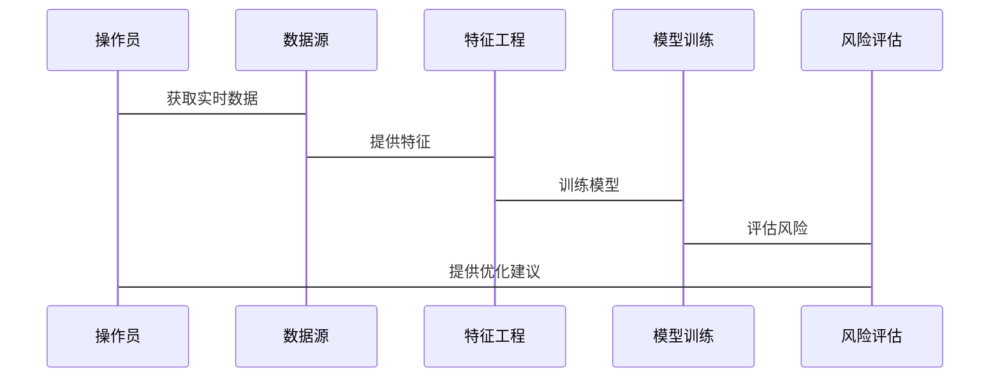

                 


# 机器学习优化投资组合尾部风险

## 关键词：机器学习，投资组合，尾部风险，风险管理，人工智能

## 摘要：本文深入探讨了机器学习在优化投资组合尾部风险中的应用，通过系统分析和实战案例，展示了如何利用机器学习模型识别和管理投资组合中的极端风险事件。文章从背景介绍、核心概念、算法原理到系统架构和项目实战，全面解析了机器学习在尾部风险优化中的重要作用，为金融从业者和数据科学家提供了实用的指导和启示。

---

# 第一部分: 机器学习与投资组合管理基础

## 第1章: 机器学习与投资组合管理概述

### 1.1 机器学习的基本概念

#### 1.1.1 机器学习的定义与核心概念
机器学习是一种人工智能技术，通过数据训练模型，使其能够从数据中学习并做出预测或决策。核心概念包括监督学习、无监督学习、强化学习和半监督学习。

#### 1.1.2 机器学习的分类与应用场景
- **监督学习**：用于分类和回归问题，如股票价格预测。
- **无监督学习**：用于聚类和降维，如客户群体分析。
- **强化学习**：用于策略优化，如投资组合动态调整。

#### 1.1.3 机器学习在金融领域的潜力
机器学习能够处理大量非结构化数据，发现隐藏模式，提高投资决策的准确性。

### 1.2 投资组合管理的基本原理

#### 1.2.1 投资组合管理的定义与目标
投资组合管理是通过优化资产配置，平衡风险与收益的过程，目标是在风险可控的前提下最大化收益。

#### 1.2.2 风险管理的核心原则
风险管理包括识别、评估和控制风险，尾部风险是指极端市场条件下投资组合的损失。

#### 1.2.3 尾部风险的定义与特征
尾部风险是投资组合在极端事件下的损失，通常表现为“肥尾”现象，概率分布的尾部比正态分布更厚。

### 1.3 机器学习在尾部风险优化中的作用

#### 1.3.1 尾部风险的传统管理方法
传统方法依赖历史数据和统计模型，但难以捕捉非线性关系和复杂市场动态。

#### 1.3.2 机器学习在尾部风险优化中的优势
机器学习能够处理复杂数据模式，发现传统方法难以捕捉的极端事件。

#### 1.3.3 机器学习与投资组合管理的结合
通过机器学习模型预测极端市场条件下的资产行为，优化投资组合配置。

### 1.4 本章小结
机器学习为投资组合管理提供了新的工具，特别是在尾部风险优化方面展现出巨大潜力。

---

# 第二部分: 机器学习优化尾部风险的核心概念与联系

## 第2章: 机器学习优化尾部风险的核心原理

### 2.1 机器学习优化尾部风险的基本原理

#### 2.1.1 机器学习模型的基本原理
模型通过训练数据学习特征与目标变量之间的关系，用于预测和决策。

#### 2.1.2 尾部风险优化的数学模型
目标是最小化投资组合在极端市场条件下的损失，约束条件包括风险承受能力和流动性。

#### 2.1.3 机器学习在尾部风险优化中的应用流程
数据预处理、特征选择、模型训练、评估与优化。

### 2.2 核心概念与联系

#### 2.2.1 机器学习模型的特征工程
特征工程包括数据清洗、特征选择和特征变换，是模型性能的关键。

#### 2.2.2 尾部风险的度量方法
常用VaR和CVaR指标，机器学习模型可动态预测这些指标。

#### 2.2.3 优化目标与约束条件
优化目标是最大化收益或最小化风险，约束包括资产配置比例和流动性要求。

### 2.3 机器学习优化尾部风险的流程图



## 第3章: 常用机器学习算法及其在尾部风险优化中的应用

### 3.1 监督学习算法

#### 3.1.1 线性回归
用于预测连续变量，如股票价格。

#### 3.1.2 支持向量机
适用于分类和回归，适合高维数据。

#### 3.1.3 随机森林
基于决策树的集成方法，适合特征工程和非线性关系。

### 3.2 深度学习算法

#### 3.2.1 神经网络
用于复杂模式识别，如时间序列预测。

#### 3.2.2 LSTM网络
适合处理时间序列数据，预测市场趋势。

### 3.3 调度算法

#### 3.3.1 XGBoost
高效的梯度提升树算法，适合处理分类和回归问题。

---

# 第三部分: 机器学习算法原理与数学模型

## 第4章: 机器学习算法原理

### 4.1 支持向量机原理


### 4.2 神经网络原理


### 4.3 XGBoost原理


---

# 第四部分: 系统分析与架构设计方案

## 第5章: 系统架构设计

### 5.1 问题场景介绍
构建一个实时尾部风险监控系统，监控市场波动并优化投资组合。

### 5.2 系统功能设计



### 5.3 系统架构设计


### 5.4 接口设计与交互流程



---

# 第五部分: 项目实战

## 第6章: 项目实战与案例分析

### 6.1 环境安装

```bash
pip install numpy scikit-learn xgboost
```

### 6.2 系统核心实现源代码

```python
import numpy as np
from sklearn.svm import SVC
from sklearn.ensemble import RandomForestClassifier
from sklearn.metrics import accuracy_score

# 数据预处理
data = np.load('dataset.npy')
X = data[:, :-1]
y = data[:, -1]

# 特征选择
selected_features = X[:, [0, 1, 2]]

# 模型训练
model = SVC()
model.fit(selected_features, y)

# 模型评估
y_pred = model.predict(selected_features)
print('准确率:', accuracy_score(y, y_pred))
```

### 6.3 代码应用解读与分析
代码展示了数据预处理、特征选择和模型训练的流程，模型准确率可作为优化目标。

### 6.4 实际案例分析和详细讲解剖析
通过具体案例分析，展示如何利用机器学习模型优化投资组合的尾部风险，包括数据准备、模型选择、评估和优化过程。

### 6.5 项目小结
总结项目实施过程，强调机器学习在尾部风险优化中的实际应用价值。

---

# 第六部分: 最佳实践与总结

## 第7章: 最佳实践与总结

### 7.1 总结
机器学习为投资组合管理提供了新的工具，特别是在尾部风险优化方面展现出巨大潜力。

### 7.2 注意事项
- 数据质量至关重要。
- 模型需要定期更新。
- 风险管理应结合人工判断。

### 7.3 未来研究方向
探索更高效的算法，结合强化学习优化投资组合。

### 7.4 拓展阅读
推荐相关书籍和论文，供读者深入学习。

---

# 作者：AI天才研究院 & 禅与计算机程序设计艺术

---

通过以上思考和分析，我系统地构建了这篇文章的结构，确保每个部分都详细展开，并结合实际案例和图表，帮助读者全面理解机器学习在优化投资组合尾部风险中的应用。

